# Funbox-4: CTF 漫游(Vulnhub)

> 原文：<https://infosecwriteups.com/funbox-4-ctf-walkthrough-vulnhub-a5c733c350df?source=collection_archive---------2----------------------->

土拨鼠日:Boot2Root！由 [@0815R2d2](https://twitter.com/@0815R2d2) 创建。最初的脚步有点瑕疵，但真的不难。进入 Funbox: CTF 后，有必要找到、阅读并理解(2 个且容易找到的)提示。聪明点，结合起来…永远小心兔子洞。下载机器访问【https://www.vulnhub.com/entry/funbox-ctf,546/】T3

我的建议是在 Virtualbox 上解决这个机器，但正如“**好奇心不断引导我们走上新的道路—** 华特·迪士尼”所以，你可以尝试 VMware，也可以重新挑战，找到自己获得 root 访问权限的方法。

> 获得的知识:-

1.  列举
2.  反向外壳
3.  创建独特的单词表
4.  绕过 rbash
5.  搜索和使用漏洞

> 端口扫描

在确定了预期的受害者之后，让我们运行一个 Nmap 扫描来查找开放的端口和正在运行的服务。

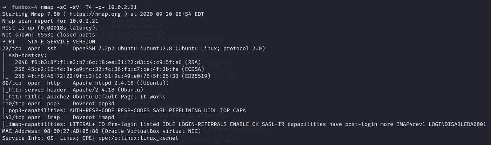

> 网络侦察

在 80 端口访问受害者的主页，显示的是 Ubuntu 的默认页面，没有任何有用的东西。所以，我尝试用 gobuster 来枚举隐藏的目录，但是首先，我们必须创建一个单词表，所有的字符都是大写的，就像这样👇

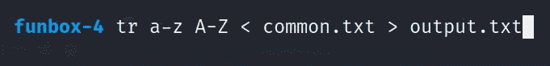

现在运行 gobuster。

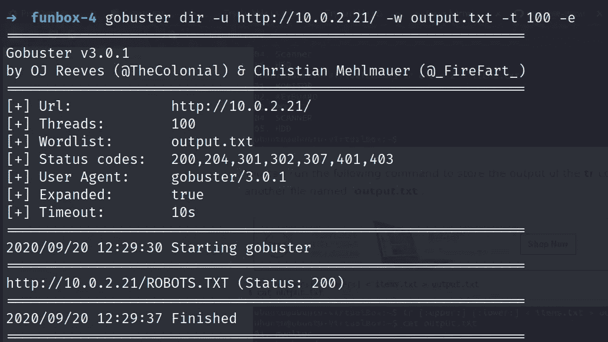

打开 URL 并向下滚动。

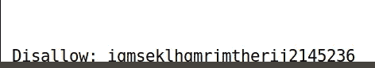

再次运行目录扫描，您将获得获得一个反向外壳的路径。

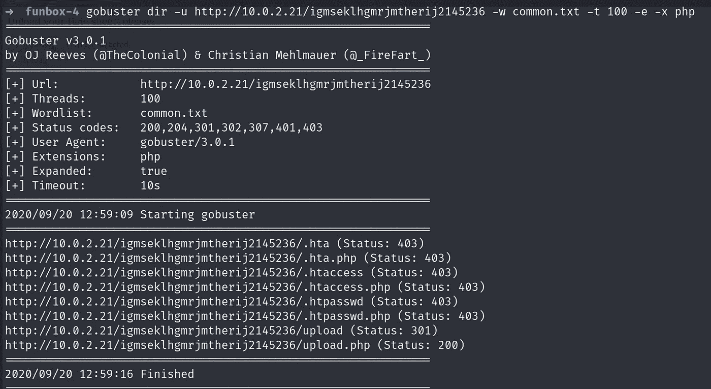

只需上传一个 PHP 反向 shell，其中包含您的 kali IP_address，同时通过 Netcat 监听传入的连接。

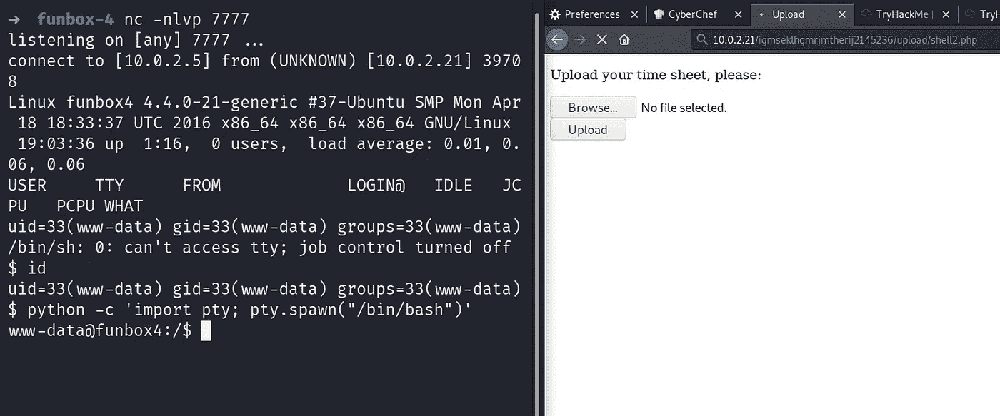

导航到 **/home/thomas** 目录，您将看到**。todo** 文件显示添加**！**密码结束。再补充一下**！**在 rockyou.txt 文件的每一行中，用**蛮力**对用户 thomas 进行 SSH 登录。

现在用九头蛇，等一段时间。

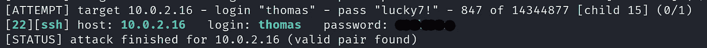

> 宋承宪*侦察*

登录 thomas，你会看到一个 rbash，通过 VIM 绕过它。

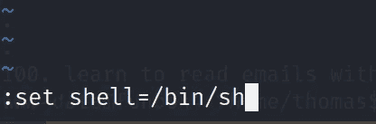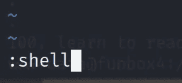

最后，你会离开巴什。

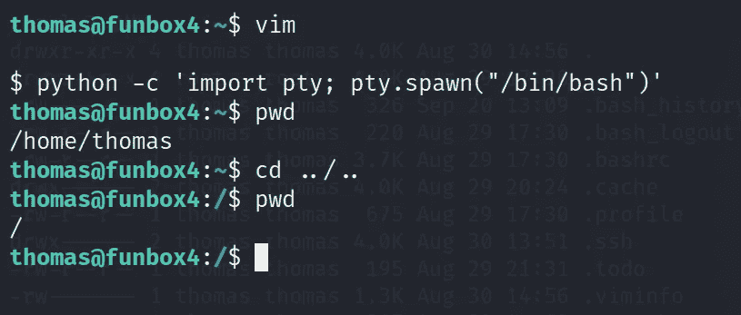

我重复一遍，不要落入像 **pspy64** 这样的陷阱，因为我试过了。因为 wget 和 curl 不存在，所以使用 SCP 进行文件传输。

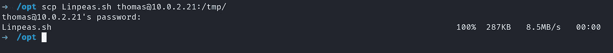

通过更改权限运行脚本，您将看到有用的软件和安装的编译器，它们可能会出现，因为会有一些操作系统漏洞，如果 gcc-5 没有出现，只需重置您的机器。

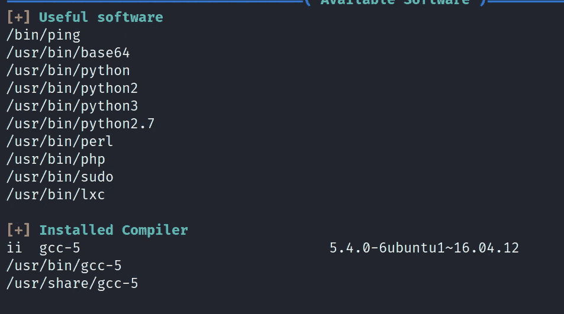

将**l**[**inux-exploit-suggester**](https://github.com/mzet-/linux-exploit-suggester)从您的机器中转移出来，并像我们上面所做的那样运行它。你会得到一个漏洞列表，让我们试试**【CVE-2017–16995】eBPF _ verifier。**

现在下载漏洞利用 **45010。C** 在你的 kali 机器中文件并转移到 thomas 中的 **/tmp/** 路径并将权限改为 **777** 然后运行漏洞利用。我也试过 dirty_cow 1 和 2 但是没用。

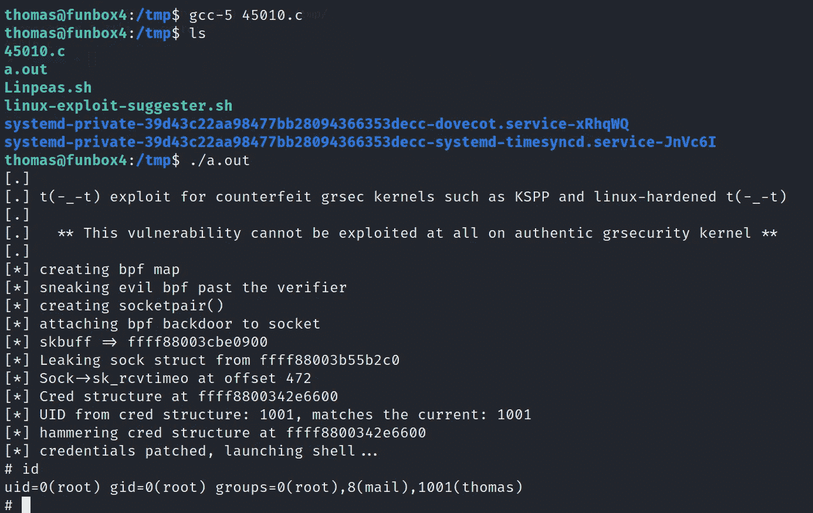

导航到根目录，您将获得标志。

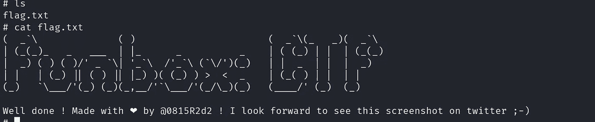

由我和我的伙伴 [**@0xMadhav**](https://twitter.com/0xMadhav) 解决

如需更多演练，请继续关注…

# 在你走之前

访问我的其他新 Vulnhub 机器演练的:-

 [## FUNBOX-3:轻松穿越(Vulnhub)

### 描述

medium.com](https://medium.com/@Shubham_Singh_/funbox-3-easy-walkthrough-vulnhub-fd13a1648445)  [## FunBox-2 演练(Vulnhub)

### 描述

medium.com](https://medium.com/@Shubham_Singh_/funbox-2-walkthrough-vulnhub-b1933209acf3)  [## 医疗保健:1 次演练(Vulnhub)

### 作者描述

medium.com](https://medium.com/@Shubham_Singh_/healthcare-1-walkthrough-vulnhub-24d9d050dd9c) 

拍手声👏🏽如果你喜欢这个。