# FUNBOX 6: GAMBLE HALL 漫游(Vulnhub)

> 原文：<https://infosecwriteups.com/funbox-6-gamble-hall-walkthrough-vulnhub-26ad3f076d67?source=collection_archive---------2----------------------->

## 描述

不是现实生活中的盒子！这是一个非常简单的盒子，让你疯狂。如果你得到的是相反的外壳，那就容易了，疯狂是因为你不明白前 10-15 分钟这里到底发生了什么。 [@0815R2d2](https://twitter.com/@0815R2d2) 设计的好看盒子首先在 **/etc/hosts** 上添加 funbox6.box，开始枚举。

> 端口扫描

像往常一样，首先用 Nmap 扫描网络，寻找开放的端口和服务。

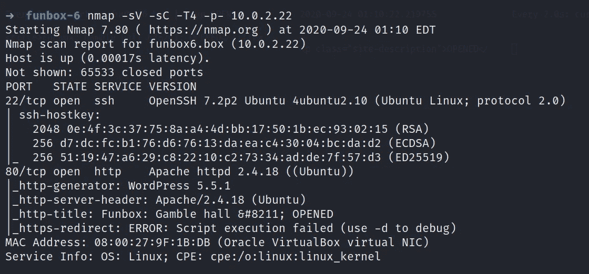

> 网络侦察

访问服务 http，您会注意到服务器状态在一定的时间间隔内发生变化，如下所示👇

当它关闭时

当它打开时…

我试着用 gobuster 找到一些隐藏的目录，很高兴看到结果，因为它安装了 WordPress。

然后我立即启动 Wpscan 来枚举用户的和插件

并且只有一个默认值，即用户管理员。(从这里获得你的 wpscan API 令牌**)**

**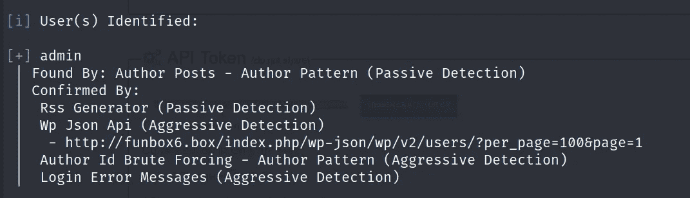**

**我再次启动了另一个 wpscan，但这一次暴力类型获取用户 admin 的密码失败了😔**

**在默认页面上花了大量时间后，我点击了博客上的评论部分，当服务器打开时，我看到了这个**

**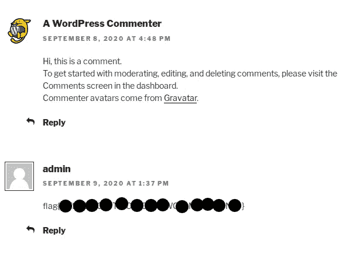**

**当服务器关闭时，你会看到这个。**

**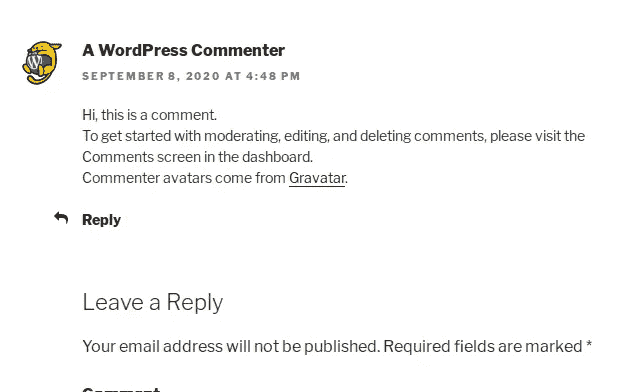**

**从这里破解加密**就可以得到密码****

***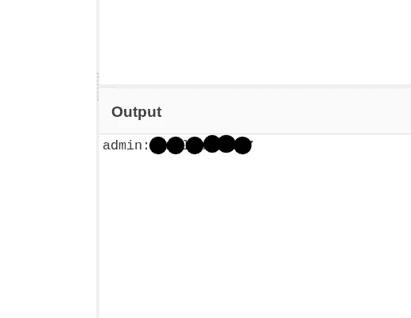***

***因为我有一个用户名和密码 **/wp-login.php** 我登录了，但是当我开始搜索一些方法来获得反向 shell 时，我被抛出了这个页面，这让我很恼火。在 google 搜了很多之后我碰到了一个监视服务器状态的工具是[***https://linoxide . com/tools/mm watch-alternative-Linux-watch-command/***](https://linoxide.com/tools/mmwatch-alternative-linux-watch-command/)*下载下来*输入命令连续监视服务器。*****

**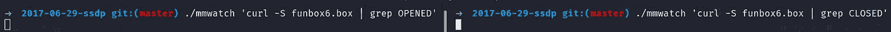**

**这将像这样开始👇**

**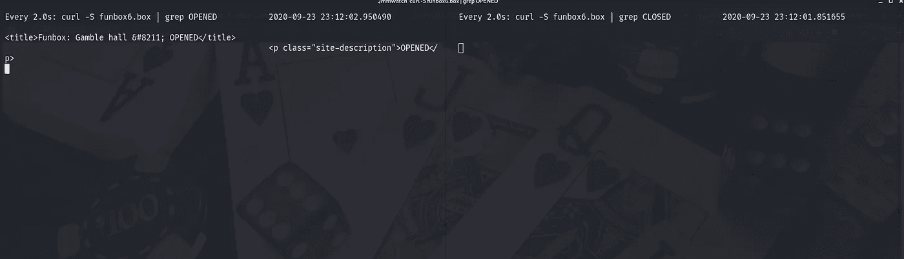**

**你可以用 kali 的内置工具 ***【手表】*** 命令做同样的事情。**

**所以，日志下来之后，我试着修改了一些。PHP 页面，试图安装媒体文件和其他，但没有工作，直到现在。**

> **爆炸阶段**

**然后我尝试了 Metasploit 的一个漏洞来获得反向 shell，即**UNIX/web app/WP _ admin _ shell _ upload。**只需设置如图所示的选项，您将获得会话。**

**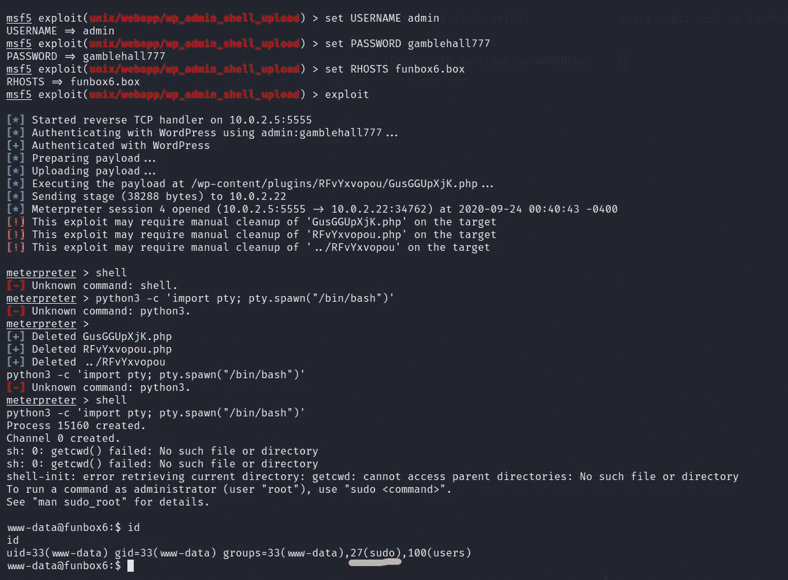**

**如果在任何情况下，你遇到了这个“**漏洞利用因失败而中止:未找到:目标似乎没有使用 WordPress** ”我这样做，然后只需简单地修改这个漏洞利用(详细研究[***【https://jhalon.github.io/vulnhub-mr-robot1/】***](https://jhalon.github.io/vulnhub-mr-robot1/))你就会成功。**

**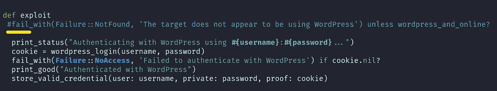**

> **权限提升**

**看到 **sudo** 上的黄色标记了吗？这意味着我们只需输入 **sudo su root 就可以轻松获得 root 权限。****

**导航到根目录，您将获得标志。**

****注意:**观察服务器状态当服务器打开时，您可以执行所有这些操作，当服务器关闭时，您的 meterpreter 会话将终止。**

**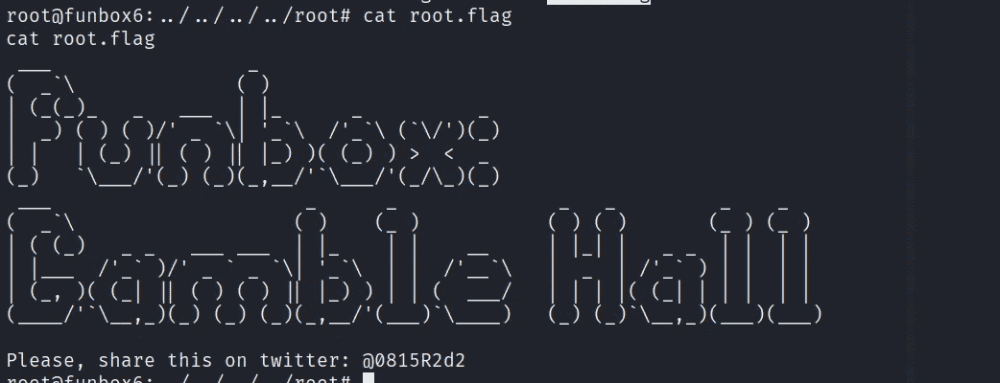**

> **通过插件上传提升权限**

**从这里[**https://www.exploit-db.com/exploits/36374**](https://www.exploit-db.com/exploits/36374)**下载插件，在插件部分，点击插件上传按钮，上传 zip 文件。****

****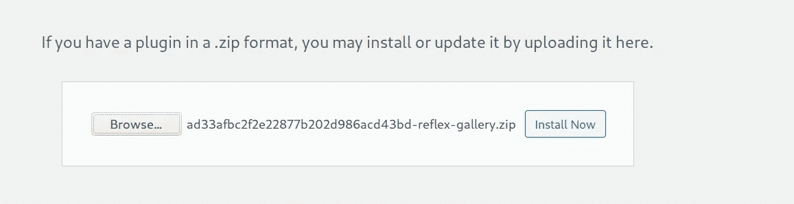****

****现在激活插件来利用它。****

****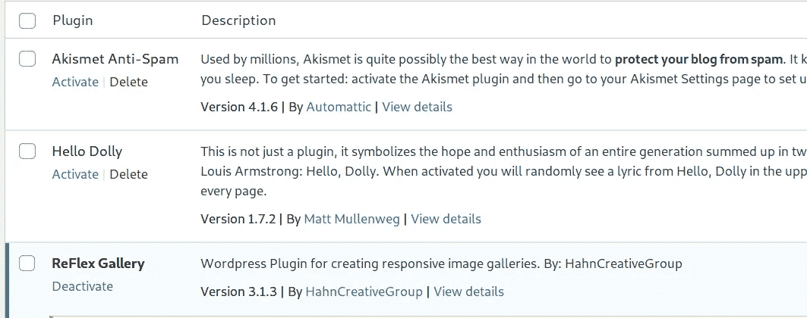****

****再次打开 metasploit，但这次使用这个👇利用并设置如下选项。****

****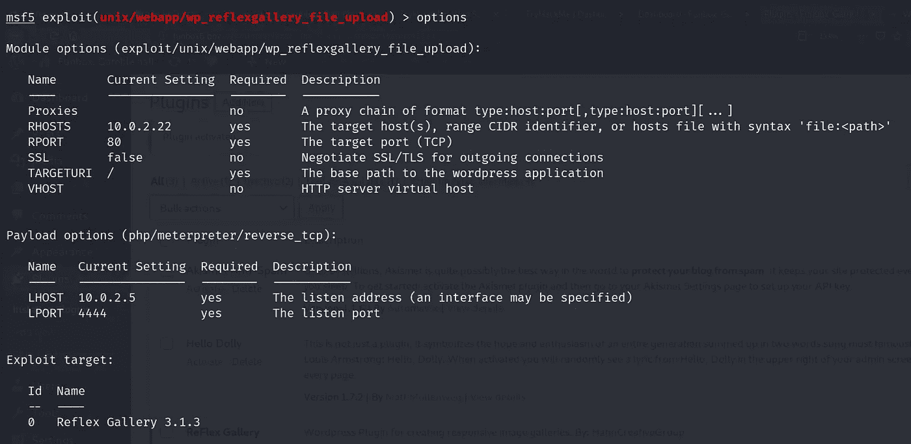****

****再次运行 exploit，您将获得 meterpreter 会话。****

****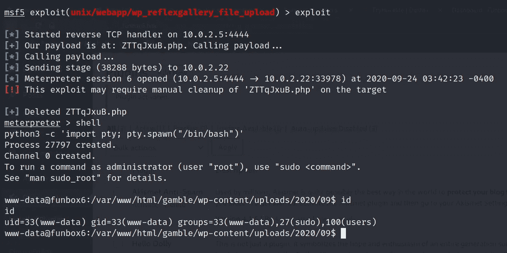****

****按照上面的方法获取根标志。****

****如需更多演练，请继续关注…****

# ****在你走之前****

****参观 Funbox 系列的 Vulnhub 机器漫游:-****

**** [## Funbox-4: CTF 漫游(Vulnhub)

### 土拨鼠日:Boot2Root！最初的脚步有点瑕疵，但真的不难。在接触到…

medium.com](https://medium.com/@Shubham_Singh_/funbox-4-ctf-walkthrough-vulnhub-a5c733c350df)  [## FUNBOX-3:轻松穿越(Vulnhub)

### 描述

medium.com](https://medium.com/@Shubham_Singh_/funbox-3-easy-walkthrough-vulnhub-fd13a1648445)  [## FunBox-2 演练(Vulnhub)

### 描述

medium.com](https://medium.com/@Shubham_Singh_/funbox-2-walkthrough-vulnhub-b1933209acf3)****