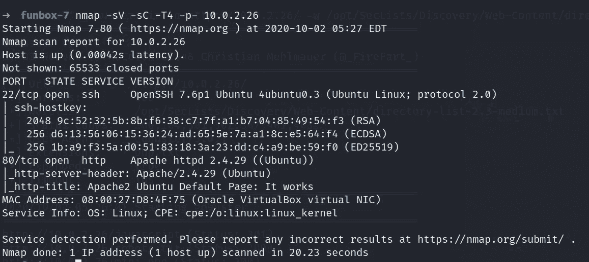
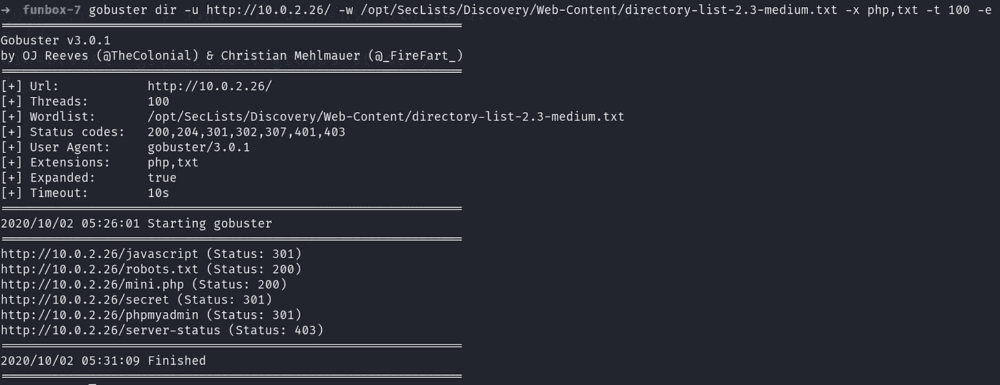
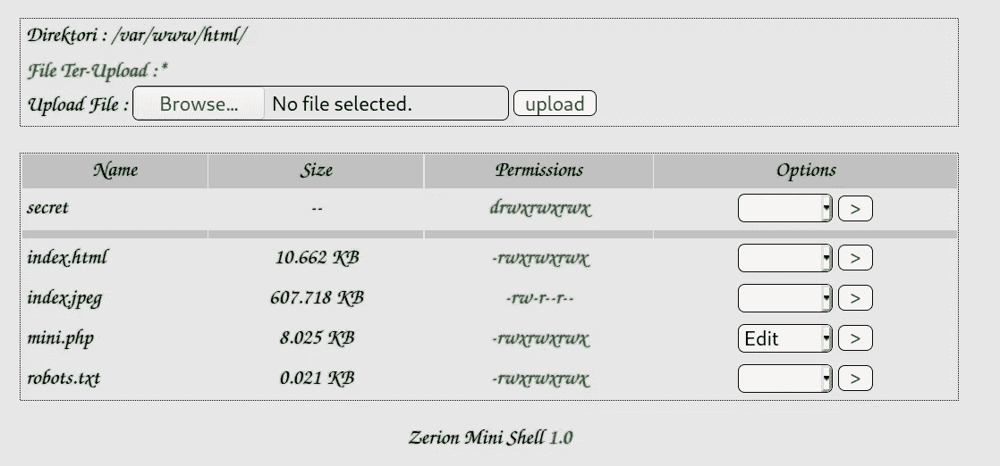
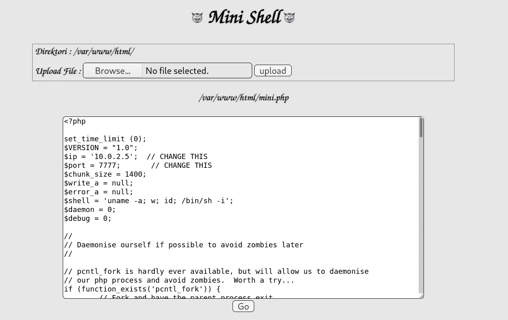
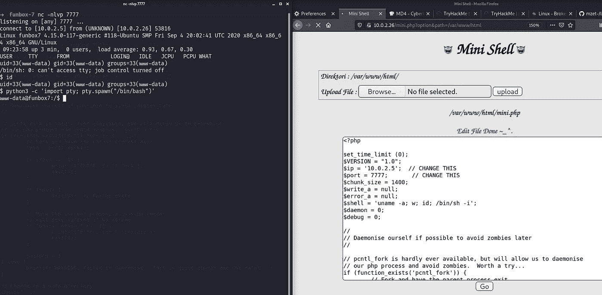
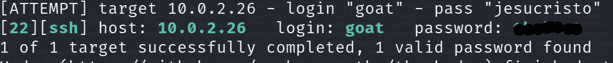
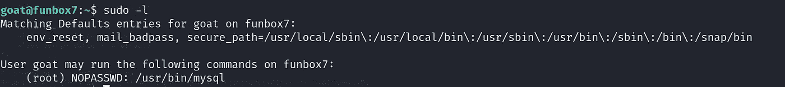
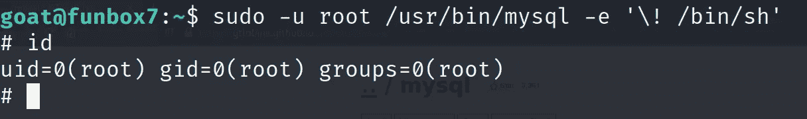
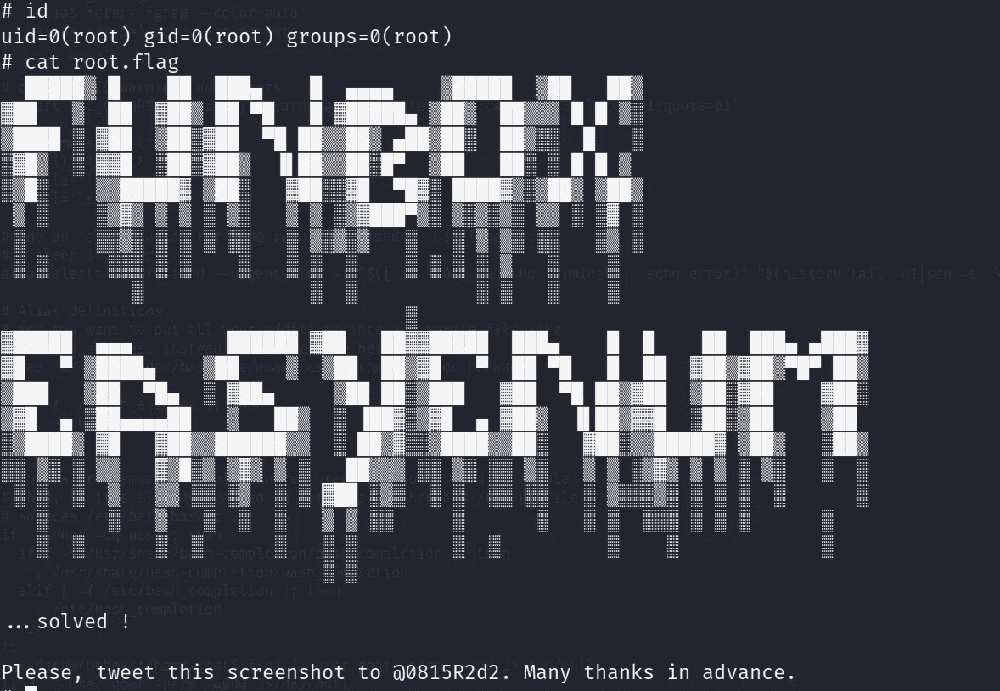

# FUNBOX-7: EASYENUM 漫游(Vulnhub)

> 原文：<https://infosecwriteups.com/funbox-7-easyenum-walkthrough-vulnhub-3c1ef0f1c2ef?source=collection_archive---------0----------------------->

## 描述

面向脚本爱好者的 6 步 Boot2root。扎根这个盒子的时间表:20 分钟到永不。它在你身上。如果找到合适的用户来执行暴力破解，您可以在 20 分钟甚至更短的时间内完成。又一个由 [@0815R2d2](https://twitter.com/@0815R2d2) 设计的好看又好用的盒子。下载访问【https://www.vulnhub.com/entry/funbox-easyenum,565/】**

> **端口扫描**

**像往常一样，首先用 Nmap 扫描网络，寻找开放的端口和服务。**

****

> **网络侦察**

**这里什么都不重要。然后我试着在 80 端口用 gobuster 找出一些隐藏的目录。**

****

**…我们在这里咕。许多隐藏的目录被发现，但帮助我们获得反向连接的是 mini.php。访问 mini.php 已经有一些文件，我试图上传一个名为秘密的文件，看看是否允许上传，是的，我们可以。**

****

**是时候把手弄脏了。上传一个 [**PHP 反向外壳**](http://pentestmonkey.net/tools/web-shells/php-reverse-shell) 文件如下**

****

**并使用 Netcat 打开另一个终端监听反向连接。如果没有得到反向外壳，单击 Go 选项 3-4 次。**

****

**在得到一个低特权 shell 后，我尝试了 LinPEAS 脚本，发现已经安装了 GCC-8 编译器。然后我装了 linux_exploit_suggester 列举了一些 linux 版本的漏洞利用但是失败了。**

**最后，花了大量时间，我决定使用 hydra on service SSH 对每个用户进行暴力攻击。首先，我对用户 harry 进行了测试，但即使花了 10-15 分钟，我还是一无所获。然后我在用户 goat 上试了试，6-8 分钟后，我找到了答案。**

****

**提示-这个密钥类似于 Funbox-4 用户 thomas SSH 密钥。**

> **权限提升**

**通过 SSH 登录，因为我们有密钥，所以让我们检查这个用户拥有的 sudo 权限。**

****

**因此，这个用户可以以 root 用户的身份运行 MySQL。访问这个网站[***https://gtfobins.github.io/gtfobins/mysql/***](https://gtfobins.github.io/gtfobins/mysql/)*你可以通过 MySQL 服务找到权限提升技术。***

******

***最后，导航到根目录，我们可以访问根标志。***

******

***如需更多演练，请继续关注…***

# ***在你走之前***

***访问我的 Funbox 系列漫游的:-***

*** [## FUNBOX 6: GAMBLE HALL 漫游(Vulnhub)

### 描述

medium.com](https://medium.com/@Shubham_Singh_/funbox-6-gamble-hall-walkthrough-vulnhub-26ad3f076d67)  [## Funbox-4: CTF 漫游(Vulnhub)

### 土拨鼠日:Boot2Root！最初的脚步有点瑕疵，但真的不难。在接触到…

medium.com](https://medium.com/@Shubham_Singh_/funbox-4-ctf-walkthrough-vulnhub-a5c733c350df)  [## FUNBOX-3:轻松穿越(Vulnhub)

### 描述

medium.com](https://medium.com/@Shubham_Singh_/funbox-3-easy-walkthrough-vulnhub-fd13a1648445) 

鼓掌👏如果你喜欢你所读的。欢迎反馈。***