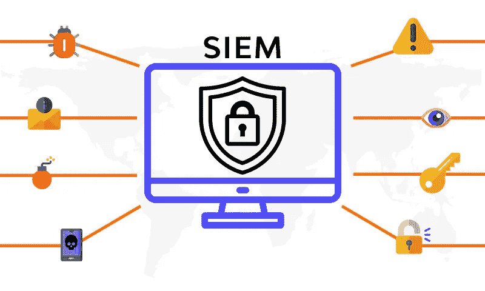
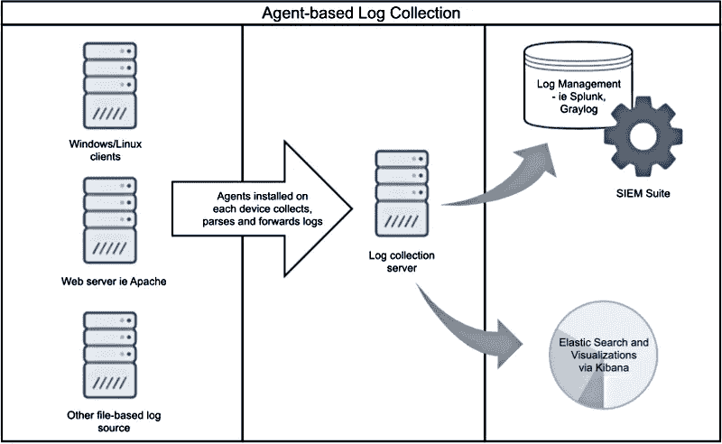
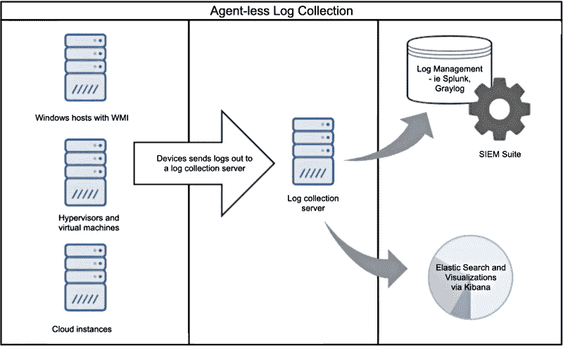
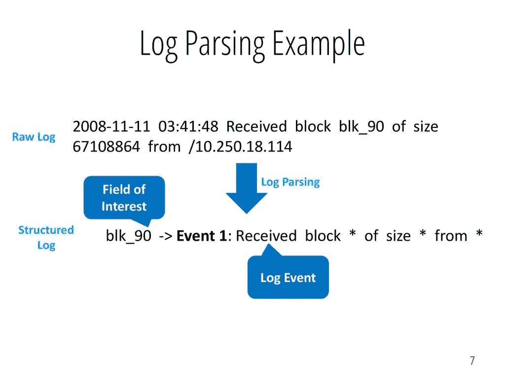

# SIEM 的基础知识

> 原文：<https://infosecwriteups.com/fundamentals-of-siem-f42359500f1c?source=collection_archive---------0----------------------->

## 这个博客是为那些对任何 Siem 工具感兴趣的人准备的。

来源:[https://www . wall arm . com/what/siem-whats-security-information-and-event-management-technology-part-1](https://www.wallarm.com/what/siem-whats-security-information-and-event-management-technology-part-1)

> **什么是 SIEM？**

SIEM 代表安全信息和事件管理。SIEM 软件结合了安全信息管理(SIM)和安全事件管理(SEM ),可对网络硬件生成的日志和安全警报进行实时分析。在一个组织中，时不时会生成大量日志，SIEM 工具可以简化这一过程，因为它具有关联、传输、解析、汇总、存储、警报等功能。SIEM 软件为组织提供分析、响应、仪表板、日志修改、相关性、警报等功能。借助 SIEM，我们可以创建规则，软件将根据这些规则匹配重复发生的事件。我们可以通过使用来自 MITRE 等资源的信息，由 APT(高级持续威胁)组创建规则来防止高级威胁。

> **西安工作**

SIEM 软件首先从各种来源收集日志，如网络、应用程序、安全设备、防病毒日志、连接到内部网络的其他设备等，然后对其进行分类。现在，开始创建规则，我们需要为特定的威胁创建规则。例如:有一个 IP 地址正在我们的一个子域上运行 web 漏洞扫描(使用 OpenVas 或任何其他扫描器),然后我们将创建一个规则来生成针对此类 IP 的警报，每当此类事件发生时，SIEM 都会生成警报。通过使用 SIEM，我们可以提高调查效率。

日志收集有两种方式:

1.  日志代理
2.  无代理

> **日志代理**

简而言之，日志代理是安装在需要收集日志的所有节点上的软件。这些软件具有解析、日志旋转、缓冲、加密等功能。我们将提前学习这些术语。在发送到目的地之前，可以在这里修改日志。例如:如果有一个帐户登录日志的“用户名”=“迈克”；" password" = "172#prod@123 "那么我们可以把它分成两部分，转发为->

信息 1:“用户名”=“迈克”

信息 2:“密码”=“1723 prod @ 123”

来源:[https://nxlog.co/](https://nxlog.co/)

**Syslog** - > Syslog 是一种传输日志的网络协议。TLS 可用于加密日志。如果我们想用 syslog 传输日志，那么我们需要用 syslog 格式解析它。

理想的系统日志格式:

时间戳-源设备-设施-严重性-消息编号-消息文本

> **无代理**

无代理日志发送过程是指客户端不希望安装任何软件来收集日志并通过 SSH 发送日志。使用这种方法，我们需要提供登录凭证，这是很危险的。

[https://nxlog.co/](https://nxlog.co/)

> **日志解析**

日志解析是 SIEM 用来从原始日志中提取数据元素的一个非常重要的工具。解析使我们能够关联来自各种来源的数据，以进行事件分析。

【https://slideplayer.com/slide/13707343/ 

> **日志聚合**

日志聚合是将所有生成的日志发送到的地方。在这里，我们可以根据要发送到目的地的内容来修改日志。例如:如果有一个从 web 服务器生成的日志，其中包含用户代理、文件、方法等的所有细节，而我们只需要发送代码(404、200 等)，那么我们可以解析它，并只将所需的部分发送到目的地。

> **日志聚合器流程**

在将日志发送到最终目的地之前，需要对日志进行处理。通过 3 种方式处理日志:

1.  从语法上分析
2.  丰富:可以在调查的时候达到更高的效率。例如:我们可以添加地理位置，因为我们从日志中知道 IP 地址。
3.  过滤:有时需要在将日志发送到目的地之前对其进行修改或过滤。可能会有一些错误，比如:假设日志的时间格式不正确，那么我们可以做的就是以正确的格式修改它。

> **EPS**

EPS 是每秒事件数。EPS 与聚集和存储成正比。如果 EPS 很高，那么聚合和存储也会很高。现在，如果 EPS 很高，就好像每个日志只使用一个聚合器，那么我们需要多个聚合器，这会使聚合器负载过大。这个过程称为扩展聚合器。

> **日志的存储**

一旦日志到达目的地，它们需要被存储，并且我们需要巨大的存储空间来存储日志。存储空间应该足够大，而且要高效。为了提高效率，访问数据的速度应该非常快。

我们也可以使用一写多读(worm)技术，因为我们已经完成了上面的修改部分。

> **警报**

现在，我们已经成功处理并存储了日志，我们需要创建规则来检测网络、设备和网页上的异常活动。假设今天创建了一个日志，那么我们需要在严格的时间范围内发出警报。如果我们在 2-3 天后才收到警报，那又有什么意义呢？没什么！因此，快速索引功能是必须的。

创建触发警报的规则的示例:

1.  假设，有一个新用户在主管理员中添加了高级权限。
2.  假设，有一个登录网页，有人重复点击重置密码一样 15 次。

> **技巧**

1.  黑名单:在这项技术中，我们创建了一个所有可能的恶意情况的列表。例子->我们可以使用开源工具收集并记下所有恶意的进程。如果日志中记录了该进程，将会触发一个警报。我们还可以创建一个所有被禁 IP 的列表。
2.  白名单:在这种技术中，我们创建了一个所有可能的正常情况的列表，其中不应该有警报。但是我们需要定期更新这个列表。

> *感谢阅读。如果你觉得有用，欢迎在评论中提问并分享这篇文章。*