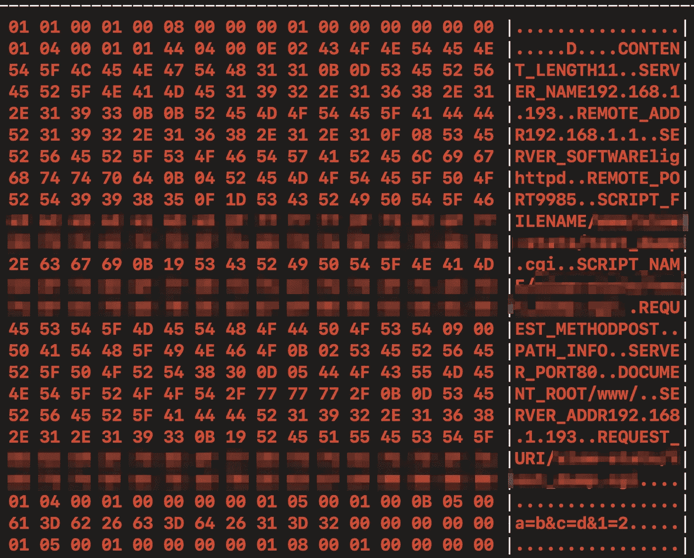
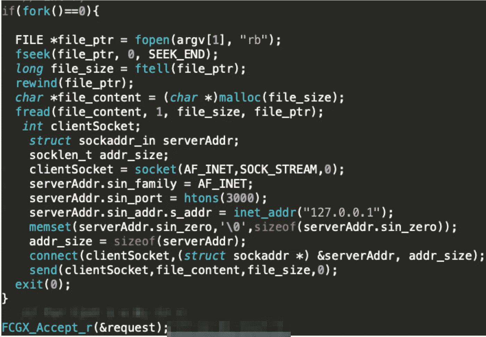
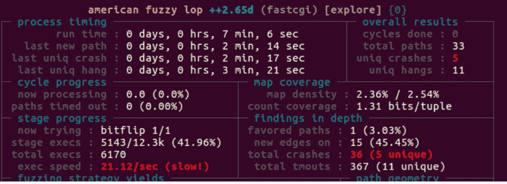
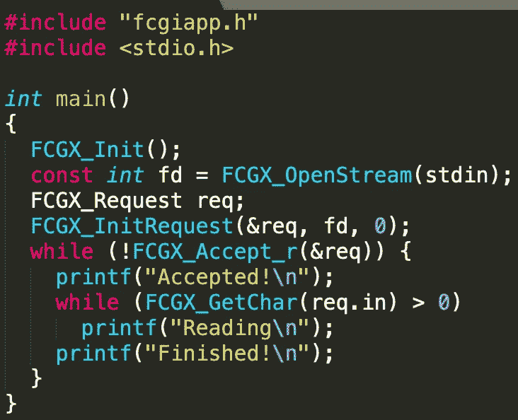
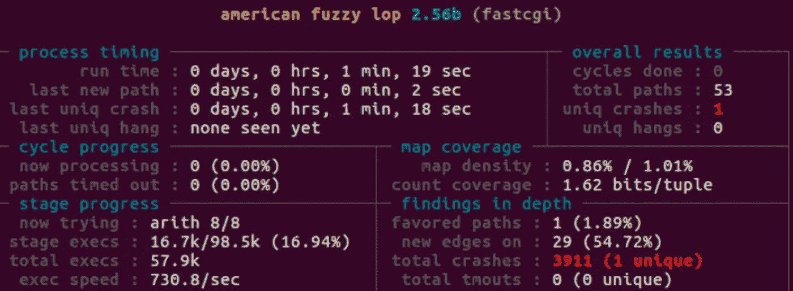
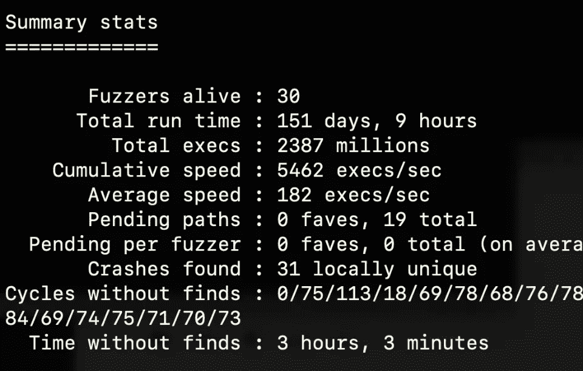

# 用 AFL-Fuzz 使 FastCGI 起毛

> 原文：<https://infosecwriteups.com/fuzzing-fastcgi-an-odyssey-4ffc1c72a732?source=collection_archive---------0----------------------->

这是我和 AFL-fuzzing 在 FastCGI 的冒险故事。如果您对模糊 FastCGI 二进制文件感兴趣，请不要犹豫。

# FastCGI 是什么？

FastCGI 是一个**二进制协议**。在大多数情况下，用户与 web 服务器(如 nginx 或 lighttpd)交互，web 服务器又通过命名管道或 TCP 连接与 FastCGI 通信。FastCGI 然后执行代码。

# 为什么是 FastCGI？

我可以访问用 C/C++编写的使用 FastCGI 的二进制文件。事实上，FastCGI 几乎用于每一个嵌入式设备。最流行的版本是 OpenMarket 的 FCGI 2.4.0，也就是 **17 岁。**

也没有关于 fuzzing FastCGI 的文档或研究(除了这篇)。

# FastCGI 请求

根据 [RFC 3875](https://tools.ietf.org/html/rfc3875) ，FCGX_Request 主要由两部分组成:

*   envp:envp 充满了元变量，有些是用户控制的，有些不是。web 服务器可能会也可能不会对这些元变量进行 URL 编码
*   参数:100%由用户控制且未修改

你不能只向 FastCGI 发送 HTTP 请求，它是一个二进制协议。FastCGI 请求的 hexdump 如下所示:

Top = envp。Bottom =参数

上面的请求是在研究过程中通过复制命名管道并使用 socat 拦截使用以下命令的请求而捕获的:

> socat-t100-v-x UNIX-LISTEN:fcgi _ sock，mode=777，reuseaddr，fork UNIX-CONNECT:fcgi_sock2，raw

# 问题#1:插座

FastCGI 通过 TCP 套接字或命名管道接受输入。AFL-Fuzz 通过 STDIN 或 fuzzed 进程使用的文件发送输入。

最快的方法是修改我们正在模糊化的二进制文件，将第一个参数作为一个文件，读取文件内容，并将内容发送到它的套接字端口。我们需要在 FCGX_Accept_r 运行之前分叉这个进程，因为它阻塞了。

这不是一个完美的实现。它速度慢，容易出故障，并且会产生很大的性能瓶颈。

FastCGI 在我们虚拟机上的执行速度是 0.011 秒。

我们最初假设执行速度为 90–100/秒。

然而在 QEMU 模式下，结果大约是 7-20 次/秒。

您看到的崩溃是误报，是由于位翻转协议而发生的，这在正常情况下是攻击者无法控制的。

# 问题#2:编译

QEMU 模式烂透了。为什么我们还停留在 QEMU 模式？

嵌入式设备上的二进制文件通常用不同于普通 Ubuntu VM 的运行时编译。大多数嵌入式设备使用 musl 而不是 glibc(都实现了 libc)。

主要的区别是 musl 二进制文件占用更少的空间，并且考虑到了安全性。

哦，还有[**musl 不支持 ASAN**](https://github.com/google/sanitizers/issues/1080) 这就给检测内存问题造成了障碍。

afl-g++和 musl-g++有一些标志不兼容的问题。每个二进制文件都是不同的，所以您必须自己进行故障排除来检测您自己的二进制文件。

一旦我们用 AFL 检测了我们的二进制文件，我们的性能速度是 70–90/秒！比以前好多了，但离完美还差得远。

# 问题#3:标准输入

我习惯于看到 1-5K exec/second 的 afl-fuzz 截图。以我现在的速度，要找到任何漏洞都要花很长时间。下一步很明显:**修改 fcgi 库以接受标准输入。**

> *在此插入黑客魔法*

噗！FastCGI 可以通过标准输入读取请求，而不是套接字或 TCP 连接。这是新实施的概念证明:

AFL-Fuzz 的执行速度现在是每核 500–1.5K exec/秒。

# 决赛成绩

AFL-Fuzz 使用 30 个内核，在 5 天内运行了 23 亿次执行。我们有 31 起本地独有的车祸！

显示的平均执行速度是由于二进制文件尝试磁盘 I/O 操作，这导致了性能瓶颈。

如果没有瓶颈，你应该至少达到 1K exec/core/second。

# FastCGI 模糊保护:

**创建字典:** FastCGI 极其挑剔。如果你需要帮助理解协议，afl-analyze 是一个很好的工具，可以给你一个直观的视图。

**尽量减少你的语料库:**语料库越小越好。通过[创建自己的请求](https://github.com/wuyunfeng/Python-FastCGI-Client)并保存到 netcat，我可以将我的语料库从 1200 字节减少到 400 字节。

**使用 AFLSmart:** 我无法配置一个正常工作的桃核，但最终最重要的是使用 [AFLSmart](https://github.com/aflsmart/aflsmart) 进行结构感知模糊化。

这将让您只模糊 FastCGI 请求的特定部分，比如特定的元变量或主体。

**接受标准输入:**接受标准输入是游戏规则的改变者，也是模糊 FastCGI 二进制文件的唯一可行的方法。我已经在 Github 上发布了修改 fcgi 库[的 diff。](https://github.com/omaidf/FastCGIFuzzing)