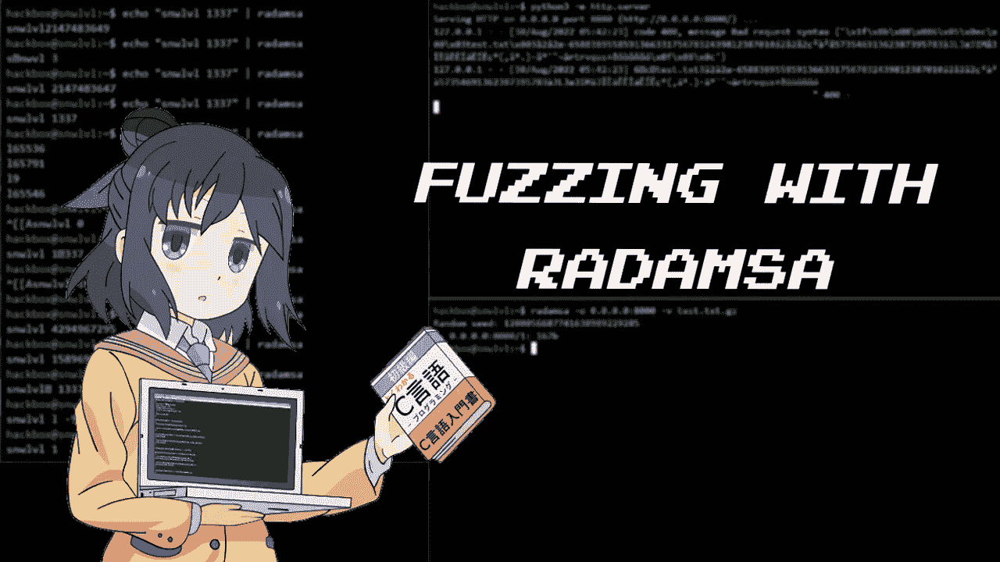
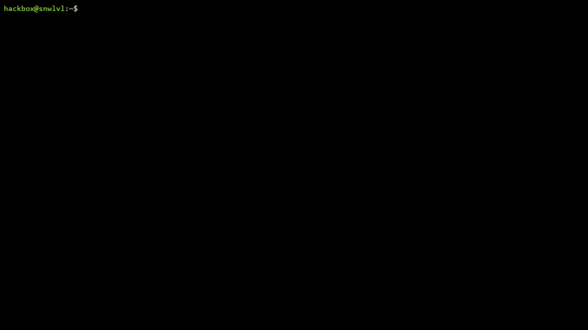
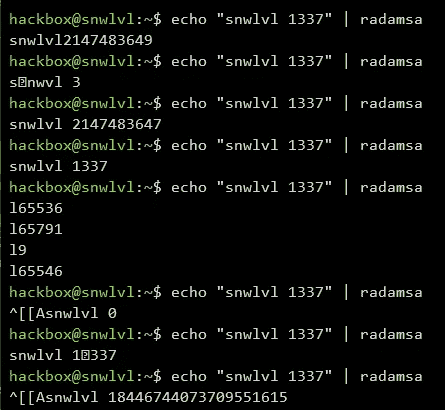
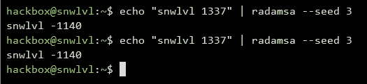
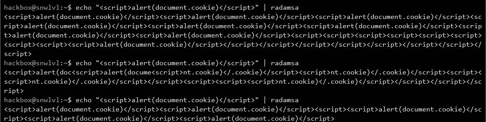

# 用雷达进行模糊处理

> 原文：<https://infosecwriteups.com/fuzzing-with-radamsa-82f1cb7fa15c?source=collection_archive---------3----------------------->



我们可以用不同的方式测试一个应用程序。在这篇文章中，我们将看看[模糊化](https://owasp.org/www-community/Fuzzing)。

开发人员的目标是编写不会崩溃的程序，但是如果程序足够脆弱，攻击者可以试图使程序崩溃并试图利用它。

这个想法是将潜在的恶意输入注入到应用程序中，看看会发生什么。

当程序要求输入时，我们可能会像这样注入恶意或模糊的输入:

*   **“aaaaaaaaaaaaaaaa”**
*   133772030
*   -12
*   2.07
*   _2

但是，每次手动生成传递给目标应用程序的唯一测试用例可能是一个问题。这就是我们可以使用 Radamsa 这样的模糊工具的地方！

雷达是攻击者可以使用的模糊器之一。这是一个用于健壮性测试的测试用例生成器。它是面向黑盒的，因为它不需要关于应用程序的信息。

## 装置

安装相当简单。克隆仓库并构建 radamsa。

```
git clone [https://gitlab.com/akihe/radamsa.git](https://gitlab.com/akihe/radamsa.git) && cd radamsa && make && sudo make install
```

## 起毛



*   **用管子起毛**

echo "snwlvl 1337" | radamsa



默认情况下，radamsa 会随机抽取一个种子开始，每次你都会看到不同的结果

*   **变异模糊**

echo“snwlvl 1337”| Rada MSA—seed 3



在这里，我们选择一个数字变异，所以 radamsa 生成相同的结果

*   **创建 XSS 有效载荷**

echo "" | Rada MSA



你甚至可以使用雷达卫星来产生 XSS 有效载荷！

# 为什么要用？

使用 Radamsa 进行黑盒测试仍然有很多限制，但是 fuzzing 是一种独特的技术，你当然可以使用 Radamsa，因为它简单且易于安装。许多 cv 已经被雷达发现了。好运 fuzzing！

*来自 Infosec 的报道:Infosec 上每天都会出现很多难以跟上的内容。* [***加入我们的每周简讯***](https://weekly.infosecwriteups.com/) *以 5 篇文章、4 个线程、3 个视频、2 个 Github Repos 和工具以及 1 个工作提醒的形式免费获取所有最新的 Infosec 趋势！*