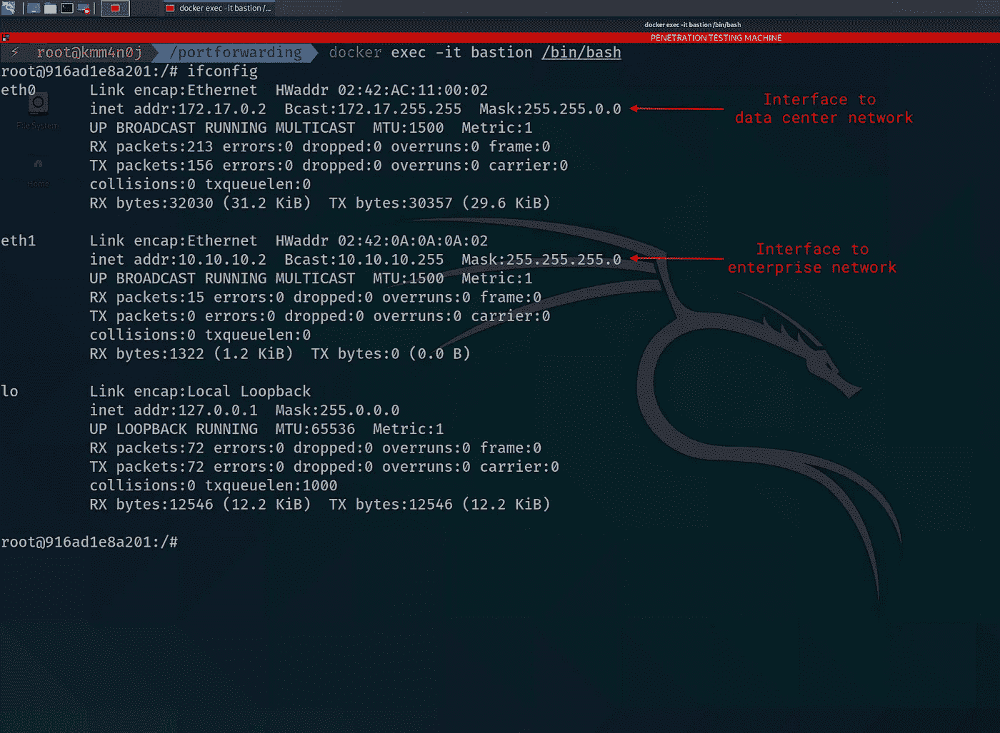
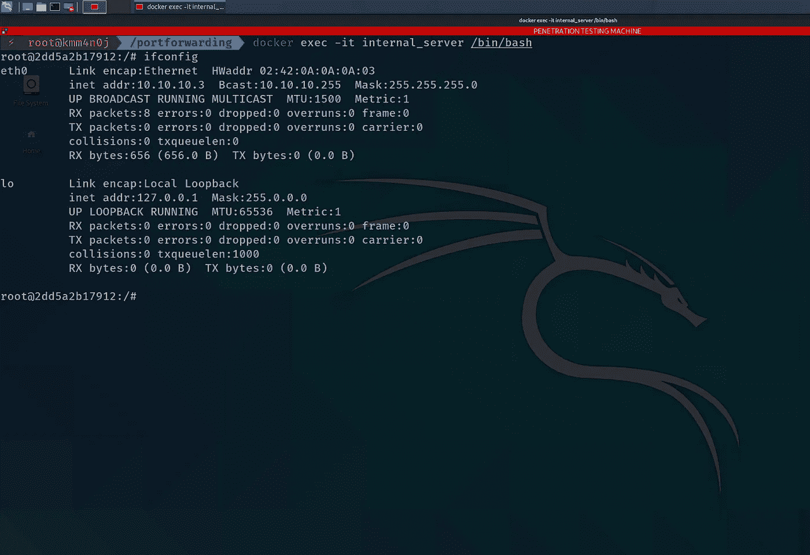

# 使用端口转发访问内部机器—设置实验环境

> 原文：<https://infosecwriteups.com/gain-access-to-an-internal-machine-using-port-forwarding-setup-experiment-environment-dd0a50110650?source=collection_archive---------2----------------------->


端口转发是一种技术，其中一台机器中的端口被隧道传输到另一台机器中的端口。简单地说，对机器*的端口*P1*M1*的请求被“转发”为对机器*的端口 *P2* 的请求。*

想象一下一个 web 应用服务器，其中传入的流量被防火墙过滤，只允许流量通过端口 80 和 443，而拒绝其余的流量。一个恶意用户在端口 22 找到了登录 web 应用服务器的密码。但是不幸的是，防火墙拒绝了他的 SSH 请求。如果恶意用户可以将到达 web 应用服务器端口 80 的请求端口转发到它的端口 22，会怎么样？这样，在服务器端口 80 发出的 SSH 请求将被“转发”到端口 22，并最终由服务器的`sshd`提供服务。

# 方案

想象你自己是一个渗透测试者。在一次成功的社会工程攻击之后，你进入数据中心，将你的计算机连接到网络。你的社会工程技能是如此有效，以至于你设法学会了跳转服务器(或)堡垒服务器和企业网络内部服务器的 SSH 登录密码。**你的意图是在企业网络**的内部服务器( [**水坑**](https://en.wikipedia.org/wiki/Watering_hole_attack) **)中放置一个恶作剧恶意软件。数据中心的堡垒服务器有两个网络接口。一个连接到企业网络，另一个连接到数据中心网络。**


情景视觉

让我们列举一下你所掌握的信息:

*   **数据中心**在***172 . 17 . 0 . 0/16***子网中，**企业**在 ***10.10.10.0/24* 子网**中。
*   **你的**机的 IP 地址是***172 . 17 . 0 . 1****。*
*   **堡垒服务器** **面向数据中心网络**的网络接口 IP 地址为***172 . 17 . 0 . 2****，而**面向企业网络**的网络接口为***10 . 10 . 2****。**
*   ***内部服务器**的 IP 地址为***10 . 10 . 10 . 3*T60。***
*   ***内部服务器** **无法访问互联网**。(不知何故)*
*   *堡垒服务器的 **SSH 登录凭证**为`bastion:fortwall`，内部服务器的`admin:homeportal`。*

*在这篇博客中，我们将介绍建立复制上述场景的环境的过程。在接下来的博客中，我们将进行渗透测试。*

# *让我们边做边学—设置*

*如上图所示，我们将在本地机器上设置一个环境来执行攻击。*

*对于环境设置，我们将使用 [dockers](https://www.docker.com/) 创建相关的网络和节点。出于本演示的目的，请确保渗透测试机器安装了以下实用程序(其中大部分已预安装在 Kali Linux 发行版中):*

*   *[对接引擎](https://linuxhint.com/install_docker_kali_linux/)*
*   *nmap*
*   *ssh(客户端)*
*   *代理链*
*   *python3*

## *设置子网*

*使用 docker-engine 提供的默认桥接网络(通常为 *172.17.0.0/16* )作为数据中心网络。要创建企业网络子网，请运行以下 docker 命令:*

```
*docker network create enterprise --subnet 10.10.10.0/24*
```

*当 docker 引擎运行时(在`docker0`接口)，渗透测试机自动获取 IP 地址 *172.17.0.1* 。它是容器与互联网对话的网关)。*

## *设置节点—修改默认的 ssh 服务器 docker 映像*

*为了创建一个打开了`sshd`服务的 docker 容器，我们将使用`[linuxserver/openssh-server](https://hub.docker.com/r/linuxserver/openssh-server)` docker 图像，在`sshd_config`中稍加修改。创建一个名为`Dockerfile`的新文件，并填入以下内容。*

*然后创建一个名为`sshd_config`的文件(该文件将用于替换`linuxserver/openssh-server` docker 镜像中的原始配置)，并填入以下内容。*

*`sshd_config`是`linuxserver/openssh-server` docker 映像的 SSHd 配置文件的一个简单复制，有以下变化。*

*   *`PasswordAuthentication yes`*
*   *`AllowTcpForwarding yes`*

*然后，通过运行以下命令构建 docker 映像。*

```
*docker build -t sshserver:latest .*
```

## *设置节点—堡垒服务器*

*现在，我们已经有了 SSH 服务器 docker 映像，运行下面的命令将一个 bastion 服务器作为默认桥接网络中的一个容器。*

```
*docker run -d -e SUDO_ACCESS=true -e USER_NAME=bastion -e USER_PASSWORD=fortwall -e PASSWORD_ACCESS=true --name bastion sshserver:latest*
```

*要为堡垒服务器创建辅助接口，请运行以下命令。*

```
*docker network connect enterprise bastion*
```

*设置完成后，bastion 服务器的网络配置如下所示:*

**

*堡垒服务器网络配置*

## *设置节点—内部服务器*

*要将内部服务器作为容器运行，请运行以下 docker 命令。*

```
*docker run -d -e SUDO_ACCESS=true -e USER_NAME=admin -e USER_PASSWORD=homeportal -e PASSWORD_ACCESS=true --name internal_server --network enterprise sshserver:latest*
```

*设置完成后，内部服务器的网络配置如下所示:*

**

*内部服务器网络配置*

****注意*** *:如果你的机器上有其他容器在运行，堡垒服务器的* `*eth0*` *接口 IP 可能不是 172.17.0.2。在攻击过程中，需要记下堡垒服务器获得的 IP 地址，并使用它来代替 172.17.0.2。**

# *这还没有结束*

*在接下来的[博客](https://medium.com/bugbountywriteup/gain-access-to-an-internal-machine-using-port-forwarding-penetration-testing-518c0b6a4a0e)中，我们将通过执行渗透测试来学习端口转发。*