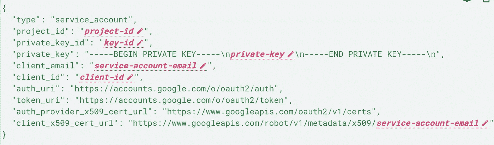
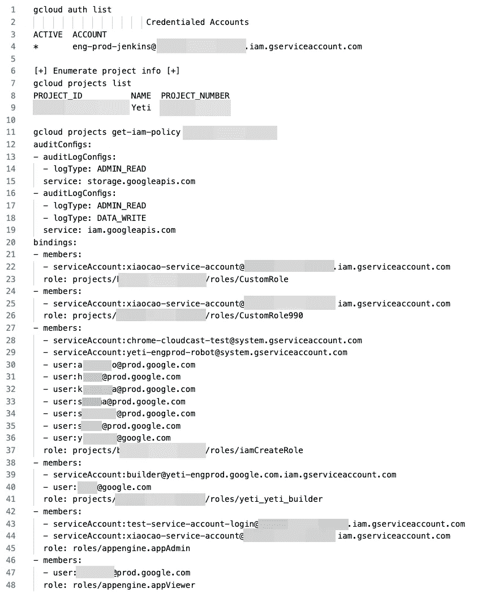
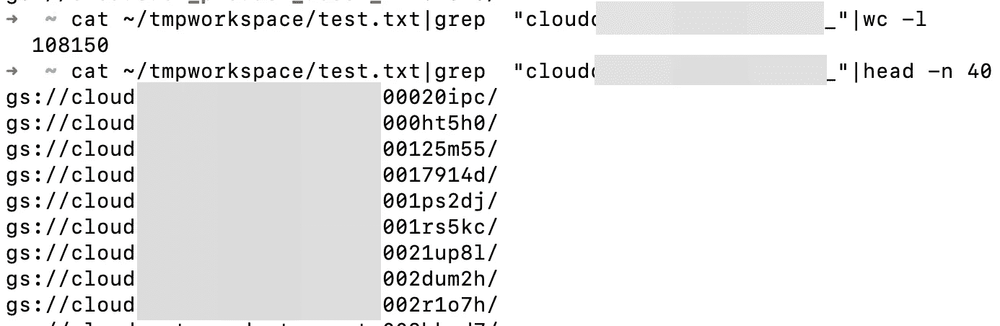

# 进入谷歌 GCP 体育场——500 美元奖金

> 原文：<https://infosecwriteups.com/gaining-access-to-gcp-of-google-stadia-500-bounty-22f76ecc8e60?source=collection_archive---------0----------------------->

你好世界！

到目前为止，我只是一个 bug bounty 文章的消费者。我希望我可以通过写我的冒险来回馈社区！

## 介绍

首先，我必须承认这个故事*有点老*。事情发生在【2019 年 7 月。

那时，我已经学会了云中基于机器的认证方法。特别是，通过连接到[内部元数据端点](https://gist.github.com/BuffaloWill/fa96693af67e3a3dd3fb)，检索服务帐户令牌，并使用泄漏的服务帐户/令牌从外部进行身份验证，利用获得访问云提供商的技术阅读已披露的 HackerOne 服务器端请求伪造和类似的漏洞报告，是我*成功*的关键。这让我想到，与其在单个目标中搜索 SSRF(或相关的)漏洞，不如在 OSINT 这个广阔的世界中碰碰运气。

就我记忆所及，Github 当时并没有扫描暴露的令牌。遭遇暴露的凭证是没有痛苦的。

## 查找搜索查询

当然，第一步是找到找到这些服务帐户的方法。我的方法是在目标中找到一个唯一的字符串来缩小搜索结果。例如，长期 AWS IAM 访问密钥 id 以`AKIA`开头，临时凭证以`ASIA`开头。谷歌服务帐户对我来说是未知的，我需要查找结构，并确定潜在的针头。



[https://cloud . Google . com/iam/docs/creating-managing-service-account-keys](https://cloud.google.com/iam/docs/creating-managing-service-account-keys)

根据谷歌云文档，所有的`service-account-email`值都以`iam.gserviceaccount.com`结尾。

通过用那根针搜索，Github 搜索结果的质量真的提高了。尽管如此，仍有改进的余地。例如，由于服务帐户通常是 JSON 结构，不难想象 Github 用户会在一个. JSON 文件中公开他们的服务帐户。搜索查询可能如下所示:

```
iam.gserviceaccount.com extension:json
```

当然，谷歌服务账户也可能以其他文件格式存储。

在我的例子中，服务帐户令牌写在一个点 YAML 文件中(该文件用于 DevOps 自动化工具)。

## 使用 Google 云服务帐户

此时，Google 服务帐户的所有者仍然不清楚，我需要一种方法来识别所有者。如果 AWS 或任何类似的证书颁发者允许安全研究人员查找所有者，这不是很好吗？我想这可能会涉及到一些隐私问题，但在某些情况下，这确实会有所帮助。

我用各种工具来识别主人。我还没有找到比列出所有谷歌云资源，然后试图将这些数据与一家公司关联起来更简单的方法。

首先，带有小脚本的 Google cloud 命令行界面非常有帮助。我首先从我的环境中撤销任何以前的访问令牌(因为您不希望针对旧的发现)。

```
**➜** gcloud auth revoke --all
```

接下来，我将暴露的服务帐户复制到一个 JSON 文件中(假设原始服务帐户也是 JSON，否则您可能需要摆弄一下)，并告诉 gcloud 使用它。

```
**➜** gcloud auth activate-service-account --key-file service-account.json
```

Gcloud 需要知道可以从 JSON 文件中检索到的项目 id。

```
**➜** gcloud config set project your-project-name
```

最后，您可以使用命令行界面与 Google Cloud 进行通信。

不用手动查询每一个 Google 云资源，我发现只需要使用下面的脚本[https://gist . github . com/carnal 0 wnage/757d 19520 fcd 9764 b 24 EBD 1d 89481541](https://gist.github.com/carnal0wnage/757d19520fcd9764b24ebd1d89481541)就非常方便了(第 4 行需要更改项目 id)。

另一种方式是 NCC 集团的 ScoutSuite。你可以在这里找到它[https://github.com/nccgroup/ScoutSuite](https://github.com/nccgroup/ScoutSuite)。它可能会给你更好的结果，但在我看来，脚本允许更快的概述。

*注意:您的服务帐户可能有权访问其他项目。最好用* `*gcloud projects list*` *列出所有可访问的项目，并检查每个项目的信息。*

我喜欢将转储的信息放在代码编辑器中，以便于查看。您可以通过将输出通过管道传输到如下文件中来实现这一点:

```
**➜** bash gcp_enum.sh >> out.txt
```



输出的前 48 行。


产量惊人。109.818 行，其中 108.466 行是桶。许多桶很无聊，因为它们是带后缀的桶；也许是日志文件的“版本化”存储桶？



108.150 桶是带后缀的桶

其他 316 个水桶有有趣的名字；包含单词“**备份**”、“**生产**”、“**自动化**”、“**詹金斯**”、“**视距**”、 **+“备份**”、“**日志”、“gpg”、“ssh”、“部署”、“脚本”、“转储”等等。**

我不仅可以访问这些存储桶，还可以访问 BigQuery 和其他云资源。


BigQuery 中的 Stadia 分析数据集

当时，我真的很高兴，认为访问生产数据将为我带来可观的收入，但谷歌付给我 500 美元的赏金。

**\_(ツ)_/**