# Gallery Tryhackme 演练第 1 部分

> 原文：<https://infosecwriteups.com/gallery-tryhackme-walkthrough-part-1-21cdf044b3b8?source=collection_archive---------2----------------------->

## **文件上传攻击**

久违了，欢迎回来，让我们重新开始道德黑客部分。

*酷让我们开始*

照片由[克拉克·蒂布斯](https://unsplash.com/@clarktibbs?utm_source=medium&utm_medium=referral)在 [Unsplash](https://unsplash.com?utm_source=medium&utm_medium=referral) 上拍摄

首先，我部署它，并开始扫描目标。

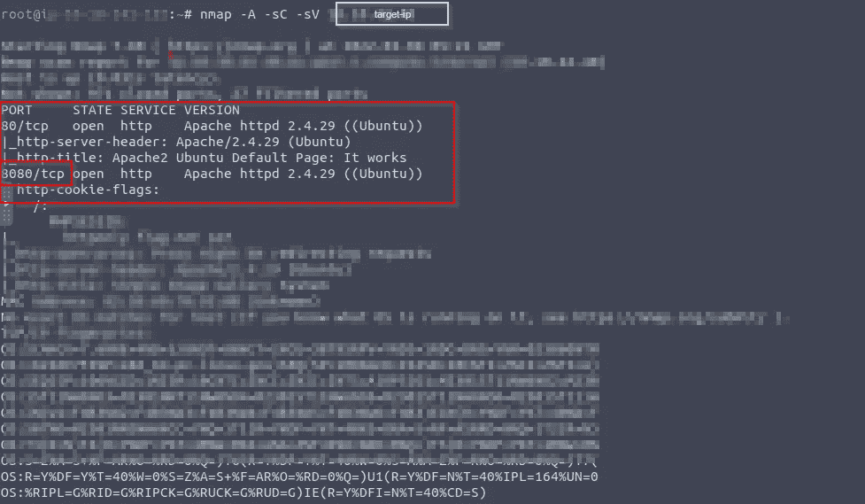

打开了两个端口，一个是 8080，另一个是 80。

端口 8080 是有趣的部分。

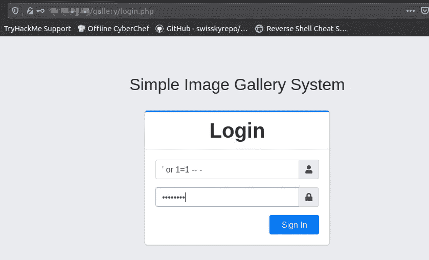

它有一个名为“简单图像图库系统”的登录界面。

你可以通过 SQL 注入进入目标网页界面。

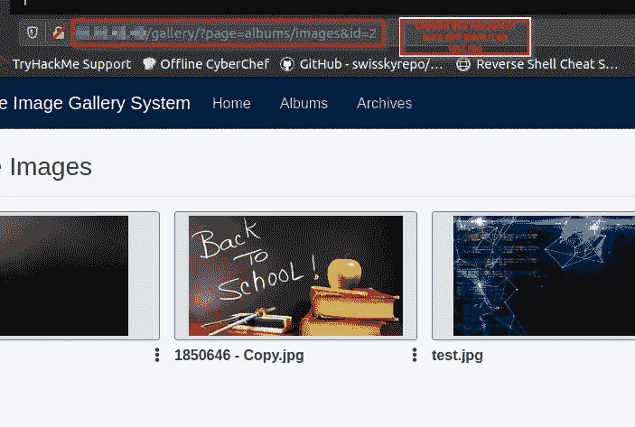

成功登录 web 应用程序后，导航到此位置，使用 Burpsuite 捕获请求，并将其发送到中继器，然后将请求另存为”。req”。并对我们保存的请求执行 SQL 注入，以获取管理员密码或哈希。

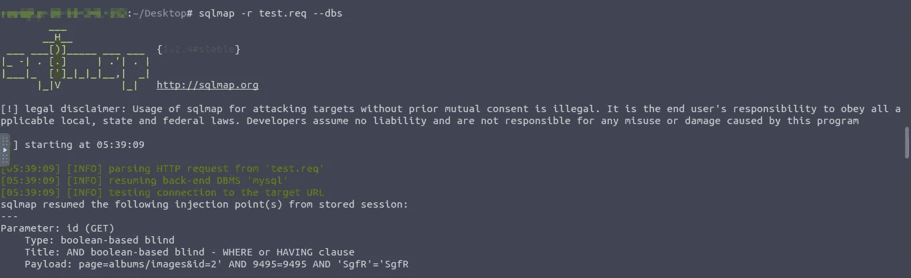

开始键入以下命令获取数据库

> sqlmap -r test.req - dbs

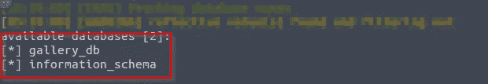

找到的可用数据库是 gallery_db 和 information_schema。

然后我通过使用

> sqlmap-r test . req-D gallery _ D B- tables

输入这个命令后，我使用相册列表、图像、system_info 和用户等信息。

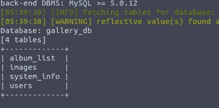

> 在我进入用户的表之后

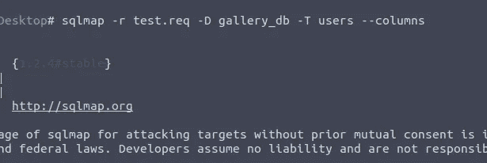

> sqlmap -r test.req -D gallery_db -T 用户-列

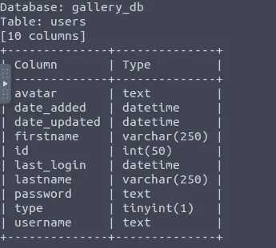

我们的用户名和密码栏，我们试图进入它。

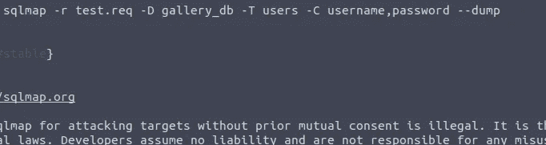

> sqlmap-r test . req-D gallery _ D B- T users-C 用户名和密码转储

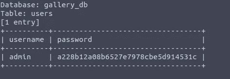

最后，我们找到了管理员的密码散列。

下一个任务是要找到 **user.txt.**

为此，我们必须研究文件上传或图像上传功能，以便远程进入系统。

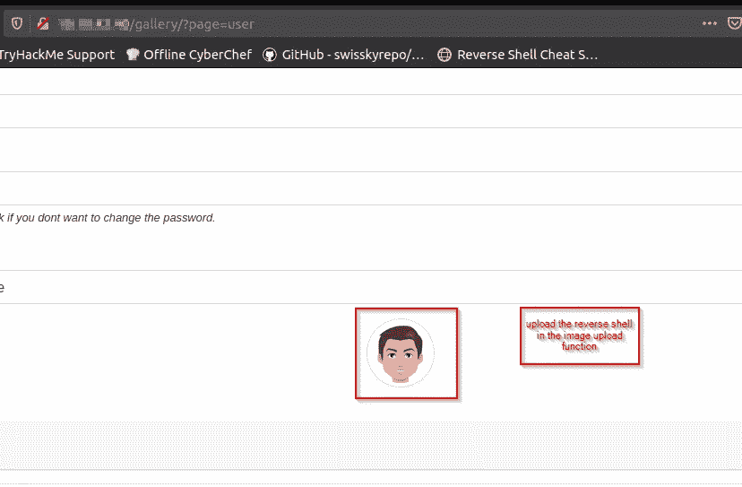

我在网页上找到了上传功能，并通过上传反向外壳来利用这些功能。

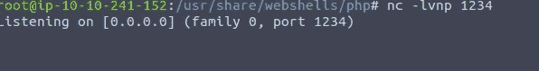

我开始用 Netcat 监听，上传那些反向 shell，把目标 shell 弄回来。

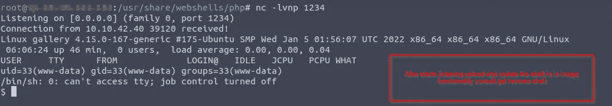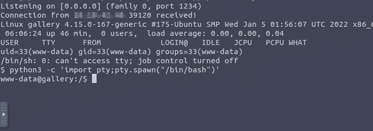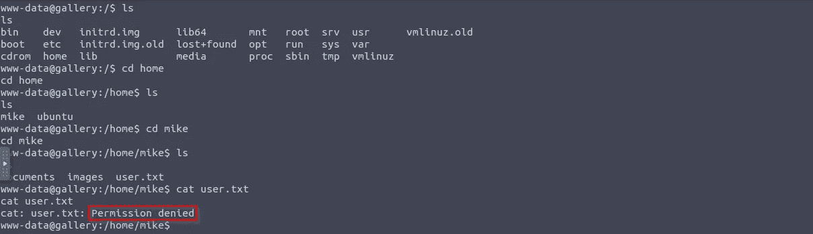

我导航到用户 mike 的位置，打开 user.txt。

这需要许可，所以我试着去调查**。bash_history**

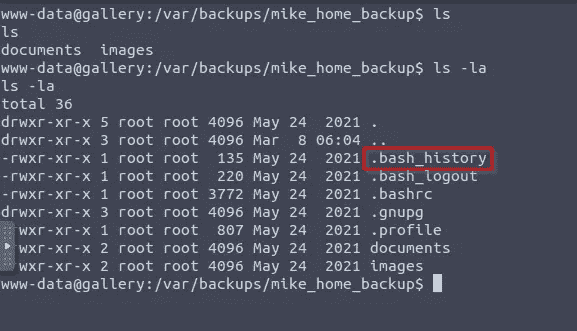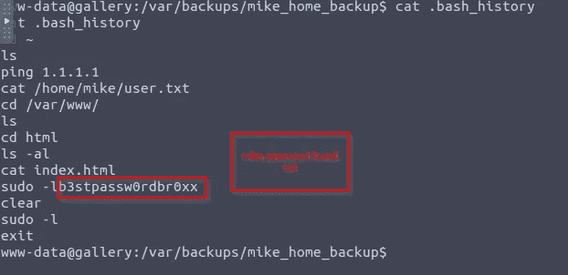

你可以在这里看到迈克的密码。

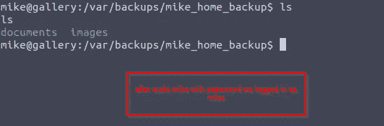

进入 mike 帐户后，我们会启用 user.txt 文件。

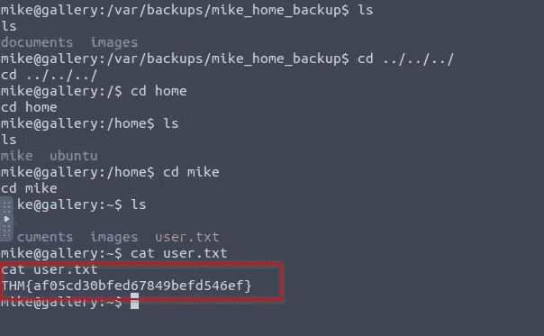

Infosec Writeups 团队刚刚完成了我们的第一次虚拟网络安全会议和网络活动。我们有 16 位出色的演讲者，他们主持了非常有价值和鼓舞人心的会议。要查看演讲者和主题列表，请点击此处。

 [## IWCon2022 — Infosec 书面报告虚拟会议

### 与世界上最优秀的信息安全专家建立联系。了解网络安全专家如何取得成功。将新技能添加到您的…

iwcon.live](https://iwcon.live/)