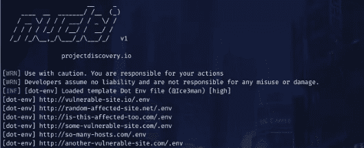
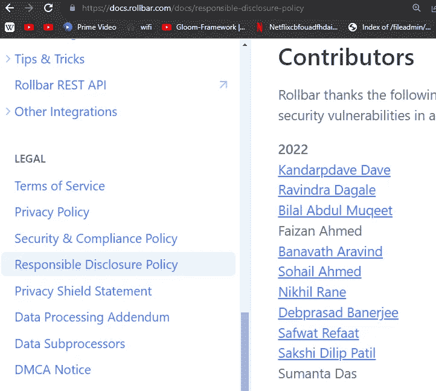
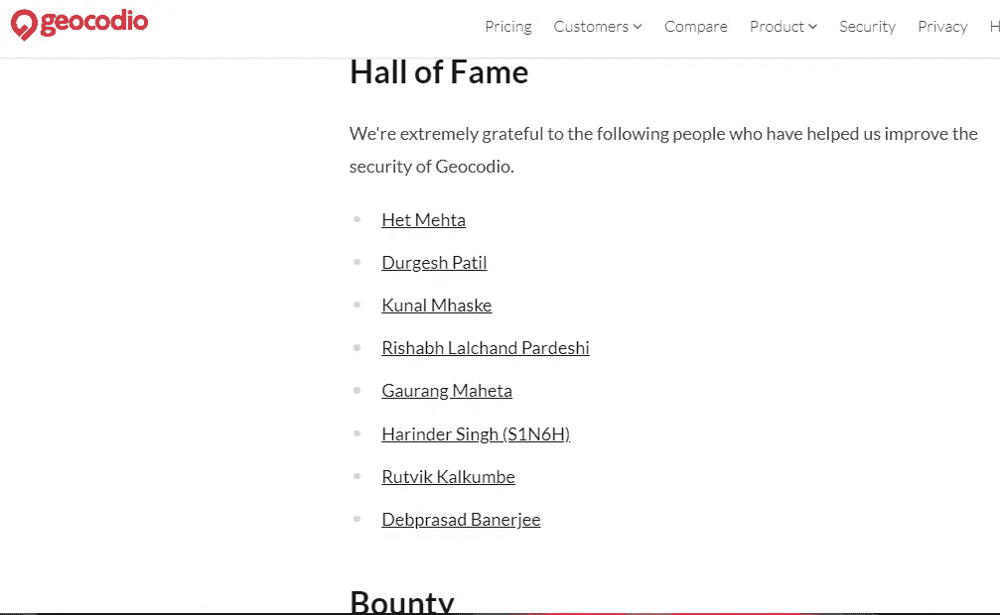

# 即时奖金的测量+核

> 原文：<https://infosecwriteups.com/gauing-nuclei-for-instant-bounties-7a8a07979fff?source=collection_archive---------0----------------------->

再次回到即时奖金系列。上次我们学习了如何与 G [oogle 呆子](https://debprasadbanerjee502.medium.com/google-dork-for-instant-bounties-a332764fc3e2)一起获得即时奖励，所以如果你还没有的话，请查看一下。再来说说更多的即时赏金技巧。注意，这些技术已经让我在 P2、P3、P4 等地遇到过多次错误。坚持到自动化的最后。

让我们今天继续原子核部分，并在下一部分测量，因为它需要更多的理解。

## 什么是测量？

> 命令:cat all.txt | gauplus -subs -b png，jpg，gif，jpeg，swf，woff，gif，SVG-o allurls . txt；cat allUrls.txt | httpx -mc 200，403 -o liveallurls.txt

首先我们使用[子域](https://github.com/Cyber-Guy1/Subdomainer)获取 **all.txt** ，命令为:

> 。/子域名-t rollbar.com-f true

嗯，Gau 是一个工具，代表获得所有网址，Gauing 基本上是指自制的过程中获得所有网址与几个自定义调整，我已经完善了我的赏金猎人。

> 命令:
> 
> cat all.txt | gauplus -subs -b png，jpg，gif，jpeg，swf，woff，gif，SVG-o allurls . txt；cat allUrls.txt | httpx -mc 200，403 -o liveallurls.txt

我们排除了图像和字体文件等不太重要的内容:

下面是我们在评估时排除的一个完整列表:

> png，jpg，gif，jpeg，swf，woff，gif，svg

在使用-b 排除之后，我们进一步想看看哪些是活动的，哪些是不活动的，为此我们使用 [HTTPX](https://github.com/projectdiscovery/httpx) 来过滤不活动的链接。把这个放在一边，在下一部分，我会告诉你几个过滤器用来给 bug 评分。在原子核上运动

## 核心

这是一个自动化的扫描器，通过自动化给我带来了几个错误。

运行子域名后，运行 nuclei，all.txt 位于网站文件夹内，这将由子域名自动生成。

**命令:**

**nucleus-t/root/nucleus-templates/-l all-live . txt-es info-o nuclei all . txt**

这排除了与信息相关的错误，只关注低、中、高严重性，并将结果保存到 nucleiall.txt

## 有用吗？

是啊！我的几个学生已经发现了数不清的 bug，诀窍是让它自动化，而不是专注于此。这让我进了几个名人堂，最近的一个例子是:

弯曲

**自动化:**

为了实现自动化，我编写了一个 shell 脚本，注意需要安装一些东西:

去 GitHub 下载脚本:[https://github.com/Ravaan21/Chandrahasa/](https://github.com/Ravaan21/Chandrahasa/)

关于这个工具的一切都在我的 Github Repo 中有解释

**Gauplus**

**Httpx**

**子域名**

现在将脚本移动到您下载子域的位置。

安装:安装三个工具后:

chmod +x chandrahas.sh

> 用法:。/钱德拉哈萨·websitename.com

现在去进入名人堂吧，从 rollbar.com 开始，用我的剧本。得分时发表评论。让我知道你是否需要易受攻击目标的列表:)

请继续关注下一部分，我将解释如何用这种方法而不是名人堂来计算现金；)—拉瓦安

## 来自 Infosec 的报道:Infosec 每天都有很多内容，很难跟上。[加入我们的每周简讯](https://weekly.infosecwriteups.com/)以 5 篇文章、4 个线程、3 个视频、2 个 GitHub Repos 和工具以及 1 个工作提醒的形式免费获取所有最新的 Infosec 趋势！