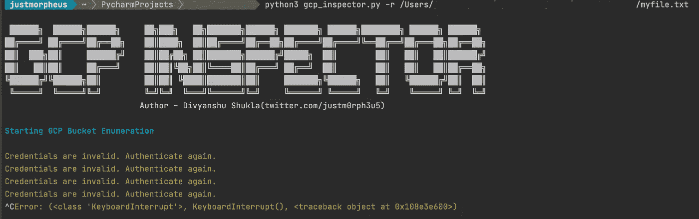
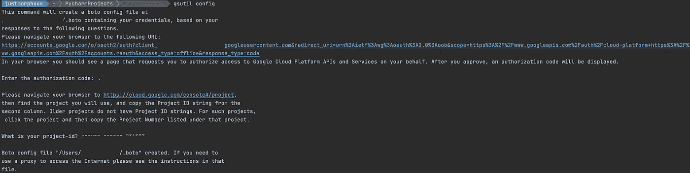
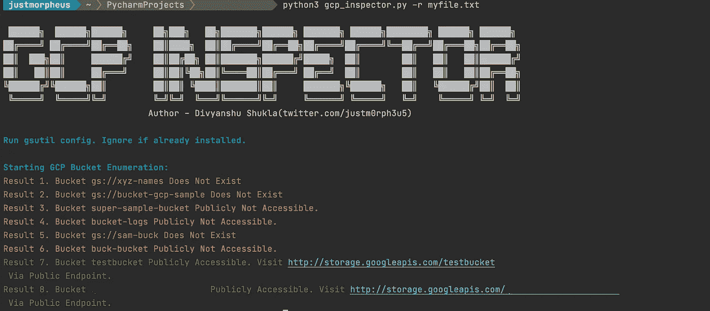

# GCP 督察|审计公开曝光 GCP 水桶

> 原文：<https://infosecwriteups.com/gcp-inspector-auditing-publicly-exposed-gcp-bucket-ac6cad55618c?source=collection_archive---------4----------------------->

*安装****【GCP】督察*** *及列举公开曝光的 GCP 水桶基础知识。*


在玩[雷霆 CTF](https://thunder-ctf.cloud/ .) 的时候，我创建了一个**简单的 python 工具**，它可以审计可公开访问的 GCP 存储桶。
雷霆 CTF 允许玩家在谷歌云平台(GCP)环境下练习攻击易受攻击的云项目。在每个级别，玩家的任务是利用云部署来找到存储在其中的“秘密”整数。

## 他的博客还会带你了解如何安装 GCP 检查器，这是一个 python 工具，用于枚举可公开访问的 GCP 桶。

> **工具:**【https://github.com/justmorpheus/gcp-inspector】

**[](https://github.com/justmorpheus/gcp-inspector)**

## **假设**

1.  **已经有了 GCP 水桶的清单。**
2.  **已经有 GCP 控制台访问(外壳)与计费帐户。**
3.  **“gsutil”安装在本地。**
4.  **访问需要审计的环境中的存储桶列表。这就需要默认范围:[https://www.googleapis.com/auth/devstorage.full_control](https://www.googleapis.com/auth/devstorage.full_control)。这将提供对给定项目的所有存储桶的列表访问。**

> **这些桶可以保存在 file.txt 中，供以后在 GCP 检查器中使用。**

```
1\. Open the shell of audit environment.
2\. Run gcloud config set project [PROJECT_ID]
3\. gsutil ls
```

## **列举 GCP 桶的步骤**

1.  **通过`python3 -m pip install gsutil`安装 python3 和 gsutil。**
2.  **登录到另一个 GCP 帐户(外部攻击者)。在运行 gsutil config 之后，这将是必需的。**
3.  **通过`gsutil config`配置终端使用 gsutil。如果未配置或凭据已过期，则会显示错误。**

**[](https://github.com/justmorpheus/gcp-inspector)

认证错误** 

**4.验证 GCP 并完成所需的详细信息，如授权码等。**

**[](https://github.com/justmorpheus/gcp-inspector)

验证本地外壳** 

**5.一旦完成，我们就可以开始了，运行下面提到的命令来激活虚拟环境并运行 GCP 检查器。**

```
git clone https://github.com/justmorpheus/GCP-Inspector
cd GCP-Inspector
mkdir gcp_inspect
virtualenv -v gcp_inspect
source gcp_inspect/bin/activate
python3 -m pip install -r requirements.txt
python3 gcp_inspector.py -r sample_file.txt
```

**6. **Sample_file.txt** 是从审计环境中保存的带有 GCP 存储桶的文件。**

**[](https://github.com/justmorpheus/gcp-inspector)

GCP 检查员在行动** 

## **Google 存储的参考命令**

1.  **将 GCP 公共存储桶数据复制到本地的命令:**

```
gsutil cp -r gs://[BucketName] .
```

**2.列出 bucket 中文件总大小的命令(可读)。**

```
gsutil du -h gs://[BucketName]
```

**3.在谷歌云存储中预览文件的命令。**

```
gsutil cat gs://[BucketName]/folder/filename
```

**4.通过端点访问可公开访问的 [GCP 桶。](https://stackoverflow.com/questions/20478369/how-do-you-get-or-generate-a-url-to-the-object-in-a-bucket)**

```
http://BUCKET_NAME.storage.googleapis.com/OBJECT_NAMEor http://storage.googleapis.com/BUCKET_NAME/OBJECT_NAME
```

> **最后，我们可以运行 grep 或任何其他工具来查找谷歌存储中的秘密和任何其他关键数据。**

**注:这是一个审计工具，用于检查 GCP 环境中公开暴露的 GCP 存储桶。**

## **荣誉提名**

*   **[https://docs . Google . com/presentation/d/1r 7m stbr a24z 5 uj 9n 6 botjkasxuenesvvvv 6 AK 5 sik nfrcw/html present](https://docs.google.com/presentation/d/1R7mSTbra24z5uj9N6botjkaXuneSvVV6AK5siKnFrcw/htmlpresent)**
*   **https://github.com/clario-tech/s3-inspector**
*   **【https://github.com/NicholasSpringer/thunder-ctf **

****免责声明:*未经所有者事先同意，请勿在生产环境中执行扫描。所有提供的信息仅用于教育目的。*****

**[](https://www.buymeacoffee.com/justmorpheus)**