# gen ymotion+exposed+inspeck age

> 原文：<https://infosecwriteups.com/genymotion-xposed-inspeckage-89f0c8decba7?source=collection_archive---------2----------------------->

## [安卓应用黑客系列](https://blog.secureitmania.com/)

## 基于 windows 的 Android 应用动态分析实验室设置

到执行 android 应用渗透测试，我们需要一个有根的 android 设备。但是把我们的个人设备作为根并不总是安全的。所以，我带来了一个解决方案，你来分析没有实际设备的 android 应用程序。在下面，我解释了在 windows 上设置实验的整个过程。

## 要求:

1.  ADB [安装阅读此](https://secureitmania.medium.com/android-hacking-fundamentals-part-2-bbc6c3ea0189)
2.  安装 Genymotion [从这里下载](https://www.genymotion.com/download/)(如果您的 PC 上已经安装了 VirtualBox，则在没有 VirtualBox 选项的情况下转到**)。**
3.  在 [Genymotion](https://www-v1.genymotion.com/account/create/) 上创建一个帐户。

## **Genymotion 上的虚拟设备设置:**

首先，我们必须登录 Genymotion，然后我们将使用 android 版 API 级配置创建一个虚拟设备。因为**检查包**只在这个版本上运行良好。

通过点击右上角的“+”图标，我们会看到下面的窗口。在“7.1-API 25”类别下选择谷歌 Nexus 5X 设备，然后点击“下一步”按钮

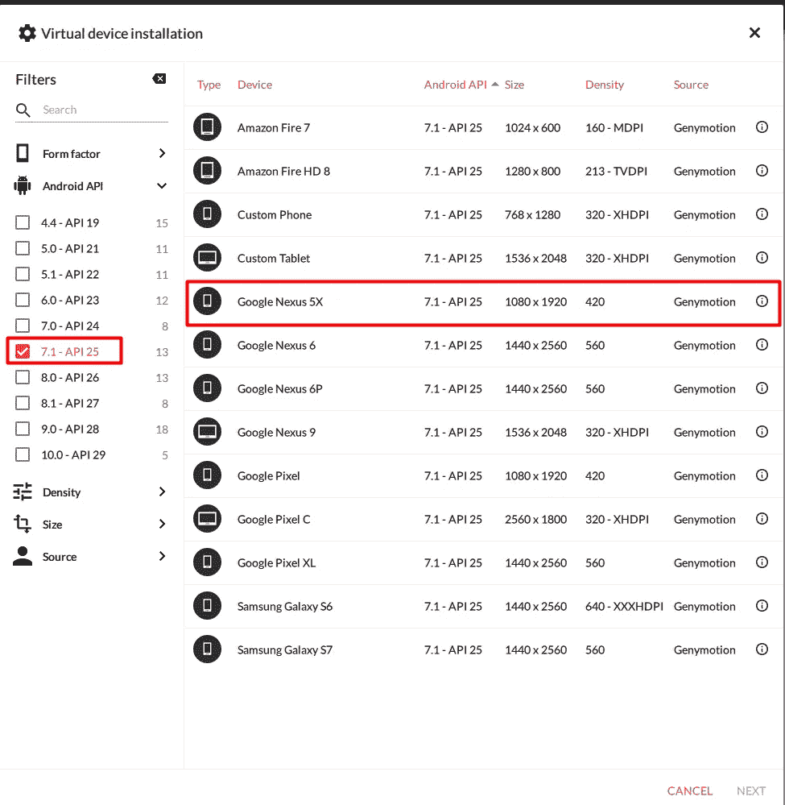

在 Genymotion 上创建 android VD

在“网络模式”选项中选择“NAT”选项，然后单击“安装”按钮。

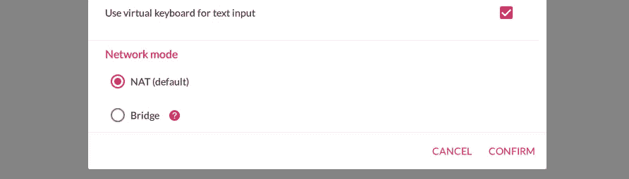

Genymotion 将下载适当版本的 VD，因此需要一段时间。

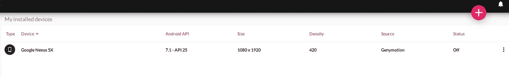

VD on Genymotion

## 安装 Xposed 框架

1.  从[这里](https://forum.xda-developers.com/attachments/xposedinstaller_3-1-5-apk.4393082/)下载暴露的安装程序 APK
2.  从[这里](https://dl-xda.xposed.info/framework/sdk25/x86/xposed-v89-sdk25-x86.zip)下载 Xposed 框架 zip
3.  从 github repo [这里](https://github.com/ac-pm/Inspeckage/releases)下载 Inspeckage v2.4 APK

从菜单启动虚拟设备

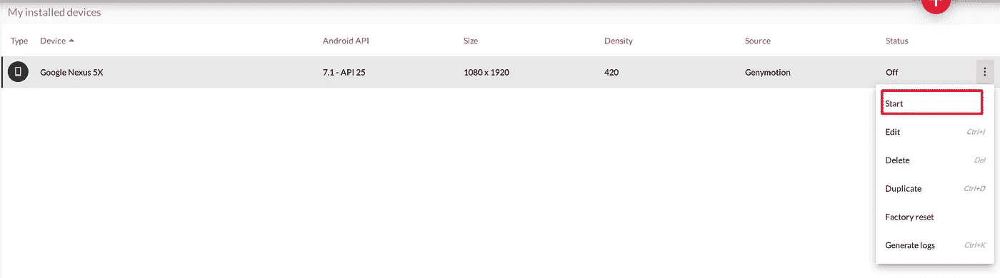

确保设备为 adb 在线

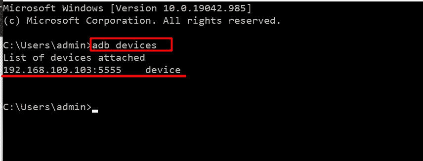

将 Xposed 框架 zip 文件(`xposed-vXX-sdkXX-x86.zip`)拖放到您的虚拟设备显示器上，以刷新设备。

拖放暴露的安装程序 APK ( `XposedInstaller_*.apk`)。这将安装并启动 *Xposed Installer* 应用程序。在这个阶段，它将显示 Xposed 框架已安装但被禁用:

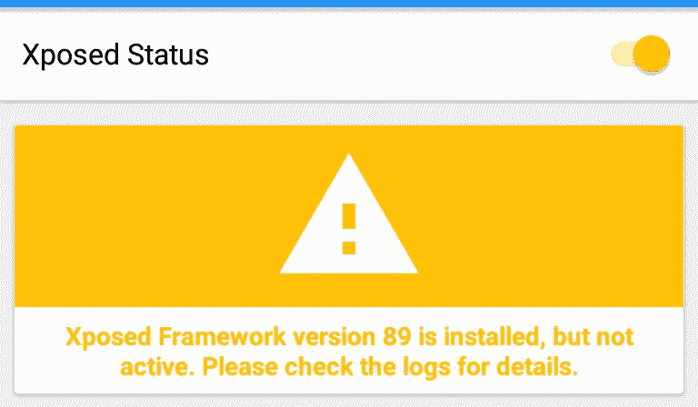

用`adb reboot`命令重启设备。**不要从*暴露的安装程序*重启，因为这会冻结设备。**

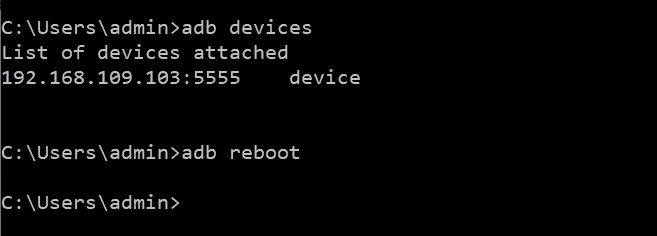

启动*曝光的安装程序*。它应该显示“Xposed Framework 版本 XX 是活动的”

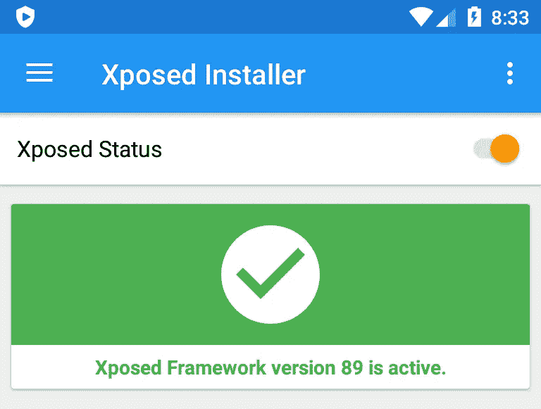

将 inspe package APK(app-release . apk)拖放到您的虚拟设备显示屏上以安装该应用程序。

安装后，转到 x 暴露的安装程序→模块→激活模块→通过 adb 重新启动

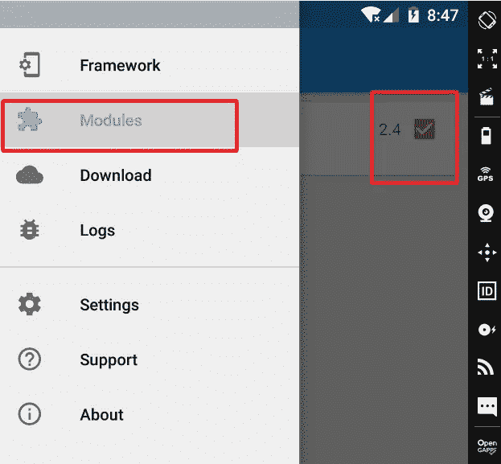

## 使用 Inspeckage 进行动态分析

之后，成功安装 Inspeckage 和 Xposed 安装程序。现在我们可以用 Inspeackage 挂接任何应用程序。为此，请遵循以下步骤

1.  从应用程序抽屉中启动 Inspeckage 应用程序
2.  单击“选择目标”文本并选择目标应用程序

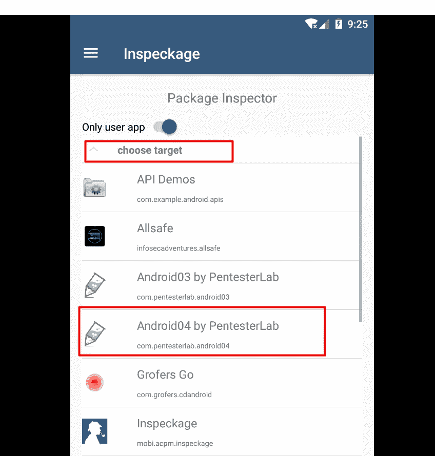

3.然后使用 adb 将 VD 本地主机端口转发到主机

```
adb forward tcp:8008 tcp:8008
```

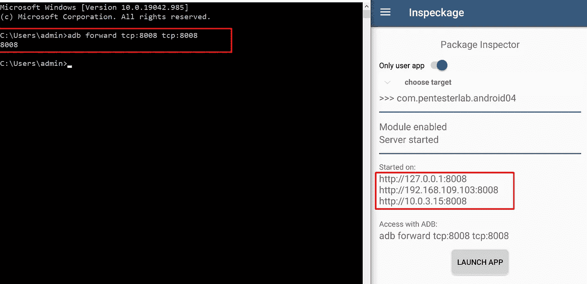

4.现在点击“**启动应用**按钮，然后访问`[http://127.0.0.1:8008](http://127.0.0.1:8008)`

5.现在点击打开按钮检查应用程序。(在“打开”之前，确保`App is running:`状态应为**真**

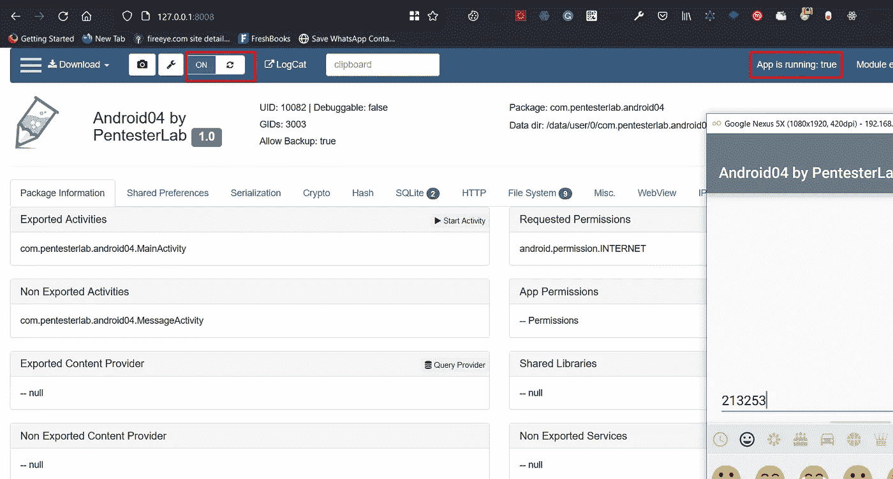

## 将 Burp Suite CA 安装到 Android 系统

**导出并转换打嗝 CA** 第一步是获得正确格式的打嗝 CA。使用 Burp Suite，以 DER 格式导出 CA 证书。我保存为`cacert.der`

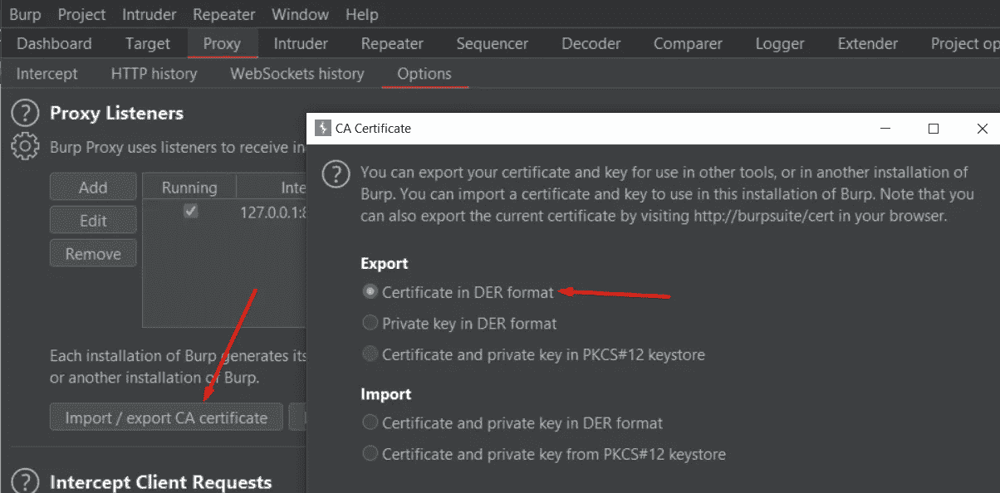

Android 希望证书采用 PEM 格式，并且文件名等于附加了`.0`的`subject_hash_old`值。

使用`openssl`将 DER 转换为 PEM，然后输出`subject_hash_old`并重命名文件:

```
openssl x509 -inform DER -in cacert.der -out cacert.pem
openssl x509 -inform PEM -subject_hash_old -in cacert.pem
```

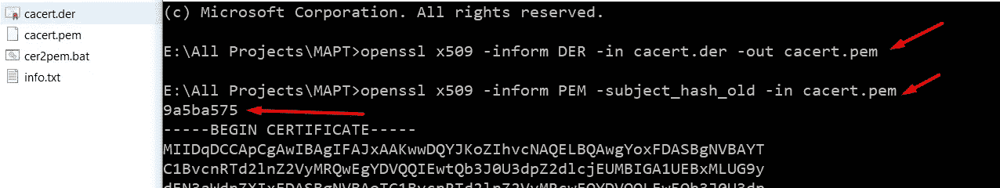

现在用`<hash>.0`重命名 cacert.pem 文件

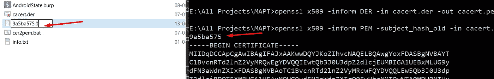

**将证书复制到设备**我们可以使用`adb`来复制证书，但是由于它必须被复制到`/system`文件系统，我们必须将它重新挂载为可写。作为 root 用户，这对于`adb remount`来说很容易。

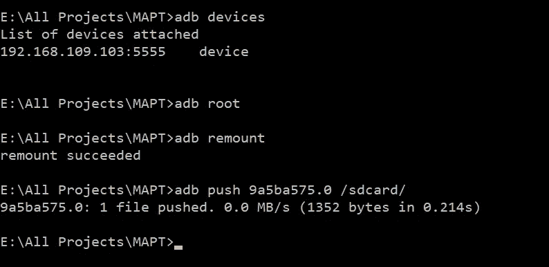

然后放入一个 shell ( `adb shell`)并将文件移动到`/system/etc/security/cacerts`并将其改为 644:

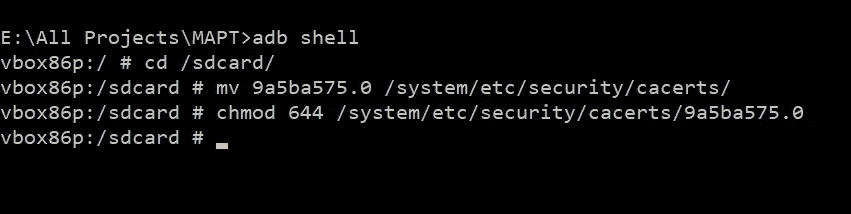

最后，我们必须通过`adb reboot`或重启来完全重启设备。

## VD 代理到 Burp 套件配置

首先知道你的机器的 IP 地址，并把它添加到你的 Burp 代理中，并附上你想要的端口

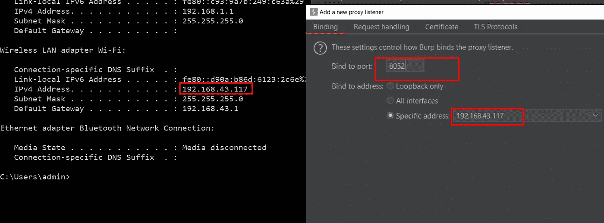

现在进入 Genymotion 的设置菜单

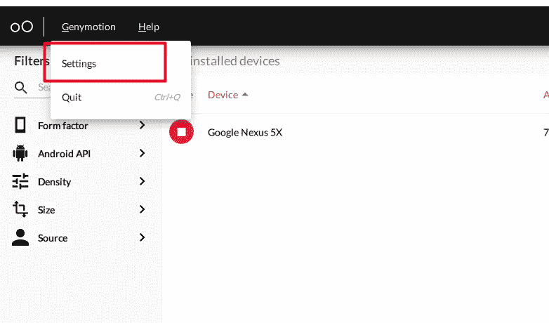

在网络设置中输入 Burp Suite 代理的 IP 端口

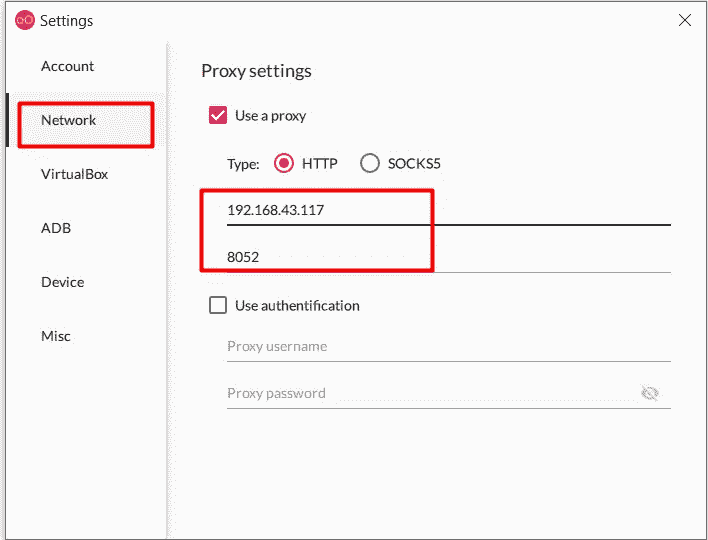

此外，在虚拟设备上设置相同的代理配置。

导航至设置→ WIFI →长按“WiredSSID”→点击“修改网络”

输入 Burp Suite 代理的 IP 端口并保存

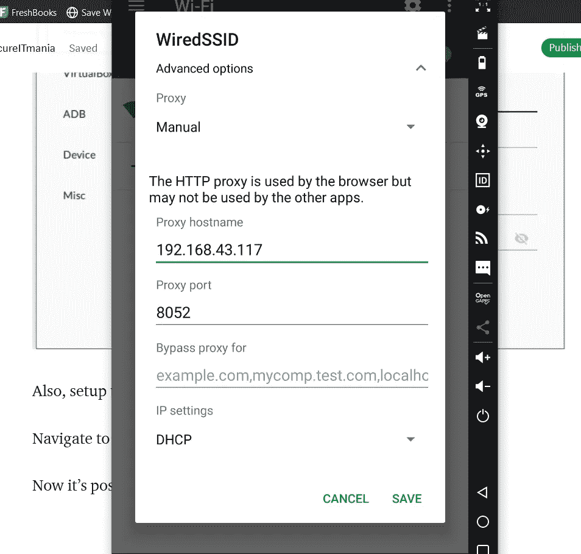

现在可以用 Burp Suite 设置代理所有应用流量了。

感谢阅读。如果你喜欢这篇**报道**，请关注我，继续关注更多**黑客技术**使用 Inspeckage 和查看 [**我的个人资料**](https://blog.secureitmania.com) 了解更多秘密。

关注我的 [**Instagram**](https://www.instagram.com/secureitmania/) ， [**Twitter**](https://twitter.com/secureitmania) 获取 BugBountytips、infosec 信息