# 给你自己一个有根的 Android 虚拟设备(AVD)

> 原文：<https://infosecwriteups.com/get-yourself-a-rooted-android-virtual-device-avd-fb443d590dfa?source=collection_archive---------0----------------------->

**总结** 在文章中，我将演示如何用最新的 Android (AVD)版本(本文写作时的 Android 12)创建一个新的根 Android 虚拟设备。根设备在渗透测试或逆向工程过程中非常有用。

**免责声明** 本文仅用于信息和教育目的，并面向那些愿意并好奇了解安全性和渗透测试的人。内容不得用于非法目的。如果你准备好学习新的好东西，那么继续读下去。

**详情** 给物理(Android)设备找根的过程可能会非常困难。难度取决于设备供应商和硬件版本。有一点是肯定的，设备版本越新，就越难 root。除了对物理设备进行根操作，还可以使用现成的 Android 根映像。这些现成的图片由谷歌在谷歌 Play 商店发布。

下一节将展示如何在 Kali Linux 上安装 Android Studio。然后，我们将向您展示如何创建自己的根 Android 虚拟设备(avd)。继续为 Linux 安装 Android Debug Bridge (avd ),最后以 root 身份连接到目标设备。

此概念验证由 1 台机器组成:

- Kali Linux
- IP 地址:192.168.62.161

注意:安装需要大约 10GB 的磁盘空间。

**安装开放的 JDK (Java 开发工具包)**

1.  安装开放式 JDK

```
sudo apt update && sudo apt install openjdk-11-jdk
```

**安装 Android Studio**

Android Studio 是为 Android 开发应用程序的官方集成开发环境。

2.下载 Android Studio tar 文件(撰写本文时版本为 2021.2.1.15)

```
firefox [https://developer.android.com/studio](https://developer.android.com/studio)
```

或者

```
wget [https://redirector.gvt1.com/edgedl/android/studio/ide-zips/2021.2.1.15/android-studio-2021.2.1.15-linux.tar.gz](https://redirector.gvt1.com/edgedl/android/studio/ide-zips/2021.2.1.15/android-studio-2021.2.1.15-linux.tar.gz) -O $HOME/Downloads/android-studio-2021.2.1.15-linux.tar.gz
```

3.将 tar 文件解压到/opt(或者您喜欢的其他目录)

```
cd $HOME/Downloads
sudo tar -xvf android-studio-2021.2.1.15-linux.tar.gz -C /opt/
```

4.启动 Android Studio 并下载所有默认组件

```
cd /opt/android-studio/bin
./studio.sh
```

在 Android Studio 安装的剩余过程中，会出现直观的提示和弹出窗口。我不打算把它们中的一些放在那里，这很容易。

-选择“不导入设置”
-选择:标准设置
-接受两个许可证

一旦安装了 Android Studio，您就可以创建您的第一个项目了。

**在 Android Studio 中创建一个新项目**

5.点击按钮[新建项目]


6.选择电话/桌子和无活动

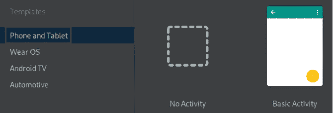

7.保留所有默认设置，然后单击[完成]

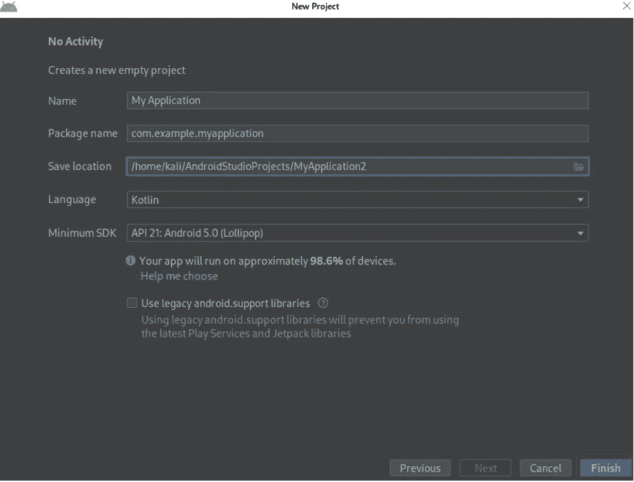

8.可选；将主题改为浅色(我不喜欢深色主题)

转到视图>快速切换方案..>编辑配色方案>智能照明

9.在工具栏中打开设备管理器


10.选择虚拟选项卡，然后单击[创建设备]

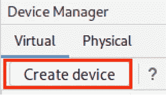

11.选择类别电话，并选择您的硬件。例如像素 2

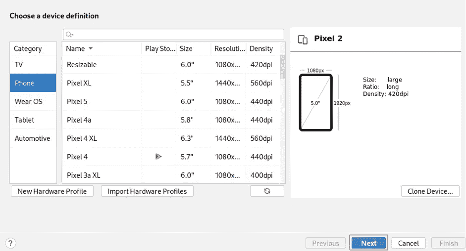

下一步很重要！您需要选择一个 Android 映像来部署到 Pixel2 Android 虚拟硬件。选择名称中不包含“(GoogleAPI)”的图像。

12.突出显示 x86 Images 选项卡，并选择一个名称中没有“(Google APIs)”的映像。单击“下载”链接开始下载。这可能需要一些时间。

注意下面的截图，我们已经下载了 Android 12 的图片。我们将继续这一形象。

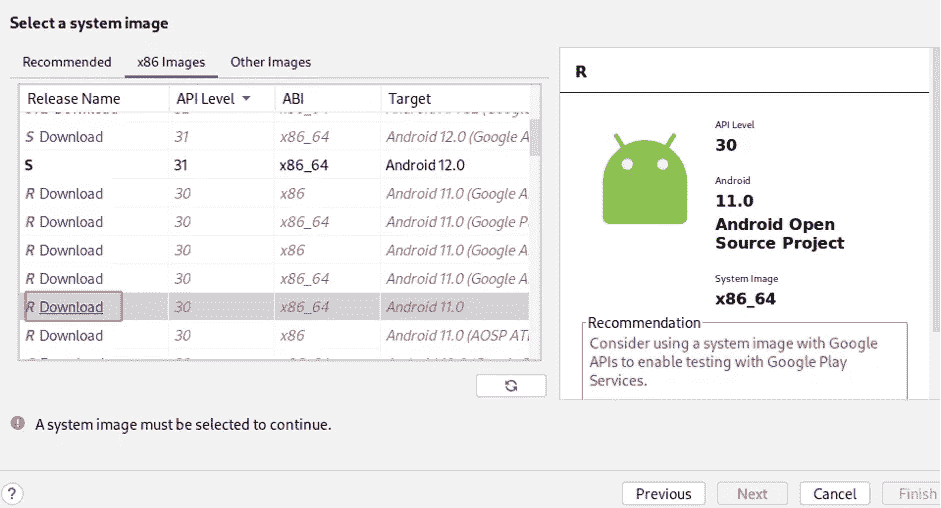

13.从谷歌 Play 商店下载图像后，单击[下一步]。

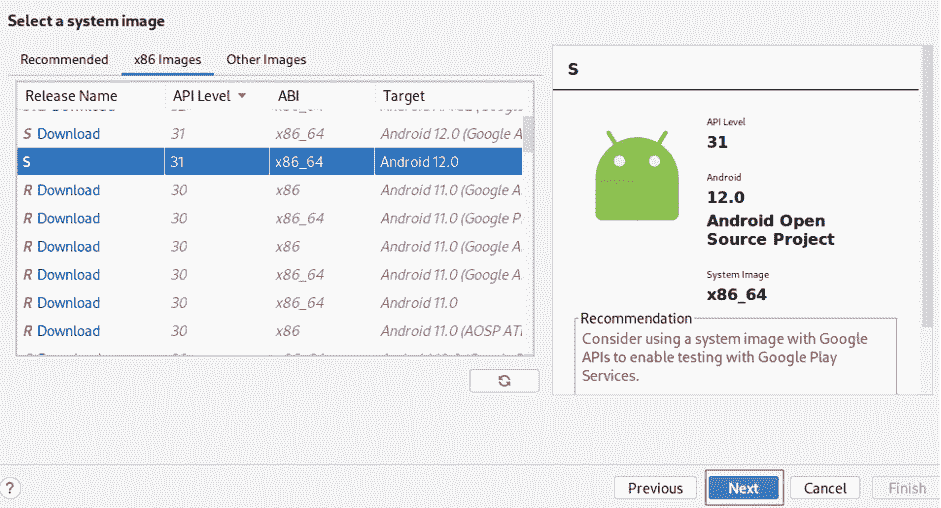

14.提供一个 AVD 名称(例如“Pixel 2 API 31 root”)，然后单击 Finish。

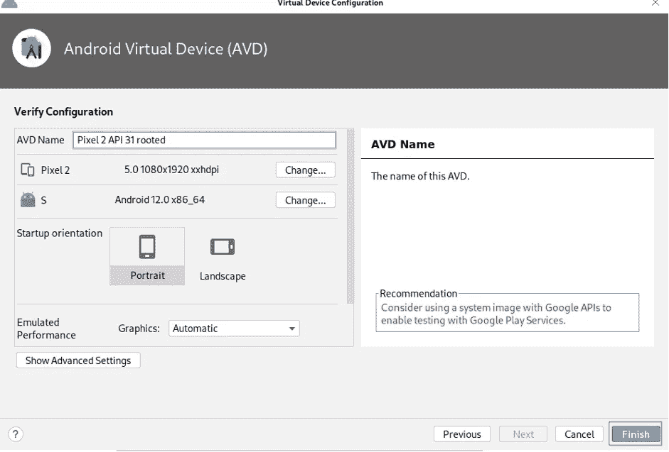

现在你已经准备好使用这个根 AVD 了。

**启动根 AVD**

你可以从 Android Studio 设备管理器中启动你的 AVD。只需点击>符号。

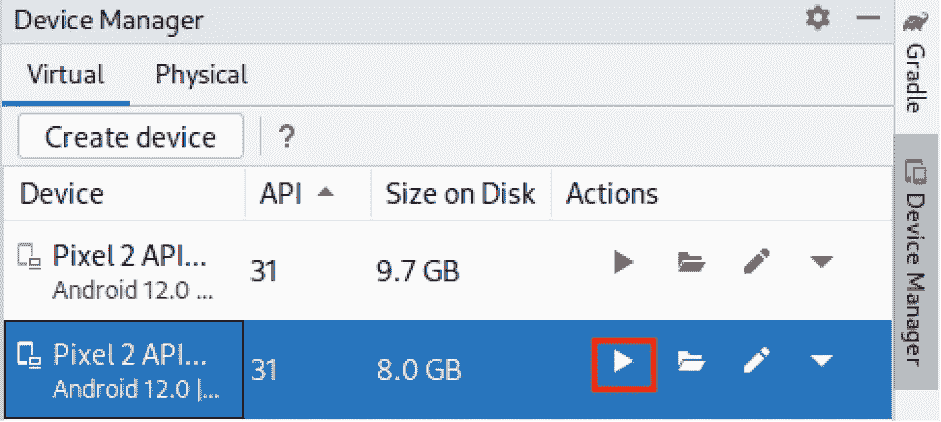

就个人而言，我喜欢使用 Android SDK 工具中可用的仿真器命令行工具。Android SDK 是一个软件开发工具包，包含一套全面的开发工具。其中包括调试器、库、基于 QEMU 的手机仿真器、文档、样本代码和教程。

15.安装 Android SDK

```
sudo apt update && sudo apt install android-sdk
```

16.列出可用的 avd

转到 Android SDK 工具目录($HOME/Android/Sdk/tools)并使用 emulator 命令列出 avd

```
cd /home/kali/Android/Sdk/tools/
./emulator -list-avds
```

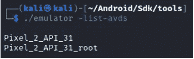

17.启动 AVD“Pixel _ 2 _ API _ 31 _ root”

```
./emulator @Pixel_2_API_31_root
```

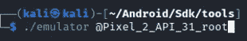

结果:

这是带有 Android API-31 (Android 12)的 root Pixel-2。


我们可以确认它安装的是最新的 Android 版本。

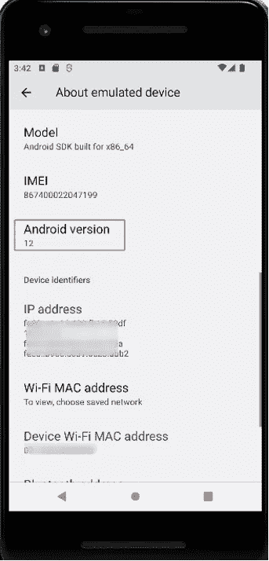

**以 root 身份连接到 AVD**

最后一步是使用 Android Debug Bridge (adb)连接到这个设备，并切换到 root 用户。Android Debug Bridge 是一个用于调试 Android 设备的工具。Android 设备上的守护程序通过 USB 或 TCP 连接到主机 PC 上的服务器，主机 PC 通过 TCP 连接到最终用户使用的客户端。

18.安装 Android 调试桥

```
sudo apt install android-tools-adb
```

19.使用 adb 列出可用设备

```
adb devices
```

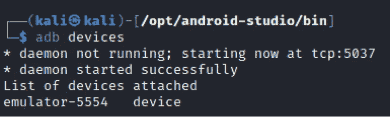

20.使用 adb 命令获得一个 shell 并切换到 root

```
adb shell
su
```

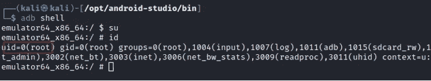

就是这样！

我希望你喜欢这个博客。如果你去了，别忘了跟着我。此外，请查看我关于创建 Android RAT 的故事(https://medium . com/system-weakness/convert-a-legal-Android-app-to-an-Android-RAT-e 69 EB 8 cc 913d)

## 来自 Infosec 的报道:Infosec 每天都有很多内容，很难跟上。[加入我们的每周时事通讯](https://weekly.infosecwriteups.com/)以 5 篇文章、4 个线程、3 个视频、2 个 GitHub Repos 和工具以及 1 个工作提醒的形式免费获取所有最新的 Infosec 趋势！