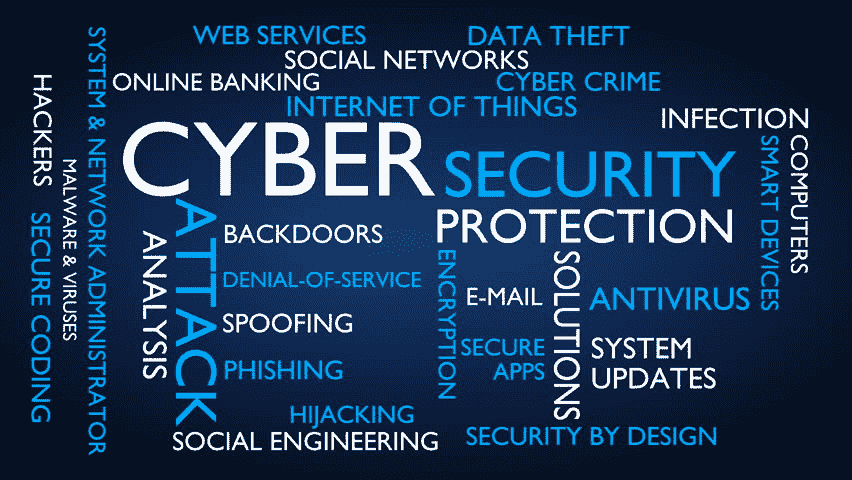
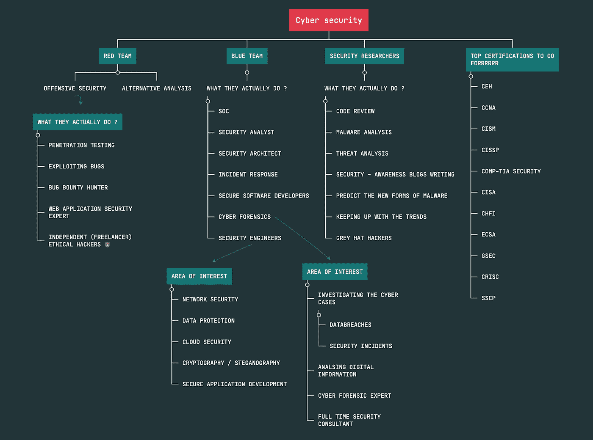
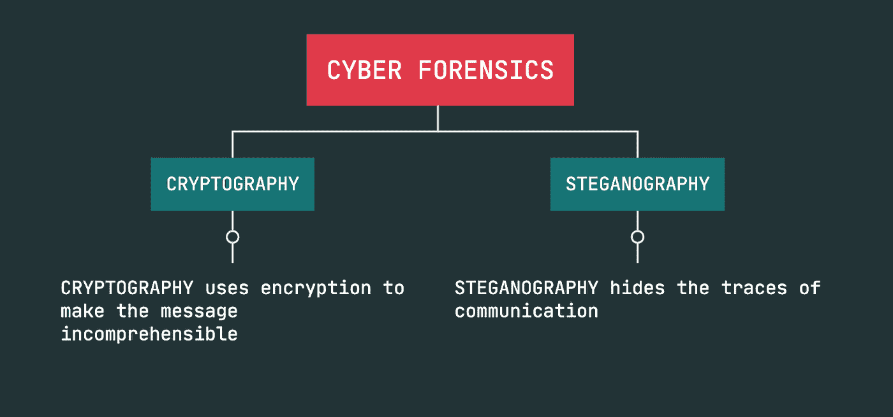
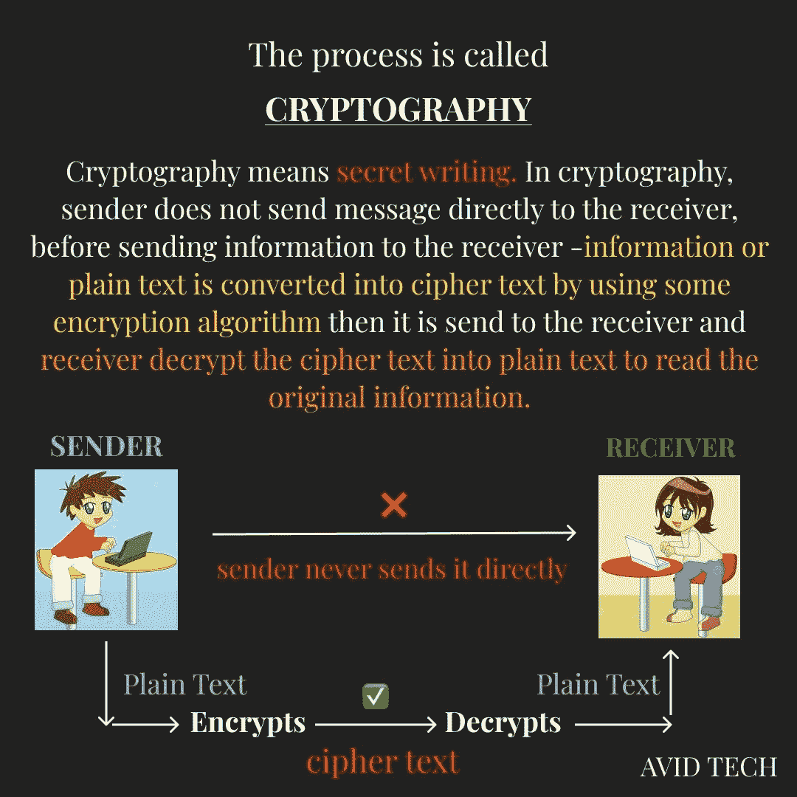
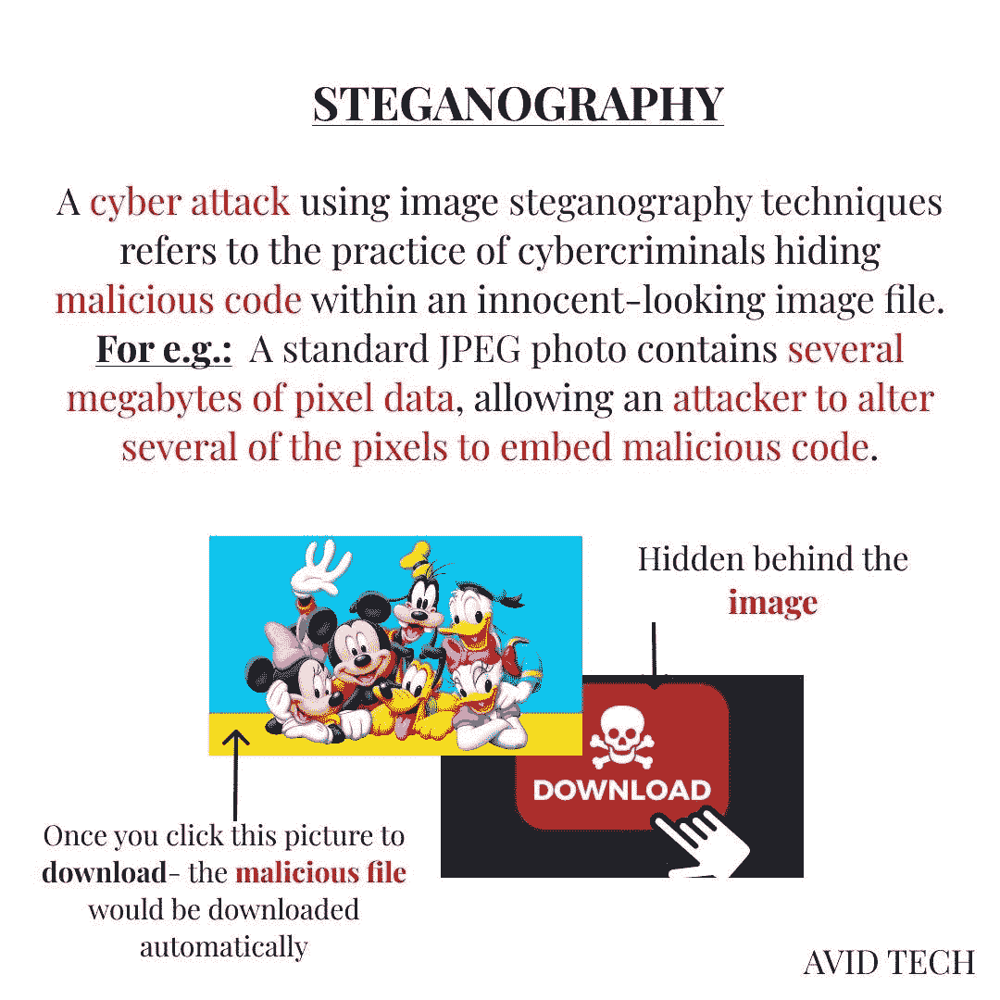

# 网络安全入门

> 原文：<https://infosecwriteups.com/getting-started-in-cyber-security-ba3638de1fa9?source=collection_archive---------1----------------------->

**职业选手可以跳过😎**

随着黑客越来越多的宣传和他们在电影和系列中令人难以置信的客串，每个计算机爱好者都会非常兴奋地知道更多关于黑客及其在网络世界中的贡献。在真正了解什么是网络安全以及如何开始之前，让我们看看网络安全中疯狂增长的领域和工作机会。没有深入挖掘，但很高兴知道网络安全工作的就业率已经上升了 33%，平均每年有 16，300 个职位空缺，比其他职业的平均水平快得多。正如我们所见，这种增长是因为年轻人的好奇心越来越强，疯狂增长的网络攻击最终导致该领域熟练专业人员的短缺。

在开始学习网络安全之前，我总是习惯在谷歌上搜索一些问题，比如开始学习网络安全需要什么工具？编程是从事网络安全职业的必备技能吗？对于网络安全初学者来说，最好的认证是什么？黑网站真的能挣钱吗？还有很多明确指出，我对网络安全及其领域没有实际的概念，我猜大多数人在开始学习网络安全之前都经历过同样的事情。

所以让我们切入正题，转到我们将知道黑客在幕后做了什么的确切活动的部分？

网络安全用简单的话来说可以解释为——你持有的每一件电子产品，比如你的智能手机和你的智能冰箱，每一件有代码的东西都需要安全，这样它就不会那么容易泄露你的秘密(比如密码、私人信息、重要数据等)。更简单地说，网络安全意味着提供安全和保护您的数字设备。

因为它包括许多职业选择，如 bug 赏金猎人，在防御性或进攻性网络安全团队工作，网络取证专家，渗透测试员，网络应用安全专家等等。

就目前而言，理解和消化它似乎真的很难，但是不要担心，最终你不会空空如也。网络安全是一个巨大的领域，所以当我们说我想从事网络安全职业时，我必须清楚我对哪个领域感兴趣。让我们通过小小的思维导图来了解广泛传播的网络安全及其领域。

在深入探讨之前，让我们从一个对我来说非常重要的问题开始——如何以及从哪里开始网络安全？互联网是让你开始并沉迷于自我学习的最好方式之一，开始更多地关注标记语言、编码基础、基本的 web 应用测试知识以及浏览互联网时找到的更多单词。但是获取如此多的信息有时会比提供帮助更令人困惑，那么现在到底应该做些什么呢？

我将在本博客的末尾列出一些免费课程，这些课程将帮助你开始学习网络安全，并探索你感兴趣的领域。

好了，现在我们来看一下，我可以帮你窥探一下网络安全的工作世界，以及如何进入其中的路线图。

## **网络安全领域的顶级域名包括:**

1.  **安全管理:(又名安全经理)**

*   规划和发展公司的安全策略。
*   构建 KPI。

(KPI→关键绩效指标(KPI)是显示组织实现其关键业务目标的效率的可测量值。)

*   为船上项目雇佣员工
*   建立安全预算，每天追踪公司的成功。

**顶级——提升安全管理职业技能的认证**

*   [注册信息安全经理(CISM)](https://www.isaca.org/credentialing/cism)
*   [认证信息系统安全专业架构(CISSP)](https://www.isc2.org/Certifications/CISSP)
*   [认证信息系统安全专家](https://www.isc2.org/Certifications/CISSP)

[(CISSP)](https://www.isc2.org/Certifications/CISSP)

*   [注册信息系统审计师(CISA)](https://www.isaca.org/credentialing/cisa#getstarted)

**2。身份和访问管理:**

*   身份和访问管理(IAM)是一个集合术语，涵盖用于管理用户身份和规范组织内用户访问的产品、流程和策略。
*   它主要分为 4 个部分，包括:
*   密码管理工具。
*   供应软件。
*   安全策略执行应用程序。
*   报告和监控应用和身份存储库。

**3。安全工程:**

众所周知，网络被认为是组织安全的支柱力量。因此，安全工程最有趣的部分就在这里，工程师们实际上致力于保护网络，包括网络设计、安全应用程序开发、访问控制、安全架构设计等等。

那里的工作主要集中在:

*   更加关注组织网络设备的安全控制配置。
*   识别和定义系统的安全需求
*   设计和开发越来越有效的安全架构和网络安全设计，帮助保护整个网络。
*   记录标准操作程序和协议。
*   开发更可靠和更好的技术解决方案，并发现更强大的安全工具，以帮助减少安全漏洞并自动化整个安全流程。
*   紧跟潮流，确保组织在发生任何安全事故时都能尽快做出反应。

如果这让你感兴趣，并让你有点好奇如何迈出你作为安全工程师职业发展的第一步，那么你绝对应该试试下面的**认证。**

*   [CCNA 路由&切换训练](https://www.cisco.com/c/en/us/training-events/training-certifications/training/training-services/courses/cisco-certified-technician-supporting-cisco-routing-and-switching-network-devices-rstech.html)。
*   [CISO(首席信息安全官)](https://ciso.eccouncil.org/)

**4。安全操作:**

这是执行所有行动的地方，所以基本上 SOC →安全运行中心在需要检查和监控活动的每一项行动时开始行动，并采取有效措施防止任何未来的网络攻击。SOC 通常负责处理并采取有效措施来预防和发现可能导致未来网络攻击和破坏组织基础设施的漏洞。

因此，安全操作领域包括从网络攻击是如何引起的到如何预防的几乎所有权利；一切都由安全行动中心测量和监控。它也属于网络取证研究，他们监控网络设备，以确定网络攻击的方式、时间和原因。他们的步骤是执行漏洞评估，测试设备或应用程序以研究它们并找出漏洞，最后当他们成功找到漏洞时，漏洞被修补并确保组织系统免受未来的网络攻击。

简而言之，如果你想开始作为一名安全分析师工作，你需要更多地关注漏洞评估和渗透测试，在那里你将学习最常见的攻击及其缓解措施，其次需要在事件响应和检测过程中表现出色。

听起来很棒，对吧，现在怎么办？

**让你成为足球队职业球员的最令人惊讶的认证是:**

*   [认证 SOC 分析师](https://www.eccouncil.org/programs/certified-soc-analyst-csa/)
*   [Comp Tia Security+](https://www.comptia.org/certifications/security)
*   [CompTIA 的 CySA+(网络安全分析师)](https://www.comptia.org/certifications/cybersecurity-analyst)
*   [认证道德黑客](https://www.eccouncil.org/programs/certified-ethical-hacker-ceh/)
*   [风险与信息系统控制(CRISC)认证](https://www.isaca.org/credentialing/crisc?utm_source=google&utm_medium=cpc&utm_campaign=CertBAU&utm_content=sem_CertBAU_certification-crisc-india-category-google&cid=sem_2006868&Appeal=sem&gclid=Cj0KCQiA3fiPBhCCARIsAFQ8QzX8AzTdt_qmLAJ8_QDEUyyh2qO_uIDsJh4PWFg-QsCuzswG5sIVca4aAg8LEALw_wcB)
*   [注册信息系统审计师(CISA)](https://www.isaca.org/credentialing/cisa)

**5。密码学世界:**

密码学是网络安全世界中最令人兴奋的事情。我猜每个安全爱好者在研究加密技术时都会更加努力。所以基本上在进入密码学之前。

先来了解一个小小的思维导图。

现在，让我们更好地理解它:

据我所知，这是最令人惊奇的领域，如果你也有同样的想法，那么你应该试试下面的**认证:**

*   [欧盟委员会认证加密专家(ECES)](https://www.eccouncil.org/programs/ec-council-certified-encryption-specialist-eces/)
*   如果你想更深入地探索密码学的世界。你可以[看看](https://onlinecoursetutorials.com/courses/10-best-cryptography-courses-classes-with-certifications/)这个神奇的页面，上面列出了所有的课程和认证信息。

6。风险评估:

听过人们谈论网络安全中的团队和帽子吗？这些奇特的术语包括蓝队、红队和三种帽子(白、黑、灰)。长话短说，我们可以说好的黑客被称为白帽黑客，而讨厌的(是的，坏的)通常被称为黑帽黑客，而能够同时拥有两种技能的被称为灰帽黑客。

谈到团队，让我们回忆一下第一张思维导图:

**RED-TEAM❤️** =攻击性安全，主要包括攻击和利用漏洞，但要以合乎道德的方式。他们是网络安全的破坏者。

**蓝队💙** =防守队，我们也可以说这些是足球的家伙，他们负责组织的安全，为红队防守。他们被称为网络安全的修补者。

这使得他们很容易将技能分配给两个团队。如果你想成为这个神奇团队的一员。**你可以考虑以下认证。**

*   [欧盟委员会的网络安全基础知识](https://www.eccouncil.org/network-security-fundamentals/?utm_source=cisomag&utm_medium=partners&utm_campaign=cisomag-cnd)
*   [认证网络卫士(CND v2)](https://www.eccouncil.org/programs/certified-network-security-course/?utm_source=cisomag&utm_medium=partners&utm_campaign=cisomag-cnd)

**如承诺的免费课程和顶级频道。😌**

1.  YOUTUBE 频道(强烈推荐，因为他们涵盖了初学者想要的一切。)
2.  借助— [学习基础知识，巩固基础知识。](https://www.simplilearn.com/learn-cyber-security-basics-skillup)
3.  伟大的学习正在提供免费的网络安全入门认证以便注册— [点击此处](https://www.mygreatlearning.com/academy/learn-for-free/courses/introduction-to-cyber-security)
4.  Coursera 正在提供免费的网络安全专业课程— [点击这里](https://www.coursera.org/specializations/cyber-security)
5.  这篇文章来自 SIMPLILEARN[2022 年最好的 6 门免费在线网络安全课程认证](https://www.simplilearn.com/free-online-cyber-secuity-courses-article)

这只是对庞大的网络安全世界的一次窥探。在这个宇宙中仍然有许多领域，每个领域都有自己的专长和机会。

**希望你喜欢这个博客:)**

快乐学习！

快乐成长

黑客快乐！

—团队数据科学与网络安全❤️相遇