# Docker 入门

> 原文：<https://infosecwriteups.com/getting-started-with-docker-14044647e78a?source=collection_archive---------1----------------------->

这个博客的目标是向读者介绍 docker，并帮助他们建立他们的第一个 docker 形象。

Docker 是一种软件，它为我们提供了执行操作系统级虚拟化的技术支持，也称为容器化。现在，作为一名读者，你可能想知道任何人都可以使用虚拟化软件，如 VMware 或 Virtual box，那么为什么要使用 docker，docker 的使用情形是什么，或者 docker 能解决什么问题？

在软件开发生命周期的所有阶段中，Docker 用于软件开发的部署阶段。docker 如此流行和广泛使用的原因是它解决了以下问题

有时，应用程序开发人员在他/她自己的环境或 PC 上构建和部署应用程序，它可以完美地工作，没有任何错误，但当相同的应用程序或代码在不同的机器或不同的环境中编译时，会出现错误或无法正常工作。运行应用程序失败可能取决于许多因素，如操作系统、技术依赖性、使用的技术版本等。

Docker 允许我们在包装整齐的容器化环境中开发和部署应用程序，这使得应用程序可以在所有类型的操作系统中以相同的方式运行，而不会出现兼容性问题。

这些容器就像有非常具体的任务的微型计算机，每个容器都有自己的操作系统、自己独立的 CPU 进程和网络资源。这使得在不影响主机的情况下添加、删除、启动和停止它们变得很容易。

用户可以设置自己的 docker 容器，或者从 Docker hub 下载预先配置的容器。 [Docker hub](https://hub.docker.com/) 是一家网上商店，里面有很多图片。

# 虚拟机和容器有什么区别？

虚拟化使用虚拟机管理程序来帮助在主机操作系统上创建和运行单独的操作系统，虚拟机或虚拟机有自己的操作系统，现在一切都有利弊，但在需要多个操作系统环境的情况下，在主机上部署大量虚拟机将成为一项艰巨的任务，因为每个虚拟机都有自己的操作系统，并将占用大量磁盘空间。

Docker 容器使用主机操作系统的 Linux 内核，容器的大小非常小。

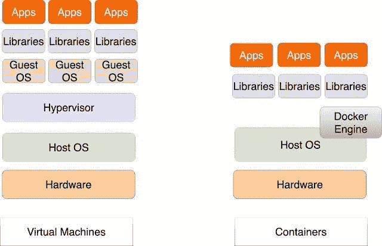

# 建立码头工人形象需要什么？

构建自己的 docker 映像非常简单，下面给出的说明描述了一个作为 docker 容器运行的 web 应用程序。

你可以使用任何 Linux，但是对于这个演示，我选择使用 Ubuntu。安装好 ubuntu 机器后，你需要做的就是进入终端，输入以下命令。

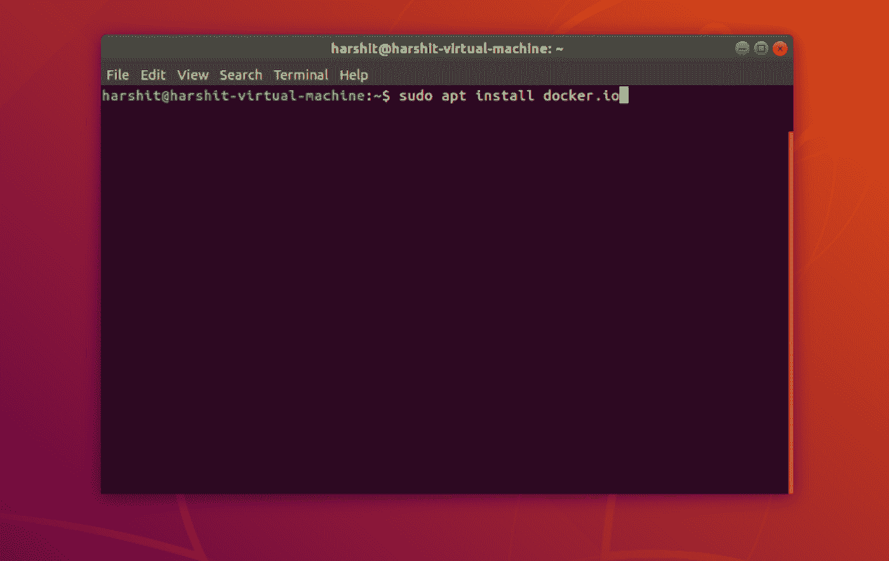

*   *sudo 安装 docker.io*

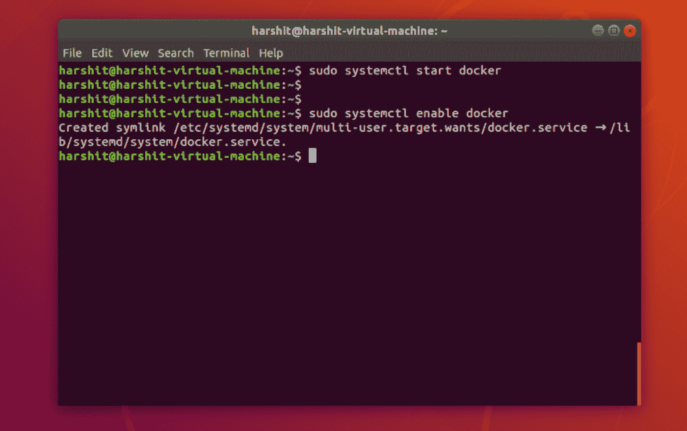

*   *sudo systemctl 开始停靠*
*   *sudo systemctl 启用 docker*

这将帮助我们启动 docker 引擎并启用 docker，您可以通过键入

*   *docker —版本*

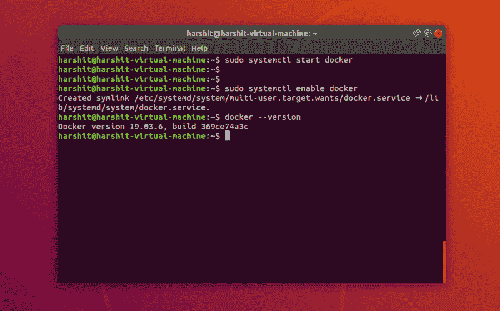

# 步骤 1:创建一个 web 应用程序放入容器中

为了模拟一个 web 应用程序，我创建了 index.html 并编写了“hello world！”并将文件保存在新创建的名为 test 的目录中。

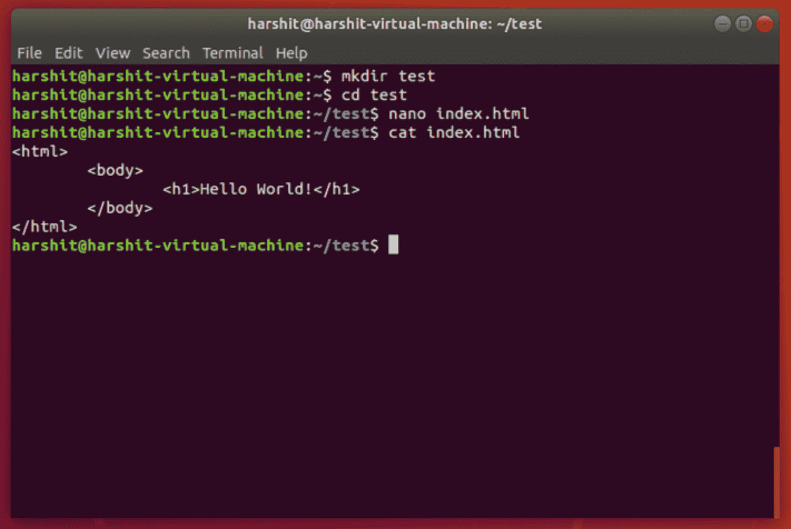

# 步骤 2:创建一个 Docker 文件

Dockerfile 是用户用来组合图像的文本文档。为了创建 docker 文件，您需要在文本文件中添加以下命令，并将其保存为 docker 文件，我们将使用 docker build 命令来构建图像。

***来自 ubuntu:16.04*** —这意味着将基础映像作为 ubuntu 16.04

***运行 apt-get update -y —*** 运行 update 以便能够安装 apache 之类的基本实用程序

***运行 apt-get install-y Apache 2***

***RUN chown-R www-data:www-data/var/www—***更改所有权，使 apache 成为/var/www/的所有者

***ENV APACHE _ RUN _ USER www-data-***APACHE 服务器的环境变量

**ENV APACHE _ RUN _ GROUP www-data**

***ENV APACHE _ LOG _ DIR/var/LOG/APACHE 2***

***ENV APACHE _ LOCK _ DIR/var/LOCK/APACHE 2***

**ENV APACHE _ PID _ FILE/var/run/APACHE 2 . PID**

***添加 index.html/var/www/html***

***揭露 80***

***入口点[" usr/sbin/Apache 2 CTL "]***

***CMD ["-D "，"前台"]***

(用 cmd 中的选项启动容器的入口点)

注意:在与 test 相同的目录中创建 docker 文件。

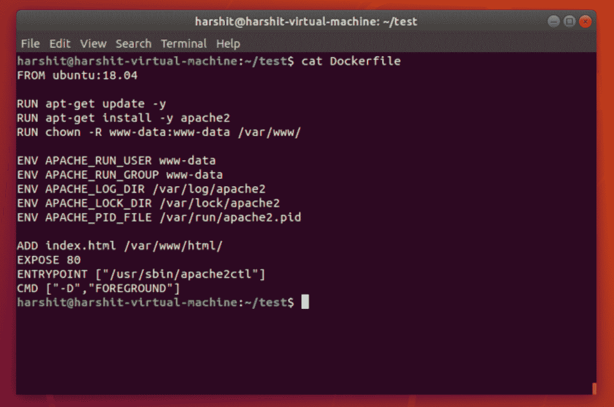

# 第三步:构建

为了从构建映像，您需要使用以下命令。

*   docker build -t lucideus:最新。

在上面的命令中-t 表示标记和点“.”表示 docker 文件应该从同一个目录中选取。

您可能会遇到权限错误，只需使用以下命令即可解决。

*   *sudo chmod 666/var/run/docker . sock*

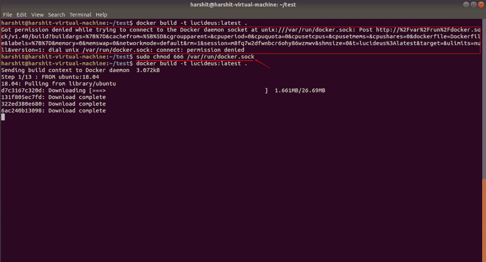

这将需要 10-15 分钟，您的 docker 映像将准备就绪。您可以键入以下命令来查看您新构建的映像。

*   *docker 图片*

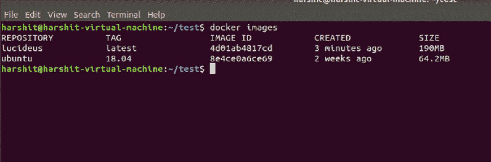

您还可以使用以下命令从 docker hub 中提取其他图像。

*   *docker pull {图片名称}*

你可以提到图像的版本，默认情况下它会下载最新的图像。

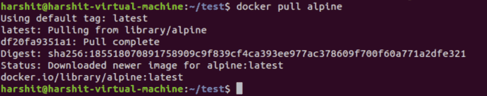

# 第四步:运行你的 Docker 镜像

您可以键入以下命令，将映像作为容器运行。

*   *docker run-itd-p 8080:80 {图像名称}:{图像标签}*

“I”表示交互模式并保持 stdin 打开，“t”表示分配一个 tty，“d”表示在后台和打印容器中运行。

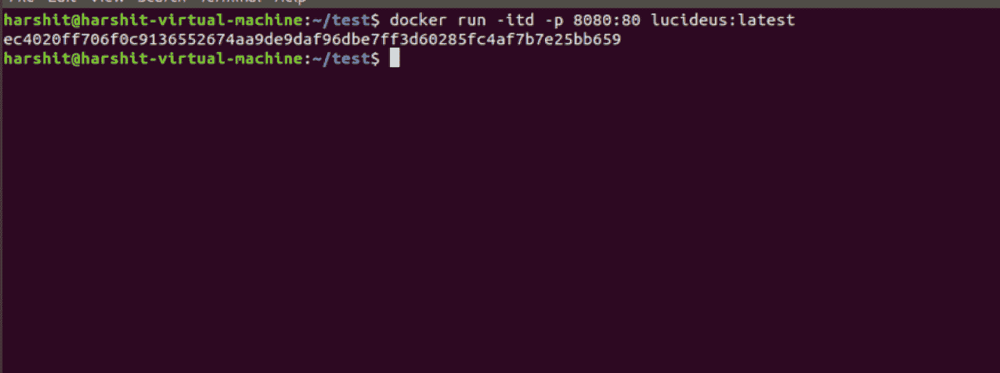

要验证它是否正在运行，您可以打开浏览器。

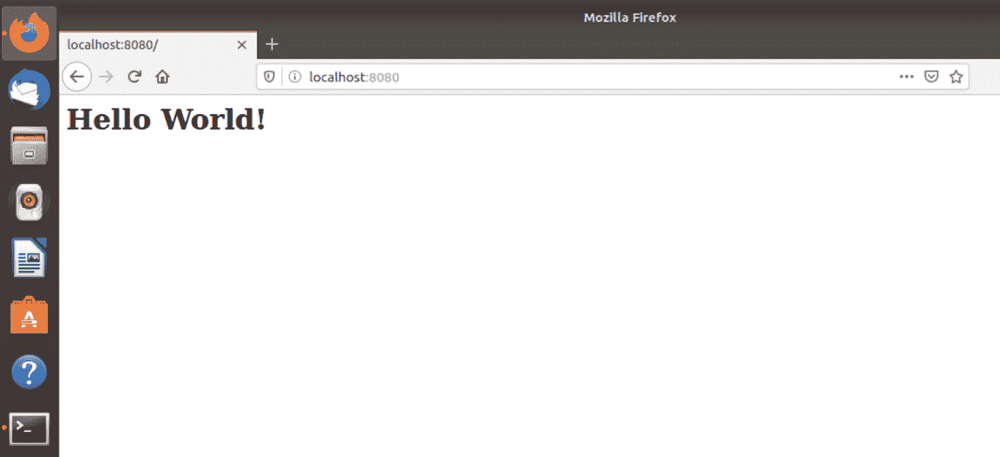

您可以使用以下命令在 docker 容器中获得一个交互式 shell。

*   *docker exec-it { container id } sh*

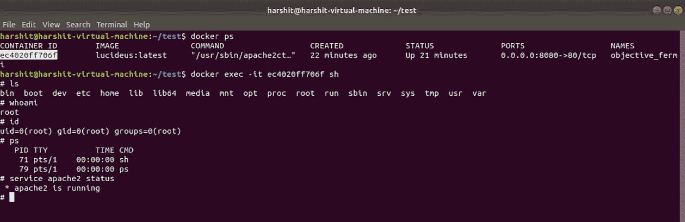

# 图像与容器

增加这一部分的目的是为了避免图像和容器之间的混淆，因为在阅读博客时，你可能会遇到像创建图像和运行容器这样的短语，这可能会使读者感到困惑。所以在这一节，有一个中肯的答案可以解答你的困惑。

我们多次提到的图像实际上被称为“**码头集装箱图像**”。

**Docker 容器映像**是一个轻量级软件包，包含运行应用程序所需的一切，例如代码、库、系统文件和工具。

另一方面，Docker 容器是映像的一个实例，通俗地说，它可以被描述为一个标准的软件单元，它打包了代码及其所有依赖项，以实现从一个计算环境到另一个计算环境的迁移和部署。请参考下面给出的图片。

