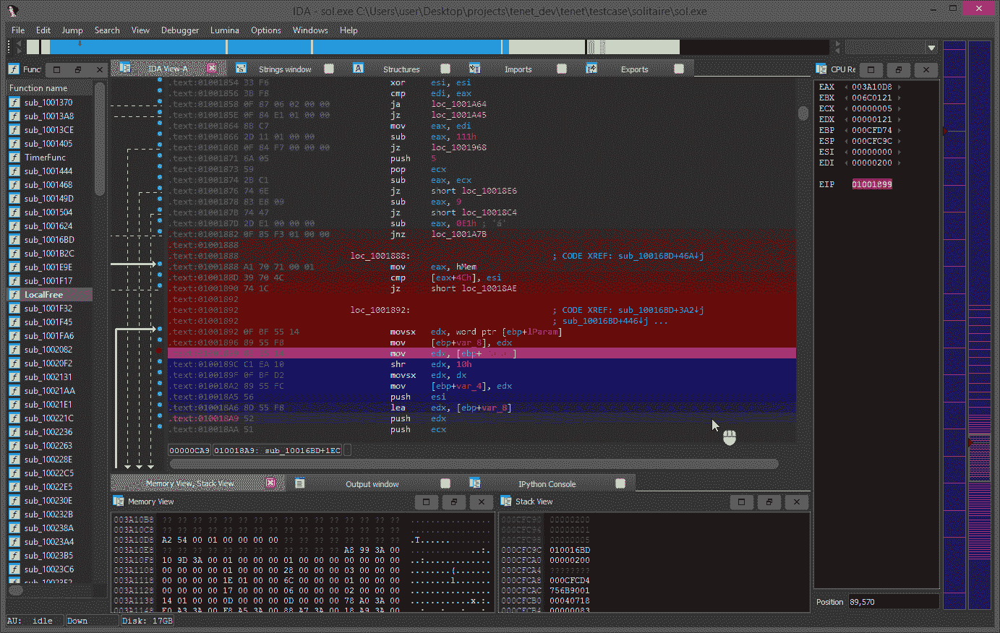
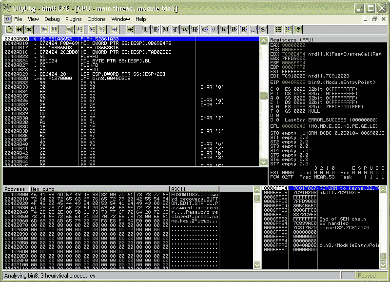

# 逆向工程入门

> 原文：<https://infosecwriteups.com/getting-started-with-reverse-engineering-609a42e86cc1?source=collection_archive---------3----------------------->

逆向工程是理解程序的特定方面的过程，下面列出这些方面是为了识别系统的组件以及组件之间的相互关系。并增强系统的组件，提高系统(或)子系统的性能和可扩展性。软件逆向工程是一种将程序的机器代码(通常发送到逻辑处理器的字符串 0 和 1)转换回称为源代码的可编程语言语句的技术。进行软件逆向工程是为了获得程序的源代码，因为要知道程序的特定部分如何执行特定的操作，以改进程序功能或修复程序中的错误，或者找到软件中的恶意语句块(如果有的话)。一般来说，这种逆向工程会发生在老工业的机器上。但是现在它被频繁地用在计算机硬件和软件上。重要的内容，如数据格式、程序员用来实现软件的算法以及程序员(或)公司的想法，将通过使用逆向工程技术违反安全和隐私问题而被泄露给第三方。

逆向工程本身并不意味着改变子系统或在现有系统的基础上开发新系统。逆向工程涉及非常广泛的方面，例如从现有的实现开始，重新创建或重新捕获设计思想，并提取现有系统的实际需求。设计恢复是逆向工程中最重要的子集，因为在逆向工程中，领域知识、外部(或)外部信息以及推理或模糊推理被添加到被研究(或)的系统中，以找到系统的高级抽象，这通常不是通过直接观察系统获得的。

## **逆向工程我们需要什么？**

要启动逆向工程软件，您需要:
在您想要应用逆向工程的领域中的知识
允许您在尝试反汇编软件时应用您的知识的工具。
让我们考虑一个与软件无关的普通例子。假设你有一只手表，你想知道它是机械的、石英的还是自动的。
懂领域就是要知道手表有三种类型。此外，你应该知道，如果有电池，它位于手表内部，如果你打开它，你可以看到它。你还应该对手表的内部结构有基本的了解，电池是什么样子的，打开表壳需要什么工具。拥有应用知识的工具意味着你需要一把螺丝刀或其他专用工具，让你有机会打开手表。
就像对手表进行逆向工程需要特定的技能和工具一样，逆向工程软件也需要特定领域的知识和工具。

## 【Windows 软件逆向工程的有用工具

在我们的应用程序架构研究中，我们已经描述了几种逆向工程工具，包括 ProcessMonitor 和 ProcessExplorer。这些工具是逆向工程不可或缺的。在这一节中，我们将回顾最流行的反汇编器和一些我们在逆向工程项目中使用的工具。
您可以在我们关于最佳软件逆向工程工具的文章中获得更多详细信息和使用示例。

**反汇编程序:**
反汇编程序是将可执行文件翻译成汇编语言的程序。最受欢迎的是 IDA Pro

**IDA Pro**

IDA Pro 是一个方便而强大的拆卸工具。它有大量的工具，可以让你快速分解一个软件。它可以显示函数调用树，解析可执行文件的导入和导出，并显示关于它们的信息。它甚至可以显示 c 中的代码。此外，它支持多 CPU 架构，因此可以使用 IDA Pro 对 ARM、AVR、M68k 和许多其他架构的代码进行逆向工程。

**Radare**
Radare 反汇编程序是 IDA 的替代产品。它具有 IDA 的所有特性，但不够健壮和稳定。但它是免费和开源的。Radare 本身是一个控制台工具，但它有一个裁剪器前端，这使它成为 IDA 的真正替代品。

**Windows Sysinternals**
Windows Sysinternals 实用程序通常用于 Microsoft Windows 环境的管理、诊断、故障排除和监控。但它们也适用于 Windows 软件的逆向工程。

**TCPView** 是一个网络嗅探器，显示来自所有进程的 TCP/UDP 数据包的所有信息。此工具对于逆转网络协议非常有用。
**PortMon** 是一个物理系统端口监视器。它监控串行和并行端口以及通过它们的所有流量。
**WinObj** 以层次结构显示系统中所有的全局对象。当对使用同步原语(如互斥体和信号量)的应用程序进行反向工程时，以及对内核模式驱动程序进行反向工程时，该工具会非常有用。
网络监控工具

Wireshark 是最强大的网络嗅探器之一。它不仅允许您捕获网络流量，还包含各种网络协议的解析器，从以太网、TCP 和 IP 等底层协议到 WebSockets 和 XMPP 等特定于应用程序的协议。

Fiddler 是一个 web 代理，它记录来自浏览器的流量，并允许您分析 HTTP/HTTPS 请求。与 Wireshark 不同，它显示 HTTP 会话，而不是单独的网络数据包。Fiddler 还允许您在监视 SOAP、REST 和 AJAX 请求时，分析通过 HTTP 发送的压缩数据和 JSON 和 XML 数据。

**API Monitor**
API Monitor 是一个有用的工具，用于发现应用程序调用了哪些 API，以及应用程序期望这些 API 具有什么行为。这个工具有一个强大的数据库，让您看到对大量 API 函数的调用，不仅包括 kernel32 和 ntdll，还包括 COM、托管环境等。此外，API Monitor 提供了方便的过滤机制。对于任何开发人员来说，调试器对于了解程序现在正在做什么都是无价的。反向调试应用程序与调试实时应用程序的好处是一样的。最流行的调试器是 OllyDbg、WinDbg 和 Windbg Preview。

在 OllyDBG 倒车

**OllyDBG**
OllyDbg(及其继任者 x64dbg)可能是软件逆向工程方面最好的调试器。它是专门为逆向需求开发的，并且拥有为此目的所需的所有工具:
一个能够分析和识别关键数据结构的内置反汇编器
一个导入和导出分析功能
一个内置组装和修补引擎
解析 API 函数及其参数的能力使逆向与系统的交互变得容易。stack 视图提供了许多关于调用堆栈的信息。一个更重要的优势是，当普通的调试器不能做任何事情时，您可以将 OllyDbg 用于受调试保护的应用程序。

尽管界面简单，但 Windbg 拥有强大的调试工具。它有一个内置的反汇编器、各种命令，这些命令允许您了解正在调试的进程/系统的几乎所有信息，以及进行内核模式调试的能力，这可能是最有价值的特性。这对于反向驱动来说是一个很大的优势，尤其是内核模式的驱动。

**Windbg 预览版**
Windbg 预览版是微软开发的 Windbg 新版本。它仅通过 Windows 应用商店分发。它拥有经典 Windbg 的所有功能，加上一个新的用户界面和几个新功能。这些新特性中的一个是时间旅行调试，它允许你记录一段时间的程序执行，然后根据需要多次重放。这样，您可以通过单步执行来执行代码中有趣的部分，而不必担心意外运行某些代码而丢失上下文或所有数据。

感谢**黑客街机**分享这篇文章([https://hackersarcade.tech/blog/](https://hackersarcade.tech/blog/))

请务必在这个平台上关注我，了解更多关于黑客 **- Zeus** 的信息性文章

## 来自 Infosec 的报道:Infosec 每天都有很多内容，很难跟上。[加入我们的每周简讯](https://weekly.infosecwriteups.com/)以 5 篇文章、4 个线程、3 个视频、2 个 GitHub Repos 和工具以及 1 个工作提醒的形式免费获取所有最新的 Infosec 趋势！