# wireShark 入门第 1 部分| WireShark 初学者教程|使用 WireShark 进行协议分析

> 原文：<https://infosecwriteups.com/getting-started-with-wireshark-part-1-begginers-tutorial-for-wireshark-protocol-analysis-using-682f1535e2fe?source=collection_archive---------0----------------------->

来源:谷歌

> Wireshark 教程将分为三个不同的部分

## Wireshark 简介

每当有关于计算机网络的讨论时，无论是网络配置、网络取证、网络故障排除还是任何其他方面，人们脑海中肯定会浮现出一个不可避免的工具“WIRESHARK”。

这个工具也被称为嗅探器、网络协议分析器和网络分析器。它是任何专业人员(如每天处理网络以检查安全问题的网络安全工程师)的必备工具。

# 用途和功能

它是一个开源工具，主要用于分析网络数据包，它还用于其他目的，如软件开发、通信协议开发、网络故障排除或教育人们了解网络，它允许用户查看和捕获所有通过网络的流量，排除延迟和恶意网络活动。

> Wireshark 在两种不同的模式下运行:混杂模式和监控模式。

混杂模式是指网络接口捕获分配给的网段上的所有网络数据包，并捕获网络中流动的所有数据包。这是最常用的模式。这种模式可用于有线和无线网络

监控模式仅适用于无线接入点。它使网络接口能够捕获来自该范围内任何接入点的网络流量，而无需与网络关联。

> **当捕获由多个交换机组成的网络上的流量时，交换机不会将所有流量传递到特定端口，这使得监控模式不足以查看所有流量。各种网络抽头或端口镜像技术用于扩展数据包**

Wireshark 还能够监控单播流量

# 颜色编码

Wireshark 使用颜色编码方案，使用户能够轻松区分捕获的数据包类型。

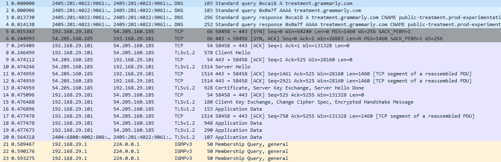

Wireshark 的颜色编码

Wireshark 遵循两条着色规则

1.  临时的(保持到程序运行)
2.  永久的

# 网络协议层次结构

1.  以太网:允许数据从一个设备移动到下一个设备
2.  IP:允许在互联网上找到任何地方的设备。
3.  TCP:允许设置会话
4.  HTTP:允许从客户端向主机发送数据，反之亦然

这些协议应该遵循相同的层次结构来建立通信。

> *以太网(数据链路层)> IP(网络层)> TCP(传输层)> HTTP(应用层)*

来自所有这些协议的数据以完全相同的顺序组合在一起，封装成帧。并且可以在 wireshark 的数据包详细信息窗格中看到

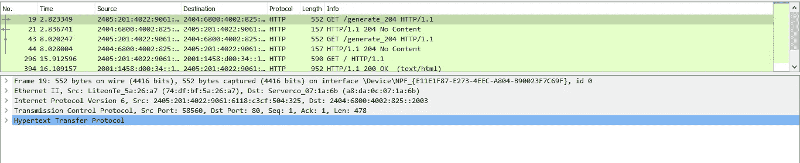

协议层次结构

# **WireShark 使用的特殊驱动**

为了捕获网络流量，Wireshark 使用两种特定于操作系统的特殊驱动程序

1.  win_Pcap_driver 或 nPcap (Windows 操作系统)
2.  Lib_Pcap_driver (Mac/Linux)

这些驱动程序有助于创建流经网络接口卡的网络数据包的精确副本。这些驱动程序并非 100%高效。有时，Wireshark 可能无法捕获消息。

根据网卡上的活动量，这些驱动程序的优先级很低。如果有太多的处理发生，那么这些驱动程序的操作将首先被丢弃。

# 安装 Wireshark

> Wireshark 可以点击[这里](https://www.wireshark.org/download.html)下载

WireShark 的安装和其他软件一样非常简单，但是安装时需要注意一些步骤，以确保用户获得所有需要的功能

而安装用户可以选择安装或不安装哪些特定组件

从 TShark 开始。它是 WireShark 的命令行实用程序，提供与 GUI 版本相同的功能

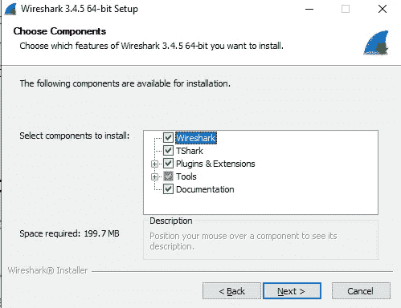

WireShark 的组件

用户接下来要做的主要选择是，是否将通用网络捕获文件格式与 Wireshark 相关联。在所有已知的格式中，Pcap 是最常用的格式。然而，Pcapng 允许存储关于捕获的更多细节

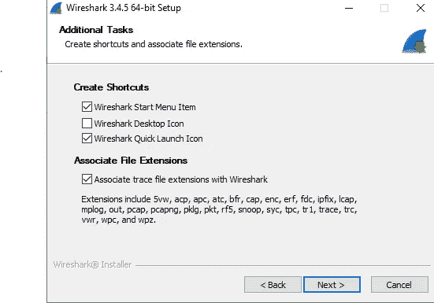

WireShark 文件扩展名

nPcap 是 Wireshark 用来捕获网络流量的特殊驱动程序，它与主软件一起安装

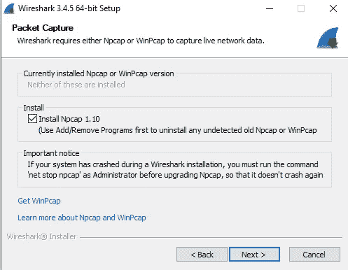

nPcap 驱动程序安装

Wireshark 使用的另一个特殊功能是 USBPcap，它用于捕获来自 USB 设备的流量

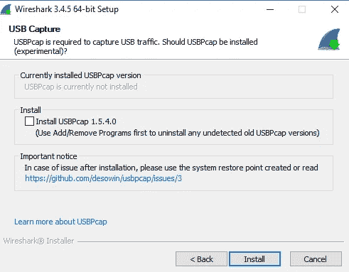

USBPcap 驱动程序

当开始安装 nPcap 时，用户会看到另一个弹出窗口，可以在其中安装一些附加组件，如 NMAP、支持 ray 802.11 流量的驱动程序等

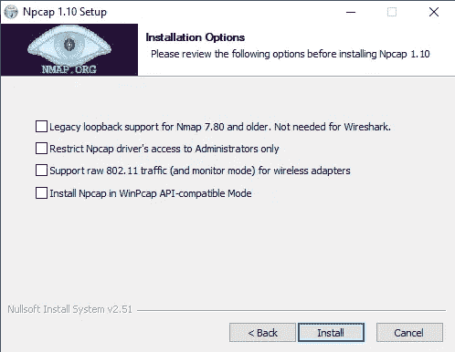

附加组件

# Wireshark 的接口

这是 Wireshark 的主屏幕，显示机器上可用的不同网络接口

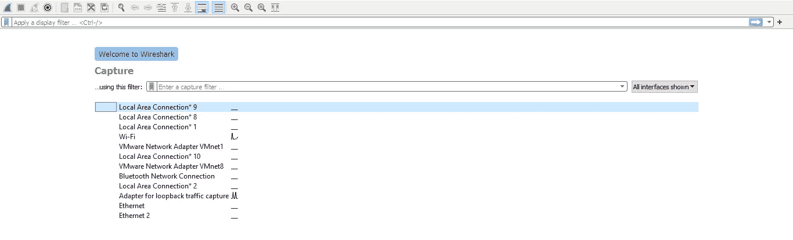

网络接口

要捕获流量，只需双击要捕获流量的网络接口，该过程将自动开始；要停止捕获，可使用工具栏菜单中第二个方形按钮。

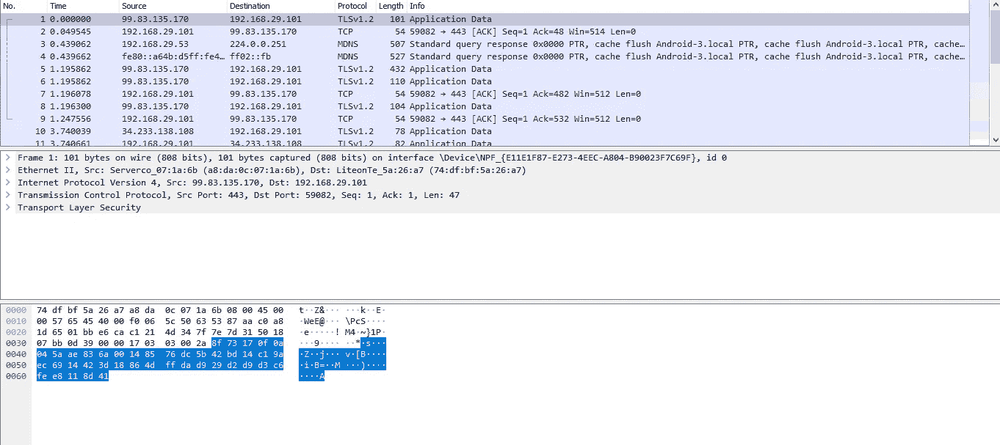

捕获的数据包

如上图所示，屏幕分为三个窗格。最上面的窗格可以看到捕获的数据包，中间的窗格显示所选数据包的详细信息，底部的窗格显示该数据包中数据的十六进制值。

Wireshark 可以将捕获的数据分解并保存在多个文件中。该选项在“捕获选项”下可用。

在工具栏中可以看到“采集选项”按钮。它就像黑色的设置图标

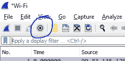

捕获选项

捕获选项提供了三个主要选项

1.  输入:显示网络接口以选择捕获数据包的来源

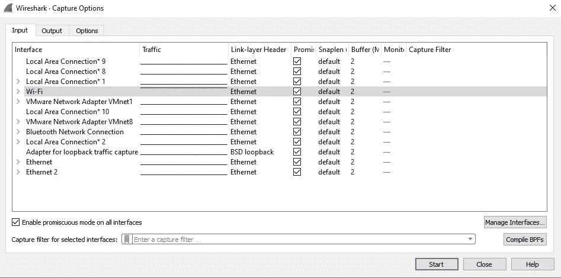

2.输出源:用户可以选择永久网络捕获文件，并将所有捕获的流量保存在该特定文件中，或者选择捕获格式，或者为捕获配置分段，即创建单个捕获文件或创建新文件，并在捕获特定数量的数据包时或在特定时间和大小后开始将数据包保存在 ti 中，等等。用户还可以选择使用环形缓冲区

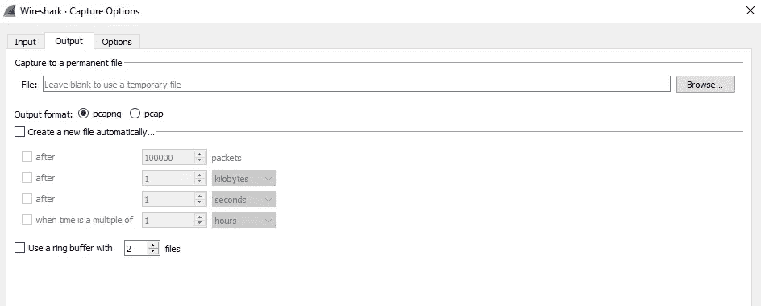

输出窗

环形缓冲区:用户选择为捕获数据包而创建的文件数量。例如，用户使用环形缓冲区创建了三个文件，因此当环形缓冲区被第一个文件填满数据包时，数据将被存储到第二个文件，当第二个文件的存储空间已满时，数据将被传输到第三个文件，当第三个文件的存储空间已满时，数据将再次被移动到第一个文件

3.选项:此窗口为用户提供选项，如何时通过获取 MAC 地址的前 24 位来结束 MAC 地址到其制造商名称的捕获或解析，解析网络类似于反向 DNS 查找。它给出了基于 IP 的网站或服务名称。“最好不要使用网络解析功能，因为它在大多数情况下是不正确的”，解析传输名称，禁用时提供端口号，启用时提供在该端口上运行的服务的名称。例如，禁用时为端口 80，启用时为 HTTP。

> Wireshark 告诉其他实用程序哪个协议正在运行，即使该选项被禁用

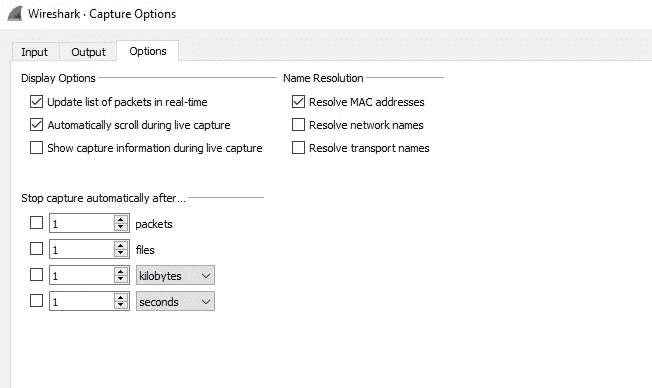

选项窗口

# 数据包之间的相关性 **B**

Wireshark 有一个惊人的功能，它可以根据序列号在不同的网络数据包之间建立关系，并用括号表示

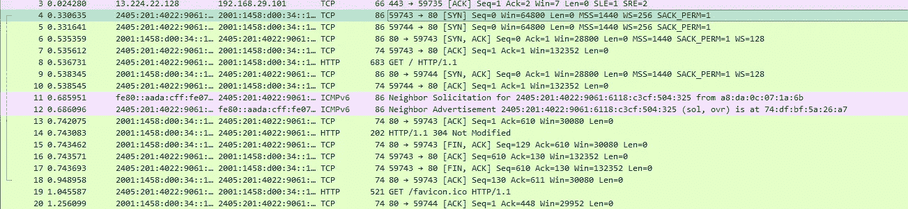

数据包之间的关系

下面是关于括号的解释

> 来源:[https://www . wireshark . org/docs/wsug _ html _ chunked/chusepacketlistpansection . html](https://www.wireshark.org/docs/wsug_html_chunked/ChUsePacketListPaneSection.html)

会话中的第一个数据包。

所选对话的一部分。

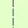

*不是*所选对话的一部分。

对话中的最后一个数据包。

请求。

回应。

选定的数据包会确认该数据包。

所选数据包是该数据包的重复确认。

所选分组以某种其他方式与该分组相关，例如作为重组的一部分。

> 本教程的第 1 部分到此结束，我希望您现在已经熟悉了 Wireshark 的基本功能及其用途。下一部分将很快推出，将涵盖捕获和显示过滤器、Wireshark 如何解析数据包中的信息、解析常见的网络协议。

> 感谢阅读。如果你觉得有价值，可以在评论中自由提问，并与你的同行分享这篇文章。

> 如果你有兴趣尝试一种开箱即用的、新开发的编程语言“突变体”，点击[这里](http://mudocs.netlify.app/)。变种人是一种开源编程语言，旨在为编程&安全研究提供一个可访问的、安全的系统。

> 如果你有兴趣了解更多关于网络安全的知识，请关注 Instagram 上的 [i.m.pratikdabhi](https://www.instagram.com/i.m.pratikdabhi/)