# WireShark 入门第 2 部分| WireShark 初学者教程|过滤器和协议解析

> 原文：<https://infosecwriteups.com/getting-started-with-wireshark-part-2-begginers-tutorial-for-wireshark-filters-and-protocol-ae56afe45aed?source=collection_archive---------4----------------------->

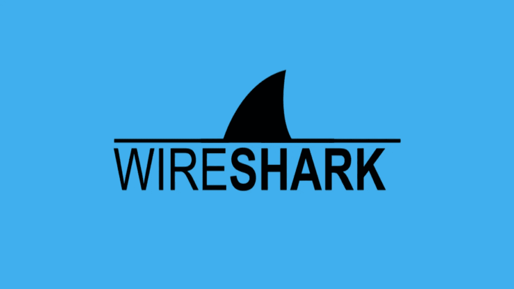

来源:谷歌

> 在第一部分中，我们讨论了 Wireshark 的基础知识，包括它的用途、特性、安装等。第一部分可以在这里找到**。**

*在这一部分，我们将进一步讨论 Wireshark 中的过滤器，并剖析前面提到的基本协议*

1.  *以太网*
2.  *互联网协议(Internet Protocol)*
3.  *传输控制协议（Transmission Control Protocol）*
4.  *超文本传送协议*

# *捕获过滤器*

*就像任何其他过滤器一样(不要说社交媒体上的过滤器:P ),它们也旨在减少可搜索的项目，但它们的工作方式完全不同。*

*它们帮助分析师过滤出要捕获的特定信息，即只捕获和记录使用过滤器指定的数据类型，而忽略所有其他数据。这就增加了网卡的负载，因为网卡增加了另一项任务，即在将数据存储到 Wireshark 之前过滤流过的数据。*

*使用捕获过滤器有一个非常大的缺陷，即它们限制了被捕获的数据包，这限制了对网络中出现的任何问题进行故障排除的能力，因为指向问题的实际数据可能被过滤掉而不会被存储。*

*Wireshark 在其欢迎屏幕上为我们提供了一个输入字段来捕获所需的流量类型*

*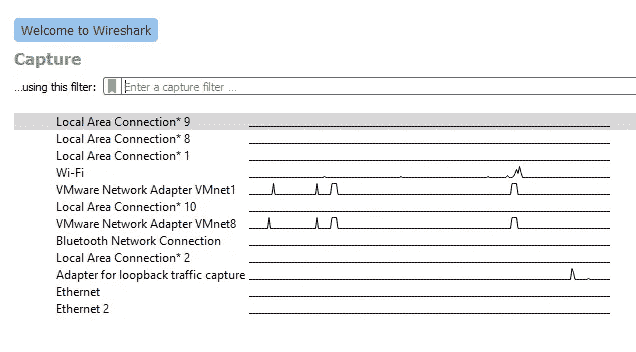*

*捕获过滤器的输入字段*

*除了欢迎屏幕，我们还可以在菜单栏中选择“捕获”选项，然后在“输入”选项卡中，我们可以找到一个输入字段来应用捕获过滤器*

*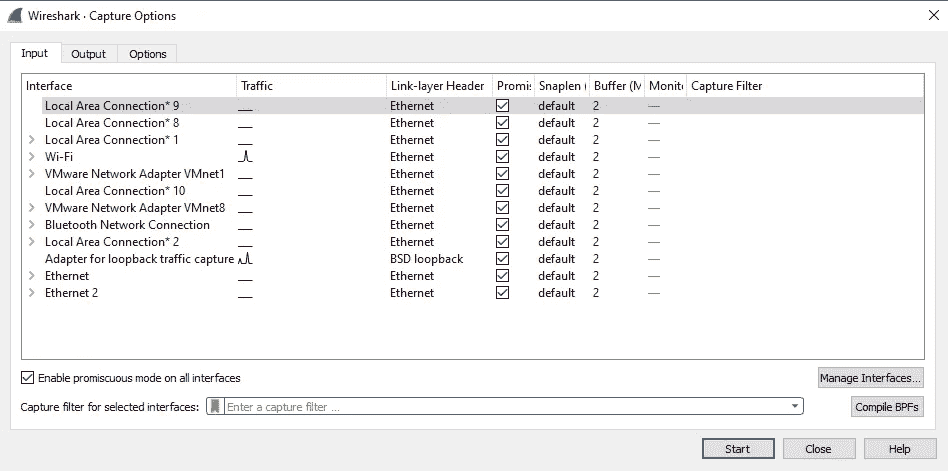*

*捕获过滤器输入字段*

*例如，如果用户希望捕获与 TCP 协议相关的流量，并且在此字段中提及协议名称，将启用该协议的捕获过滤器，即仅捕获与该协议相关的流量。*

*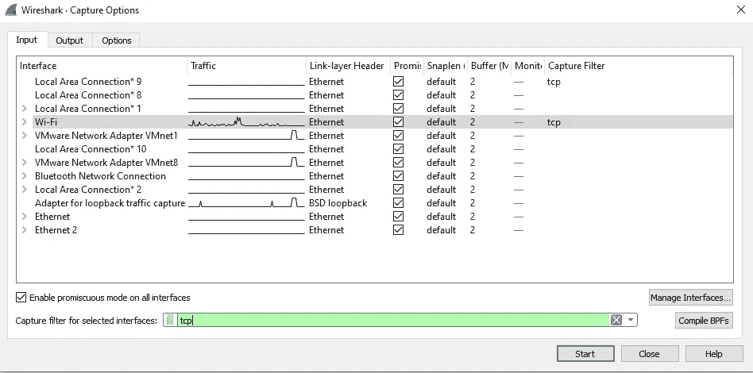*

*TCP 捕获过滤器*

*输入字段中的绿色表示应用的过滤器是正确的，否则颜色应该是红色。当使用此过滤器开始捕获时，将只记录 TCP 协议的流量*

*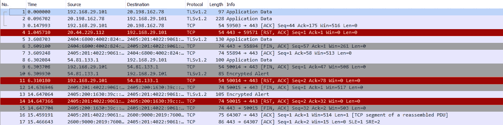*

*TCP 捕获*

*在上面的片段中可以看到，还提到了序列号、时间源和目的 IP、协议名称、数据包长度以及数据包的一些基本信息。该信息可用于 Wireshark 中捕获的每个数据包。*

*用户还可以从 Wireshark 预定义的捕获过滤器列表中选择一个捕获过滤器。为此，用户需要选择菜单栏中捕获选项下拉菜单中的捕获过滤器选项*

*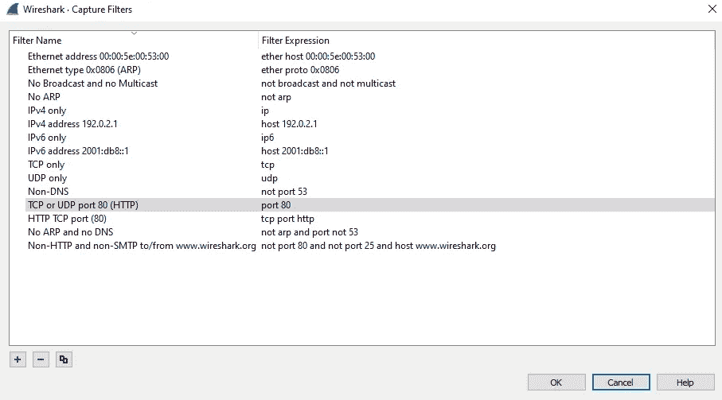*

*捕获过滤器列表*

*该列表也可用于添加用户自己定期使用的过滤器。*

*用户还可以选择使用“and”和“or”来组合多个过滤器。它们在 Wireshark 中的工作方式与在其他任何地方的工作方式相似，这意味着当使用“and”时，只有满足两个过滤器的数据包才会被捕获，而在使用“or”时，满足其中一个过滤器的数据包才会被捕获*

*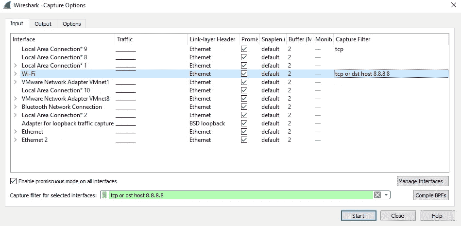*

*TCP 或 DST 主机过滤器*

*在上面使用的过滤器中，我们指定了协议和目的主机。因为它是一个捕获过滤器，所以只有满足这些过滤器的数据才会被捕获。*

*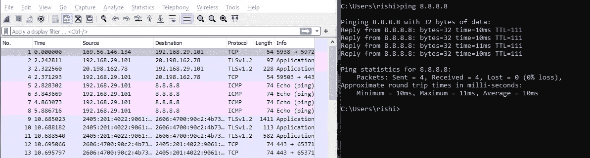*

*捕获过滤器的输出*

*在输出中，可以看到过滤器如何只捕获指定的数据，而忽略流经网卡的任何其他数据。*

> *要指定源主机，可以使用“src host”*

# *显示过滤器*

*与捕获过滤器不同，显示过滤器在捕获时不会过滤掉流量。它们允许 Wireshark 捕获流经指定接口的每个数据包。事实上，显示过滤器与捕获流过的数据没有任何关系。*

*当应用显示过滤器时，在所有捕获的数据包中，只有与该过滤器相关的数据包才会显示*

> *捕获和显示过滤器的格式完全相同，只是它们提供的功能不同*

*显示过滤器以一种大家都知道和熟悉的方式工作，即缩小搜索结果。*

> *最好使用显示过滤器，而不是捕捉过滤器。*

*可以在欢迎屏幕上捕获过滤器输入字段上方的输入字段或数据包捕获屏幕上指定显示过滤器。*

*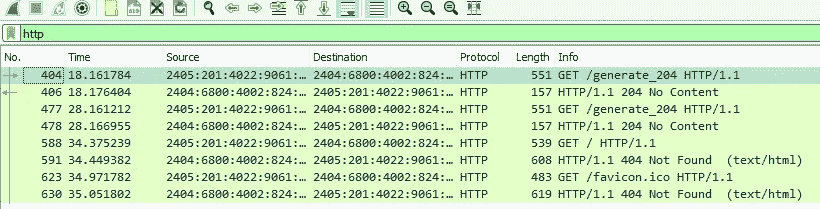*

*HTTP 流量*

*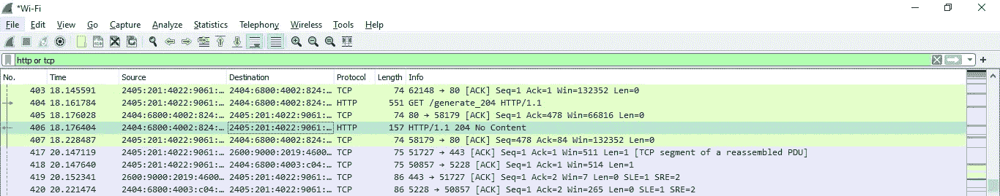*

*HTTP 和 TCP 流量*

> *显示过滤器也可以像捕获过滤器一样使用“and”&“or”进行组合*

*还可以从特定数据包选择数据包中创建和应用显示过滤器，以包括该类型的数据包或从显示结果中删除它们。要做到这一点，右键单击数据包详细信息窗格中的任何协议，并将鼠标悬停在应用为过滤器上，然后选择您希望该过滤器执行的操作类型。这将过滤与所选协议中的数据相匹配的数据包。*

*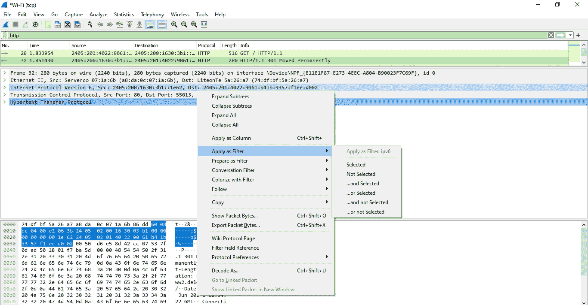*

*应用为过滤器选项*

# *协议剖析*

*Wireshark 每次捕获数据包时都会遇到各种类型的网络数据包。尽管如此，这个工具还是非常漂亮地剖析了每个数据包中的信息。这是因为帧头中的信息以固定的方式存储*

## *以太网帧*

*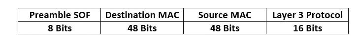*

*以太网帧的内容*

*每个以太网帧都包含上图中所示的以下项目，并且可以在 Wireshark 的数据包详细信息窗格中很容易地看到，但报头 SOF(帧开始)除外，因为它总是相同的*

*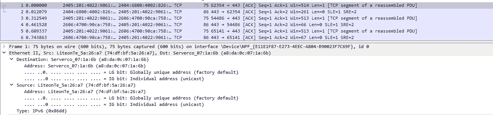*

*以太网帧*

*在上图中可以看到以太网帧的内容，它清楚地显示了前面提到的所有字段。
目的 MAC
源 MAC
第 3 层协议，在本例中为 IPv6*

## *解剖器*

*此处的信息基于标准 IP 报头(32 位)进行分解。关于 IP 头的更多信息可以在“ [*rfc 791*](https://datatracker.ietf.org/doc/html/rfc791) *中找到。* IP 报头也遵循如下固定结构*

**

*在数据包详细信息窗格中打开数据包的 IP 报头会显示上图中提到的所有信息*

*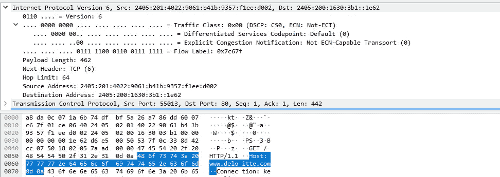*

*IP 报头信息*

*在检查 IP 报头时，我们通常寻找的信息是其版本、服务类型(可视为下一个报头，即 TCP)、生存时间(由跳数限制以及源和目标 IPv6 地址提及)。
主机名称也可以在十六进制包字节窗格中看到*

# *TCP 剖析*

*与 IP 类似，TCP 也是基于标准 TCP 报头进行剖析的。关于 TCP 的更多信息可以在" [*rfc 793*](https://datatracker.ietf.org/doc/html/rfc793) 中找到*

*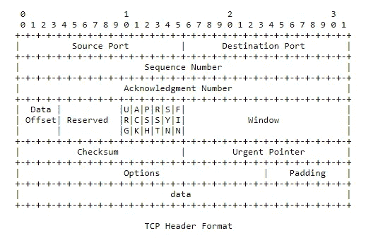*

*当在 Wireshark 中解析 TCP 报头时，可以发现上图中提到的信息如下*

*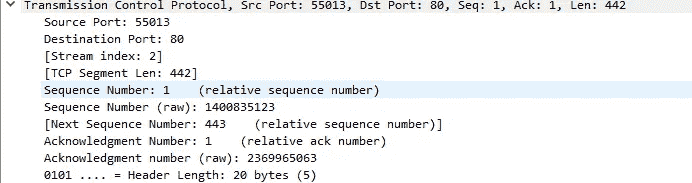*

*源端口和目的端口、序列号、确认号和报头长度/数据偏移。*

*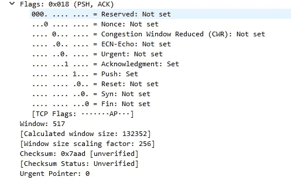*

*保留、窗口、校验和及紧急指针*

> *TCP 中的窗口大小就像一个广告，告知接收设备在任何时间点愿意接收多少数据(以字节为单位)*

# *HTTP 解析*

*与 IP、TCP 或以太网相比，HTTP 报头要复杂得多，而且不太固定。
然而，Wireshark 仍然能够从 HTTP 数据包中检索一些重要信息，例如*

*   *这个包属于哪个网站*
*   *哪个浏览器生成了该数据包*
*   *关于 HTTP 请求的附加信息*

*关于 HTTP "[*RFC 2616*](https://datatracker.ietf.org/doc/html/rfc2616)"的更多细节可以参考。*

*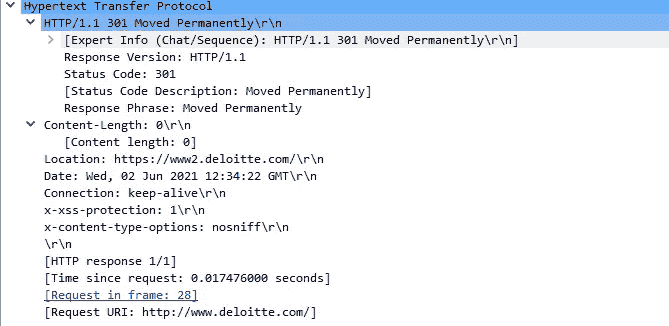*

*HTTP 数据包解析*

*可以看到，wireshark 正在透露响应版本、访问的网站、日期和时间等信息。此外，如果我们右键单击 HTTP 标题并选择 follow HTTP stream，我们可以获得关于特定 HTTP 请求可能使用的浏览器的信息。要提供此信息，请给出可能生成此请求浏览器的名称*

*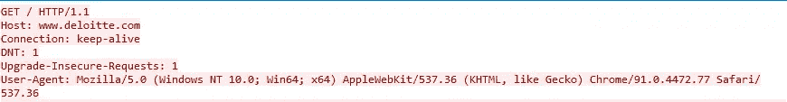*

*HTTP 流*

*就像在这种情况下，Wireshark 显示像 Mozilla，Chroma，Safari 这样的建议。然而，这个 HTTP 请求实际上使用了 chrome。*

> *Wireshark 教程的第 2 部分到此结束，我希望您现在已经熟悉了过滤器的基础知识和通过分析协议可以找到的信息。下一部分将很快推出，将介绍如何检索网站，我们还将了解下载网站时生成的 DNS、ARP 和 HTTP 请求。*

> **感谢阅读。如果你觉得有价值，可以在评论中自由提问，并与你的同行分享这篇文章。**

> **如果你有兴趣尝试一种开箱即用的、新开发的编程语言“突变体”，点击* [*这里*](http://mudocs.netlify.app/) *。突变体是一种开源编程语言，旨在为编程安全研究提供一个可访问的、安全的系统。**

> **如果你有兴趣了解更多关于网络安全的知识，请关注 Instagram 上的*[*I . m . pratikdabhi*](https://www.instagram.com/i.m.pratikdabhi/)*