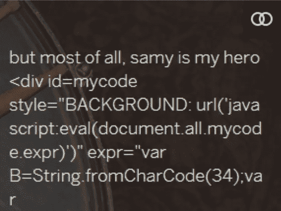

# XSS 入门:跨站点脚本攻击

> 原文：<https://infosecwriteups.com/getting-started-with-xss-cross-site-scripting-attacks-822c82b7cd82?source=collection_archive---------2----------------------->

让我们从 XSS 开始，为了得到那些关键的错误- CSRF，SSRF，RCE。大多数情况下，XSS 缺陷是漏洞被利用并升级为关键发现的原因。

首先，也是最重要的，结构:我们将从学习 XSS 的基础知识开始，然后:你应该知道的事情——一个浏览器和网站如何运行，之后:XSS 的类型——理解有影响力的 XSSs ’,最后:XSS 在 Bug 狩猎。

# 什么是 XSS？

我知道你知道。但是你知道吗，你不知道的是什么？XSS 是一种跨站点脚本攻击，对于安全测试人员来说是一种非常基本的攻击。但是，重读(或跳过)也没什么坏处。记住- **学习，忘记&重新学习**。所以，在这里。

跨站脚本(XSS)攻击是**注入**的一种，在这种攻击中，恶意的**脚本被注入**原本良性且可信的网站。当攻击者使用 web 应用程序向不同的最终用户发送恶意代码(通常是浏览器端脚本的形式)时，就会发生 XSS 攻击。允许这些攻击成功的缺陷非常普遍，并且出现在 web 应用**在其生成的输出**中使用来自用户**的输入而没有验证或编码**它— OWASP 的任何地方。

XSS 在 OWASP Top 10(2017)A7:2017-跨站脚本(XSS)中排名**第七。这并不是说，XSS 现在不常见，而是事实上其他漏洞已经获得了优先权。**

此外，自动化工具可以自动发现一些 XSS 问题，特别是在诸如 PHP、J2EE / JSP 和 ASP.NET 等成熟技术中。—进入白盒/灰盒测试。

> ***简单来说:*** 如果你能控制 JavaScript，一个典型的网站功能就在上面。那么，XSS 是一个可能性。

# 浏览器和网站如何运作？

在深入潜水之前，重要的是要掌握好基础知识。

我们知道这个世界运行在一些基本的规则、原则上，让我们免于浩劫。同样，互联网如此，浏览器和网站也是如此。

浏览器和网站在一定的规则下共存。为了清楚地了解缺陷的安全影响，您应该知道下面提到的一些规则:

## 1.同源政策- SOP

同源策略是一个关键的安全机制，它限制了从一个源加载的文档或脚本如何与另一个源的资源交互。它有助于隔离潜在的恶意文档，减少可能的攻击媒介——Mozilla。

"限制互动的限制性政策."

> ***简单来说:*** 服务器为一个浏览器定义规则，在这个规则中，Website1 可以与 Website2 进行交互。

## **2。跨产地资源共享-** CORS

CORS 是一种基于 HTTP 头的机制，它允许服务器指出除了它自己以外的任何其他来源(域、方案或端口),浏览器应该允许从这些来源加载资源——Mozilla。

" SOP 中的放松，便于与可信来源进行互动."

> ***简单来说:*****是 HTTP 头，是服务器发送的，用来状态浏览器，哪些网站在它的好友列表/允许列表中。**

## **3.跨站点请求伪造令牌- CSRF 令牌**

**为了防止跨源写入，在请求中添加了一个不可访问的令牌，称为跨站点请求伪造(CSRF)令牌。您必须防止对需要 CSRF 令牌的页面进行跨源读取。**

> *****简单来说:*** CSRF 令牌是——一次性使用的、不可预测的(随机的)长(至少- 16 字节/128 位)令牌(值/密钥)，由服务器生成(不受用户控制)——交给浏览器执行单个任务。**

## **4.HTTP Cookie**

**HTTP cookie (web cookie，浏览器 cookie)是服务器发送给用户的 web 浏览器的一小段数据。浏览器可以存储它并将其与稍后的请求一起发送回同一个服务器。通常，它用于判断两个请求是否来自同一个浏览器——例如，保持用户登录。它会记住无状态 HTTP 协议(Mozilla)的有状态信息。**

> *****简而言之:*** Cookie 通常是你的凭证(用户名&密码)的替代品，服务器将这些凭证来回发送给浏览器，以提醒他某个特定的会话(HTTP-一种无状态协议，在每次请求后，它会忘记你是谁&你想从他那里得到什么)并跟踪所执行的活动。**

## **5.HTTPOnly -Set-Cookie**

**HttpOnly 是一个包含在 Set-Cookie HTTP 响应头中的*附加标志*。在生成 cookie 时使用 HttpOnly 标志有助于降低客户端脚本访问受保护 cookie 的风险。**该属性指定不能通过脚本访问 cookie。**通过使用 HTTP-only cookie，网站消除了 cookie 中包含的敏感信息随脚本发送到黑客的计算机或网站的可能性。在客户机上设置了一个带有 HTTP 响应头的 cookie。**

**“将 cookie 标记为 httpOnly 会禁止 JavaScript 访问它，从而保护它不被发送给第三方。但是，即使在这种情况下，也可以使用 TRACE 方法绕过这种保护并访问 cookie。-OWASP**

****异常:**如果应用程序允许 HTTP-method: TRACE。跨站点跟踪(XST)仍然是一种可能性，尽管有标志 Set-Cookie HTTPOnly，Cookie 仍然可能被窃取。"**

> *****简单来说:*** HTTPOnly 属性指定 cookie 不能通过脚本访问，只能通过 HTTP 头访问。**

****注意:**使用上述单独的技术是不够的，但是，当一起使用时，可以减轻跨站点脚本的风险。单独使用时，它们不能完全消除跨站点脚本的危险。**

**浏览器还可以使用其他一些规则来实现安全通信。但是，这里我们限制了 XSS 规则的范围。**

**现在，我们知道了什么是 XSS，以及浏览器和网站是如何根据一定的规则运行的。让我们进一步讨论 XSS 和重要 XSS 在 Bug 搜索中的类型。**

****

## **XSS 的类型(一般):**

1.  **反射 XSS-您的有效载荷影响您/登录用户***
2.  **存储的 XSS-您的有效负载-影响其他用户' ***
3.  **多姆 XSS-您的有效负载由易受攻击的文档对象模型处理***
4.  **盲目的 XSS-狡猾地得到你的注射有效载荷的结果***
5.  **自我 XSS-不在 bug 搜索范围内(或低影响/信息)**
6.  **基于闪存的 XSS-过时了(闪存已经死了)**

***(在寻找漏洞方面很重要——因为可能会产生严重影响——CSRF、SSRF 和 RCE。)**

# **XSS 在捕虫:**

**我们将讨论以下 XSS 类型，它们与寻找 Bug 的角度相关:**

1.  **反光 XSS**
2.  **存储的 XSS**
3.  **多姆 XSS**
4.  **盲人 XSS**

## **1.反射 XSS 攻击**

**反射攻击是那些注入的脚本被 web 服务器反射的攻击，例如在错误消息、搜索结果或任何其他响应中，包括作为请求的一部分发送给服务器的部分或全部输入。反射的攻击通过另一种途径传递给受害者，比如通过电子邮件或者其他网站。当**用户被诱骗点击恶意链接上的**，提交特制的表单，甚至只是浏览恶意网站时，**注入的代码会传播到易受攻击的网站，从而将攻击反射回用户的浏览器**。然后浏览器执行代码，因为它来自一个“可信的”服务器。反射 XSS 有时也被称为非持续性或二型 XSS。**

**反射 XSS 攻击通常需要社会工程技巧来传递影响。**

## **2.存储的 XSS**

**存储攻击是指**注入脚本永久存储在目标服务器**上的攻击，例如存储在数据库、消息论坛、访问者日志、评论栏等。然后**受害者在请求存储的信息**时从服务器检索恶意脚本。储存 XSS 有时也被称为持久性或 I 型 XSS。**

## **存储 XSS 的经典示例:**

****Samy(电脑蠕虫)**，由 Samy Kamkar 设计用于在社交网站 **MySpace** 上传播。在其 2005 年 10 月 4 日发布的短短 20 小时内，超过 100 万用户运行了该有效载荷，使 Samy 成为有史以来传播最快的病毒。**

****

**受害者资料上的信息**

**蠕虫本身相对无害；它携带了一个有效载荷，可以在受害者的 MySpace 个人资料页面上显示字符串“但最重要的是，萨米是我的英雄”，并向萨米发送好友请求。当用户查看该个人资料页面时，有效负载将被复制并植入他们自己的个人资料页面，从而继续传播蠕虫。MySpace 已经保护了自己的网站免受这一漏洞的影响。[阅读更多](https://en.wikipedia.org/wiki/Samy_(computer_worm))。**

## **3.多姆 XSS**

**基于 DOM 的 XSS(或在某些文本中称为“0 型 XSS”)是一种 XSS 攻击，其中**攻击有效负载是由于修改了受害者浏览器**中由原始客户端脚本使用的 DOM“环境”而执行的。以便客户端代码以“意外”的方式运行。也就是说，**页面本身(HTTP 响应)没有改变，但是页面中包含的客户端代码由于 DOM** 环境中发生的恶意修改而以不同的方式执行。**

**这与其他 XSS 攻击(存储或反射)形成对比，在其他攻击中，攻击有效负载被放在响应页面上(由于服务器端缺陷)。**

**一定要检查元素并注意 DOM 源和接收器。**

**在寻找基于 DOM 的 XSS 时，请留意 DOM 对象，如:**

1.  **来源**
2.  **水槽**

**检查你的输入/有效载荷是否能控制输出。**

**来源—您输入的内容。**

**`document.url
document.documentURI
document.URLUnencoded
document.baseURI
document.referrer
location
location.href
loaction.search
location.hash
location.pathname
window.cookie
window.referrer
window.name`**

**接收器——你的输入被反射回来的地方。**

**`element.innerHTML()
element.outerHTML()
eval()
setTimeout()
setInterval()
documemt.write()
document.writeln()`**

## **4.盲人 XSS**

**盲 XSS 漏洞属于持久性 XSS 漏洞。当攻击者注入的有效载荷被 web 服务器保存并作为恶意脚本在应用程序的另一个组件或完全不同的应用程序中执行时，这些漏洞就会出现。**

## **例如:**

**攻击者向联系/反馈页面中注入恶意有效载荷，当应用程序的管理员查看反馈条目时，攻击者的有效载荷将被加载。攻击者的输入可以在一个完全不同的应用程序中执行，它可以是一个内部应用程序，管理员可以在其中查看访问日志或应用程序异常。**

****

**此外，上述 XSS 种类可以进一步分为两类:**

1.  **服务器 XSS**
2.  **客户 XSS**

# **服务器 XSS**

**当不受信任的用户提供的数据包含在由服务器生成的 HTTP 响应中时，服务器 XSS **发生。该数据的来源可以来自请求，也可以来自存储位置。因此，您可以同时拥有反射服务器 XSS 和存储服务器 XSS。****

**在这种情况下，**整个漏洞都在服务器端代码中，浏览器只是呈现响应**并执行嵌入其中的任何有效脚本。**

# **客户 XSS**

**当不可信的用户提供的数据被用于通过不安全的 JavaScript 调用更新 DOM 时，就会发生客户端 XSS **。如果一个 JavaScript 调用可以用来将有效的 JavaScript 引入 DOM，那么它就被认为是不安全的。这个数据源可能来自 DOM，也可能是由服务器发送的(通过 AJAX 调用或页面加载)。数据的最终来源可能来自请求，也可能来自客户机或服务器上的存储位置。因此，您可以同时拥有反射客户端 XSS 和存储客户端 XSS。****

**基于 DOM 的 XSS 只是客户端 XSS 的一个子集，数据源在 DOM 中的某个地方，而不是来自服务器。**

****

## **备忘单:**

**现在，我们已经了解了 XSS 的基本情况。我们准备升级攻击。参考下面的备忘单，可以帮助绕过常见的 WAFs 和过滤器。**

** [## 跨站点脚本(XSS)备忘单- 2021 版|网络安全学院

### 这个跨站点脚本(XSS)备忘单包含许多可以帮助你绕过 WAFs 和过滤器的向量。你可以…

portswigger.net](https://portswigger.net/web-security/cross-site-scripting/cheat-sheet)  [## XSS 滤波规避备忘单

### OWASP 基金会的主要网站上的 XSS 过滤器规避小抄。OWASP 是一个非营利基金会，致力于…

owasp.org](https://owasp.org/www-community/xss-filter-evasion-cheatsheet)**