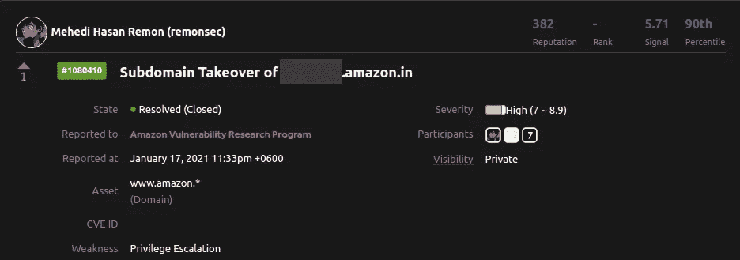
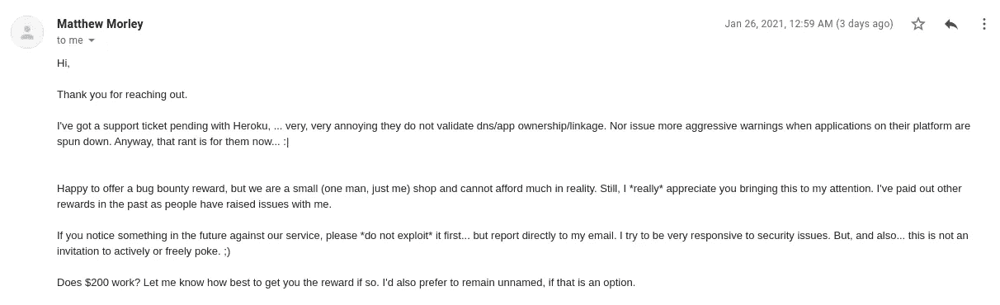
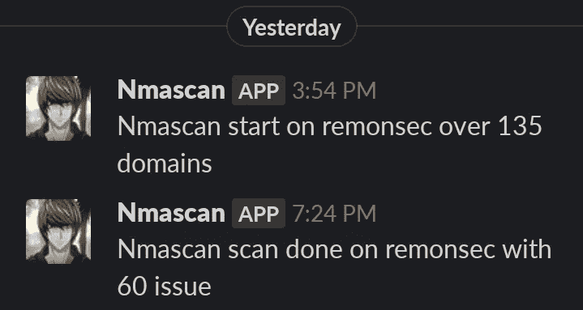
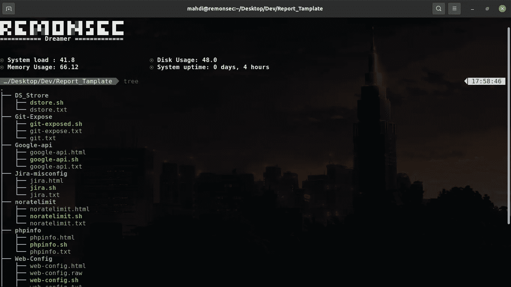
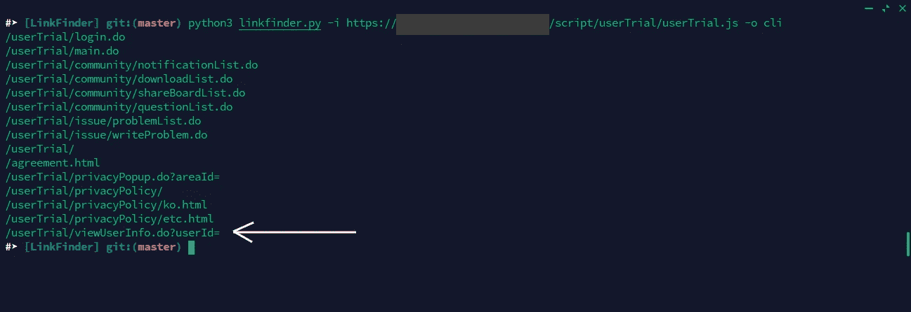
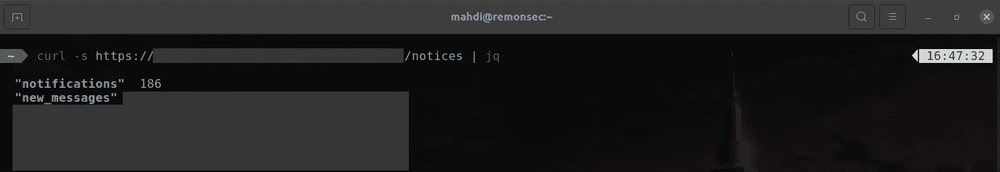
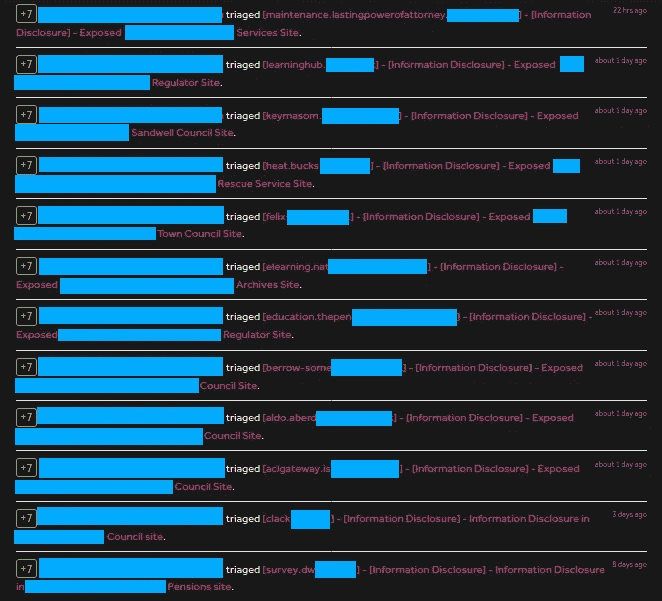

# 得到你的第一个错误

> 原文：<https://infosecwriteups.com/getting-your-first-bug-part-ii-f7081a027f71?source=collection_archive---------0----------------------->

بسم الله الرحمن الرحيم奉至仁至慈的真主之名

祝你平安

**注**
这不是一个如何入门类型的写法。我假设你已经知道了一些基本知识，现在正在努力解决你的第一个 bug。

我从推特上看到每个人都对活跃的 BugBounty 感兴趣。所以今天我将更多地关注这一点

# 被动 BugBounty

被动 BugBounty 是一种被动赚取类似的东西。投入时间和精力并获得回报。大多数时候，对信息安全不感兴趣或没有信息安全基础知识的人会被动地开始 BugBounty。但是，是的，你会看到顶级职业猎人也做被动 BugBounty。但他们的设置和理解是另一个层面。他们过去常常把他们所有的经验和技能用于为他们建立一个主被动工作流程。甚至不要指望从今天的文章中得到什么。今天的被动工作流程将变得简单易行。

**工作流程**

*   子域接管
*   细胞核扫描

由于 Nuclei 将覆盖大多数已知的表层错误，所以我不认为我应该浪费时间在这里一个一个地写这些错误。但是，为什么我提到子域接管不同！让我们来看看

在写这篇文章之前，我做了一些研究。我自己尝试了被动和主动狩猎，以体验初学者在这些想法下将面临的真实环境。为了让你感觉良好，我想说，我发现了主动和被动 BugBounty 方法的错误，也为我的发现赚了一些现金$$$。听起来很酷，至少对我来说

**子域接管**

这个 bug 只是告诉公司，嘿，你不再为你的子域使用该服务。我代表你使用这个。现在闭嘴，并支付我没有滥用

你所要做的就是挑选大量的目标&尽可能多地收集子域。运行多个子域接管扫描器，并验证自己的手动。

我尝试使用 bash，通过创建一个 shell 脚本，该脚本接受大量域作为输入并枚举子域，检查接管并存储数据以供手动验证。你不必走那么远，只要确保你有足够的目标来检查他们的子域接管问题

正如你所看到的，它扫描了 984 个域，最终有 20 个检测，手动验证后，数量少于此。但是，嘿，它的工作。我在亚马逊上发现了一个收购，但亚马逊上的子域收购超出了范围，我没有注意到，但这是他们的核心子域，所以他们解决了它，但没有为我的发现支付任何奖金

得到了一些超过自我主办的负责任的披露计划。在 Heroku、AWS、GitHub 上的收购在那里很常见，也收到了奖金

如果你瞄准像这样的小公司，你在那里获得报酬的机会很高。你将在 GitHub 上获得几个 BugBounty 谷歌呆子使用它们或自己制作

如果你想使用像 HackerOne BugCrowd 这样的平台，我建议你使用外部程序。就像他们没有直接列在 HackerOne 上一样，他们可能会在安全电子邮件上报告后邀请。然后他们直接从 HackerOne 支付报酬。可以以迈克菲为例。由于人们不太了解这些外部程序，这是一个动手的好地方

**原子核扫描**

嗯，这也将是一样的子域接管工作流程。确保你有大量的目标，仅此而已

为 Nuclei scan 构建一个类似的 bash 脚本，将目标作为输入，检查问题并存储结果

你会遇到日志文件泄露、配置文件泄露、吉拉 wp 问题、基本配置错误等问题。大多数时候，你只会遇到一些公司根本不关心的小问题。但是在某些时候，你会收到一些由小到大的奖金，这取决于你所拥有的 bug

在这里，我扫描了一次，得到了一些低，中问题。也收到了奖金，支出是如此之低

我不能再报告那些低挂的果实了&所以又写了一些模板来自动化报告部分。我不想在那些领域浪费时间

**注**

我甚至不知道那些程序是从哪里来的。我甚至没有访问任何一个这样的网站去看看它们是什么样子的。我尝试用 python 来构建一个抓取工具，但由于我的编程知识太差，我失败了，然后我设法用 bash 构建了一个，并从一些 GraphQL 数据库中获取数据。不要告诉我我是怎么做到的。这是我喜欢保存在我的秘密盒子里的东西，但肯定会在未来暴露出来:)

# 活跃的 BugBounty

现在真正的黑客和乐趣从这里开始。老实说，我不喜欢被动 BugBounty。这有点无聊，没有挑战性，因为任何人都可以做这些事情。我花了 1 天时间来构建 scarping 工具，花了 10-20 分钟来完成子域接管和核心自动化脚本。仅此而已。花了 2-3 天时间扫描所有目标，然后花了 1-2 个小时报告它们。什么都没学到，我的技术水平和以前一样。

从 InsiderPHD BugBounty 系列中，我看到她提到 IDOR 是一个初学者友好的 bug。我以前没试过这么多。所以这对我来说是一个学习新东西和做实验的好机会。为什么我不推荐 XSS！实际上，对于现代网络应用程序来说，它并不是那么容易上手，至少从我的经验来看不是。我已经浪费了前一个星期的被动 BugBounty，也许赚了一些$$$但对我来说这只是浪费时间，所以我开始尽可能快和深入地做我的实验

**工作流程**

*   挑选一个 bug，然后学习和获得
*   伊多尔
*   CSRF
*   信息披露
*   你会更多地发现自己；-)

# **IDOR**

你可以窃取其他用户的数据，代表其他用户执行操作等等。只要谷歌一下，自己研究一下，就能了解 ido 的基本知识，或者这个问题实际上是什么，为什么会发生。在你学会了基础知识之后，现在看看你如何找到它们！

**完全不接触目标**

嗯，这叫被动狩猎。您使用第三方来源来收集关于您的目标的数据，并根据您所拥有的来利用它。说够了，让我们试一试

**工作流程**

*   爬行
*   核实
*   剥削

您可以使用 waybackurls、gau 等工具在您的目标上爬行以收集端点和 js 文件。从这些 js 文件中，您还可以收集更多的端点，然后根据它们的参数进行验证。你可以使用像 GF 这样的工具，或者只是手动地在那些端点周围摸索。然后根据端点行为或结构来利用端点。

我就是写不出像这样做，那样做，你会找到我的。我可以告诉你一般的方法，没有固定的方法可以侵入。你必须根据情况和环境来解决问题
让我给你看看我的，我昨天是怎么得到的

就像这里你有一个 JS 文件。您可以使用 LinkFinder 从文件中收集端点。在这里，它清楚地显示了它接受输入并返回用户信息。那又怎样！只需要放一个随机数就行了。

他们在那里应用了一个临时的修正，并且会让我知道那个资产是否在奖励范围内。随着我侦查的深入，看起来我穿越了范围边界 xD

**四处打探每一个请求**

我利用了另一个 IDOR。这是他们的 API。我过去常常从他们主要 web 应用程序中获取 API 端点。像检查 logger++日志和重新测试每个请求。我不知道如何向你展示我是在剥削你。因为这听起来有点敏感，他们仍在努力解决这个问题。然后他们会为此而奖励。我只是给出一个 SS 来展示事物的样子。但是如果我藏得太多，不要生我的气

[https://targetapi/API/path/$ username/notices](https://targetapi/api/path/$username/notices)

它无法验证令牌并为任何客户端返回响应。我知道为什么它仍然存在，即使它是一个公共的 RDP 计划。这个端点有点难以找到。另一个端点引用了这个端点，所以如果我不检查所有请求，我也可能会错过它

伙计，我写不下去了。我已经写了两个小时了。说真的，我太慢了。不管怎样，让我们继续

# **CSRF**

在 CSRF，你愚弄受害者去做受害者根本不想做的事情。我的话毫无意义！那是什么阻止你去做一些谷歌搜索！

现在你不会像以前那样看到 CSRF，那里没有令牌可用，你只需复制粘贴打嗝 CSRF 有效载荷和利用。现在，由于他们使用 CSRF 代币，所以你可以检查他们是否真的很好地验证了 CSRF 代币。这很简单，你可以利用自己的创造力来扩展攻击方法

我在哈佛找到一个标记为有效的，他们也解决了。但我的运气不好，子域超出了范围，所以没有收到任何信件。
提及重现部分 POC 视频也可用

1 使用您的帐户登录
2 更改电子邮件地址并捕获请求
3 从/CSRF 端点获取 CSRF 令牌，并在/更改电子邮件端点中使用它，而不是 X-CSRF 最终令牌(这些令牌不相同)
4 再次在/CSRF 端点中发送请求，查看他们是否更改了令牌
5 在/更改电子邮件端点中使用旧令牌
6 即使有了新的 CSRF 令牌，您也会看到它仍在工作

# 信息披露

任何暴露你女朋友电话号码的东西！开玩笑，所以这里的事情是你必须考虑你的目标在收集什么信息或者给什么信息以重要性。然后根据这个目标，你可以寻找几种方法来收集一些数据，或者至少查看一些你不应该查看的内容

它可以用两种不同方式分离

*   客户端信息
*   服务器端信息

**客户端信息**

瞄准用户就好。寻找可以看到自己信息的地方，然后尝试绕过请求，检查是否可以查看其他数据而不是自己的数据。可以是伊多，SQLI，或者别的什么。我不是在这里向你展示你必须做什么，只是向你展示当你在那里时如何思考。

你很幸运，我有一个 POC 视频可以展示 IDOR 如何泄露客户端信息

**服务器端信息**

这里我们的主要目标是尽可能多地收集后端数据。它可以是源代码、web 组件、配置文件，任何服务器不愿意响应的东西

您也可以瞄准防火墙旁路，以查看防火墙试图保护你。这并不容易，因为你必须有很好的基本理解，如果不知道基本知识，你就不会知道应该在哪里用力

我在这方面有很好的发现。大部分时间是深模糊和 403 旁路。我写了一篇关于 403 旁路的文章，看看这个

 [## 凯瑟琳 19/HowToHunt

### bypass 403 端点指南…

github.com](https://github.com/KathanP19/HowToHunt/blob/master/Status_Code_Bypass/403Bypass.md) 

# 尾注

够了伙计，我写不下去了。说真的，我甚至不能集中精力写下一步。我也不知道你怎么还在读这个。我只能看到你是信息安全世界的下一个英雄，他会用他的力量做好事。

记住，如果你明天就死了，这个世界不会在乎你有多少钱。但是这个世界在乎你用你的时间和精力为别人做了什么。确保你的言语和性格能激励他人。作为一个 BugHunter，你可以给社会留下好的影响。哦，还有一件事，不要忘记你的出身&你是谁，支持每一个在你无用时支持过你的人。祈祷更好的生活&为更好的世界而奋斗

欢迎我的孩子，迫不及待地想看到你的崛起和战斗
阿拉·哈菲兹