# Ghizer TryHackMe 演练

> 原文：<https://infosecwriteups.com/ghizer-tryhackme-walkthrough-6028bd94b02c?source=collection_archive---------3----------------------->

lucrecia 已经在服务器上安装了多个 web 应用程序。

我要解决另一个叫做" [Ghize](https://tryhackme.com/room/ghizerctf) r "的房间。在 [TryHackMe](https://medium.com/u/dc49a0a3cb16?source=post_page-----6028bd94b02c--------------------------------) 有售，难度等级为**中等**。

照片由 [Laith Abushaar](https://unsplash.com/@prodigeon?utm_source=unsplash&utm_medium=referral&utm_content=creditCopyText) 在 [Unsplash](https://unsplash.com/s/photos/dragon?utm_source=unsplash&utm_medium=referral&utm_content=creditCopyText) 上拍摄

让我们做一个端口扫描:

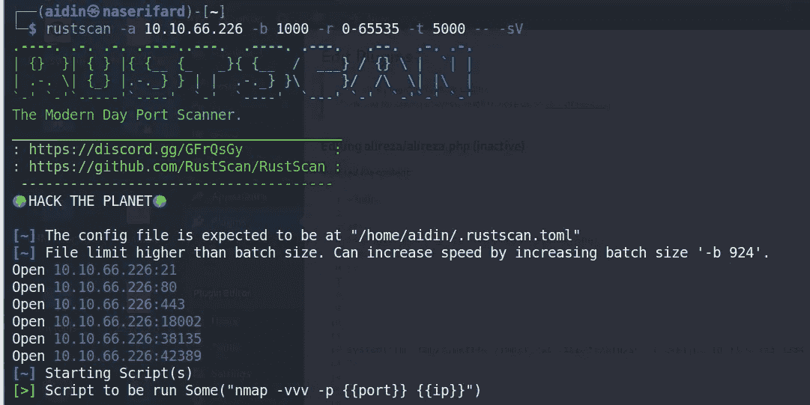

使用 rustscan 进行端口扫描

-答:IP

-b:端口扫描的批量或一次扫描多少个端口。

-r:带有格式开始-结束的端口范围。

-t:假定端口关闭前的超时时间(毫秒)。

-sV:在发现的端口上运行的 nmap 参数。

**rustscan** 找到 6 个端口，并将其馈送给 nmap 扫描。

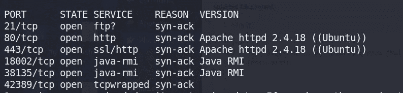

服务枚举

运行 **Apache 的端口 80 和 443。**让我们探索一下端口 80 和 443。

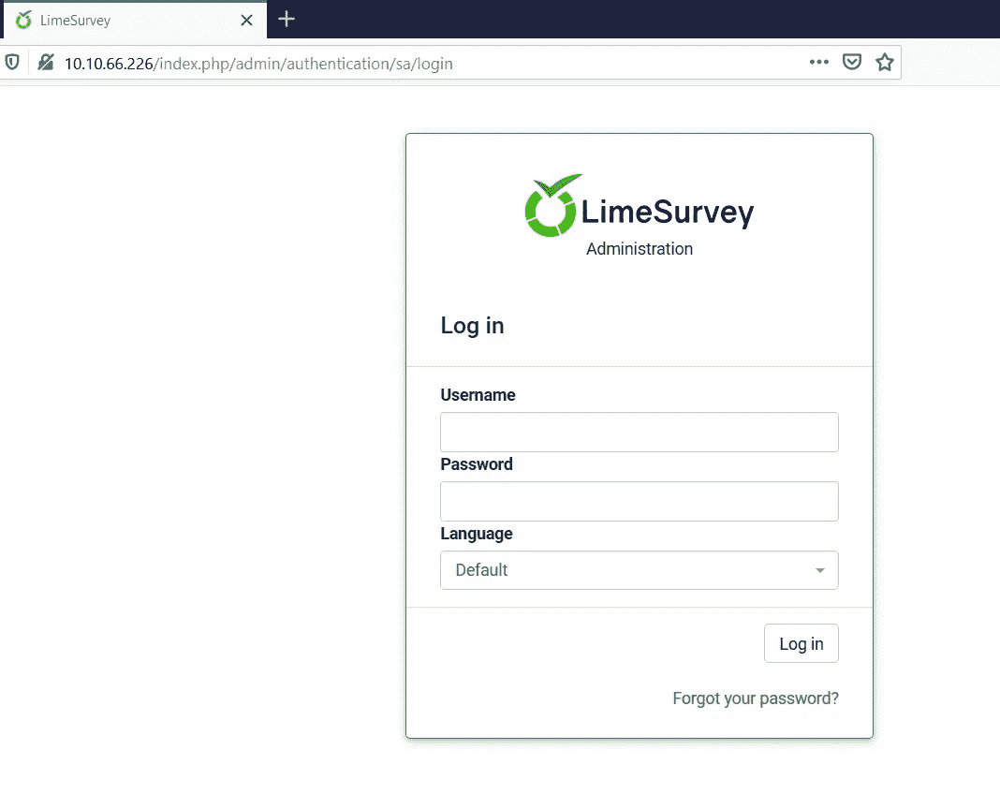

端口 80

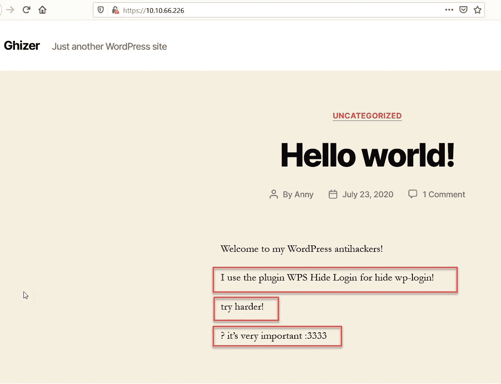

端口 443

端口 80 是一个高级在线调查系统，名为“ **LimeSurvey** ”，端口 443 是一个 wordpress 网站。根据维基百科，LimeSurvey 是一个免费的开源在线统计调查 web 应用程序，基于 MySQL、SQLite、PostgreSQL 或 MSSQL 数据库，用 PHP 编写，在 GNU 通用公共许可证下分发。

现在，让我们尝试使用 **gobuster** 暴力破解 web 服务器中的目录和文件:

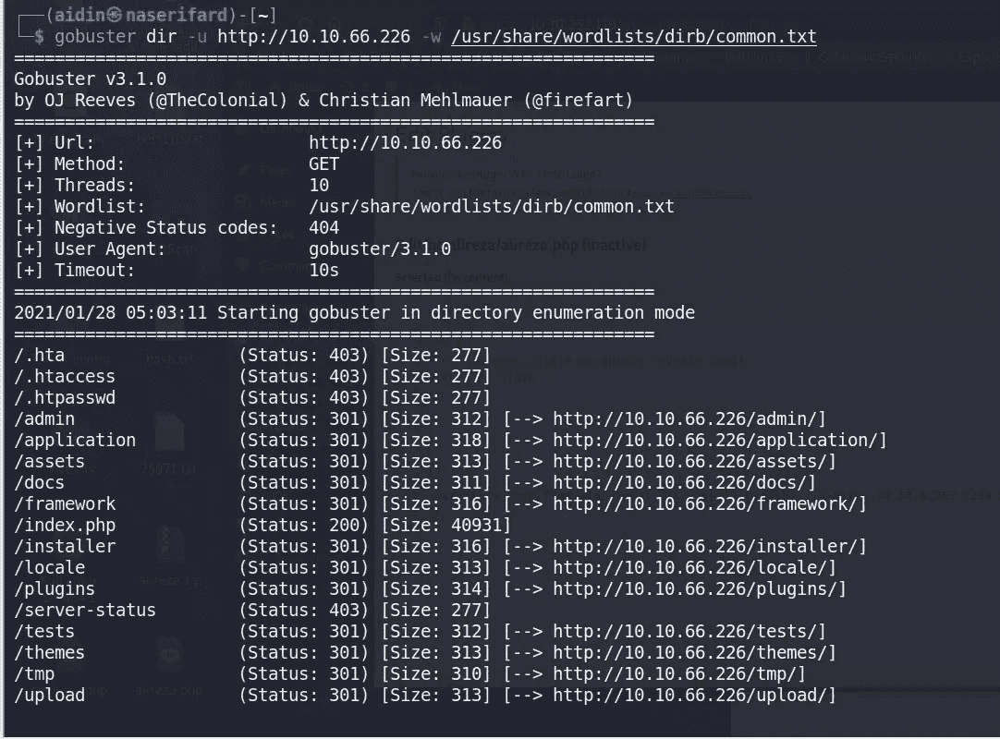

呃，有一个管理目录。我直接进入 admin 目录进行进一步的枚举，并在那里找到了一个登录页面。然后寻找 LimeSurvey 管理页面的默认凭证，得到了一个— > **admin:password。**我试了试，成功登录。

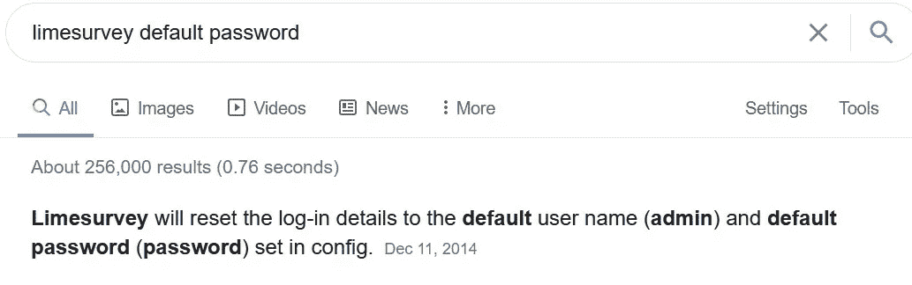

LimeSurvey 默认凭据

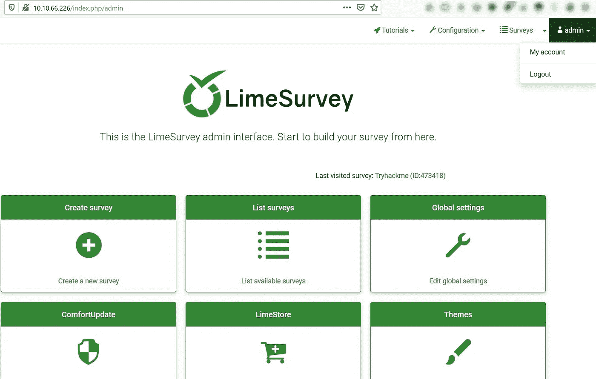

LimeSurvey 管理仪表板页面

我们看到了一个管理控制面板页面，如果你转到页面底部，你可以看到 LimeSurvey 版本是 3.15.9。

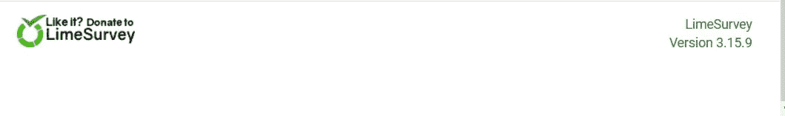

LimeSurvey 版本

我们四处逛逛吧。低于 3.16 的 LimeSurvey 版本的 **RCE** 存在漏洞。让我们下载并分析一下。

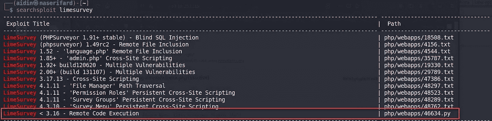

searchsploit

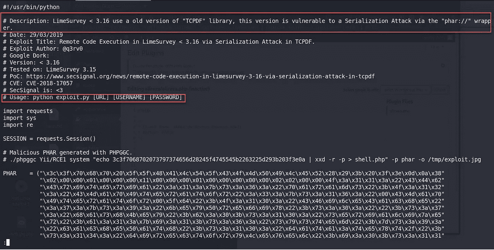

RCE 利用

该漏洞利用是用 Python 编写的，易受攻击的版本通过**“phar://”包装器**受到**序列化攻击**！我运行了漏洞并得到了一个外壳:)

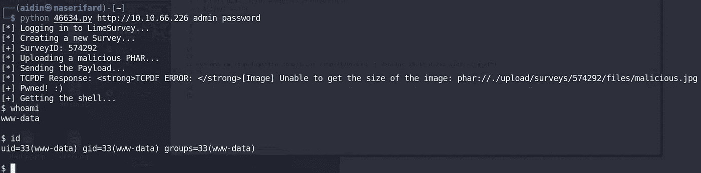

壳

我看到我们是 **www-data** 并且没有访问 **user.txt** 文件的权限。我们不能更改目录，但可以导航到所有目录并查看允许的文件。

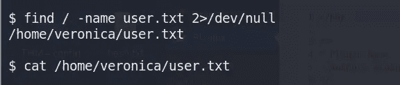

我搜索了 config.php 的 T4，得到了 4 个结果中的一个。

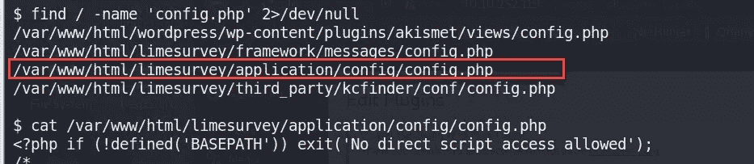

于是查看第三个文件'**/var/www/html/lime survey/application/config/config . PHP**，得到数据库用户名和密码。

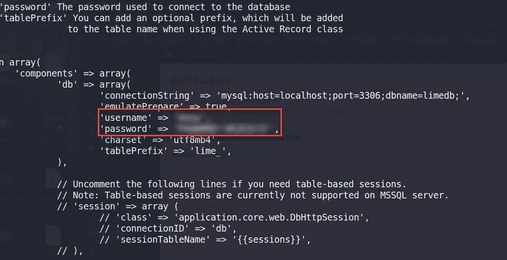

现在，我导航到 [https://target_ip:443](https://targetip:443) 。有个 wordpress 网站打出了这样的横幅:“ ***我用插件 WPS Hide Login 来隐藏 wp-login！”***

点击**登录**按钮重定向到 wordpress 登录页面。

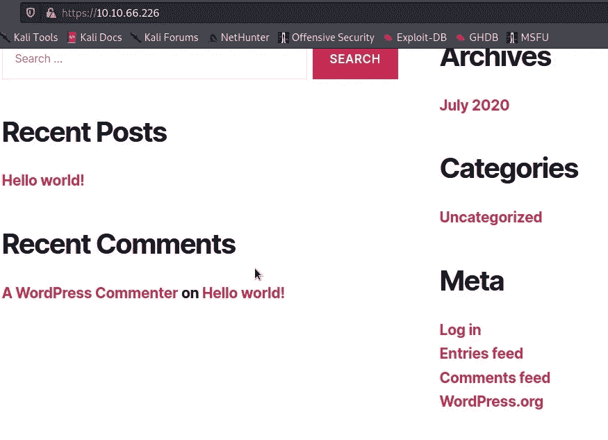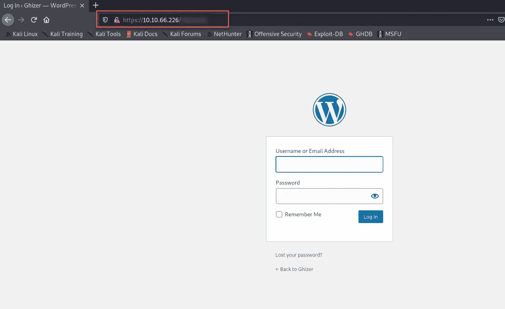

wordpress 登录页面

wordpress 安装的登录路径是什么？:)

现在，使用我得到的凭证，我登录到 WordPress 管理面板:

现在让我们产生一个反向外壳。我实际上使用插件的方式来获得一个反向外壳并压缩它，以便能够上传到插件页面。(你也可以用外观方式得到一个反壳)

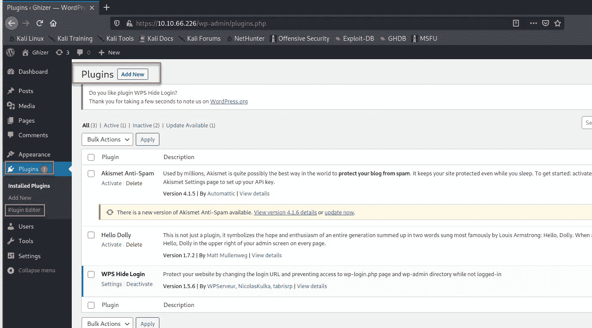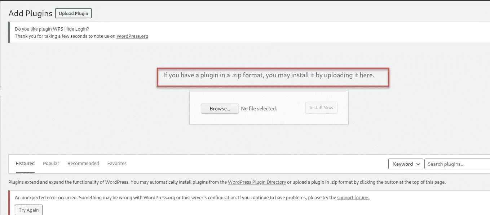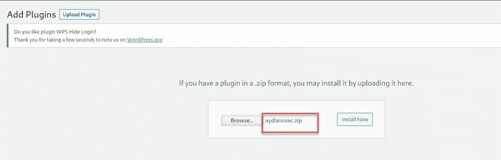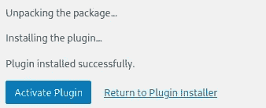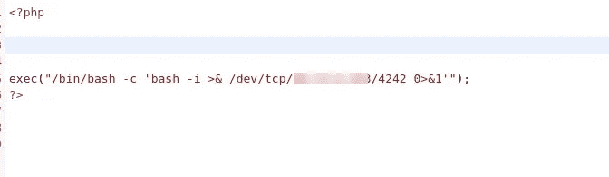

简单 bash 反向外壳

我启动一个 netcat 监听器并点击**激活插件**按钮。现在我有一个反向外壳。

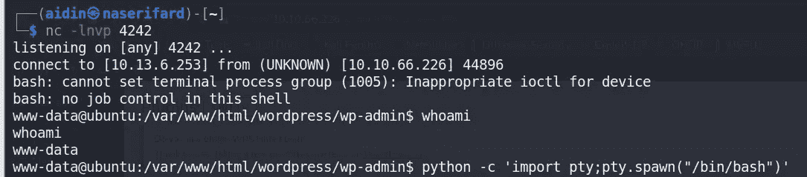

反向外壳

我试着拿到用户档案。但是我仍然没有必要的权限。

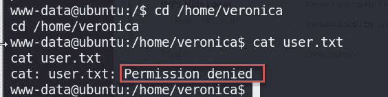

如果您还记得的话，web 服务器上的端口 18001 也是打开的。于是我 Google 了一下，发现了一个有趣的事情: [**Ghidra(调试模式)通过 JDWP 调试端口**](https://github.com/NationalSecurityAgency/ghidra/issues/6) **远程执行代码。**于是我开始找它的 POC，找到了一个 [**的视频**](https://www.youtube.com/watch?v=N3VcWIUpgfE) 。因此，执行这些步骤，我们得到了一个 shell 作为 **veronica** 。

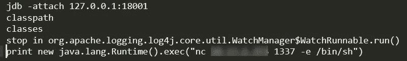

JDWP 调试端口

现在让我们获取 **user.txt** 标志。

反壳为维罗妮卡

我们必须进行权限升级。这个房间里 PrivEsc 的技术是 **python 库劫持。**现在，我们需要以下步骤来执行 root 权限提升:

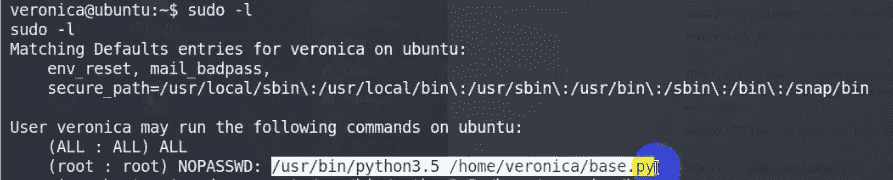

第一步

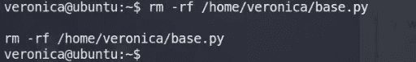

第二步

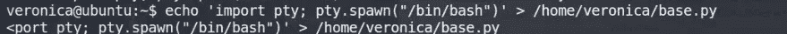

第三步

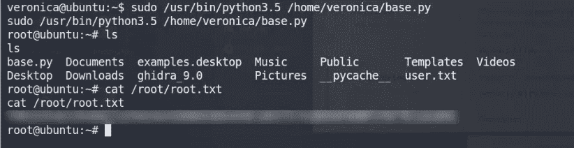

第四步，获取 root.txt

嗯，我们现在是根了！

这个房间真的很棒。快乐黑客…