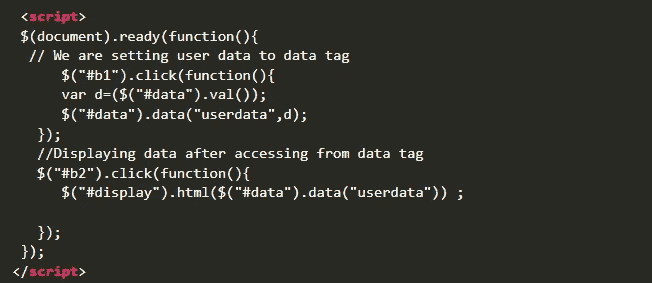

# 超越表面:报酬丰厚的 Vulns

> 原文：<https://infosecwriteups.com/going-beyond-the-surface-vulns-that-pay-well-8f043abda799?source=collection_archive---------1----------------------->

来源:-谷歌

这些天来，虫子赏金猎人已经找到了许多唾手可得的果实，他们中的许多人都想超越这些虫子。这个博客是为那些想要找到一些需要更多观察和时间的高薪 bug 的人准备的。我已经提出了我的方法和想法来找到它们，你可能也想学习一点 JS 和脚本来找到它们。我们来深究一下:)

如果你能很好地观察请求/响应，我会列出 5 种错误/错误类型，这些错误可以帮助你支付账单。我已经找到了很多，当我进入任何应用程序时，我仍然会寻找这些东西。以下是错误类型:-

*   **IDORs**
*   **储存 XSS**
*   **内部 ssrf**
*   **账户接管**
*   **SQL 注入**

**💎idor:-**每个人都在寻找 idor，但是我很确定超过 80%的人只是在寻找数值。但是，IDORs 不止**”？id=12345”。对于 IDORs，你需要观察每一个值，如果我们改变它，它会给你不同的结果。例如，一个普通参数可能是这样的**

**？user=somesusername**

或者一个 JSON 请求看起来像这样

**“邮箱”:“user @ org . com”**

在这里，我们可以做的是将用户名更改为 admin，并尝试是否可以为 admin 获取一些信息。在第二种情况下，将电子邮件地址更改为 admin@org.com，您可能会得到 admin 的结果。我有一个类似的请求，当我把电子邮件地址改为 admin@org.com 时，我可以查看管理员创建的所有用户的电子邮件地址和 SSN 号码。我为这个 bug 支付了大约 1200 美元。

**💎存储的 XSS: -** 在这里，我不是在谈论一个经典的存储的 XSS，你可以在评论区存储一个评论，并为所有用户得到一个弹出窗口。如果您仔细观察，您可以检查所有存储数据的功能，并将它们显示给所有用户。你可以考虑很多可能导致存储 XSS 的情况，由于它们的影响，通常情况下，支出是很大的。在我的情况下，我有一个存储的 XSS，我可以将有效载荷作为广播消息发送给每个人，因为我是管理员，谁收到消息，谁就可以获得 XSS。在西纳克，他们付给我 980 美元。此外，您可以检查**存储的基于 Dom 的 XSS** ，这种情况很少见，但如果检查得当，还是可以找到的。

检查此代码:-

来源:-**[**Geeksforgeeks**](https://www.geeksforgeeks.org/how-to-store-data-in-the-dom/)**

**在这里，如果一个网站正在使用相同的功能，它被存储在服务器端，我们可以继续尝试存储的 Dom XSS。您也可以从 Portswigger 查看这个实验室:- [**存储的 Dom XSS**](https://portswigger.net/web-security/cross-site-scripting/dom-based/lab-dom-xss-stored) **。****

**💎内部 ssrf:-如果你能向他们展示除了端口扫描之外的一些关键东西，内部 ssrf 通常是高回报的 bug。有很多方法可以找到内部 SSRFs。我检查的一些事情是上传一些图像之类的东西，如果数据通过一些位置 URL，我可以尝试我的，检查我是否得到 pingback。此外，PDF 转换器是生成内部 SSRFs 的宝贵资源。基本上，我们试图找出所有的位置，看看我们是否得到任何回应，无论是在我们的服务器或合作者的服务器上。**

**同样，我们也可以在标题中检查它们。有时，我们为 eg. **X-Forwarded-Host** 添加一个外部头，并为其分配 collaborator 有效负载。这些是你可以检查它们的几种方法。**

**💎**账户接管:-** 账户接管有很多种方式，顾名思义，你可以假设这将是一个高报酬的 bug，因为你拥有别人的账户，这是一个明显的商业和 PII 损失。我们有很多关于账户接管的博客，所以快速浏览一下账户接管的一些常用技术**

*   **权限提升**
*   **密码重置**
*   **安全错误配置**
*   **中断的访问控制**
*   **被破坏的认证**

**还有很多方法，但这些是可以用来检查帐户接管的一些方法。**

**💎 **SQL 注入:-** SQL 注入一直是每个 bug 赏金猎人的清单，因为你可以直接进入数据库并从中获取信息。所以，如果你还没有开始寻找，那就开始做吧。我曾经在 Synack 上的同一个程序中进行了 3 次 SQL 注入，每次都获得了大约 3k 美元的接受。所以，SQL 注入总会给你带来丰厚的报酬。然而，现在你不会发现很多基于错误的 SQL 注入，但是基于时间的注入仍然存在，并且人们发现它很多。**

**对于基于时间的 SQL 注入，您必须检查每个带有值的端点，并在那里尝试基于时间的 SQL 注入。它可以是任何你的有效载荷能放进去的东西。所以，要留意端点和参数。**

**您可以随时尝试 Portswigger labs 进行 SQL 注入，相信我，这对刚起步的人非常有帮助。**

**我提到的所有这些错误，在每个应用程序中都可以找到，新的功能和代码实现来了，它们在其中出现了很多。你唯一需要做的就是花大量的时间去观察它们，你可能会在一个高潮中结束你的一周/一个月:)**

**这将是这个博客，我希望你能从中有所收获。如果你做了，分享给社区，让人们也能学到一些东西。我会把我用过的资源放在这个博客里，这样你就可以去看看了。**

**黑客快乐！**

**和平:)**

****Portswigger SQL 注入实验室:** [**点击这里**](https://portswigger.net/web-security/sql-injection)**

****了解存储数据的 DOM:-**[**点击这里**](https://www.geeksforgeeks.org/how-to-store-data-in-the-dom/)**

****基于 XSS 存储的 Dom:-**[**点击此处**](https://portswigger.net/web-security/cross-site-scripting/dom-based/lab-dom-xss-stored)**

****Hackerone 报告账户接管:**[**1**](https://hackerone.com/reports/314808)**[**2**](https://hackerone.com/reports/1074047)**[**3**](https://hackerone.com/reports/1175081)******