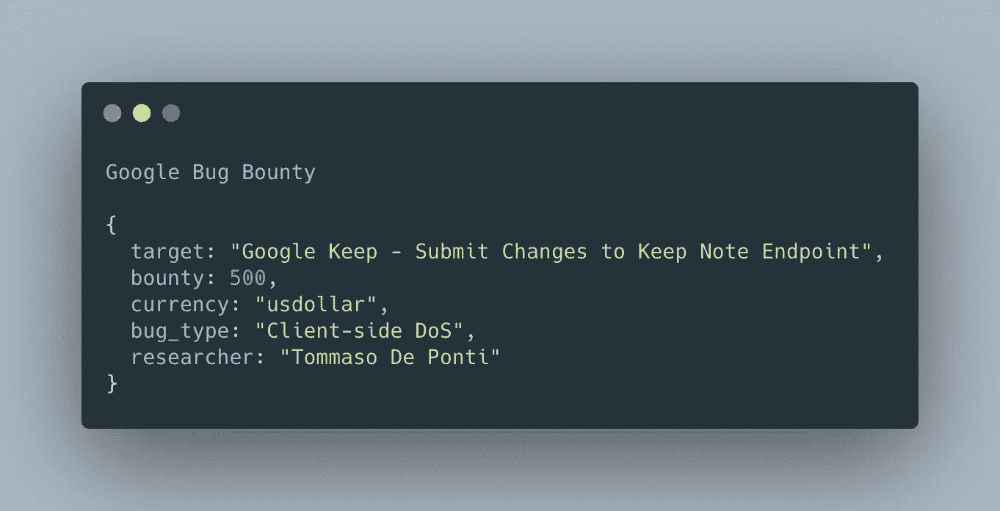
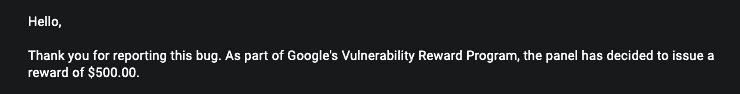

# Google Bug 赏金:Google Keep 上价值 500 美元的客户端 DoS

> 原文：<https://infosecwriteups.com/google-bug-bounty-500-worth-client-side-dos-on-google-keep-35aab6aef279?source=collection_archive---------1----------------------->

## 一篇关于 Keep 上的客户端 DoS 的文章，允许我阻止任何用户访问他们的 keep notes

[ [好友链接](/google-bug-bounty-500-worth-client-side-dos-on-google-keep-35aab6aef279?sk=6662ba65bc74173f64256f96ec27e598)对于没有订阅的用户]

嘿，那些关注我和跟踪我的工作的人(如果有的话)知道我已经有一段时间没有发布我的发现了(我最近没怎么打猎)，是时候解决这个问题了！

今天，我将与大家分享一个简单的链接了 Google Keep notes 功能的有效负载是如何让我阻止任何 Google 用户访问其 Keep notes 的。

此外，我将分享更多我的发现(我怀念写文章的日子),并开始在推特上发布关于网络安全和 Bug Bounty 的帖子。

请继续关注 Vale、Wickr、Acronis、Basecamp 等网站，了解更多关于甜虫子的信息。

> 为什么这么有影响力的 bug 只要 500 美元？这些天 DoS 甚至很少被接受，我是“*幸运”*他们奖励了我。

# 虫子

在测试时，我注意到 Keep 有一个注释中可以包含的最大字符数。它有过滤器，以防止攻击者写更多。

我想，如果我能够绕过过滤器，一些伟大的事情可能会发生。我就是这么做的。

经过一点测试，我发现非常特殊的字符`Ⱦ`允许我写更多的内容。这是为什么呢？

我不太清楚，我必须看一下处理服务器端输入的代码，但我确实有一些看法，为什么:

*   处理奇怪的 Unicode 字符串时会出现问题
*   ⱦ有特殊的行为(这就是我使用这个字符的原因):当在服务器端处理并输入小写时，字符的 Unicode 会变成 double。这意味着当ⱦ被提交时，它被客户端计为 1，而被服务器处理为 2，然后服务器在 keep 上存储 2 个ⱦ。这意味着，如果我发送 1000 个ⱦs，它们将作为 2000 个ⱦs.存储在 keep 上

含有大量ⱦ字符的便笺会导致 Keep 应用程序崩溃(在手机和桌面上都是如此)。

# 具有 Keep 功能的链接具有更多攻击面

这对我来说是一个游戏规则的改变，让我的报告得到了奖励。您可以在 Keep 上共享笔记。您不必同意打开它们，只要我与您分享它们，它们就会显示在您的保留页面上。

这意味着我只需要与一个邮件地址共享带有 DoS 有效负载的注释，并且与该邮件地址相关联的 Keep 帐户被阻止。

# 时间表

2021 年 2 月 26 日下午 8 点 23 分—已报告

2021 年 3 月 1 日中午 12 点 22 分—分庭

2021 年 3 月 5 日下午 5 点 23 分—已验证

2021 年 3 月 9 日下午 6 点 20 分——奖励 500 美元

此外，不要忘记在 Twitter 上与我联系，我刚刚开始发布关于加密、编程和 Bug 赏金的帖子！