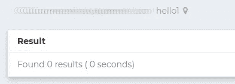
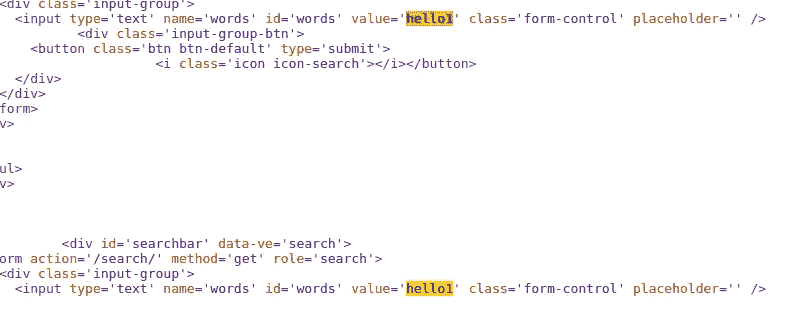
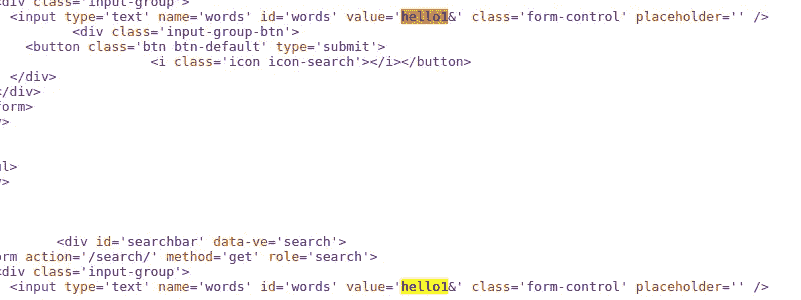
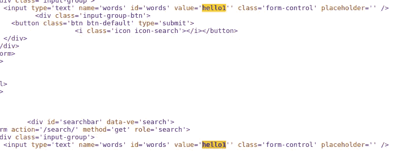
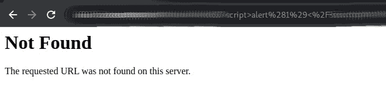
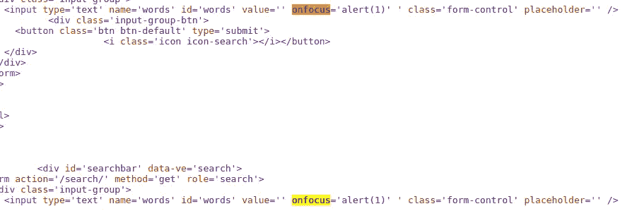
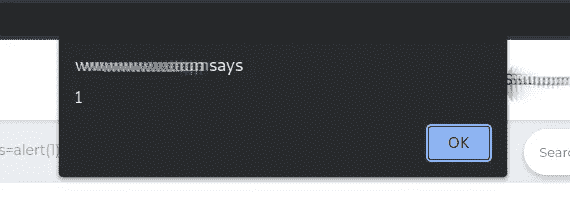
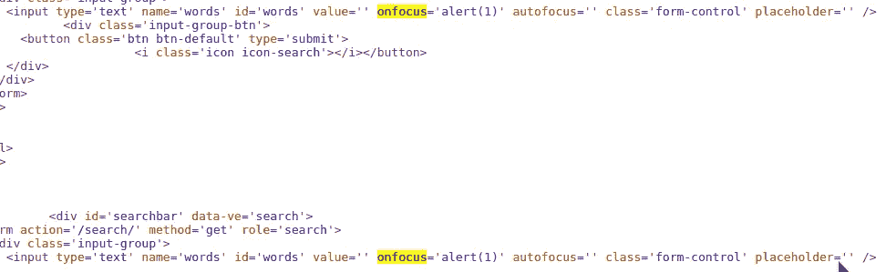
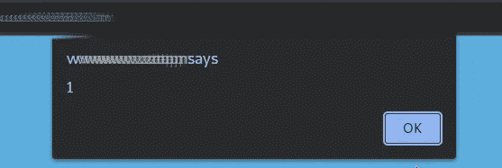
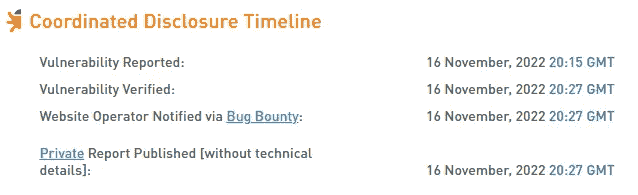

# 使用双重编码反射 XSS

> 原文：<https://infosecwriteups.com/got-another-xss-using-double-encoding-e6493a9f7368?source=collection_archive---------0----------------------->

## 使用双重编码绕过 XSS 滤波器

你好黑客们，

最近，我开始了我的 bug 狩猎之旅，并通过绕过 Cloudflare WAF 获得了一个 XSS(你可以在这里阅读相关内容)。现在我带着另一个由[双编码](https://owasp.org/www-community/Double_Encoding)的 XSS 回来了。

> 这种攻击技术包括以十六进制格式对用户请求参数进行两次编码，以绕过安全控制或导致应用程序出现意外行为。这是可能的，因为 web 服务器接受并处理许多编码形式的客户端请求。

直接进入它…

有志者事竟成。像这样如果有输入字段，就有 ***的机会*** 的跨站脚本。目前，我正在使用非常基本的方法，同时试图通过学习更多的方法和错误来发现错误和提高自己。在检查一些目标和测试输入字段(比如搜索框)时，我得到了一个有趣的输入字段，我只是输入了通常的输入

搜索栏

并检查了源代码。

源代码

然后我添加了一个单引号，但它过滤了输入，并用*hello 1&amp；*在某些地方，在我们的目标字段中带有“&”。

我在那里尝试了 URL 编码，然后也得到了相同的输出，这意味着它解码了输入。

所以我用了[双编码](https://owasp.org/www-community/Double_Encoding)。
通过使用双重编码，可以绕过只对用户输入解码一次的安全过滤器。第二个解码过程由适当处理编码数据的后端平台或模块执行，但没有相应的安全检查。

它工作了。

然后我们的基本有效载荷' >用双编码试了试。

> % 25281 % 2529 % 253C 脚本%253E 警报% 25281 % 2529 % 253C %脚本%253E

但是它产生了一个错误

我搜索了输入标签的属性来利用它。
[onfocus](https://www.w3schools.com/jsref/event_onfocus.asp) :当一个元素获得焦点时发生 onfocus 事件。

onfocus='alert(1)'

> %2527%2520 焦点% 2529 % 2527 警报%25281%2529%2527%2520

我点击搜索栏，弹出警告出现了。

但是我想用 autofocus 对它做一点修改，使文本字段在页面加载时自动聚焦，并在访问页面时创建弹出警告。

onfocus='alert(1)' autofocus= '

> % 2527% 2520 onfocus % 253d % 2527 alert % 25281% 2529% 2527% 2520 auto focus % 253d % 2527

XSS

是啊。成功了…

OpenBugBounty

您还可以使用有效负载，如

onmouseover='alert(1)'

> % 2527% 2520 onmouseover % 253d % 2527 alert % 25281% 2529% 2527% 2520

感谢您的阅读…

# 跟我来:

推特:[https://twitter.com/ag3n7apk](https://twitter.com/ag3n7apk)

领英:【https://www.linkedin.com/in/abhijith-pk-ag3n7/ 

## 来自 Infosec 的报道:Infosec 每天都有很多内容，很难跟上。[加入我们的每周时事通讯](https://weekly.infosecwriteups.com/)以 5 篇文章、4 个线程、3 个视频、2 个 GitHub Repos 和工具以及 1 个工作提醒的形式免费获取所有最新的 Infosec 趋势！