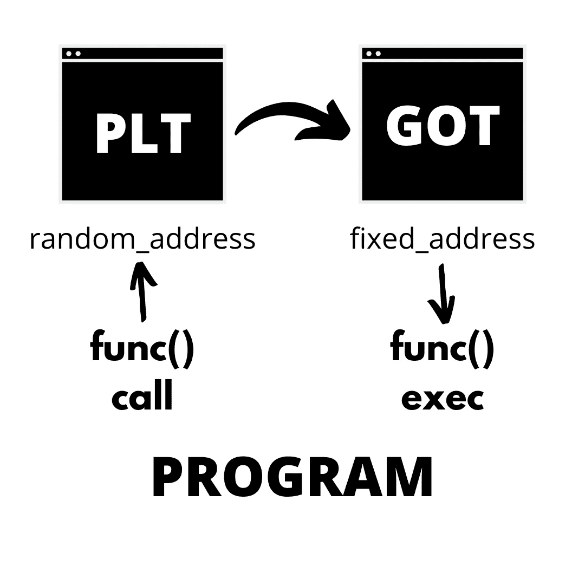
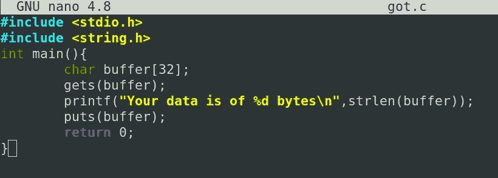
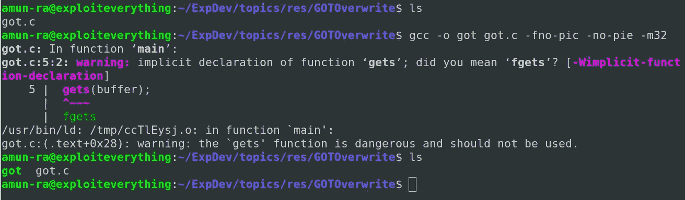
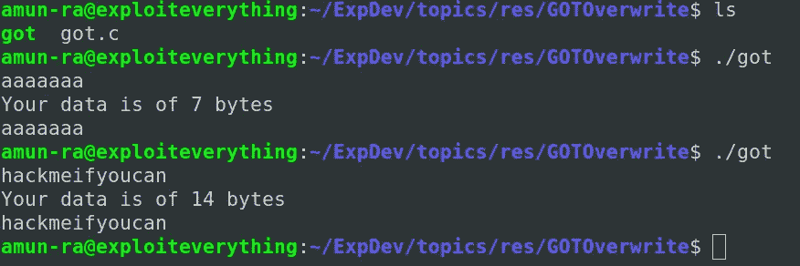
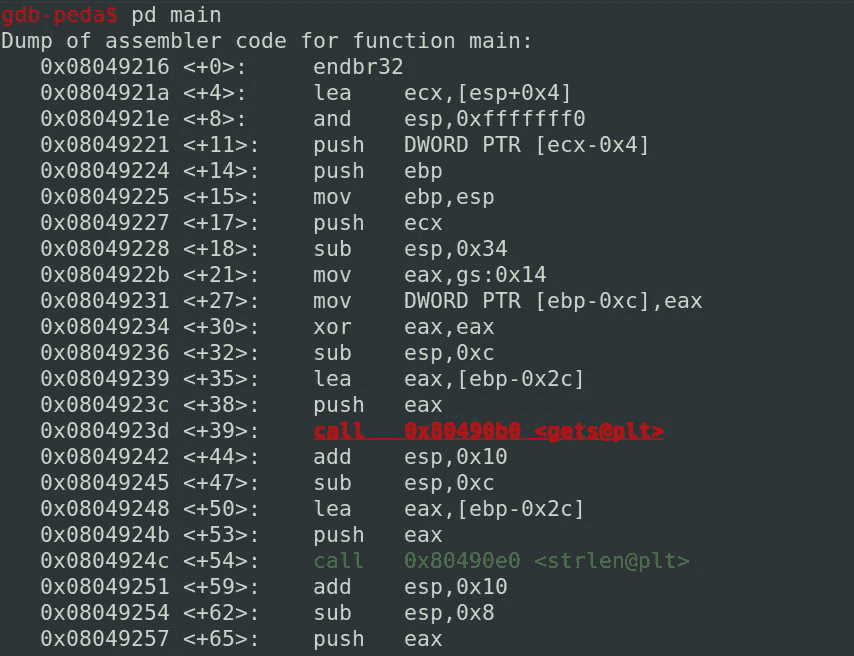
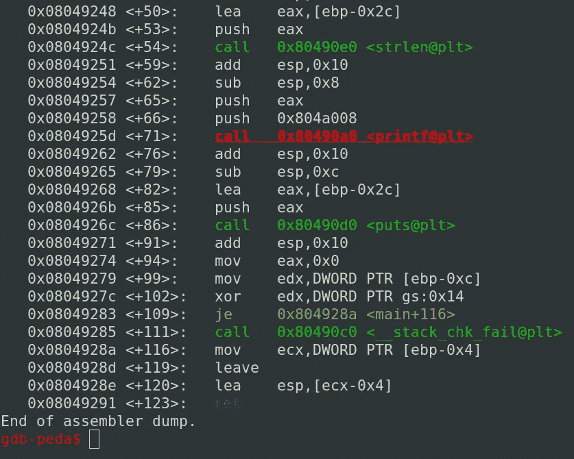
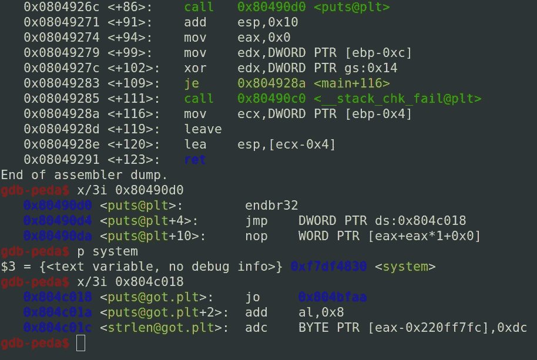
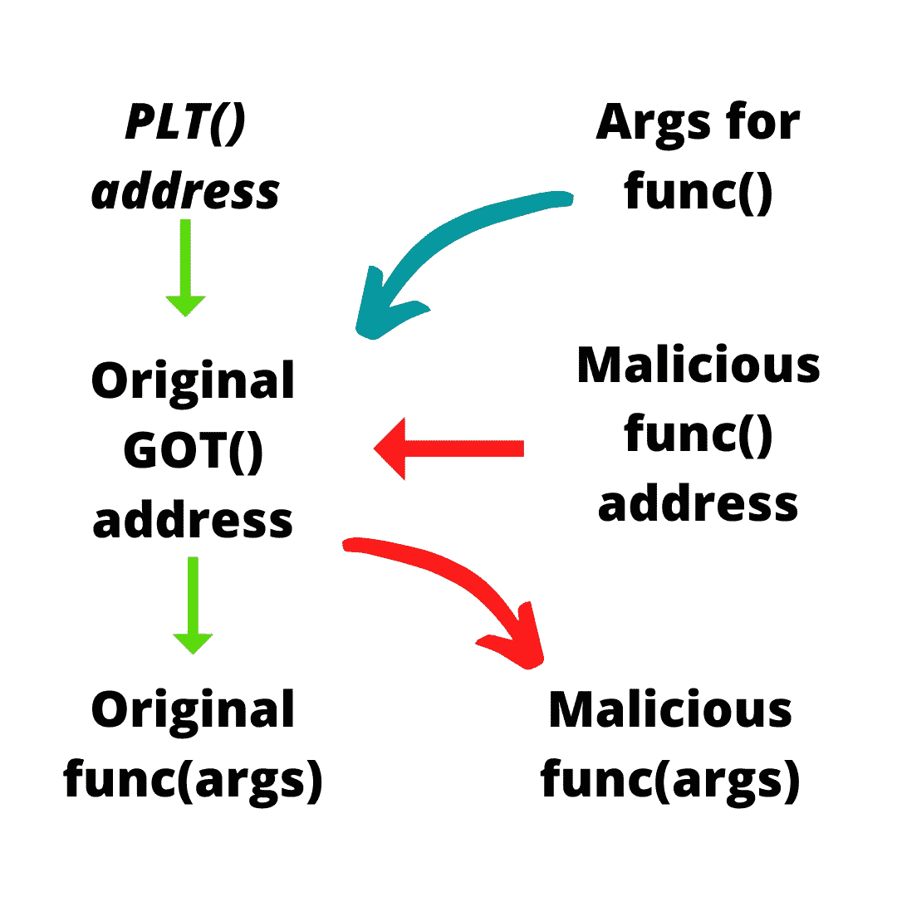

# 被覆盖

> 原文：<https://infosecwriteups.com/got-overwrite-bb9ff5414628?source=collection_archive---------3----------------------->

# 使用简单的 get 覆盖生成 SHELL


# 了解基础知识:

# 过程链接表

过程链接表(PLT)是一个“只读”部分

它负责在程序运行期间和之后调用动态链接器，以解析所请求函数的地址

在编译过程中，我们不能提及这些地址，因为每个系统的函数地址都是未知的，共享对象也是不可用的

因此，PLT 在运行时解析这些函数地址时起着至关重要的作用

PLT 表比 GOT 表大得多

每个程序/二进制文件都有自己的 PLT 表，只对自己有用

当请求符号解析时，调用函数向 PLT 发出请求，并将 GOT 的地址推入处理器寄存器

这就是如何通过二进制文件调用共享库函数来执行它们想要的功能

# 全局偏移表(GOT)

在编程运行时，动态链接器弹出全局偏移表(GOT)

动态链接器获得被请求函数的绝对地址，并根据请求更新得到的地址

文件不需要重定位，因为 GOT 从过程链接表(PLT)中获取位置请求

许多函数在运行时不会被解析，只有在第一次调用被请求的函数时才会被解析

这是一个被称为“惰性链接”的过程，可以节省资源

一旦函数的 PLT 地址与程序中函数的 GOT 地址链接，程序就可以借助 PLT-GOT 翻译直接从库中调用特定的函数

# PLT-GOT 的工作



# 被覆盖

GOT 重写是一种二进制开发技术，其中函数的 GOT 地址被替换为我们想要的函数的地址

假设我们将在程序中调用“printf()”

当程序中的“printf()”被调用时，它首先检查 PLT 表

在检查“printf()”函数的 PLT 表时，它寻找“printf()”的 get 地址来运行该函数，以便可以从库中直接调用“printf()”

如果我们用另一个期望的函数的地址重写了“printf()”的 get 地址

当“printf()”被调用时，它转到 PLT，获取被操纵的 get 地址，并执行我们想要的函数

“printf()”所需的参数也将传递给我们想要的函数

这就是我们如何覆盖得到的值来执行我们想要的功能

# 剥削

让我们用这个源代码执行 GOT 覆盖



这里使用了简单的函数，如 gets()、puts()、strlen()

这个程序不做任何复杂的运算，只是一个简单的程序

让我们编译这个程序



现在，让我们试着正常执行这个程序



用 GDB-PEDA 反汇编程序



这里我们可以看到许多函数都是使用 PLT 表调用的

现在让我们检查“puts()”的 PLT 地址


这里 0x80490d0 是“puts()”的 PLT 地址值

要获得“puts()”的 get 地址，让我们检查“puts()”的 PLT

每个 get 都需要从 PLT 调用

查看 JMP 指令

“puts()”的 get 地址是 0x804c018

现在让我们将“puts()”重定向到“system()”

要查找“system()”地址



是时候用“system()”的地址设置“puts()”的 get 了

如果我们重写，每当“puts()”被调用时，“system()”就会执行

在操作了 get 地址之后，我们将使用“gets()”将数据传递到“buffer”中

在我们的实际程序中“puts(buffer)”是被传递的，所以它将打印来自“buffer”的数据

来自“buffer”的数据作为参数传递给“puts()”

因为我们用“system()”重写了“puts()”，所以来自“buffer”的参数将被传递到“system()”



这是一个潜在的 RCE

因此，如果我们将“/bin/sh”作为参数从“buffer”传递到“system()”

它的工作原理是

```
system("/bin/sh");
```

为我们打开外壳


因此，在这个简单的程序中，执行 get 覆盖来生成 shell

## GitHub Repo 中提供了漏洞利用示例

## [aiden peace 369](https://github.com/AidenPearce369/ExploitDev)