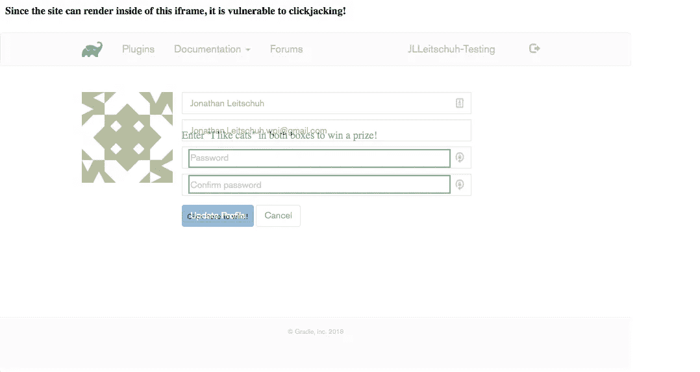
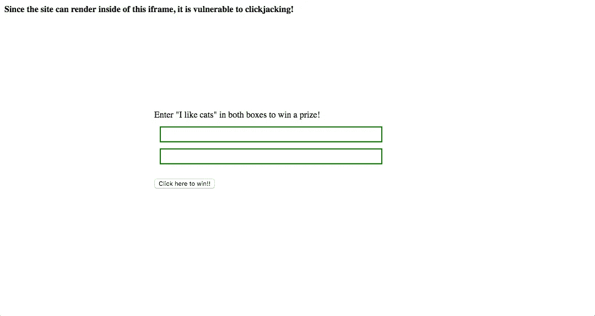
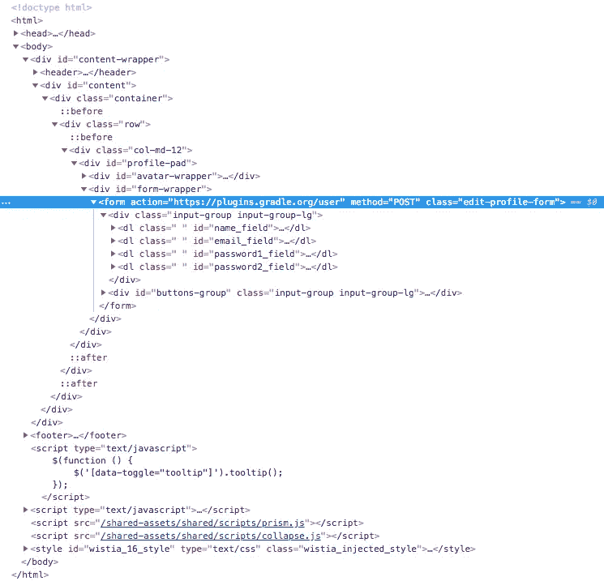
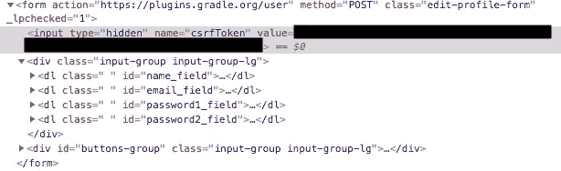

# Gradle 插件门户:点击劫持和跨站请求伪造启用帐户接管

> 原文：<https://infosecwriteups.com/gradle-plugin-portal-clickjacking-cross-site-request-forgery-enabling-account-takeover-d65c2e43082b?source=collection_archive---------0----------------------->


## Gradle 插件门户中的两个安全漏洞将允许任何网站更改任何登录插件作者的用户名、电子邮件和密码。

**责任披露:**2018 年 10 月 22 日
**漏洞** **已修补:**2018 年 10 月 31 日
**披露发布:**2019 年 1 月 9 日

# 点击劫持

> 点击劫持，也称为“UI 补救攻击”，是指攻击者使用多个透明或不透明层来欺骗用户点击另一个页面上的按钮或链接，而他们本打算点击顶级页面。因此，攻击者“劫持”了对其页面的点击，并将其路由到另一个页面，很可能是另一个应用程序、域或两者所拥有的页面。
> 
> 使用类似的技术，击键也可以被劫持。通过精心制作的样式表、iframe 和文本框的组合，用户可以相信他们正在键入他们的电子邮件或银行帐户的密码，但实际上是在攻击者控制的一个看不见的框架中键入。
> - [OWASP 点击顶升](https://www.owasp.org/index.php/Clickjacking)

## 发现

我最近对软件安全捕获旗帜(CTF)挑战产生了兴趣。在浏览 YouTube 时，我偶然发现了这个[机器人 CTF 先生黑客演练](https://youtu.be/0VJyfJzbPE4)，在那里我了解到一个叫做 [Nikto](https://cirt.net/Nikto2) 的有趣工具。Nikto 是一个简单的实用程序，您可以使用它来扫描 web 域中已知的安全漏洞。我之前在 Gradle 插件门户中发现了一个[安全漏洞，所以我决定在 Gradle 插件门户上运行它。](https://medium.com/@jonathan.leitschuh/leveraging-gradle-plugin-wildcard-versions-for-remote-code-execution-24e15112c432)

在本文详述的攻击都被修补之前，Nikto 的输出

让我印象深刻的一句台词是:

```
The anti-clickjacking X-Frame-Options header is not present.
```

我在大学时了解了点击劫持漏洞，甚至报告了我在以前的雇主那里做网站开发实习生时发现的一个漏洞。对于那些不熟悉标题`X-Frame-Options` 的人，这里有一个描述。

> `***X-Frame-Options***` [HTTP](https://developer.mozilla.org/en-US/docs/Web/HTTP) 响应头可用于指示是否允许浏览器在`[*<frame>*](https://developer.mozilla.org/en-US/docs/Web/HTML/Element/frame)`、`[*<iframe>*](https://developer.mozilla.org/en-US/docs/Web/HTML/Element/iframe)`或`[*<object>*](https://developer.mozilla.org/en-US/docs/Web/HTML/Element/object)`中呈现页面。网站可以利用这一点来避免[点击劫持](https://en.wikipedia.org/wiki/clickjacking)攻击，确保它们的内容不会嵌入到其他网站中。
> -[MDN web docs X-Frame-Options](https://developer.mozilla.org/en-US/docs/Web/HTTP/Headers/X-Frame-Options)

## 概念证明(POC)

这很有趣。我想出了一个快速的 POC，演示了一个点击劫持攻击，可以利用它来攻击 Gradle 插件门户。
为了让这种特殊的 POC 攻击生效，插件作者必须登录到他们的插件门户帐户。然而，一个恶意的和精心制作的网站可能会额外使用 clickjacking 来让插件作者在不知情的情况下登录他们的帐户，如果他们还没有登录的话。

下面是这种攻击在一个试图利用已经登录的插件作者的“真实”网站上的表现。



不透明度设定为 0.5 的攻击示例



不透明度设置为 0 的攻击示例

## 披露和修复

这个问题很快被披露给了 Gradle 团队。他们已经使用已弃用的[和仍然安全的`X-Frame-Options`标题修补了这个问题。](https://tools.ietf.org/html/rfc7034#section-1)

在我发现第一个漏洞的那天晚上，我正在和 Gradle 团队讨论这次攻击的安全含义。他们向我提到插件门户目前不依赖于 javascript。在这一点上，我实际上还没有查看网站上的任何代码，但是这条信息立即促使我开始查看网站上表单提交框的 HTML。

这导致我在那天晚上发现了第二个也是更糟糕的安全漏洞。

# 跨站点请求伪造(CSRF)

> 跨站点请求伪造(CSRF)是一种攻击，它迫使最终用户在他们当前已通过身份验证的 web 应用程序上执行不需要的操作。CSRF 攻击专门针对状态改变请求，而不是窃取数据，因为攻击者无法看到对伪造请求的响应。在社会工程的一点帮助下(例如通过电子邮件或聊天发送链接)，攻击者可以欺骗 web 应用程序的用户执行攻击者选择的操作。如果受害者是普通用户，成功的 CSRF 攻击可迫使用户执行状态更改请求，如转移资金、更改电子邮件地址等。如果受害者是一个管理帐户，CSRF 可以危及整个网络应用程序。
> 
> …
> 
> CSRF 是一种欺骗受害者提交恶意请求的攻击。它继承受害者的身份和特权，代表受害者执行不希望的功能。对于大多数站点，浏览器请求自动包括与站点相关联的任何凭据，如用户的会话 cookie、IP 地址、Windows 域凭据等。因此，如果用户当前通过了站点的身份验证，站点将无法区分受害者发送的伪造请求和合法请求。
> - [OWASP 跨站请求伪造](https://www.owasp.org/index.php/Cross-Site_Request_Forgery_(CSRF))

## 发现

如果你打开 Gradle 插件门户[用户管理页面](https://plugins.gradle.org/user)，你会看到一个允许你更改用户名、电子邮件和密码的表单。打开 Chrome 开发工具，你可以看到这是一个 HTML 表单元素。您会注意到这个表单不包含任何作为表单 HTTP POST 请求的一部分发送的身份验证令牌。这意味着服务器完全依赖浏览器的会话 cookies 来为该请求提供身份验证。这是一个很好的迹象，表明页面容易受到 CSRF 的攻击。



修补前 Gradle 插件门户的 HTML

## 概念证明(POC)

为了测试 CSRF，我将整个表单元素从 Gradle Plugin Portal 源代码复制到我自己的 HTML 文档中。清除了格式/样式元素后，我只剩下一个包含表单的 HTML 文档。在我的电脑上用浏览器打开这个 HTML 文档，我设置了一个不同的用户名和密码，并点击了“更新配置文件”按钮。


我在恶意网站上更改您的密码表单的概念验证

当我点击“更新个人资料”按钮时，我看到了我的 Gradle 插件门户测试帐户的个人资料页面。我注销并尝试了我刚刚设置的密码。我可以用这个新密码登录了。我刚刚从一个不应该有权限这么做的网站上更改了我的插件门户帐户的密码。

我发送的 POC 源代码是我负责任的披露的一部分。

这里实际发生的是，浏览器理解`form`标签上的`action="https://plugins.gradle.org/user" method="POST"`，当按下`<input type="submit"/>`按钮时，浏览器将 HTML 表单有效载荷作为 POST 发送给`[https://plugins.gradle.org/user](https://plugins.gradle.org/user)`。这里的问题是，浏览器发送有效负载和登录用户的会话 cookies 这意味着服务器认为这是一个经过身份验证的请求，并更新帐户。这种攻击可以完全自动化，除了访问一个恶意站点，只需在文档中添加一个简单的内容，无需用户交互。

```
<body onload="document.forms[0].submit()">
```

## 含义

互联网上的任何网站都可能在他们的网站上嵌入此表单，任何登录到他们的 Gradle 插件门户帐户的 Gradle 插件作者(即使他们早已离开插件门户页面)的帐户都可能很容易受到威胁。这是因为`GRADLE_PORTAL_SESSION_ID`被设置为永不过期。然而，如果插件作者没有登录，恶意网站可能会使用点击劫持让作者不知不觉地点击“登录”按钮。

## 披露和修复

我立即直接向 Gradle 团队报告了这一情况，解释了该漏洞的重要性、严重性和潜在影响。此外，我还提供了讨论如何正确修复这个漏洞的参考资料的链接。如果您现在查看 Gradle 插件门户的源代码，您会看到现在添加了一个新的隐藏表单元素。



编辑配置文件表单上新的隐藏 csrfToken 字段

现在，当这个表单被发送到 Gradle Plugin Portal 服务器时，这个令牌也被检查以确保它是一个有效的令牌。这个`csrfToken` 不可能是由恶意站点生成的，因为它无法访问它所来自的 cookie。

# 结论

两个漏洞都被 Gradle 团队迅速成功修补。然而，这次漏洞披露提供了一个完美的时机来反思我们作为开发人员在日常生活中使用的资源。

## 插件门户对攻击者的价值

Gradle 插件门户对黑客来说是一个非常有价值的目标。如果攻击者想要危害世界各地的数百个软件，或者潜在地危害每一个新开发的 Android 应用程序，那么一个很好的开始就是危害 Gradle 插件门户、Maven Central 或 JFrog 等。如果一个恶意的参与者可以在一个可信的插件作者的指导下将一个恶意的插件放到插件门户上，他们就可以很容易地让他们的代码在世界各地的许多开发者机器和持续集成(CI)服务器上执行。这种攻击的一个简化版本是，恶意行为者在新插件发布后的 7 天内侵入 Gradle 插件作者的帐户，删除现有的工件并上传他们自己的工件。插件作者并不知道他们的工件已经受损，用户的构建系统正在愉快地下载受损的插件。现在，攻击者让他们的代码在软件开发栈中的关键位置执行。更糟糕的是，由于这种恶意代码在构建工件的生产地附近执行，恶意插件可能会将恶意字节码注入到生成的工件中，从而危及全球的 web 应用和 Android 应用。

对构建服务器的攻击以前也发生过，CCleaner 的构建和发布过程的成功入侵就是证明。在公开披露 CCleaner 黑客攻击的[思科 Talos 博客帖子](https://blog.talosintelligence.com/2017/09/avast-distributes-malware.html)中，思科团队写道:“外部攻击者很可能破坏了他们的部分开发或构建环境，并利用该访问将恶意软件插入到由该组织发布和托管的 CCleaner 构建中”。这类攻击的后果可能相当广泛。在 CCleaner 的案例中，他们声称“截至 2016 年 11 月，全球下载量超过 20 亿次，据报道，他们正以每周 500 万的速度增加新用户。”

## 未来的步骤

我已经强烈要求 Gradle 团队尽快聘请专业的渗透测试团队，探索插件入口和构建扫描入口中可能存在的其他安全漏洞。此外，我建议团队探索几个步骤。

*   当插件作者的电子邮件地址/用户名/密码更改时，自动向其发送电子邮件。此外，当他们拥有的插件的新版本被上传时，发送确认电子邮件确认将通知插件作者他们的认证令牌是否已经被泄露。
*   添加对插件门户帐户双因素身份验证的支持，并在登录和更改帐户的电子邮件或密码时要求第二个身份验证因素。
*   在允许设置新密码之前，要求输入插件帐户的当前密码。
*   考虑提供一个臭虫奖励计划。未修复的安全漏洞有一个非常有利可图的灰色市场。有些公司(例如 T2 的 zero dium T3)和政府愿意购买安全漏洞，这样他们就可以为自己的目的所用。这些漏洞通常不会报告给受影响的公司，而是转售给利用它们的个人。Bug bounty 程序已被证明是安全研究人员探索公司产品安全漏洞的有效激励因素。此外，它为负责任地披露安全漏洞提供了另一个市场。
*   雇佣专业渗透测试团队。我知道我在上面陈述了这一点，但是它值得重复。专业渗透测试团队发现自动化工具永远不会发现的安全漏洞。Gradle 插件门户是 Gradle 团队维护的极其宝贵的资产。

# 在 Gradle 中发现了安全漏洞？

安全漏洞应该报告给 security@gradle.com。

## 额外资源

[通过交叉构建注入攻击构建(2007)](https://www.helpnetsecurity.com/dl/articles/fortify_attacking_the_build.pdf)