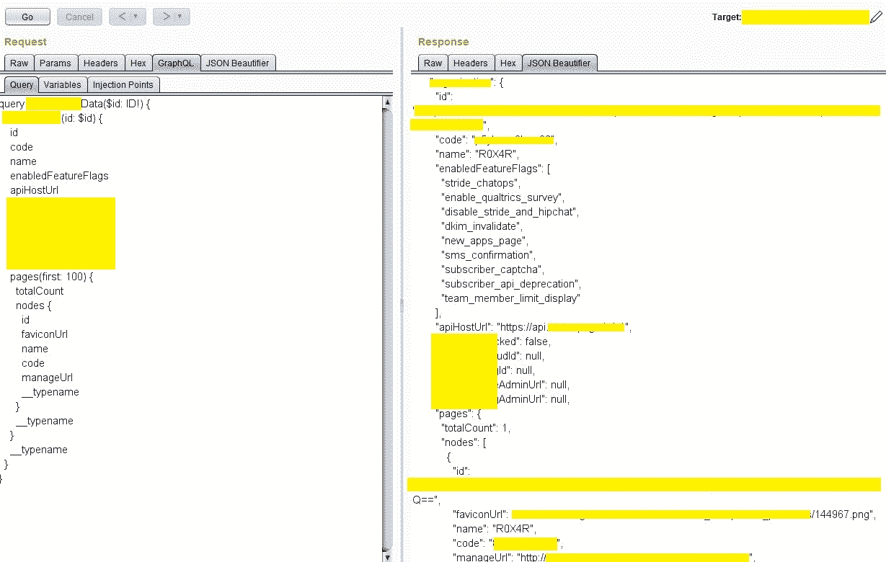

# GraphQL IDOR 导致信息泄露

> 原文：<https://infosecwriteups.com/graphql-idor-leads-to-information-disclosure-175eb560170d?source=collection_archive---------0----------------------->


你好世界！，我是 Eshan Singh 又名 *R0X4R* 。我在这里分享一下我最近对 GraphQL IDOR(不安全的直接对象引用)导致信息泄露的发现。那么，我们开始吧。我正在登录…

**graph QL 是什么？**

GraphQL 基金会定义“GraphQL 是一种用于 API 的开源数据查询和操作语言，是一种用现有数据完成查询的运行时。”如今，GraphQL 正被用来代替 Rest-API。

**漏洞**

在为 redacted.com 做 recon(一个私人项目，根据他们的隐私政策，我不能透露他们的名字)时，我发现这个 web 应用程序正在使用 GraphQL 进行 API 管理。

因此，我首先尝试了内省查询来提取敏感信息。通过查询后，我看到一个名为 Users 的字段，所以我通过了

```
Query: {__type (name: \”Users\”) {name fields{name type{name kind ofType{name kind}}}}}”}
```

在“用户”字段中枚举类型定义的查询，然后我看到“用户”类型包含一些字段，即电子邮件、移动电话号码、用户 id、位置和 api_key。因此，我又传递了一个查询来提取这些字段携带的信息，但是我得到了 403 未授权的响应。

```
Query: {Users{email,mobile_number,user_id,api_key}}
```


来源:[https://imgflip.com/memetemplate/100827024/Sad-meme](https://imgflip.com/memetemplate/100827024/Sad-meme)

所以，我认为这个网络应用程序并不脆弱，所以我开始寻找 XSS。我点击了我的个人资料，然后我编辑了我的名字并截取了请求，然后我看到了一些有趣的东西；在请求新的编辑之前，web 应用程序会提取用户以前的信息。

```
Request: {“operationName”:”CurrentUserData”,”variables”:{“id”:” — base64 encode — “},”query”:”query CurrentUserData($id: ID!) {\n User(id: $id) {\n id\n email\n name\n mobile_number\n apiHostUrl\n SiteAdminUrl\n pages(first: 50) {\n nodes {\n id\n faviconUrl\n name\n code\n manageUrl\n __typename\n }\n __typename\n }\n __typename\n }\n}\n”}
```

因此，我将该请求发送到中继器，在该请求中，有一个名为“id”的变量，它包含 base64 中的内容。所以，我解码了 base64 编码字符串

```
Decode: oph:cloud:redacted::user/p5yhwx30First Account: r0x4r@hhacker.comSecond Account: bcr_rox4r@hacker.com
```

“P5yhwx30”是我的“id”于是，我在 redacted.com 上又创建了一个账号，复制了它的“id:oph:cloud:redited::user/d5mzk1 m2”。


来源:[https://winggo . com/WP-content/uploads/2019/03/happy-memes-make-you-smile-more-02 . jpg？ezimgfmt=ng:webp/ngcb3](https://winkgo.com/wp-content/uploads/2019/03/happy-memes-make-you-smile-more-02.jpg?ezimgfmt=ng:webp/ngcb3)

然后从第二个账号注销，用第一个账号登录。现在我传递相同的查询，但是我用我的第二个“id”改变了我的“id ”,然后嘣！我得到了信息。



来源:[https://me . me/I/oh-yeah-meme-creator-funny-oh-yeah-meme-generator-b 8 BD 2d CFD 4d b 44 bb 961 BCD 638 a4 b 2659](https://me.me/i/oh-yeah-meme-creator-funny-oh-yeah-meme-generator-b8bd2dcfd4db44bb961bcd638a4b2659)

但是有一个问题等待着我，那就是我如何获得另一个用户 id。因此，在枚举之后，我发现其他用户的“id”在他们的个人资料页面源代码中。我只需进入他们的个人资料，查看他们个人资料页面的来源，然后我搜索“var_userID”，我得到了他们的“ID”


来源:[https://media 1 . tenor . com/images/17d 912 fad 3 b 04 c 322 b 0c 2678 ade CCF 97/tenor . gif？itemid=10323706](https://media1.tenor.com/images/17d912fad3b04c322b0c2678adeccf97/tenor.gif?itemid=10323706)

**披露:**

于 2019 年 11 月 15 日向 redacted.com 报告

他们在 2019 年 12 月 7 日奖励了我 3 位数的赏金。

感谢和问候！

埃尚·辛格又名 R0X4R

正在注销…