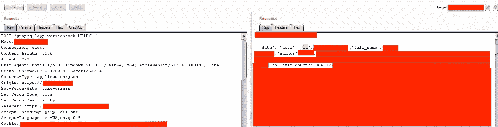

# [graph QL IDOR]泄露数千用户的信用卡信息[外部审计]

> 原文：<https://infosecwriteups.com/graphql-idor-leaking-credit-card-information-of-1000s-of-users-d07eec732979?source=collection_archive---------2----------------------->

嘿大家好

我在搜索一个网络应用程序。该计划是私人的；出于显而易见的原因，让我们假设域是 redacted.com。通过利用两个不同的 Graphql 端点，我能够找到大量信息。

# 正在查找 Graphql IDOR

在对 redacted.com 进行初步调查时，我发现 web 应用程序使用 GraphQL 进行 API 管理。

为了将查询转换成可读的格式，我使用了 graphql raider 扩展，它将 graphql 查询和变量从不可读的 JSON 主体转换成可读的格式，其中查询和变量显示在单独的选项卡中。Graphql raider 提取了' id '变量作为插入点。对此请求的响应包含用户的个人信息，包括信用卡信息。

我创建了两个帐户并检查了 IDOR。该应用程序容易受到 IDOR 的攻击，我可以获得我的另一个帐户的个人信息。

# 发现一个奇怪的功能

ID 变量是一个 12 字符长的字符串，所以我不能猜测/强行取值。我正在寻找一种方法来获得 id 参数，浏览了 burp suite repeater 选项卡，发现了一个令人兴奋的端点。端点获取我的关注列表，响应包含我关注的用户的 id 值和个人资料图片。

当用户在 redacted.com 上创建账户时，用户会自动关注一些公司高管。

当我点击这些高管的关注者列表时，会发送一个 graphql 查询，从用户的个人资料中获取信息，响应包含用户的 ID 和许多用户的个人资料图片。我发现了一个拥有百万粉丝的用户，这也是可以利用的。

# 剥削

我从以下公司高管列表的回复中收集了一个“id”来创建 POC。

我发现 graphql 查询没有抵御暴力攻击的保护措施。在此之后，我使用 bash 脚本获取了 id，并使用 burp 入侵者强行获取了数千用户的敏感数据。

# **披露**

2020 年 12 月 26 日报道

**领英:**【https://www.linkedin.com/in/vipul-sahu-a7a420174/】T4

## 来自 Infosec 的报道:Infosec 每天都有很多内容，很难跟上。[加入我们的每周简讯](https://weekly.infosecwriteups.com/)以 5 篇文章、4 个线程、3 个视频、2 个 GitHub Repos 和工具以及 1 个工作提醒的形式免费获取所有最新的 Infosec 趋势！