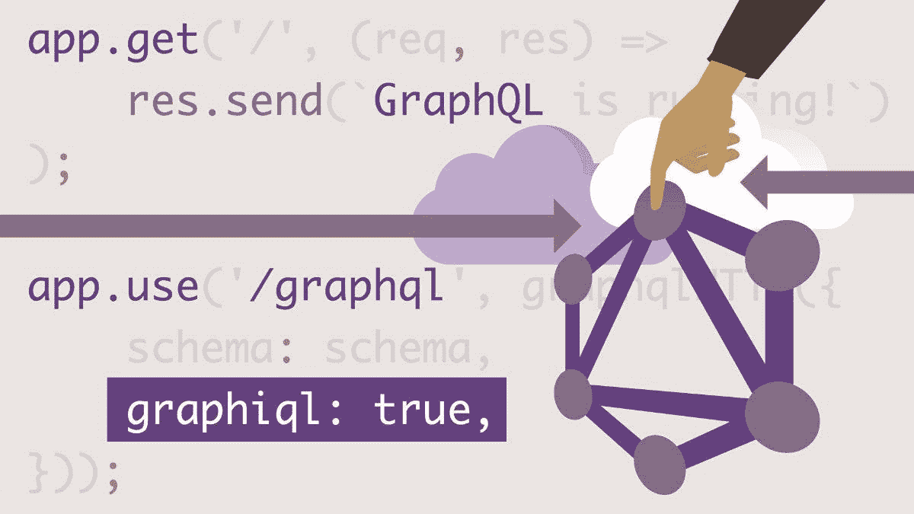
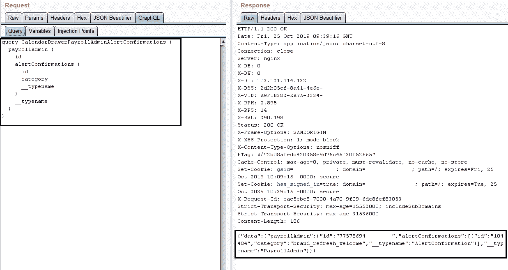
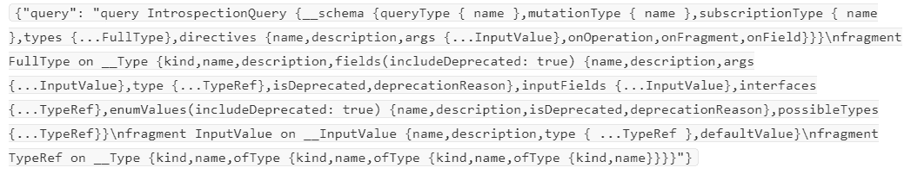
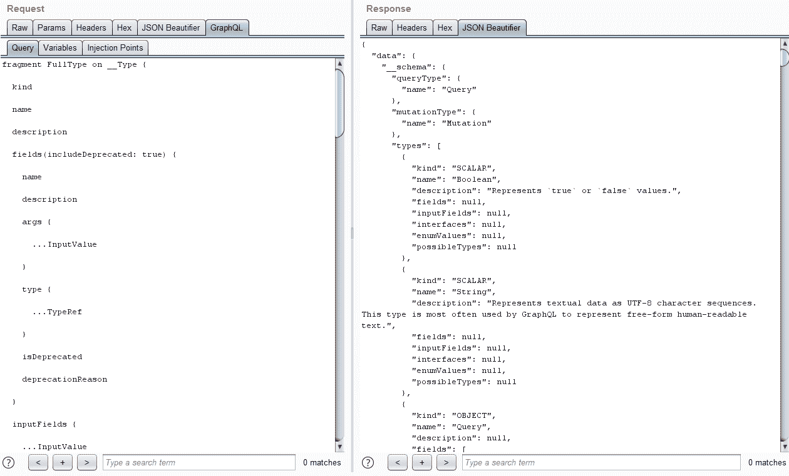

# GraphQL 自省导致敏感数据泄露。

> 原文：<https://infosecwriteups.com/graphql-introspection-leads-to-sensitive-data-disclosure-714f1d9d9d4a?source=collection_archive---------0----------------------->

资料来源:lynda.com

**简介**

你好世界！我是艾山·辛格，又名**T3【R0X4R。我就是你朋友告诉你的那个黑客少年。我侵入网络服务器以确保系统安全。我在这里分享我最近关于 GraphQL 自省的发现。**

**什么是 GraphQL**

众所周知，脸书使用自己的查询语言来正确存储数据。因此，根据 GraphQL.org 的说法，GraphQL 是一种 API 查询语言，也是一种用现有数据完成这些查询的运行时语言。GraphQL 为 API 中的数据提供了一个完整且易于理解的描述，让客户能够准确地了解他们的需求，使 API 更容易随时间发展，并支持强大的开发工具。

**关于此漏洞**

为了发现这个 bug，我花了至少 5-6 个小时学习 GraphQL 的基础知识，并阅读了所有其他相关的 bug 报告，尤其是 Namhamsec 的 GraphQL CTF 挑战赛。

之后在 Bugcrowd 上看到一个新的节目，就参与了。他们给了我一个域【就当域是**example.com**吧，因为漏洞还没修复】，也就是 example.com。所以我在这个域名上建了一个账户，然后解雇了 burpsuite，并为蜘蛛搜索添加了 example.com；10-20 秒后，我看到了 example.com/graphql,，于是我有了 example.com 使用 Graphql 进行 API 管理的想法。

资料来源:almostdumb.com

**我在此使用的工具**

*   硬石膏
*   Burpsuite 扩展—JSON beautiier 和 GraphQL Raider
*   网页浏览器[火狐] :P

**我是如何获得漏洞的**

首先，我注销并再次登录 example.com，然后我进入 ***【更新个人资料】*** 部分，将我的名字从 Eshan Singh 改为 Singh Eshan，并点击保存。然后截取那个请求，并发送给中继器，然后我看到了一些有趣的事情，即

__typename 带有 PayRollAdmin，所以我将其替换为 xyz，然后我再次发送请求，然后检查 xyz 在 PayRollAdmin place 上反映的响应。

因此，为了更深入地挖掘这个问题，我谷歌了 GraphQL 漏洞，然后我看到一个黑客披露了这个漏洞，即[https://hackerone.com/reports/291531](https://hackerone.com/reports/291531)。所以我想让我们试试这个人在这个报告上做的。

我谷歌了自省 GraphQL 有效载荷，我从 PayloadAllTheThings repo:

然后我复制了有效载荷并粘贴到 burpsuite 中的 graphql 选项卡上，发送了请求，然后 walla！我得到了一个有趣的回答。

来源:https://tenor.com/view/omg-oh-my-god-wow-gif-11411674

这种影响

该应用程序基本上由工资单和人力资源使用。所以当我利用它时，我能够检索交易收据和用户密码电话号码等

感谢和问候

埃尚·辛格[R0X4R]

正在注销…