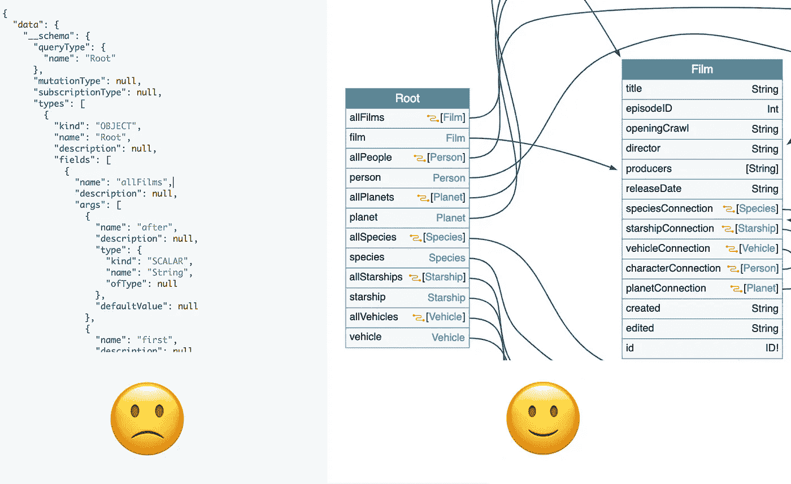

# GraphQL Voyager 作为 API 安全性测试的工具

> 原文：<https://infosecwriteups.com/graphql-voyager-as-a-tool-for-security-testing-86d3c634bcd9?source=collection_archive---------0----------------------->

“航海家”查询的谷歌图片结果之一。图片[来源](https://images.newscientist.com/wp-content/uploads/2017/09/12165539/04._-key-image-4-farthest-publicity-stills-from-film-voyager-float.jpg)。

你面对的是 GraphQL API，想测试它的安全性。但是[自省查询](https://graphql.org/learn/introspection/)给你巨大的不可读的 JSON，web 应用只使用了 GraphQL API 的一部分，当然也没有公开文档。在这种情况下如何理解和测试 GraphQL API？

幸运的是，有一个叫做 [**GraphQL Voyager**](https://apis.guru/graphql-voyager/) 的工具可以可视化 GraphQL 模式。这对理解 GraphQL API 和查找授权漏洞特别有用。

如果您是 GraphQL 的新手，以下是学习它的良好起点:

1.  [https://www.howtographql.com/](https://www.howtographql.com/)—采取互动的方式完成实际任务和里程碑。让您从零开始使用第一个 GraphQL 应用程序。
2.  [https://graphql.org/learn/](https://graphql.org/learn/)—利用文档方法。了解 GraphQL 的特定主题很有好处。
3.  **【upd 04 . 07 . 19】**[https://ctf.hacker101.co](https://ctf.hacker101.com/)m—hacker one 为 GraphQL 创建了两个任务。这是一个尝试航海家号的好地方。名为 BugDB v1 和 BugDB v2 的任务。

# 为什么要使用 GraphQL Voyager？

测试 GraphQL API 的第一步是理解它做什么。通常没有包含文档的网页，因为 GraphQL 是自文档化的。这意味着您可以执行特制的自省查询来获取 GraphQL 模式。Schema 包含所有关于 GraphQL API 的公共信息。

不幸的是，schema 通常以巨大的 JSON 返回，因此需要通过阅读来理解 API。相同模式的可视化表示是完全不同的情况。百闻不如一见:

JSON vs IMAGE

# 如何使用

旅行者号的使用相对简单。例如，让我们得到 [SWAPI GraphQL](https://github.com/graphql/swapi-graphql) 的可视化表示:

*第一步*。获取巧尽心思构建的自省查询:

*   去 https://apis.guru/graphql-voyager/。
*   单击“自定义模式”。
*   点击“复制自检查询”。

*第二步*。对目标 GraphQL 端点执行内省查询:

*   去 https://graphql.github.io/swapi-graphql。
*   将自省查询粘贴到请求中。
*   发出请求。

*第三步*。将获得的 GraphQL 模式复制并粘贴到 Voyager。

步骤 2 可能因目标而异，因为 GraphQL 请求可能以不同的方式实现，但您已经有了一个大致的概念。

# 结论

GraphQL Voyager 是帮助您理解 GraphQL APIs 的伟大工具。它让您全面了解了使用 GraphQL API 可以做些什么。

但是可以通过添加“diff”特性来进一步改进。这个想法是，您可以监视目标的 GraphQL API 中的变化，然后可视化这些变化的差异。这将有助于您快速发现新功能并理解现有功能的变化。

我为航海家的 GitHub 上的 diff 功能创建了一个[问题。您可以通过以下方式为其发展做出贡献:](https://github.com/APIs-guru/graphql-voyager/issues/113)

1.  (简单方法)对[问题](https://github.com/APIs-guru/graphql-voyager/issues/113)进行投票表决。所以开发者会优先考虑它。
2.  (艰难地)动手编写这个特性的代码，因为 GraphQL Voyager 是开源项目。