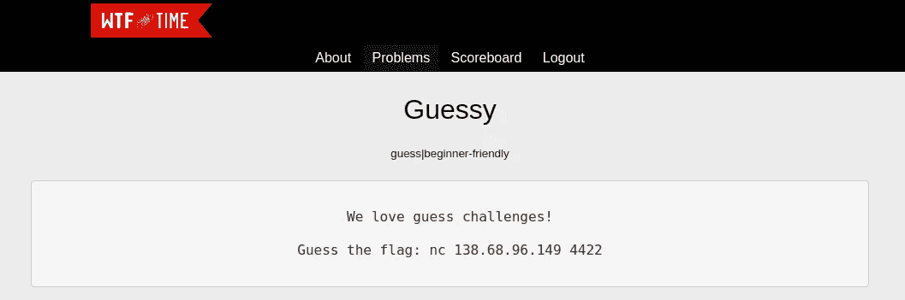
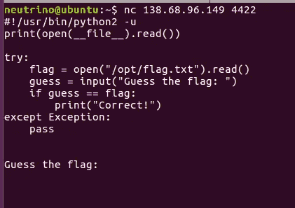
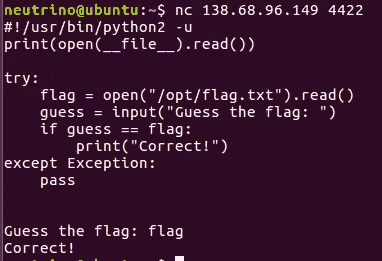
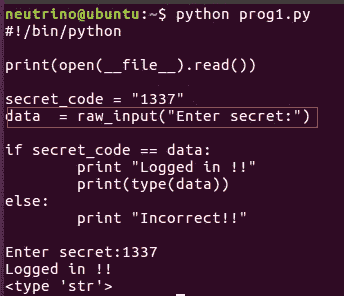
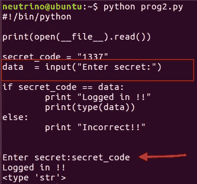
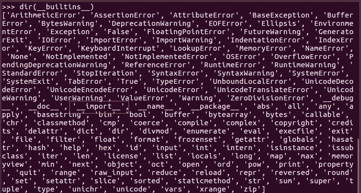
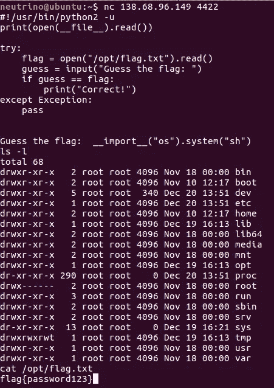

# 猜猜挑战与时间 CTF 写

> 原文：<https://infosecwriteups.com/guessy-challenge-writeup-wtftime-ctf-43417f9caa?source=collection_archive---------0----------------------->

> 我们参加了危险风格的 wtftime ctf。猜谜是杂项类别的挑战之一。我从这个挑战中学到了一个非常微妙但很好的技巧。所以，这篇文章让我们直接进入主题。
> 
> http://wtftime.org CTF 网址:
> 
> https://ctftime.org/event/949[CTF 时间网址](https://ctftime.org/event/949)

挑战陈述

在问题陈述中没有太多的细节，只有一个 IP 和端口使用 nc 连接，也就是给出了一个 netcat。于是，我赶紧连接，看看它输出的是什么。

北卡罗来纳州 138.68.96.149 4422

因此，我们建立了连接，它转储了一个 python 文件，每当我们连接到这个 IP 和端口时，就会执行这个文件。随着我开始理解代码，一些有用的观察是，这是一个 python2 代码，我们可以在第一行中发现。其次，它打印正在执行的文件。然后是 try 块，我们的标志被存储到路径***"/opt/flag . txt "****中的一个文件中，并被加载到一个名为 *flag* 的变量中。现在，通过 input()函数获取用户输入，并与加载的文件变量进行比较。如果您猜中了正确的标志，它将打印“**正确！**"并退出。*

*因此，暴力或猜测正确的标志不可能是这里显而易见的方法。最初我想到了缓冲区溢出的想法，但在这里行不通。我在本地玩了这个脚本，因为我们有完整的代码，有些东西就在我脑海里。我在输入中给出了字符串“flag ”,它正确地打印出来了！*

**

*将字符串标记为输入*

*这很奇怪，因为 flag 显然不是正确答案。所以，一些谷歌搜索和我偶然发现这里发生了什么。*

# *虫子*

*挑战代码中唯一有趣的事情是用于接受用户输入的 *input()* 函数。我知道 python2 中的 input 函数不执行**类型的杂耍**，而是原样接受输入。因此，我们可以给它的字符串，数字，甚至变量名。有意思吧！！鉴于 *raw_input()* 确实执行类型杂耍并将您的输入转换为 **str** 类型。*

**

*原始输入()*

**

*输入()*

*这里，我们在输入中给出了变量名，当它与字符串*“secret _ code”进行比较时，变量名进入 if 循环。*那么*，*现在我们知道我们可以把任何值传递给这个变量，它将在内部被处理。在更多的磕磕绊绊中，我开始了解 python 的内置函数。这是 python 中的一些函数，可以用来执行各种操作。所以，我把它们都打印出来了，其中一个是我们用的:)*

**

*内置函数*

*使用 *__import__* 我们可以在 python 代码中加载模块。从这里开始，这是一个非常直接的挑战。现在，我们可以导入操作系统模块，并在目标上生成一个 shell，并获取标志。*

> *输入的最终有效负载:_ _ import _ _(“OS”)。系统(“sh”)*

**

*拿到旗子*

*所以，这是一个小小的挑战，但它让我学会了 *raw_input()* 和 *input()* 之间的细微差别。希望你也学到了新的东西。总的来说，CTF 非常好。*

***我们的队伍 dark_phoenix 以第 14 名的成绩结束了比赛，来自印度的第一队在积分榜上 xD***

*下次见，祝你愉快:)黑客快乐！！！！*

**关注* [*Infosec 报道*](https://medium.com/bugbountywriteup) *获取更多此类精彩报道。**

* [## 信息安全报道

### 收集了世界上最好的黑客的文章，主题从 bug 奖金和 CTF 到 vulnhub…

medium.com](https://medium.com/bugbountywriteup)*