# CTF 安全指南—获取 Hexy(2021 年 10 月)

> 原文：<https://infosecwriteups.com/guide-point-security-ctf-get-hexy-oct-2021-cd5654b26065?source=collection_archive---------0----------------------->

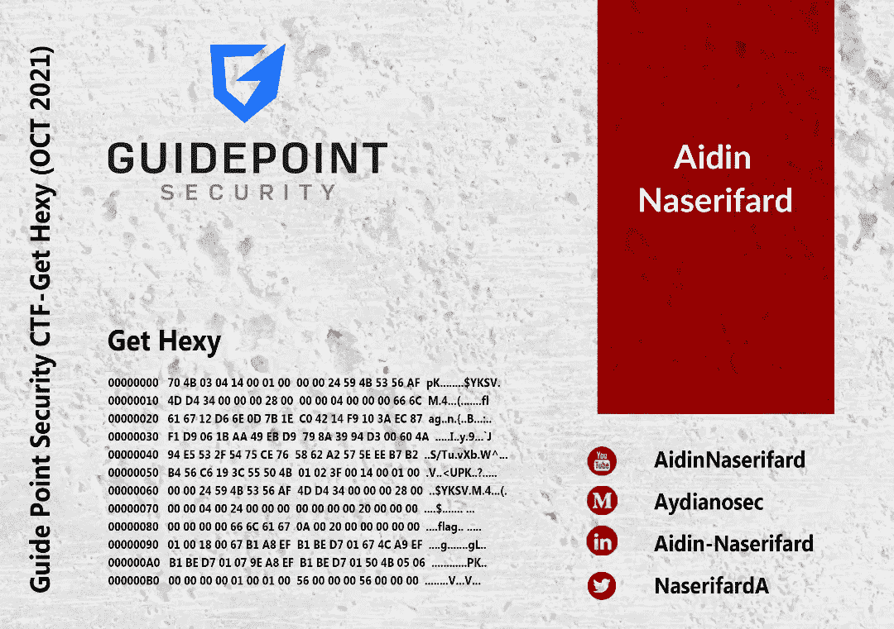

GetHexy-guide point Security CTF 2021 年 10 月

在 2021 年 10 月 12 日至 10 月 18 日进行的**引导点 CTF** 的 **Misc** 类别中，有一个挑战叫做“ **Get Hexy** ”。让我们来解决这个挑战。

首先，试着在这个上面运行**文件**命令

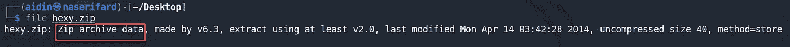

它只是简单的压缩文件。我用**解压**解压 ***hexy.zip*** 里面的文件:

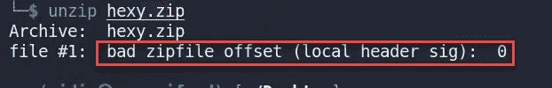

我们收到一个损坏的 zip 文件。如果我们得到这个文件的任何元数据，让我们使用 **exiftool**

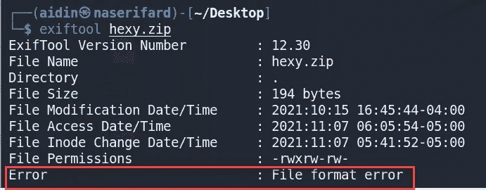

哦！在输出结束时，我们得到文件格式错误。

尝试使用 **zipdetails** 到**显示 zip 文件的内部结构:**

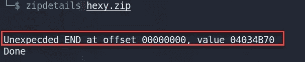

试着在这个文件上使用 **hexeditor** :

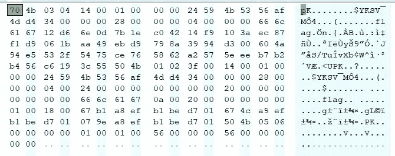

如果你注意到在文件的最顶端，左边是十六进制部分，右边是 ASCII 部分，它只是以" **70 4b 03 04"** 开始文件。一个普通的 **PKZIP 存档**文件应该是以 **50 4b 03 04** 开头的。我们必须将 70 个文件头修改为 **PKZIP 存档**的幻字节(50)。

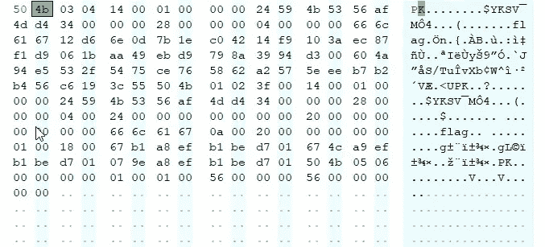

保存此文件。解压文件，它会继续询问密码。

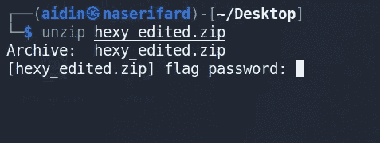

现在，我们必须破解这个文件。我们可以用两种方法破解这个文件。

1)使用名为**约翰开膛手**的工具:

首先，我们将使用 **zip2john** 工具将 zip 文件转换成 john 能够理解的散列格式，并有望破解。

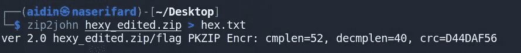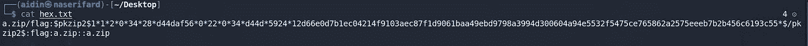

hex.txt 内容

我用了很多单词表，花了大约 12 个小时才找到一个帮助我找到正确密码的单词表！找到的密码是 ***健忘*** 。

你可以从 S [ecLists 库](https://github.com/danielmiessler/SecLists/tree/master/Passwords/Software)下载“ **cain 和 able** ”单词表。

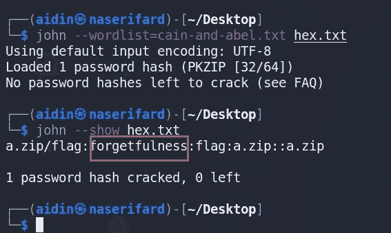

2)使用名为 **fcrackzip** 的工具:

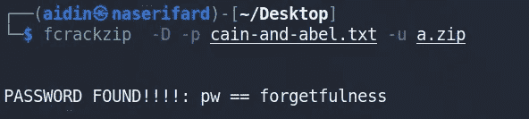

解压后会给我们一个名为 **flag** 的文件，其中包含了这个挑战的标志

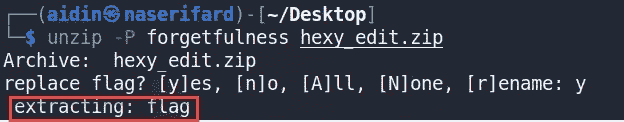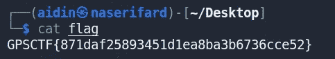

挑战标志是:

> **GPSCTF { 871 daf 25893451 D1 ea 8 ba 3b 6736 CCE 52 }**

希望你喜欢这篇文章。