# h@cktivitycon 2021 CTF 报道:反应堆机器人挑战

> 原文：<https://infosecwriteups.com/h-cktivitycon-2021-ctf-writeup-reactor-android-challenge-85d1d03d4502?source=collection_archive---------1----------------------->

你好， [HackerOne](https://medium.com/u/6f816e37be2c?source=post_page-----85d1d03d4502--------------------------------) 几周前在 CTF 举办了 h@activitycon 2021。我有时间做一些挑战。这里是关于**反应堆**挑战的报道。

# 挑战

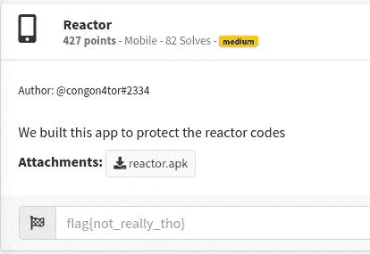

挑战说“我们构建这个应用程序是为了保护反应堆代码”&标志格式是 **flag{xxxxxx}**

让我们下载并安装 **reactor.apk**

应用程序需要 4 位数字代码。

我进入 **1111** 引脚观察输出。应用程序响应了一些不可读的字符。因此， **1111** 不是正确的引脚。

我们必须查看源代码才能理解其中的逻辑。我们的下一步是使用 jadx-gui 打开 APK。

让我们导航到通信>反应器>主活动

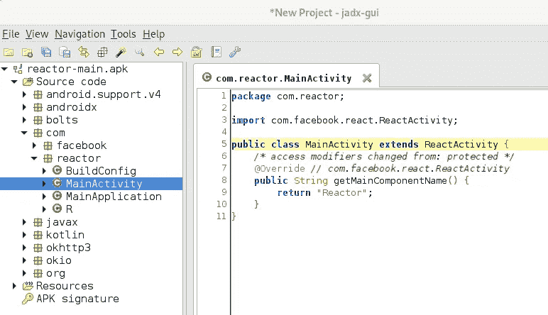

只有一种方法(不常见)返回字符串“Reactor”。如果我们查看导入的包，我们可以得出结论，该应用程序是用 [React Native](https://reactnative.dev/) 技术构建的。

React 本地库的存在表明应用程序逻辑应该已经在 javascript 文件中编写好了。

JS 文件的位置在**assets/index . Android . bundle**

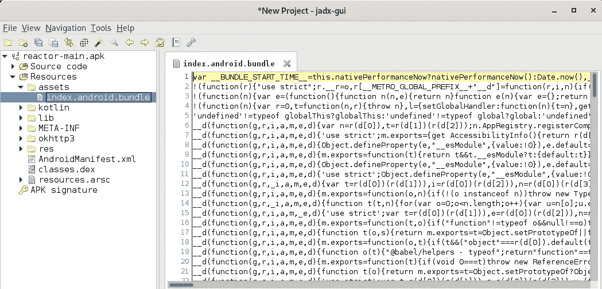

index.android.bundle 文件被混淆和缩小。我缩小了 JS 文件，以便更好地查看内容。

我用`apktool d reactor.apk`命令反编译了 app，打开了 **index.android.bundle** 文件。

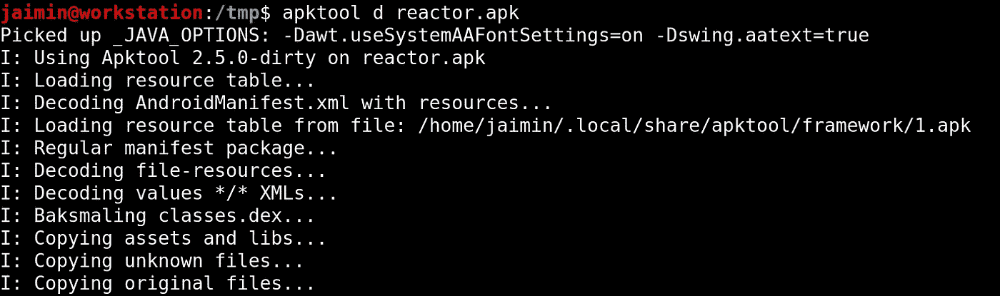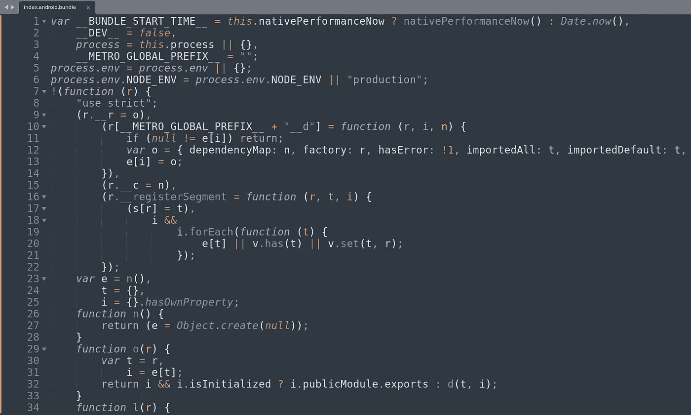

接下来，我搜索“插入 pin”文本，并找到了出现的位置。应用程序正在创建一个文本元素，内容是“插入 pin 以显示反应器代码”

我们在启动应用程序时收到了同样的消息。

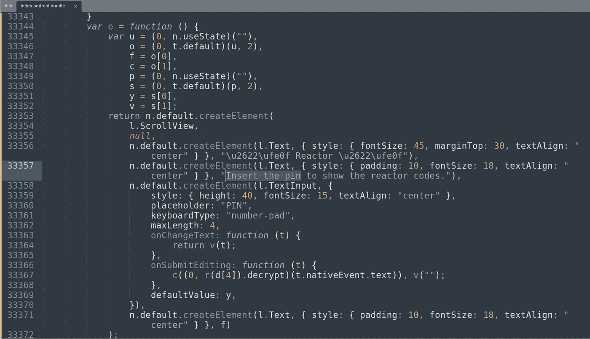

引起我注意的一件事是 **onSubmitEditing** 功能。

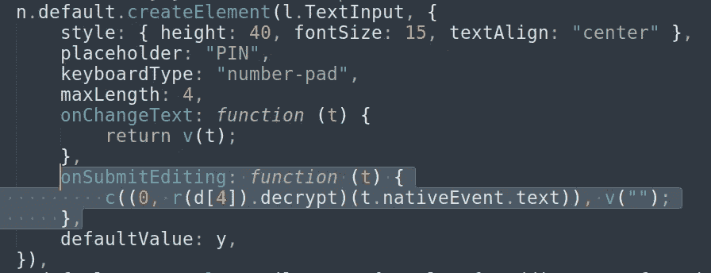

上述方法获取用户输入 **t.nativeEvent.text** ，如果该值与正确的 pin 匹配，它将打印该标志。

让我们确认当我们输入 pin 时是否调用了这个方法。为了实现这一点，我在方法 c()上方的语句中添加了一个`console.log("Debugger hit!");`。

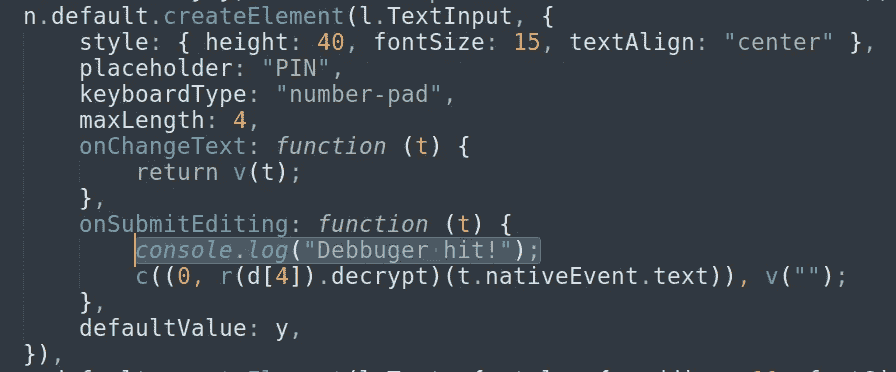

我们已经对 JS 文件进行了更改，现在我们需要使用下面的命令重新构建应用程序。

`apktool b reactor`

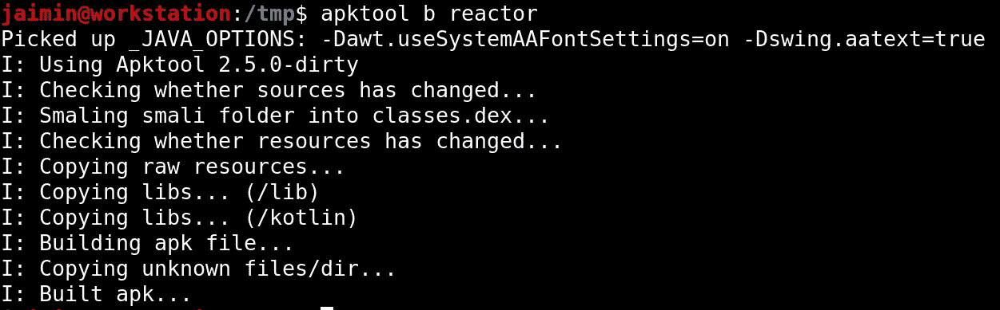

在我们安装应用程序之前，需要对其进行重新签名。我使用命令`apksigner sign --ks /home/jaimin/jaimin.keystore reactor.apk`退出了应用程序

应用程序(已修改)现在可以安装了。使用命令`adb install reactor.apk`

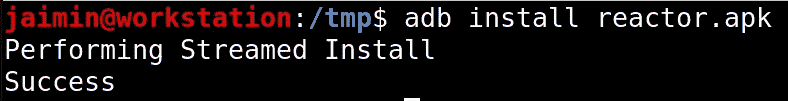

在我们与应用程序交互之前，我们需要打开 android 设备的 logcat。为此，使用命令`adb logcat`

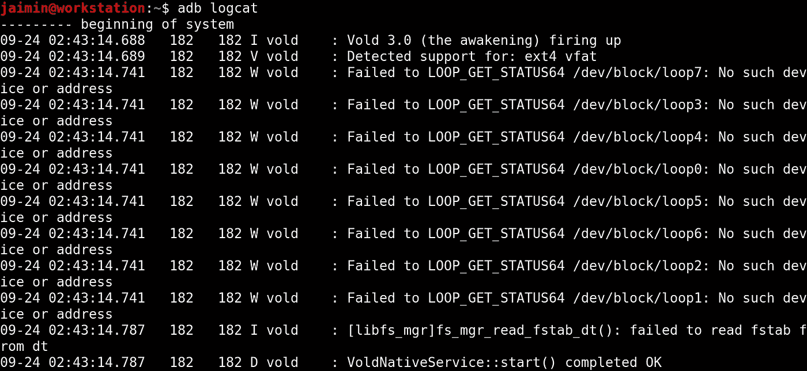

我保持 logcat 窗口打开，并输入 0000 pin 来观察我们的调试器是否被命中。

# **logcat 窗口**

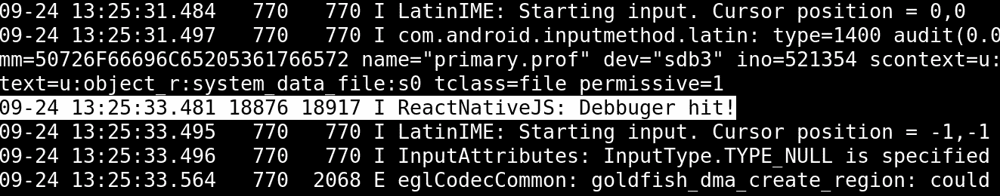

是的，我走在正确的道路上。

以前添加的值(调试器命中！)正在日志中打印。

# 返回 index.android.bundle

我在 JS 文件中搜索“decrypt”关键字，发现了一个有趣的方法。

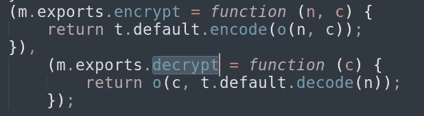

我添加了下面一行来打印控制台中的解密值。

**console.log("解密值:"+o(c，t . default . decode(n)))；**

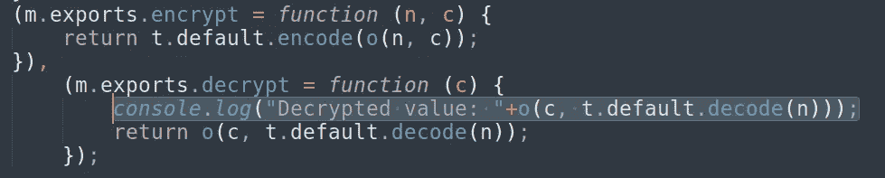

让我们**重建，辞职，重装**

为了加快进程，我在`build.sh`中添加了所有三个命令。

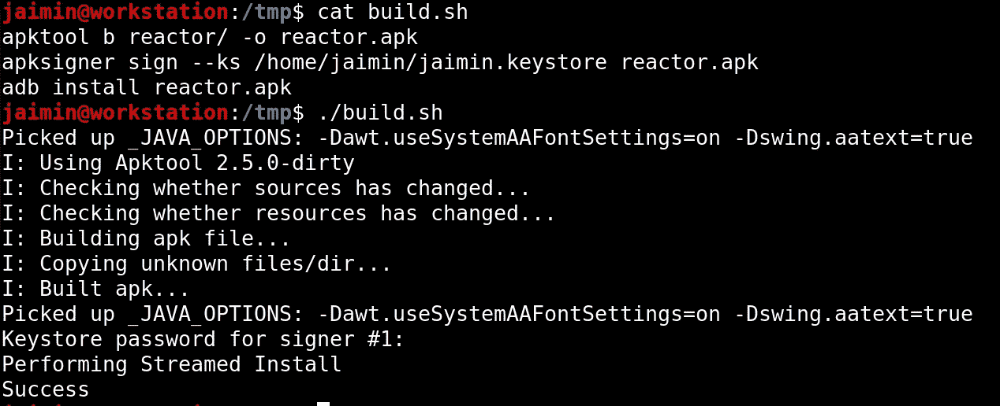

打开应用程序，输入 0000 个人识别码。

# 导航回 logcat

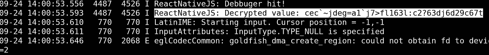

在 logcat 中，我们打印了与应用程序中相同的值，它指出 0000 不是正确的 pin。

现在有很多方法可以解决这个挑战，我决定通过在 **onSubmitEditing** 方法中添加以下代码来强力破解 PIN。

# 以前

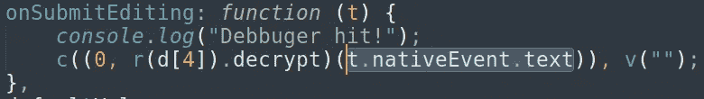

# 在...之后

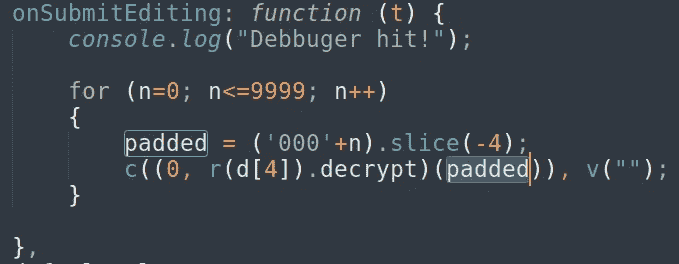

我添加了一个 for 循环来强制 pin 从 0000 到 9999。

我调整了 **decrypt** 方法来打印输入的 pin 和解密的值。

# 以前

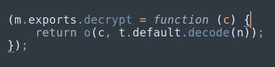

# 在...之后

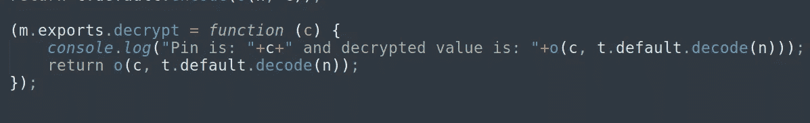

让我们重建，辞职，重新安装 APK。

输入了任意一个 pin 码，然后直奔 logcat。

# 战斗中的野蛮人

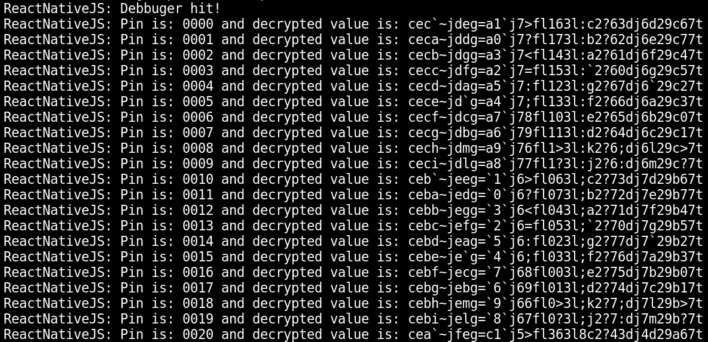

logcat 打印了所有的值，现在我们可以简单地 grep for **flag{** keyword。

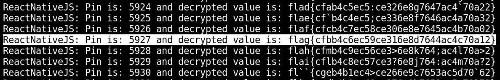

正确的 pin 为 5927，标志值为**flag { CFBB 4c 6 EC 59 ce 316 E8 d 7644 AC 4c 70 a 12 }**

# 挑战解决了！

我喜欢写这篇文章，我希望你也喜欢阅读它。

**保持安全，快乐黑客:-)**

推特:[@ jaimin _ gohel](https://twitter.com/jaimin_gohel)
LinkedIn:[@ jaimin-gohel-440 a4a 52](https://www.linkedin.com/in/jaimin-gohel-440a4a52)