# h4cked Tryhackme 报道

> 原文：<https://infosecwriteups.com/h4cked-tryhackme-writeup-cf40463684c8?source=collection_archive---------6----------------------->

**作者 Shamsher khan 这是一篇关于 Tryhackme room“被黑”的文章**

[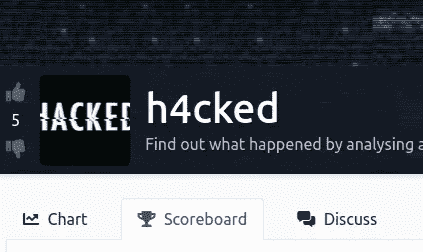](https://www.tryhackme.com/room/h4cked)

【https://www.tryhackme.com/room/h4cked 号

**房间链接:**[https://www.tryhackme.com/room/h4cked](https://www.tryhackme.com/room/h4cked)
**注:此房免费**

**问题 1:** 攻击者试图登录特定的服务。这是什么服务？


> **答案:FTP**

**问题 2:**Van Hauser 有一个非常流行的工具，可以用来暴力破解一系列服务。这个工具叫什么名字？


> **答案:九头蛇**

**问题 3:** 攻击者试图用特定的用户名登录。用户名是什么？

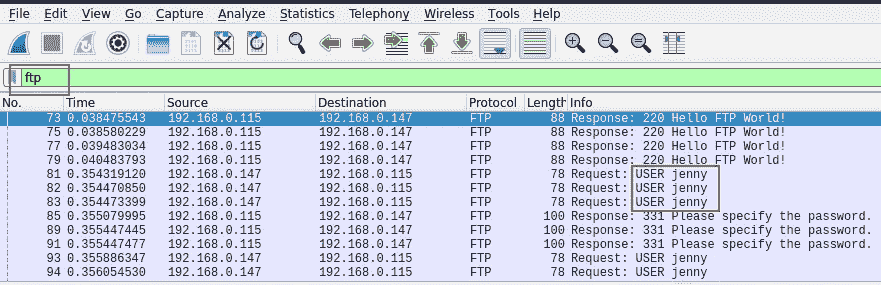

> **答案:珍妮**

**问 4:** 用户的密码是什么？

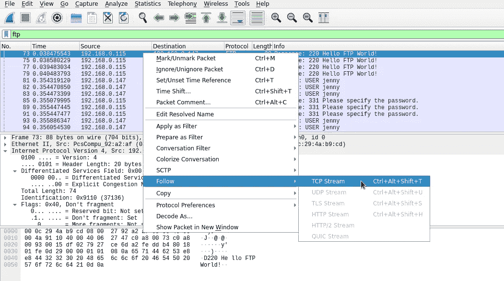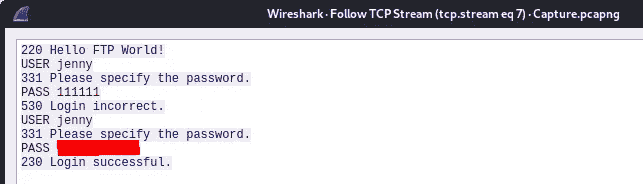

**问 5:** 攻击者登录后当前的 FTP 工作目录是什么？


> **答案:/var/www/html**

**问 6:** 攻击者上传了一个后门。后门的文件名是什么？

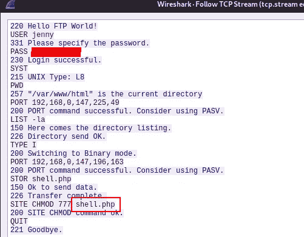

> **答案:shell.php**

**问 7:** 后门可以从特定的 URL 下载，因为它位于上传的文件中。完整网址是什么？

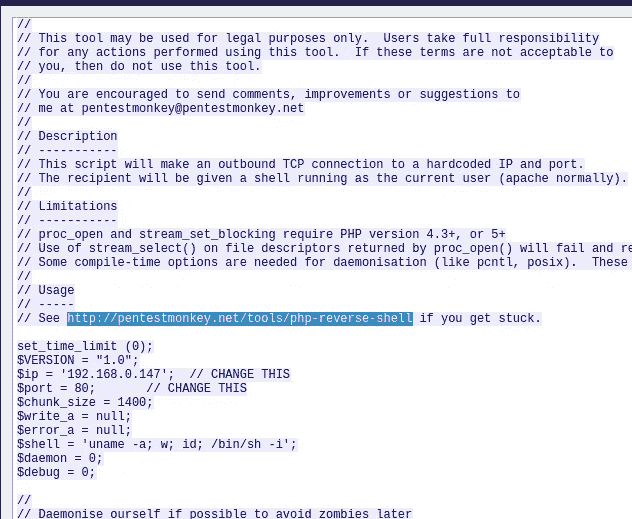

> **回答:**[**http://pentestmonkey.net/tools/php-reverse-shell**](http://pentestmonkey.net/tools/php-reverse-shell)

**问题 8:** 攻击者在得到一个逆向 shell 后手动执行了哪个命令？

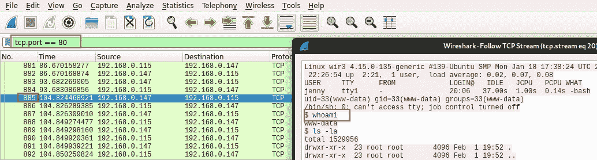

> **答案:whoami**

**问 9:** 电脑的主机名是什么？

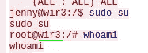

> **答案:wir3**

问题 10: 攻击者执行了哪个命令来生成一个新的 TTY shell？

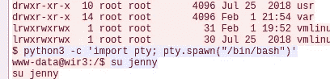

> **答案:python 3-c ' import pty；pty.spawn("/bin/bash")'**

**问题 11:** 执行了哪个命令来获得根 shell？

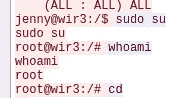

> **答案:须藤苏**

**问题 11:** 攻击者从 GitHub 下载了一些东西。GitHub 项目的名字是什么？

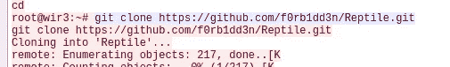

> **答案:爬虫**

问题 12: 这个项目可以用来在系统上安装一个秘密后门。很难察觉。这种类型的后门叫什么？

> **答案:rootkit**

部署机器。

攻击者已经更改了用户的密码！能否复制攻击者的步骤，读取 flag.txt？该标志位于/root/爬虫目录中。记住，你可以随时回头看。如有必要，pcap 文件。祝你好运！

在 FTP 服务上运行 Hydra(或任何类似的工具)。攻击者可能没有选择复杂的密码。如果你使用一个普通的单词表，你可能会很幸运。

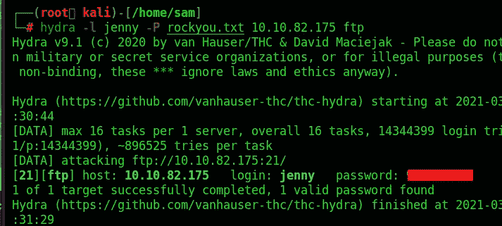

我们得到了登录 ftp 服务器的密码

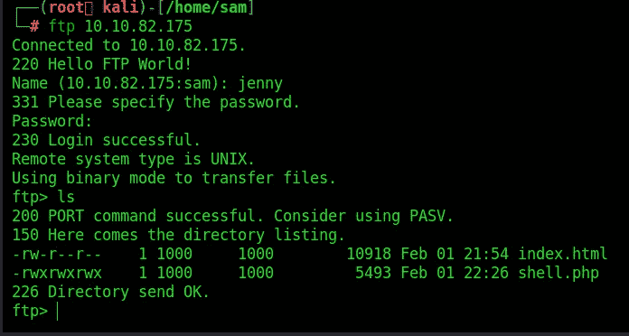

用我们的 tryhackme ip 地址上传我们的新 shell.php

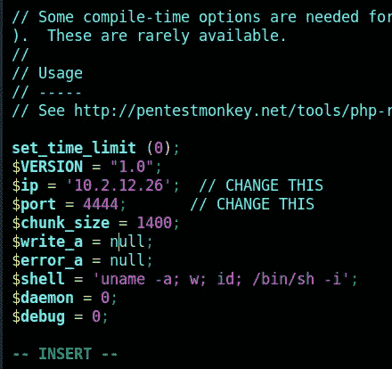

现在在 kali 上启动 netcat 监听器

```
nc -lvp 4444
```

并访问[http://10 . 10 . 82 . 175/shell . PHP](http://10.10.82.175/shell.php)

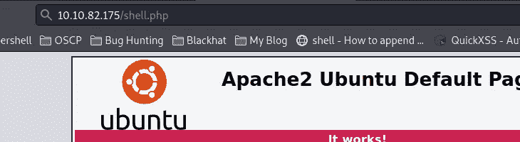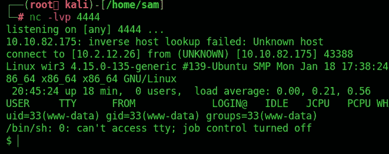

我们得到 revershell

**升级外壳**

```
python3 -c 'import pty; pty.spawn("/bin/bash")'
```

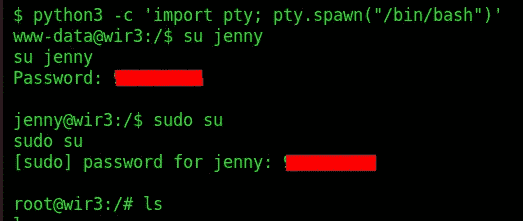

嘣！我们得到了根外壳让我们得到标志. txt

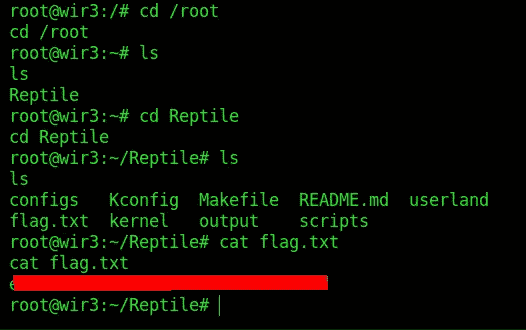

你可以在:
**LinkedIn:-**[https://www.linkedin.com/in/shamsher-khan-651a35162/](https://www.linkedin.com/in/shamsher-khan-651a35162/)
**Twitter:-**[https://twitter.com/shamsherkhannn](https://twitter.com/shamsherkhannn)
**Tryhackme:-**[https://tryhackme.com/p/Shamsher](https://tryhackme.com/p/Shamsher)

[](https://tryhackme.com/p/Shamsher)

如需更多演练，请在出发前继续关注…
…

## [点击这里加入电报](https://t.me/tryhackme_writeups)

[](https://t.me/tryhackme_writeups)

访问我的其他演练:-

感谢您花时间阅读我的演练。如果您觉得它有帮助，请点击👏按钮👏(高达 40 倍)并分享
它来帮助其他有类似兴趣的人！+随时欢迎反馈！