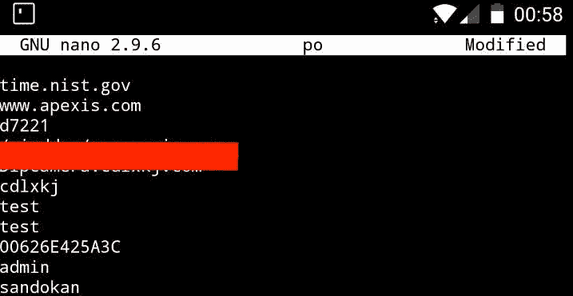
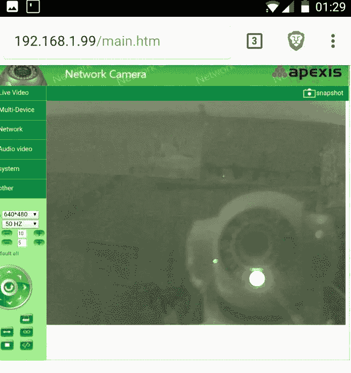

# 用智能手机黑掉网络摄像头

> 原文：<https://infosecwriteups.com/hack-a-webcam-with-a-smartphone-fa8f57c692c5?source=collection_archive---------0----------------------->

最近我和我的女朋友在度假。一天晚上，我睡不着，所以我决定用我的手机来玩酒店的无线网络。

作为第一件事，我试图到达路由器，所以我打开我的网络浏览器，键入 **192.168.1.1** 而不知道我的 IP 的类别。令人惊讶的是，它起作用了，我在一个更大的意大利运营商拥有的调制解调器/路由器的网页前，要求我输入用户名和密码。“没有隔离啊，好吧..”。于是我输入 **admin:admin** ，瞧，我成功了。这太容易了。

然后我想起了大厅前台的网络摄像头，我问自己“如果我能伸手拿起那个摄像头，那该多酷啊？!"。

因此，我没有搜索所有连接的设备和端口，而是决定使用一个应用程序来查看网络摄像头的流，该应用程序会自动找到所有连接到网络的网络摄像头。

网络摄像头是一个**网络波**，并且可以在地址 **192.168.1.99** 到达。

在浏览器中输入地址，它要求输入用户名和密码。这一次管理员:管理员没有工作。

我决定试试“黑客”用来建立著名的 Mirai 未来组合僵尸网络的凭证，但是什么也没有。这次运气不好。

所以，我在谷歌上搜索，我发现这个摄像头的模型遭受了内存泄漏，这里是[漏洞](https://www.exploit-db.com/exploits/41236/)。
太好了！但是，我如何在智能手机上使用它呢？

检查漏洞利用代码时，我发现本质上我只需要做一个 GET，并将输出字符串化以备后期检查。密码应该在第 10000 行左右。所以我寻找一个好的 Android 终端模拟器，我发现了 [Termux](https://termux.com/) (如果你还没有使用它，请检查一下，因为它真的很棒！)，然后我就打字了

> wget http://192 . 168 . 1 . 99//proc/kcore | strings | nano

检查内存泄漏我找不到密码，所以我搜索单词“admin”，因为我认为 admin 是默认用户，密码通常在用户名附近，幸运的是，它就像我猜测的那样！

正如你在上面看到的，密码是**桑多坎**。

我玩了一会儿网络摄像头。这是反映在大厅窗户上的网络摄像头。

第二天早上，我就这些问题警告了酒店的员工:)

