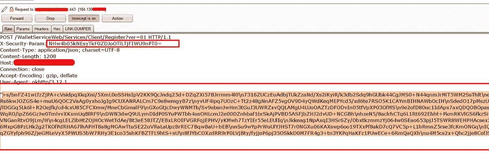
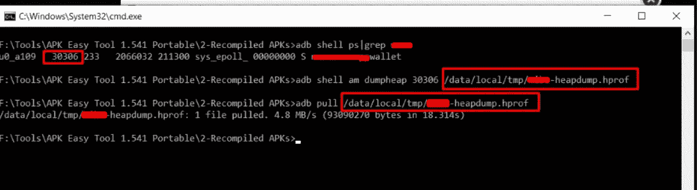
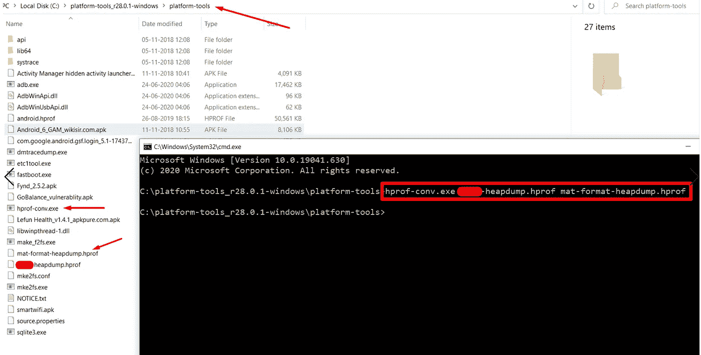
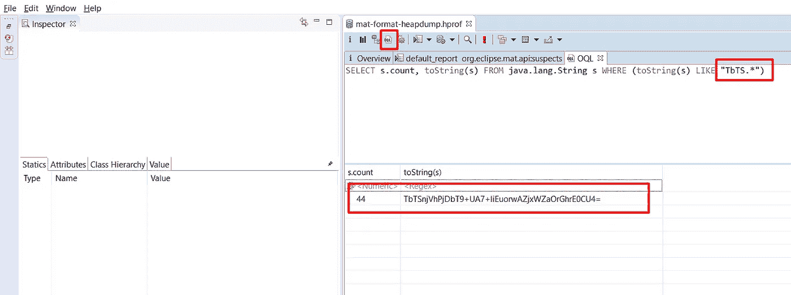
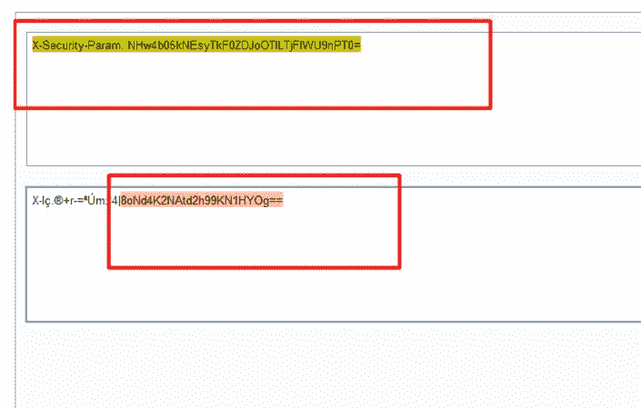
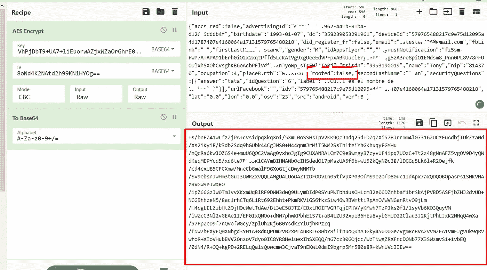

# 从堆内存中窃取加密秘密以利用 Android 应用程序

> 原文：<https://infosecwriteups.com/hack-crypto-secrets-from-heap-memory-to-exploit-android-application-728097fcda3?source=collection_archive---------0----------------------->

> 通常情况下，android 应用程序中的**加密漏洞**不会产生重大影响(**一般来说，严重性较低**)。除非在应用程序工作流和加密功能之间有很强的依赖性。

在最近的私人 bugbounty 项目中，我面临了一个挑战。其中应用程序请求主体用某种加密机制加密。所以我必须找到加密机制来进一步评估应用程序。



加密身体挑战

为了理解加密逻辑，我使用 **Android 逆向工程工具**集对 APK 进行了反编译，然后我分析了加密机制和敏感密钥信息的代码。但是我还没有在反向源代码中发现任何硬编码的秘密。

## **到了**检查**应用堆内存**的时候了

## **堆内存**

堆用于进行动态内存分配。为了提供流畅的用户体验， **Android 为每个正在运行的应用** *设置了一个堆大小的硬性限制。*堆大小限制因设备而异，并且基于设备拥有的 RAM 大小。**堆内存用于分配对象。每当你创建一个对象，它总是在堆中被创建。**

## 为什么我们需要分析

由于开发时间短，开发人员只专注于构建特性、功能和 UI 组件。但是他们可能会忘记用**内存分析器**检查应用程序的内存使用情况。因此我们可能有机会在**内存泄漏时获得这些**密码密钥**。**

## 如何分析 android 应用程序内存泄漏

第一步

首先我们必须用`android:debuggable="true”`重新编译目标应用程序。为了用调试标志重新构建目标应用程序，我使用了 **apk-mitm。**

[](https://github.com/shroudedcode/apk-mitm) [## shroudedcode/apk-mitm

### 一个 CLI 应用程序，自动准备 Android APK 文件的 HTTPS 检查检查移动应用程序的 HTTPS…

github.com](https://github.com/shroudedcode/apk-mitm) 

卸载原始应用程序，安装目标应用程序的重新编译版本，导航到应用程序的所有功能，并作为普通应用程序使用几分钟。

第二步

现在使用 adb 获取应用程序内存配置文件。为此，请使用以下命令。

```
adb shell am dumpheap <PID of target app> /path/to/store/heap-dump.hprof#get the heapdump file to PC
adb pull /path/to/the/hprof .
```



通过 adb 堆配置文件转储

第三步

要在 MAT Analyzer 工具中分析 **hprof** 文件，请将 hprof 文件转换为 **MAT 支持格式**。为此需要使用位于**【Android-SDK】\平台-工具中的 **hprof-conv** 工具。**

```
cd "C:\android-sdk\platform-tools"hprof-conv.exe "heapdump.hprof" "MAT-format-heapdump.hprof"
```



第四步

现在我们有了目标应用程序的 MAT 支持 hprof 文件。让我们分析文件中的敏感字符串。

使用[链接](https://www.eclipse.org/mat/)下载 Eclipse MAT

使用 MAT analyzer 打开转换后的 hprof 文件。从反编译的源代码中，我观察到 AES 秘密是以“ **TbTS** 开始的。这是通过分析字节数组函数得到的。所以我在 Eclipse MAT 中用 OQL ( **对象查询语言**)特性搜索了这个字符串模式。

```
SELECT s.count, toString(s) FROM java.lang.String s WHERE (toString(s) LIKE "TbTS.*")
```



最后拿到了 AES 密钥，但是需要 **IV random** 密钥来解密或者加密数据。



经过一番分析，我的目光集中在' **X-Security-Param** '头上。当我解码这个头值时，我得到了一个值，我坚信这是摘要的 IV 键。

最后，使用识别出的值，我解密并修改了加密的请求体。



使用 AES 密码和 IV 加密的正文请求

## 参考资料:

[https://developer . Android . com/studio/profile/memory-profiler](https://developer.android.com/studio/profile/memory-profiler)

[https://proandroiddev . com/everything-you-need-know-on-memory-leaks-in-Android-d 7 a 59 faaf 46a](https://proandroiddev.com/everything-you-need-to-know-about-memory-leaks-in-android-d7a59faaf46a)

感谢你花时间阅读这篇博客。如果你想学习 android 黑客技术，请关注我，关注有趣的**黑客技术**并查看 [**我的简介**](https://medium.com/@secureITmania) 阅读有趣的 **BugBounty** 文章。