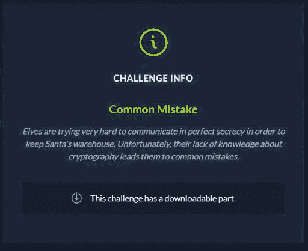
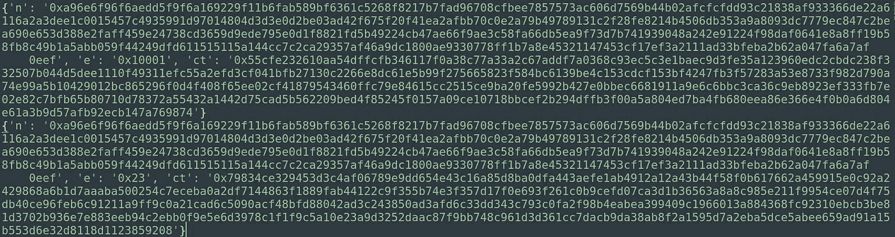
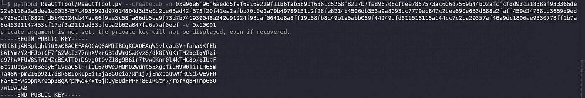
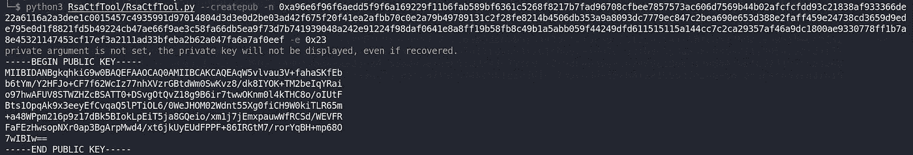
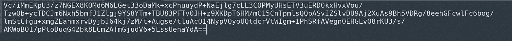
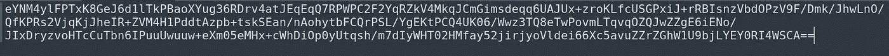
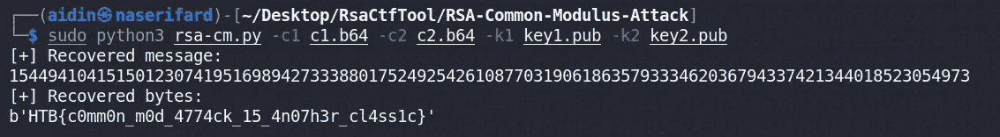

# 黑掉电脑圣诞老人 CTF 2021 的盒子——常见错误

> 原文：<https://infosecwriteups.com/hack-the-box-cyber-santa-ctf-2021-common-mistake-ae3494bcb6ae?source=collection_archive---------1----------------------->

网络圣诞老人夺旗

从 2021 年 12 月 1 日至 12 月 5 日举行的**网络圣诞老人来到 CTF** 的**密码**类别，有一个挑战叫做“**常见错误**”。让我们来解决这个挑战

看一下挑战描述:

挑战描述

让我们看一下 **encrypted.txt** 文件，如你所见，我们有相同的模数和两个不同的加密值和密文，这导致了常见的模数攻击。

加密文件内容

使用(' n '和第一个' e '值)生成第一个公钥:

key1.pub

使用(相同的“n”和第二个“e”值)生成第二个公钥:

使用(n 和 1st e):key2.pub 生成第一个公钥

使用 [rsa-cm.py](https://github.com/HexPandaa/RSA-Common-Modulus-Attack) 生成第一个密文的 Base64 编码形式

c1.b64

使用 [rsa-cm.py](https://github.com/HexPandaa/RSA-Common-Modulus-Attack) 生成第二个密文的 Base64 编码形式

c2.b64

运行脚本对 RSA 执行共模攻击，以恢复消息的明文:

旗

并且我们得到了旗帜:HTB { c 0 mm0n _ m0d _ 4774 CK _ 15 _ 4n 07 h3r _ cl 4 ss 1c }

希望你喜欢这篇文章…