# 黑盒子— DevOops 报道

> 原文：<https://infosecwriteups.com/hack-the-box-devoops-write-up-367d260d550c?source=collection_archive---------2----------------------->

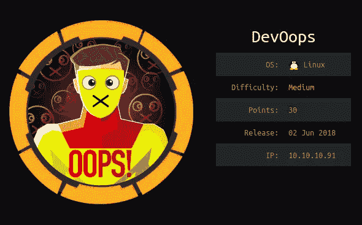

DevOops 是 Hack the Box pen-testing labs 中难度中等的退役机。今天，我将向您展示如何通过一个已知的 web 漏洞找到这个盒子。

像往常一样，让我们运行 Nmap 来扫描主机:

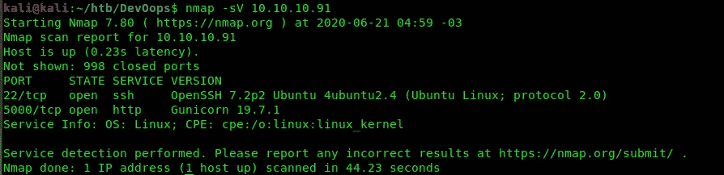

端口 5000 上有一个 HTTP 服务器，默认端口 22 上运行一个 SSH 服务器。

因此，通过访问该页面，我们可以看到一个正在建设中的网站。显然，这个 web 应用程序是博客提要的消费者，顾名思义。此外，feed.py 参考向我们展示了它是用 Python 编写的:

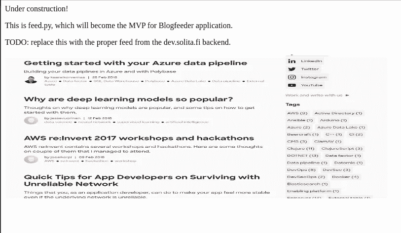

所以让我们开始模糊网站，看看我们能否找到有趣的路线。我们将在这里使用 gobuster 和中型目录 wordlist，该目录可以在 Kali 的/urs/share/dirbuster/wordlists/中找到:

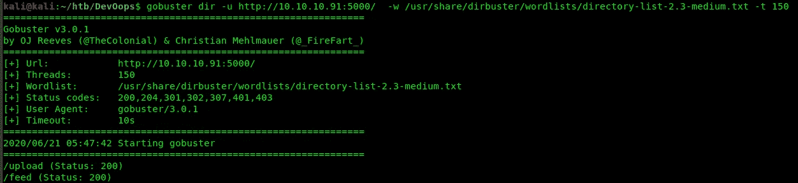

Gobuster 找到了/upload 和/feed 路径。最后一张是我们在第一页看到的图片，但是/upload 非常有趣:

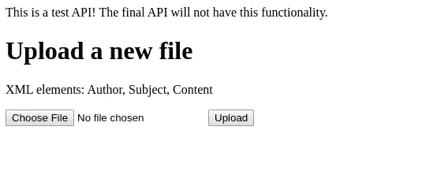

这是一个我们可以上传 XML 文件的页面。它还给出了我们期望的模式:XML 元素必须有作者、主题和内容字段。因此，让我们构建一个简单的 XML 文件并上传它，看看会发生什么:

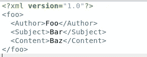

在将其保存为 payload.txt 并上传后，我们得到了以下消息:

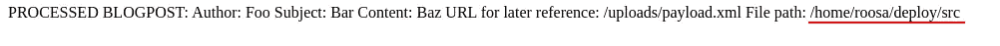

正如您在上面看到的，应用程序向我们显示了我们刚刚通过 XML 插入的值，还向我们提供了用户名:roosa。

# XML 外部实体

XML 外部实体注入(XXE)是一种被 [OWASP Top 10 - 2017](https://owasp.org/www-project-top-ten/OWASP_Top_Ten_2017/) 列为 web 应用十大主要风险之一的漏洞。

首先，让我们了解什么是 XML 文件。XML 是一种允许我们描述数据的标记语言。这是一种允许两个不同系统相互通信的模式。因此，我们之前上传的文件将字段 Author、Subject 和 Content 定义为 Foo、Bar 和 Baz 值。

还可以定义实体，允许我们通过 DOCTYPE 头中的系统标识符引用外部资源。

这是声明实体的语法:

```
<!ENTITY **reference_name** SYSTEM **reference** >
```

我们在一个字段中引用它:

```
<xpto>&reference_name</xpto>
```

我们可以引用一个本地文件:

```
<?xml version="1.0"?>
<!DOCTYPE foo [ <!ENTITY xxe SYSTEM "**file:///etc/passwd"** > ] >
<foo>
   <content>&xxe</content>
</foo>
```

或远程服务器:

```
<?xml version="1.0"?>
<!DOCTYPE foo [ <!ENTITY xxe SYSTEM "**http://xpto.com/resource"** > ] >
<foo>
   <content>&xxe</content>
</foo>
```

通过禁用应用程序 XML 解析器中的外部实体和 DTD 处理，可以避免这种攻击。

# 获取用户访问级别

知道了如何利用 XXE，我们就可以测试我们的应用程序是否易受攻击。让我们通过使用下面的有效负载来尝试获取 */etc/passwd* 文件:

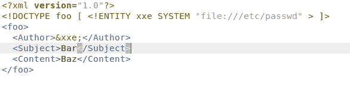

上传之后，我们得到了 *passwd* 文件，所以这个应用程序确实很容易受到攻击:

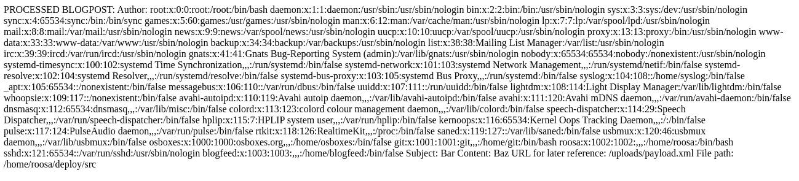

知道了有一个名为 *roosa* 的用户和一个 ssh 服务器，让我们看看是否为这个用户配置了任何 SSH 密钥。通常 ssh 密钥存储在*里面。用户目录中的 ssh* 文件夹，为此，我们将使用以下有效负载:

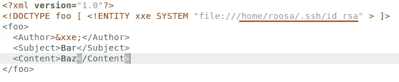

上传文件后，我们得到了一个密钥:

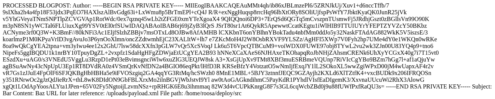

让我们将它保存在一个名为 key 的文件中，并通过运行以下命令来配置它的权限:

```
chmod 600 key
```

现在，让我们使用这个密钥连接到 SSH 服务器。连接后，旗帜就在我们面前:

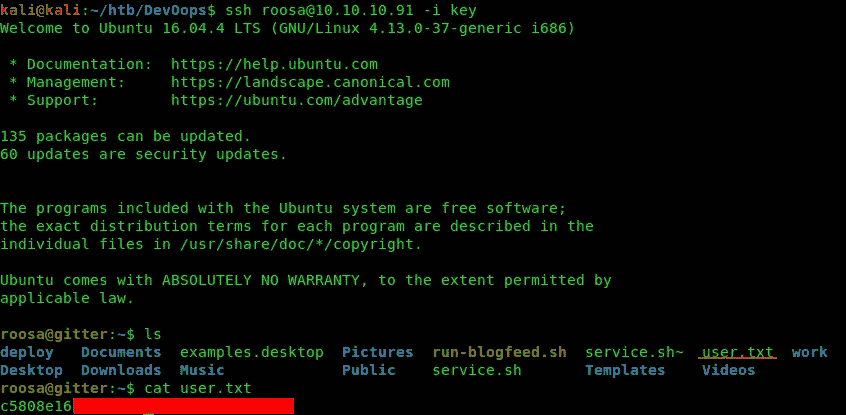

# 获取 root 访问权限

现在，让我们检查一下这个目录，以便找到有用的东西。只要运行 *ls -lah* 来查看隐藏的文件，你就会发现一个非常有趣的文件:

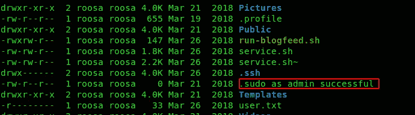

似乎不知何故这个用户有 root 权限，我们记在心里吧。

现在，我们可以检查里面是什么。bash_history 来验证用户输入了什么命令。正如您在下面看到的，用户在*资源/集成*目录中意外提交了一个错误的认证密钥，然后通过生成一个新的 SSH 密钥对来修复它:

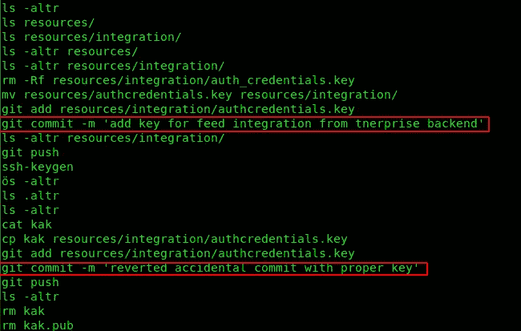

是根 ssh 密钥吗？让我想想…

通过搜索后。git 目录我们找到了用户正在处理的目录:

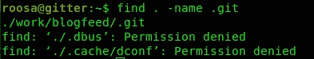

导航到 *work/blogfeed* 目录后，让我们查看 git 日志，找到添加了错误键的确切提交位置。只需键入 *git log* ，您将看到提交时间表:

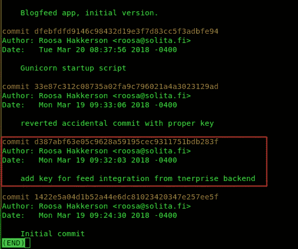

那么让我们恢复这个提交。注意，我们需要使用 *-f* 标志，因为有修改过的文件。

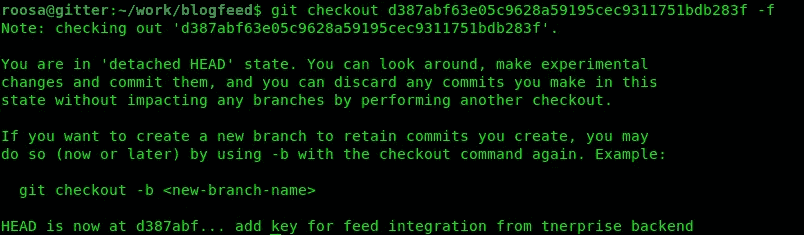

导航到*资源/集成*并将正确的权限设置为 *authcredentials.key* 。然后尝试使用这个密钥以 root 用户身份连接到 SSH。正如您在下面看到的，它起作用了，我们的根标志就在那里:

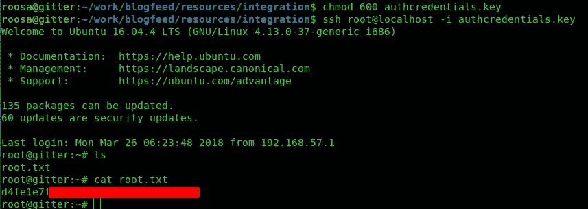

# 结论

从这个盒子里，我们可以学到三个重要的教训:

*   千万不要相信用户输入的数据！像 XSS 和 SQLi 一样，XXE 漏洞只是关于信任来自用户的数据。
*   Git 是一个代码版本控制工具，所以你提交的所有东西都将被保存！如果您不小心提交了任何敏感凭据，您需要使其无效并生成另一个凭据。
*   此外，凭据必须以更安全的方式存储，例如，使用环境变量。查看[12 因素](https://12factor.net/config)了解更多信息。

# 参考

*   [信息安全协会—什么是 XXE 攻击？](https://resources.infosecinstitute.com/xxe-attacks/#gref)
*   [OWASP 小抄系列— XXE 预防](https://cheatsheetseries.owasp.org/cheatsheets/XML_External_Entity_Prevention_Cheat_Sheet.html)

我希望你喜欢这篇文章！

如果你对黑盒子感兴趣，看看我的其他文章:

*   黑盒子——感觉
*   [黑盒子——蹩脚](https://medium.com/rd-shipit/dive-into-hack-the-box-lame-ec44fccb5711)